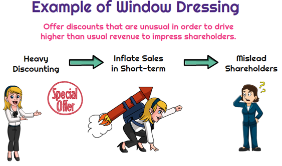

## Table of Contents

## What is window dressing in finance?

Window dressing in finance is when companies or investment funds make their financial statements look better than they really are. They do this at the end of a financial period, like the end of a quarter or year, to impress investors or hide problems. For example, a company might sell off losing investments or buy more of the winning ones just before reporting, so their portfolio looks better.

This practice can be misleading because it doesn't show the true performance of the company or fund. It's like putting on a nice outfit to hide the fact that you haven't been doing well. Regulators don't like window dressing because it can trick investors into making bad decisions. Even though it's not always illegal, it's seen as unethical and can lead to trouble if it's too obvious or if it breaks any rules.

## Why do companies engage in window dressing?

Companies engage in window dressing because they want to look good to investors and the public. At the end of a financial period, like a quarter or a year, they might try to make their financial reports look better than they really are. This can help them attract more investors or keep the ones they have by showing a stronger financial position. For example, a company might sell off investments that are losing money or buy more of the ones that are doing well, just before they have to report their numbers.

However, window dressing can be risky. It's like putting on a nice outfit to hide the fact that things aren't going well. If people find out that the company is trying to trick them, it can lead to big problems. Regulators and investors might get upset, and the company could face fines or lose trust. Even though window dressing isn't always illegal, it's seen as not being honest, and that can hurt the company in the long run.

## Can you provide examples of window dressing techniques?

One common window dressing technique is when a company sells off its losing investments right before the end of a reporting period. By doing this, the company can make its financial statements look better because it won't have to show those losses. For example, if a company has been holding onto stocks that have gone down in value, it might sell them just before the end of the quarter so that its portfolio looks like it's only made up of winning investments.

Another technique is when a company buys more of its winning investments just before reporting. This makes the company's portfolio look stronger because it shows more of the stocks that have been doing well. For instance, if a company has some stocks that have gone up a lot, it might buy more of those stocks right before the end of the year to make its financial report look better.

Sometimes, companies also use accounting tricks to make their financial statements look better. They might change how they report certain expenses or revenues to make their profits look higher. For example, a company might delay reporting some expenses until the next period or recognize revenue earlier than it should. These tricks can make the company's financial health seem better than it really is, but they can be risky if regulators find out.

## How does window dressing affect financial statements?

Window dressing can make a company's financial statements look better than they really are. When a company sells off its losing investments right before the end of a reporting period, it doesn't have to show those losses on its financial statements. This makes the company's portfolio look like it's only made up of winning investments, which can make the company seem more successful to investors. For example, if a company has stocks that have gone down in value, it might sell them just before the end of the quarter to avoid showing those losses.

Another way window dressing affects financial statements is when a company buys more of its winning investments just before reporting. This makes the company's portfolio look stronger because it shows more of the stocks that have been doing well. For instance, if a company has some stocks that have gone up a lot, it might buy more of those stocks right before the end of the year to make its financial report look better. These actions can make the company's financial health seem better than it really is, but they can be risky if regulators find out and can lead to trouble if it's seen as trying to trick investors.

## What are the ethical implications of window dressing?

Window dressing is when companies try to make their financial reports look better than they really are. This can be seen as not being honest, which is a big problem in the world of business. When companies do this, they might be trying to trick investors into thinking the company is doing better than it really is. This can lead to investors making bad choices because they don't have the real information they need. It's like telling a lie to make yourself look good, which is not fair to the people who trust you with their money.

The ethical problem with window dressing is that it breaks the trust between a company and its investors. When investors find out that a company has been trying to hide the truth, they can lose faith in the company. This can hurt the company's reputation and make it hard for them to get more investors in the future. Even though window dressing might not always be against the law, it goes against the idea of being honest and open, which are important values in business. In the end, trying to make things look better than they are can lead to more problems than it solves.

## How can investors detect window dressing in financial reports?

Investors can detect window dressing by looking closely at a company's financial reports and watching for changes that happen right before the end of a reporting period. For example, if a company suddenly sells a lot of its losing investments just before the end of a quarter, it might be trying to make its portfolio look better. Investors should also pay attention to if a company buys more of its winning investments right before reporting. These sudden changes can be a sign that the company is trying to make its financial statements look better than they really are.

Another way to spot window dressing is by comparing a company's financial reports over time. If the company's performance seems to change a lot from one period to the next, it might be using window dressing to hide the truth. Investors can also look at the company's accounting practices. If the company is using different ways to report its expenses or revenues that make its profits look higher, it could be a sign of window dressing. By being careful and looking for these signs, investors can better understand if a company is being honest about its financial health.

## What are the legal consequences of window dressing?

Window dressing can get a company into legal trouble if it breaks any rules. Regulators, like the Securities and Exchange Commission (SEC) in the United States, watch out for companies that try to trick investors. If a company is caught doing window dressing and it's against the law, it might have to pay big fines. The people in charge of the company could also get in trouble, like being banned from working in the industry or even going to jail.

Even if window dressing isn't always illegal, it can still lead to problems. If investors find out that a company has been trying to hide the truth, they might sue the company for misleading them. This can hurt the company's reputation and make it hard for them to get more investors in the future. So, even if window dressing doesn't break any laws, it can still cause a lot of trouble for a company.

## How does window dressing impact a company's stock price?

Window dressing can make a company's stock price go up in the short term. When a company makes its financial reports look better than they really are, investors might think the company is doing well. This can make more people want to buy the company's stock, which can push the price up. For example, if a company sells off its losing investments right before reporting, it can make its portfolio look stronger, and investors might see this as a good sign.

However, if investors find out that the company has been using window dressing, the stock price can drop a lot. When people realize that the company has been trying to hide the truth, they might lose trust in the company. This can make them want to sell their stock, which can cause the price to go down. In the long run, window dressing can hurt a company's reputation and make it harder for them to attract investors, which can keep the stock price low.

## What role does window dressing play in corporate governance?

Window dressing can be a big problem for corporate governance. Corporate governance is about how a company is run and how it makes sure it's doing things the right way. When a company uses window dressing, it's trying to make its financial reports look better than they really are. This can make it hard for the people in charge to do their job well. If the board of directors and other leaders don't know the real financial situation, they can't make good decisions for the company. This can lead to bad choices that hurt the company in the long run.

Window dressing also breaks the trust between a company and its investors. Good corporate governance is all about being honest and open with the people who invest in the company. When a company tries to hide the truth by using window dressing, it goes against these important values. If investors find out, they might lose faith in the company and its leaders. This can make it hard for the company to get more investors in the future and can hurt its reputation. In the end, window dressing can cause a lot of problems for a company's governance and its overall health.

## How do accounting standards address window dressing?

Accounting standards are rules that companies have to follow when they make their financial reports. These rules are made by groups like the Financial Accounting Standards Board (FASB) in the United States and the International Accounting Standards Board (IASB) around the world. They want to make sure that companies are honest about their money situation. To stop window dressing, these standards say how companies should report their money, like when they can say they made money or had to spend money. If a company tries to use tricks to make its reports look better, it might break these rules.

When companies follow these accounting standards, it helps investors trust the financial reports. If a company doesn't follow the rules and gets caught doing window dressing, it can get into big trouble. Regulators can make the company pay fines, and the people in charge might even have to go to court. So, accounting standards are important because they help keep companies honest and make sure everyone knows the real story about a company's money.

## What are the differences between window dressing and earnings management?

Window dressing and earnings management are both ways that companies try to make their financial reports look better, but they are a bit different. Window dressing is when a company changes its investments or other financial stuff right before it has to report its numbers. For example, a company might sell off investments that are losing money or buy more of the ones that are doing well, just to make its portfolio look good at the end of a quarter or year. It's like putting on a nice outfit to hide the fact that things aren't going well.

Earnings management, on the other hand, is when a company plays around with its accounting to make its profits look better. This can be done by changing when the company reports its expenses or revenues. For instance, a company might delay reporting some expenses until the next period or recognize revenue earlier than it should. While both window dressing and earnings management can be seen as not being honest, earnings management often involves more direct changes to the financial statements, whereas window dressing focuses more on the timing and selection of investments.

## How has technology and data analytics changed the detection of window dressing?

Technology and data analytics have made it easier for people to spot window dressing. Before, it was hard to see if a company was trying to make its financial reports look better than they really are. But now, with computers and special software, people can look at a lot of data quickly. They can see if a company is selling off losing investments or buying more winning ones right before the end of a reporting period. This helps investors and regulators find out if a company is being honest about its money situation.

Data analytics also helps by letting people compare a company's financial reports over time. If a company's numbers change a lot from one period to the next, it might be a sign of window dressing. With technology, it's easier to spot these changes and see if the company is using tricks to make its reports look better. This makes it harder for companies to hide the truth and helps keep them honest.

## References & Further Reading

[1]: Lakonishok, J., Shleifer, A., & Vishny, R. W. (1994). ["Window Dressing by Pension Fund Managers."](https://www.jstor.org/stable/2006859) The American Economic Review, 84(2), 289-294.

[2]: Carhart, M. M. (1997). ["On Persistence in Mutual Fund Performance."](https://onlinelibrary.wiley.com/doi/full/10.1111/j.1540-6261.1997.tb03808.x) The Journal of Finance, 52(1), 57-82.

[3]: Barber, B. M., & Odean, T. (2000). ["Trading is Hazardous to Your Wealth: The Common Stock Investment Performance of Individual Investors."](https://faculty.haas.berkeley.edu/odean/Papers%20current%20versions/Individual_Investor_Performance_Final.pdf) The Journal of Finance, 55(2), 773-806.

[4]: Lopez de Prado, M. (2018). ["Advances in Financial Machine Learning."](https://www.amazon.com/Advances-Financial-Machine-Learning-Marcos/dp/1119482089) Wiley Finance.

[5]: Chan, E. P. (2009). ["Quantitative Trading: How to Build Your Own Algorithmic Trading Business."](https://github.com/ftvision/quant_trading_echan_book) Wiley Trading.

[6]: Jansen, S. (2020). ["Machine Learning for Algorithmic Trading."](https://github.com/stefan-jansen/machine-learning-for-trading) Packt Publishing.