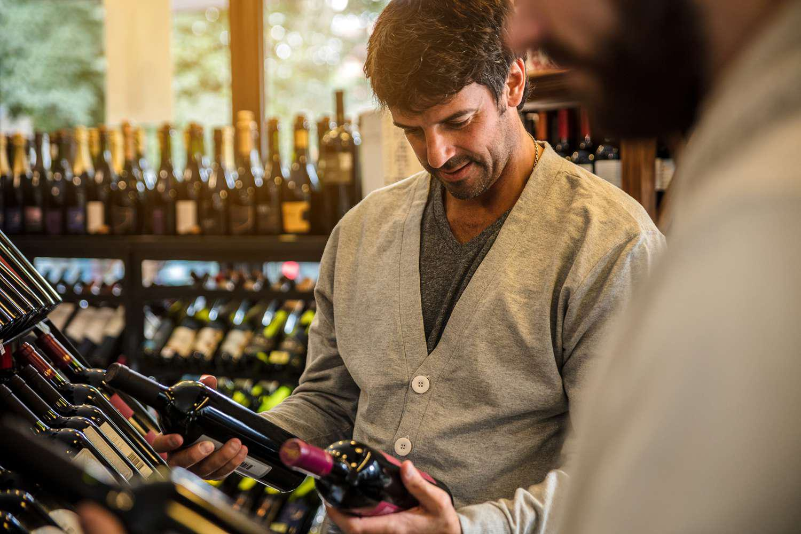

Fine wine investment has long captivated collectors and investors alike with its allure as a prestigious alternative investment opportunity. Known for its capacity to withstand economic fluctuations and retain value over the long-term, fine wine presents a unique asset class distinguished by its rarity, provenance, and brand prestige. As investors increasingly seek diversification and stability beyond traditional stocks and bonds, fine wine gains attention not just for its intrinsic value and historical returns, but also for the lifestyle and status it represents.

Parallelly, technology is reshaping traditional markets, a trend prominently evident in financial markets with the rise of algorithmic trading. Algorithmic trading utilizes computer algorithms to execute trades at speeds unmatchable by human traders, applying complex mathematical models to predict market movements and optimize trading strategies. The efficiency and precision offered by algorithmic trading have transformed the ways in which various assets are bought and sold, improving market performance and liquidity.



In this technologically driven evolution, the fine wine market is also beginning to embrace algorithmic trading. Traditionally dominated by subjective assessments and long-term holding strategies, wine investments are seeing a gradual shift toward data-driven decision-making processes. Leveraging algorithms in wine trading opens up possibilities for analyzing extensive market data, from pricing and vintage information to consumption trends and even weather patterns affecting grape harvests. This analytical approach could identify potential opportunities that were previously overlooked in a predominantly qualitative industry.

The integration of algorithmic trading in the fine wine market offers several potential benefits, such as increased returns through timely and informed trading decisions, improved market liquidity, and enhanced risk management. However, this emerging trend is not without its challenges. The wine market's complexities, such as its illiquidity compared to traditional financial assets and the intricate criteria defining wine valuation, present unique hurdles for the implementation of algorithmic strategies. Additionally, the risk of over-reliance on algorithms and the uncertainty inherent in any investment landscape must be carefully managed to mitigate potential pitfalls.

As technology and finance continue to intertwine, the synthesis of fine wine investment and algorithmic trading signifies a dynamic shift. This evolution calls for investors to balance the tradition of wine collecting with innovation to capitalize on emerging strategies. Understanding this intersection is vital for those looking to navigate and benefit from the changing landscape of fine wine investments.

## Table of Contents

## The Growing Interest in Fine Wine Investment

Fine wine investment has steadily gained popularity, driven by the promise of historical returns and stability. Diverse market trends have contributed to its allure as a lucrative investment option. Fine wines have consistently shown appreciable returns, often outperforming traditional assets like stocks and bonds. According to the Liv-ex Fine Wine 100 Index, an industry benchmark, fine wines have frequently demonstrated more stable returns compared to the volatility seen in equity markets. This stability can be attributed to the intrinsic factors that underline fine wine valuation.

One of the fundamental elements determining the value of fine wines is rarity. Limited production runs, often dictated by vineyard size, contribute to scarcity. Provenance, or the history of wine ownership and storage, is another critical [factor](/wiki/factor-investing). Properly stored wines with impeccable provenance command higher prices. Furthermore, the brand and reputation of a winery significantly influence a wine's market value. Prestigious names like Château Lafite Rothschild and Domaine de la Romanée-Conti bestow extra cachet on their vintages, inherently driving up demand and value.

When juxtaposed with other investment options, fine wines offer unique advantages. Unlike stocks, whose values can be swayed by market sentiment and economic conditions, wine values are grounded in physical scarcity and consumer desire. Gold shares some characteristics with fine wine, particularly in terms of tangibility and historical value retention. However, unlike many traditional investments, fine wine also offers the tangible benefit of consumption, providing an intrinsic value regardless of market performance.

Case studies highlight the successes experienced by astute fine wine investors. Notably, collector and investor Bill Koch, who amassed a substantial wine collection, saw its value appreciate significantly over the years. His case exemplifies how strategic acquisition and understanding of the factors affecting wine prices can yield substantial financial benefits.

The growing interest in fine wine investment underscores a trend towards diversification, with investors increasingly seeking out alternative assets that offer both stability and potential for appreciation. This trend is bolstered by the combination of historical performance data and the unique value determinants inherent to the fine wine market, providing a robust foundation for investment strategies.

## Understanding Algorithmic Trading

Algorithmic trading refers to the use of computer programs and algorithms to execute trades in financial markets. These algorithms make decisions to buy or sell financial instruments by analyzing market data at speeds and frequencies that are difficult for human traders to achieve. The primary goal is to leverage technology to find optimal entry and [exit](/wiki/exit-strategy) points in the market, thus enhancing profitability and efficiency.

Advantages of utilizing [algorithmic trading](/wiki/algorithmic-trading) over traditional methods are manifold. Firstly, algorithms can process vast volumes of data far faster than a human, allowing traders to capitalize on market inefficiencies virtually instantly. This speed can lead to reduced market impact and improved price execution. Secondly, algorithmic trading eliminates human emotions from trading decisions, which can help in adhering to a disciplined trading strategy. Additionally, the capacity to backtest trading strategies using historical data before employing them in live markets provides an invaluable tool for risk assessment and strategy optimization.

Common algorithms used in market trading include trend-following algorithms, [arbitrage](/wiki/arbitrage) algorithms, and market-making strategies. Trend-following algorithms aim to capture gains through the analysis of an indicator’s upward or downward trajectory. Arbitrage algorithms seek to exploit price differences of the same asset in different markets. Market-making strategies involve continuously buying and selling securities to provide [liquidity](/wiki/liquidity-risk-premium) to the market while profiting from the bid-ask spread.

Despite its advantages, implementing algorithmic trading strategies poses several challenges. Crafting a robust algorithm requires significant expertise in programming and financial market understanding. Moreover, algorithms must be carefully monitored and updated to adapt to changing market conditions. High-frequency trading, a subset of algorithmic trading, has been scrutinized for potentially increasing market [volatility](/wiki/volatility-trading-strategies) and risk.

Risk management and ethical considerations are crucial in algorithmic trading. Unauthorized trading or "rogue algorithms" can inadvertently initiate massive trades, leading to market disruptions. Regulatory bodies closely scrutinize trading algorithms to ensure they comply with trading norms and maintain market integrity. Ethical considerations include fair access to markets and ensuring that trading activities do not manipulate market prices or disadvantage other market participants.

In summary, algorithmic trading represents a powerful advancement in trading methodologies, offering speed, efficiency, and improved decision-making capabilities. However, it also requires careful planning, risk management, and adherence to ethical standards to successfully leverage its benefits in today’s financial markets.

## Integration of Algorithmic Trading in the Fine Wine Market

Algorithmic trading in the fine wine market involves applying quantitative models to make trading decisions, analyzing historical data to forecast future price movements. This integration of technology is enhancing the efficiency and liquidity of the market but also introduces unique challenges.

**Algorithmic Analysis of Market Data**

To effectively analyze market data in the wine industry, algorithms leverage vast datasets, including auction prices, historical sales records, and economic indicators. These algorithms utilize [machine learning](/wiki/machine-learning) techniques to recognize patterns and predict market trends. For instance, regression analysis can be used to understand the relationship between wine age and its market value, while time series analysis can help forecast future prices based on historical data.

**Tools and Technologies**

Several advanced tools facilitate algorithmic trading in wine investments. Platforms like MATLAB and Python libraries such as Pandas and NumPy allow for complex data manipulation and statistical analysis. Furthermore, machine learning frameworks like TensorFlow and Scikit-Learn enable the development of predictive models, which can forecast price movements.

Example Python code for data analysis using Pandas and Scikit-Learn:

```python
import pandas as pd
from sklearn.model_selection import train_test_split
from sklearn.linear_model import LinearRegression

# Load wine market dataset
data = pd.read_csv('wine_market_data.csv')

# Define features and target variable
X = data[['age', 'provenance', 'brand_value']]
y = data['market_price']

# Split data
X_train, X_test, y_train, y_test = train_test_split(X, y, test_size=0.2, random_state=42)

# Train a linear regression model
model = LinearRegression()
model.fit(X_train, y_train)

# Predict market prices
predictions = model.predict(X_test)
```

**Impact on Liquidity and Market Efficiency**

The introduction of algorithmic trading can significantly improve market liquidity by increasing transaction volumes and reducing bid-ask spreads. Algorithms can execute trades more rapidly than human traders, increasing the market's efficiency and reducing information asymmetry. However, the relatively low [volume](/wiki/volume-trading-strategy) and illiquid nature of the fine wine market compared to traditional markets pose a challenge.

**Challenges Specific to Wine Market Algorithmic Trading**

One major challenge is the lack of standardized data, as wine markets are less transparent compared to stocks or commodities. The inherent subjectivity in wine valuations, influenced by factors like tasting scores and expert opinions, adds complexity to algorithm design. Moreover, fine wines lack the frequent trading activity seen in other asset classes, which can limit the effectiveness of traditional high-frequency trading strategies.

**Real-World Examples**

Several firms have started to integrate algorithmic trading into wine investment strategies. For example, Cult Wines, a UK-based company, utilizes data analytics to optimize wine portfolios for their clients, leveraging algorithms to balance risks and returns effectively. Additionally, financial platforms are beginning to offer algorithmic trading services tailored to niche markets, including fine wines.

The fusion of technology and the traditional wine market presents opportunities for enhanced investment strategies while posing challenges that necessitate continued adaptation and innovation.

## Benefits and Risks of Algorithmic Trading in Wine Investment

Algorithmic trading in wine investment offers both significant advantages and noteworthy risks that investors must consider. It provides potential for increased returns and diversification, allowing investors to leverage data-driven insights for more informed decision-making. Algorithms can process large volumes of data, analyzing trends and patterns that may be invisible to human traders. This capability enables investors to diversify their portfolios by including fine wines, which traditionally offer stable returns and may act as a hedge against financial market volatility.

Algorithmic trading aids in overcoming traditional trading limitations by incorporating quantitative models that systematically analyze wine market data. For instance, an algorithm may evaluate historical prices, supply, and demand dynamics to identify undervalued assets or predict future pricing trends. This data-centric approach can enhance decision-making, supporting investments with a higher likelihood of success based on empirical evidence. Enhancing decision accuracy with these data-driven insights can minimize human error and emotional biases, leading to potentially improved investment outcomes.

There are case studies that exemplify successful algorithmic strategies in the wine market. For example, certain investment firms have effectively utilized machine learning algorithms to track auction prices and historical sales, thereby dynamically adjusting their investment strategies to maximize profits. These algorithms can adapt to shifts in the market, ensuring that investment strategies are consistently aligned with current market conditions.

Nevertheless, algorithmic trading in wine investment is not without risks. Volatility and unpredictability pose significant challenges. Fine wine markets can be influenced by various factors, including geopolitical conditions, changes in consumer preferences, and rare events like natural disasters affecting vineyards. Such unpredictability can lead to sudden market shifts that algorithms might not immediately account for, potentially leading to losses.

As with any investment strategy, staying informed and educated about market changes is crucial for investors using algorithmic trading in wine investments. This includes understanding the underlying algorithms, being aware of systemic market changes, and continuously updating the trading models based on new data. Adapting to technological advancements and maintaining a comprehensive understanding of market dynamics can mitigate risks and enhance the potential benefits of algorithmic trading in wine investments.

Understanding these benefits and risks allows investors to harness algorithmic trading effectively, ensuring that they can exploit fine wine as a robust investment alternative while managing the inherent challenges.

## Future Trends and Developments

The fine wine market is undergoing a transformation, driven by technological advancements and the rise of algorithmic trading strategies. Predictions for the evolution of wine investment and trading algorithms are optimistic, suggesting a significant shift in how this niche market operates and is accessed by investors.

**Technological Advancements and Market Influence**

The integration of cutting-edge technology is set to redefine the wine investment landscape. With the increasing power of computational analysis, trading algorithms are expected to become more sophisticated, able to handle larger datasets and execute trades with enhanced precision. These advancements will likely facilitate more dynamic pricing models and improve market efficiency by minimizing human error and emotional trading biases.

**AI and Machine Learning's Role**

Artificial Intelligence (AI) and machine learning are at the forefront of refining algorithmic trading strategies in the fine wine market. These technologies can analyze historical data, improve pattern recognition, and predict future market trends with greater accuracy. Machine learning models are particularly advantageous, as they can adapt to new data inputs and continuously optimize investment strategies. AI algorithms could, for instance, assess variables like vintage quality and storage conditions, offering insights that were previously unquantifiable.

**Growth of Digital Markets and Blockchain**

Blockchain technology is poised to enhance transparency and security in wine trading. By providing irrefutable provenance records, blockchain can prevent counterfeiting and assure authenticity, critical factors in the valuation of fine wines. Digital marketplaces leveraging blockchain could facilitate smoother transactions by offering decentralized platforms that connect buyers and sellers directly. Additionally, these platforms might incorporate features such as smart contracts, which automatically enforce agreements once set conditions are met.

**Expert Opinions on Future Landscape**

Experts suggest that the convergence of these technologies could democratize access to wine investments, opening opportunities for a broader range of investors. According to industry analysts, the traditional barriers to entry — such as lack of access to expert knowledge and market information — can be diminished by data-driven platforms and AI-based advisory services. Moreover, as digital and algorithmic trading increases liquidity, the fine wine market could see enhanced growth potential.

As these trends unfold, the wine investment landscape is expected to experience an accelerated transformation, integrating traditional appreciation for wine with modern technological innovation. This evolution may lead to more robust investment opportunities and a more accessible market, benefiting both new and seasoned investors.

## Conclusion

The convergence of fine wine investment and algorithmic trading represents a significant shift in how traditional markets adapt to modern technological influences. This synergy allows for data-driven insights and potentially increased returns while maintaining the allure and sophistication of investing in fine wines. As both fields evolve, it is critical for investors to embrace informed decision-making by thoroughly understanding the risks and benefits associated with algorithmic trading in wine investments.

Algorithmic trading provides a systematic approach to navigating the complex market dynamics of fine wines, allowing investors to leverage technology for better decision-making. This requires not just a fundamental knowledge of wine valuation and market trends, but also an understanding of the algorithms' workings and the data insights they provide. Staying informed about these elements is paramount to navigating the market's volatility and achieving successful outcomes.

Balancing traditional wine investment practices with technological innovation requires continuous learning and adaptation. As investors embrace new methodologies, the importance of retaining respect for the intrinsic qualities that define fine wines—such as rarity, provenance, and brand—is vital. This blend of tradition with innovation ensures that the essence of wine investing is preserved while utilizing cutting-edge strategies for competitive advantage.

Investors are encouraged to explore this dynamic market further, recognizing it as a growing opportunity that marries the elegance of wine with the precision of technology. By embracing both the timeless aspects of wine culture and the transformative potential of algorithmic trading, investors can position themselves at the forefront of an evolving market landscape.

## References & Further Reading

[1]: Masset, P., & Weisskopf, J. P. (2010). [Raise your Glass: Wine Investment and the Financial Crisis.](https://papers.ssrn.com/sol3/papers.cfm?abstract_id=1457906) Swiss Institute of Banking and Finance.

[2]: Liv-ex. [The Fine Wine Index: Liv-ex Fine Wine 100.](https://www.liv-ex.com/news-insights/indices/)

[3]: ["Wine Investment for Portfolio Diversification"](https://www.rbcwealthmanagement.com/en-us/insights/passion-investing-diversifying-your-portfolio-into-the-wine-market) by Cult Wines

[4]: Lussier, J. (2005). [Investing in Wine.](https://thevineyard.wine/en/from-vine-to-vault-the-journey-of-investing-in-wine/) CFA Digest, Volume 35, Issue 3.

[5]: Aldridge, I. (2013). ["High-Frequency Trading: A Practical Guide to Algorithmic Strategies and Trading Systems"](https://www.amazon.com/High-Frequency-Trading-Practical-Algorithmic-Strategies/dp/1118343506) by Irene Aldridge

[6]: Vance, A. (2009). ["Algorithmic Trading and DMA: An Introduction to Direct Access Trading Strategies"](https://archive.org/details/algorithmictradi0000john) by Barry Johnson

[7]: Silverstein, A., & Tassel, P. V. (2010). ["The Wine Investment Handbook: Your Tastings, Reviews & Guide to Investing"](https://onlinelibrary.wiley.com/doi/abs/10.1111/j.1741-3737.2010.00749.x) by Andrew Silverstein 

[8]: Skaria, N. (2009). [Quantitative Investing: Strategies to Exploit Anomalies for All Investors.](https://books.google.com/books/about/Quantitative_Investing.html?id=6l3lAgAAQBAJ) John Wiley & Sons.