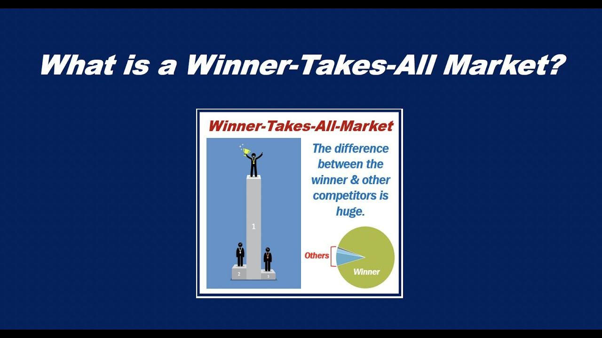

In this article, we examine the concept of the 'winner-takes-all' market, exploring its implications for both the economy and the world of algorithmic trading. A winner-takes-all market is characterized by situations where top performers capture the majority of rewards, often leaving little room for others. This phenomenon leads to a concentration of power and resources among a few dominant players, often resulting in oligopolies or monopolies.

The economic landscape is increasingly shaped by these markets, particularly as technological advancements lower barriers to entry, making it easier for top performers to maintain their lead. Such market structures can significantly impact income distribution and economic stability by exacerbating wealth disparities and consolidating market share within powerful entities. Consequently, this dynamic poses challenges for smaller competitors, who struggle to survive amidst reduced market diversity.

As we navigate through various sectors, we observe the operation of winner-takes-all markets in action. Industry giants like Amazon in retail and Google in technology provide clear examples of how a combination of scale, strategy, and innovation can lead to market dominance. These developments prompt significant implications for market participants, often limiting consumer choices and potentially increasing prices.

Algorithmic trading has emerged as a critical component within winner-takes-all markets. By using advanced computational strategies, firms can outperform human traders, gaining a substantial edge in financial markets. This intersection raises questions about market fairness and competitive pressures, as well as efficiency and inequality within these markets.

Throughout this article, we will also explore strategies for navigating these competitive landscapes. Businesses must focus on innovation, differentiation, and strategic partnerships to thrive in a winner-takes-all environment. Furthermore, regulatory perspectives are essential in promoting fair competition and limiting monopolistic practices.

By understanding the dynamics of winner-takes-all markets, market participants can better strategize, considering both ethical and regulatory dimensions in an ever-evolving landscape. Emphasizing adaptability and technology investment will be crucial for future success in these competitive arenas.

## Table of Contents

## What is a Winner-Takes-All Market?

A winner-takes-all market describes an economic environment where the most successful entities capture a significantly larger share of rewards or resources compared to their competitors. This structure often results in a disproportionate allocation of success to a small number of top performers, leading to the emergence of oligopolies or even monopolies. These dominant entities gain the ability to dictate market terms, often making it difficult for smaller competitors to survive and thrive.

The rise of such market dynamics has been closely linked to advancements in technology. Technological progress has the potential to lower barriers to entry, enabling a few companies to rapidly capture substantial market shares by harnessing innovations that grant competitive advantages, such as cost reductions or enhanced service delivery. Consequently, these advancements can lead to the centralization of market power and increased concentration of resources among the leading players.

This kind of market structure tends to exacerbate wealth disparities as resources and rewards accumulate disproportionately at the top. In a winner-takes-all environment, the concentration of wealth and market influence typically creates a feedback loop, where leading companies leverage their financial and strategic advantages to further entrench their positions, limiting the possibility of equitable wealth distribution and reducing market competition. These dynamics may have profound implications for economic equality and the overall health of the market system.

## Economic Impact of Winner-Takes-All Markets

Winner-takes-all markets can result in several significant economic outcomes, with one of the most prominent being the exacerbation of income inequality. In these markets, the most successful entities amass a substantial share of the rewards, leading to a concentration of wealth among top players while leaving minimal opportunities for smaller competitors. As these dominant entities consolidate their market share, smaller firms often struggle to compete, leading to decreased market diversity and potentially stifling innovation at the grassroots level.

This market model tends to reward aggressive business strategies and rapid technological advancement, fostering an environment where innovation is encouraged. However, this environment can also undermine economic stability. When a few companies dominate, the market becomes heavily dependent on their performance, making it more susceptible to disruptions if these entities face difficulties. The risk of monopolistic behavior increases, where dominant players can leverage their position to set prices and terms favorable to themselves, potentially leading to inefficiencies in resource allocation.

The long-term economic impacts of winner-takes-all markets include reduced consumer choices and higher prices, which can negatively affect consumer welfare. As dominant players edge out competition, consumers may find themselves with fewer alternatives, leading to a lack of competitive pricing and innovation. This consolidation can lead to a static market environment where new entrants find it difficult to establish themselves, diminishing the vibrancy that competition typically brings.

Economic theory suggests that while winner-takes-all markets can drive short-term growth by incentivizing innovation, they also pose risks for long-term economic health due to the potential for monopolistic practices and reduced market competitiveness. Policymakers and regulators may need to intervene to ensure fair competition and to mitigate the adverse effects on smaller firms and consumer welfare.

## Examples of Winner-Takes-All Markets

Retail giants like Amazon and Wal-Mart provide quintessential instances of winner-takes-all dynamics, given their ability to edge out numerous smaller competitors. These companies leverage economies of scale, sophisticated supply chain management, and aggressive pricing strategies to secure dominant positions in the retail sector. Amazon, for example, utilizes its vast logistics network and technological expertise to offer a diverse range of products at competitive prices, making it challenging for smaller retailers to compete effectively. Similarly, Wal-Mart's sheer size and purchasing power enable it to maintain low prices, which smaller competitors often struggle to match.

Technology companies, such as Google, Facebook, and Apple, similarly demonstrate winner-takes-all characteristics by dominating their respective markets through strong network effects, brand loyalty, and continuous innovation. Google's dominance in the search engine market is bolstered by its advanced algorithms and extensive data collection capabilities, allowing it to deliver highly relevant search results and targeted advertising. Facebook's vast user base creates a network effect, where the value of the platform increases as more users join, reinforcing its market position. Apple, with its ecosystem of products and services, fosters brand loyalty and captures a significant share of the consumer electronics market through its unique integration of hardware, software, and services.

In the media sector, companies like Netflix and Disney have captured large portions of the streaming market, illustrating similar winner-takes-all trends. Netflix's strategic investment in original content and global distribution capabilities has allowed it to maintain a competitive edge in the crowded streaming industry. Disney leverages its extensive library of popular franchises and characters, combined with strategic acquisitions such as Marvel and Lucasfilm, to offer an expansive streaming service that attracts a broad audience.

These examples illustrate how a combination of scale, strategic execution, and technological innovation can propel companies to exponential growth and dominant market positions. In winner-takes-all markets, the leading players not only establish significant market share but also set industry standards, making it increasingly difficult for newcomers or smaller companies to gain a foothold. As these firms continue to expand their influence, understanding the underlying factors contributing to their success is crucial for potential competitors and policymakers alike.

## Algorithmic Trading in Winner-Takes-All Markets

Algorithmic trading represents a pivotal technological advancement that perfectly aligns with the dynamics of winner-takes-all markets. This trading approach employs computer algorithms to execute orders at speeds and efficiencies unattainable by human traders. By utilizing sophisticated algorithms, firms can process vast amounts of market data instantaneously, allowing them to identify trends, execute trades, and capitalize on opportunities faster than competitors.

Firms using [algorithmic trading](/wiki/algorithmic-trading) strategies often surpass human traders by leveraging the speed and precision of automated processes. Such algorithms can perform tasks such as high-frequency trading ([HFT](/wiki/high-frequency-trading-strategies)), where trades are executed in fractions of a second, as well as complex [arbitrage](/wiki/arbitrage) strategies that identify and exploit price discrepancies across different markets. The capability to analyze and act on data rapidly creates significant advantages, including enhanced market share and profitability.

In the context of financial markets, superior algorithms confer substantial benefits. A firm's ability to predict market movements accurately and respond swiftly can lead to increased trading volumes and dominant positioning. This advantage derives from enhanced capabilities in data analysis, where algorithms can detect patterns and signals invisible to human operators. This technological edge is crucial in capturing larger shares of market activity, further entrenching leading players in winner-takes-all scenarios.

However, the deployment of algorithmic trading in financial markets has broader implications. It challenges the concept of market fairness; firms with access to better algorithms and data analysis tools can create barriers for smaller competitors, exacerbating existing inequalities. As these firms grow their market share, competitive pressures elevate, promoting overall market efficiency but simultaneously intensifying disparity. The focus on speed and technology potentially sidelines entities unable to match these capabilities, raising critical discussions regarding the ethics and regulations necessary to ensure a level playing field.

In summary, while algorithmic trading provides significant efficiencies and opportunities for profit maximization, it also contributes to the winner-takes-all dynamics by consolidating advantages among technologically sophisticated firms and intensifying market inequalities.

## Strategies for Navigating Winner-Takes-All Markets

In winner-takes-all markets, businesses often face significant challenges due to the dominance of a few key players. To navigate these competitive landscapes effectively, companies need to adopt strategies centered on innovation and differentiation. This can allow them to carve out unique market positions and avoid direct competition with dominant entities.

For small and medium-sized enterprises (SMEs), focusing on niche markets offers a viable pathway to success. These markets often provide less direct competition from large corporations, enabling SMEs to cater to specialized demands and build loyal customer bases. By understanding and addressing the unique needs of niche market segments, businesses can develop products and services that stand out.

Building strategic partnerships is another effective approach for companies operating in winner-takes-all markets. Collaborative alliances can enhance competitive advantage by pooling resources, sharing expertise, and accessing new customer bases. These partnerships can also facilitate innovation through shared research and development efforts, providing access to technologies or capabilities that might be otherwise unattainable.

Investment in technology is essential for staying competitive in rapidly evolving markets. Tech-driven solutions can streamline operations, reduce costs, and improve customer experiences. Companies that harness data analytics, [artificial intelligence](/wiki/ai-artificial-intelligence), and [machine learning](/wiki/machine-learning) can make informed decisions quickly, enhancing their responsiveness to market changes and consumer preferences.

Regulatory measures also play a critical role in ensuring fair competition and preventing monopolistic practices. Governments can implement policies designed to encourage market entry and foster competition, thereby preventing excessive market concentration. Antitrust regulations, for instance, can limit the ability of dominant players to engage in anti-competitive behavior, ensuring a level playing field for all market participants.

In summary, businesses can navigate winner-takes-all markets successfully by focusing on niche markets, forming strategic partnerships, investing in technology, and adhering to a regulatory framework that promotes fair competition. These strategies can not only help companies survive but also thrive in highly competitive environments.

## Conclusion

Winner-takes-all markets present unique challenges and opportunities for businesses and the economy. Such markets are known for their capacity to spur innovation and efficiency, primarily through intense competition. As firms vie for the top spot, the emphasis on technological advancements and optimizing operations often accelerates progress within an industry. However, this competitive landscape is not without its drawbacks. A significant concern is the exacerbation of economic inequality, as wealth and resources tend to concentrate in the hands of few dominant players, leaving smaller entities at a disadvantage.

The dynamics of winner-takes-all markets necessitate a comprehensive understanding by market participants. This involves recognizing the interplay between competitive advantage and ethical considerations, as well as navigating the regulatory frameworks intended to mitigate monopolistic behaviors. Ethical considerations come to the forefront as businesses might resort to aggressive tactics that, while legally permissible, may not always align with broader societal values. Consequently, regulatory bodies play a critical role in ensuring that competition remains fair and that consumer interests are safeguarded.

In today's rapidly changing market landscape, adaptability and investment in technology are more crucial than ever. Companies must be nimble, embracing new technologies and methodologies to maintain a competitive edge. Whether through employing advanced data analytics, leveraging algorithmic solutions, or innovating in product development, technological investment is key to sustaining growth in winner-takes-all environments. In conclusion, while these markets pose challenges, they also offer substantial rewards for those prepared to understand their intricate dynamics and act accordingly.

## References & Further Reading

[1]: Brynjolfsson, E., & McAfee, A. (2014). ["The Second Machine Age: Work, Progress, and Prosperity in a Time of Brilliant Technologies."](https://psycnet.apa.org/record/2014-07087-000) W.W. Norton & Company.

[2]: Frank, R. H., & Cook, P. J. (1995). ["The Winner-Take-All Society: Why the Few at the Top Get So Much More Than the Rest of Us."](https://books.google.com/books/about/The_winner_take_all_society.html?id=QcSqqFzzlz4C) Penguin Books.

[3]: Shapiro, C., & Varian, H. R. (1998). ["Information Rules: A Strategic Guide to the Network Economy."](https://link.springer.com/article/10.1023/A:1007897212472) Harvard Business Review Press.

[4]: Wadhwa, V. (2018). ["The Driver in the Driverless Car: How Our Technology Choices Will Create the Future."](https://books.google.com/books/about/The_Driver_in_the_Driverless_Car.html?id=lWXEDQAAQBAJ) Berrett-Koehler Publishers.

[5]: Gawer, A. (Ed.). (2009). ["Platforms, Markets and Innovation."](https://www.researchgate.net/publication/265268354_Platforms_Markets_and_Innovation) Edward Elgar Publishing.