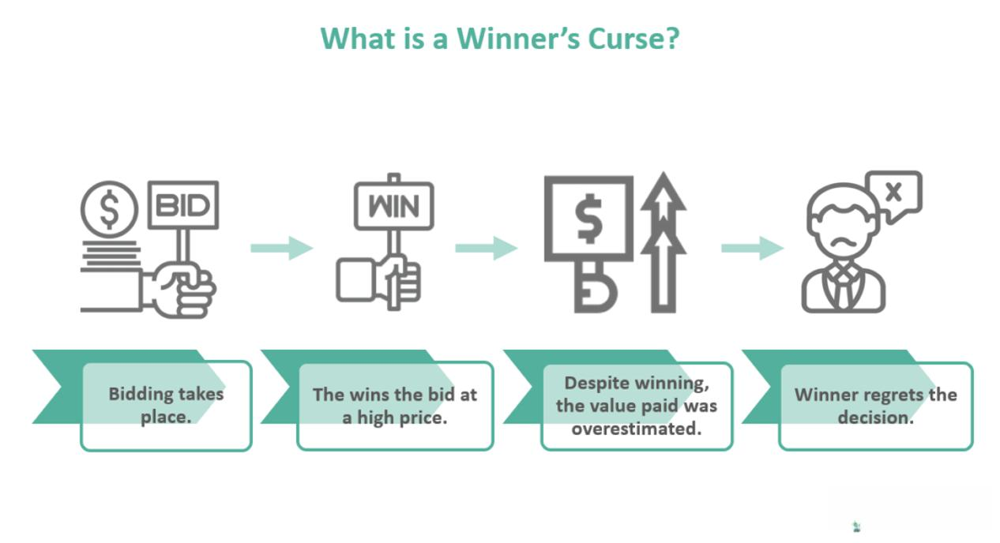

In the rapidly evolving world of economics and trading, understanding complex theories and concepts can be crucial for success. Among these, the Winner's Curse stands out as a particularly significant phenomenon, especially within the contexts of auction theory and algorithmic trading. This concept describes a situation in which the winner of an auction tends to overpay due to competition and incomplete information, thereby obtaining an item for a price exceeding its intrinsic value. Originally observed in auctions for oil drilling rights, the Winner's Curse has broader applications across various types of auctions, including Initial Public Offerings (IPOs) and real estate transactions.

The exploration of the Winner's Curse involves analyzing its implications in auctions, its economic significance, and how it influences trading strategies. For traders, economists, and investors, comprehending the intricacies of the Winner's Curse is vital for making informed decisions and avoiding financial pitfalls. This article will examine how auction theory can illuminate the causes and effects of the Winner's Curse, highlighting its potential to distort perceived market valuations and decision-making processes.



Furthermore, the development of algorithmic trading offers new strategies to circumvent the risks associated with the Winner's Curse. By utilizing computer algorithms, traders can react to market changes with unprecedented speed and precision, potentially mitigating the impact of overbidding. Understanding the interplay between auction theory, economic concepts, and algorithmic trading allows stakeholders to better navigate the complexities of modern markets, thereby enhancing their ability to achieve optimal outcomes. As we unravel these interactions, our goal is to provide actionable insights into effectively managing the dynamics of contemporary trading and investment scenarios.

## Table of Contents

## Understanding the Winner's Curse

The Winner's Curse is an intriguing phenomenon frequently encountered in auctions, where the winning bid often exceeds the intrinsic value of the item being sold. This occurrence is primarily attributed to several factors, including incomplete information, emotional decision-making, and overestimation.

The origins of the Winner's Curse can be traced back to auctions for oil drilling rights in the Gulf of Mexico during the 1960s. In these auctions, companies often found that the value of the oil reserves they secured was less than anticipated. The discovery highlighted a recurrent theme: the winner, due to aggressive bidding under uncertainty, frequently ended up worse off than other competitors, effectively becoming "cursed".

This concept reveals itself diversely across auction types, whether in initial public offerings (IPOs), real estate markets, or spectrum auctions. A critical aspect behind the Winner's Curse is the issue of incomplete information—bidders act on data that may not fully encapsulate an item's true value. As a result, they rely on estimates, which can distort perceptions of worth.

Emotional decision-making, an element of behavioral economics, further intensifies the Winner's Curse. Bidders may be propelled by competitive instincts or overconfidence, leading to inflated valuations. This overbidding occurs as participants aim to outdo rivals, often neglecting rational assessments.

Preventing the Winner's Curse involves understanding these mechanisms and adjusting bidding strategies. Bidders must strive to critically evaluate available information, applying rigorous analytical methods to estimate true value accurately. Correcting cognitive biases and adopting more calculated approaches can help avoid significant financial setbacks.

Recognizing the potential pitfalls of the Winner's Curse is crucial in auction contexts. This understanding prompts bidders to develop strategies to prevent overpayment, ensuring that their bids align with intrinsic values rather than succumbing to emotional pressures or informational deficits. Through informed decision-making, participants can sidestep the adverse effects typically associated with winning the bid.

## Auction Theory and the Winner's Curse

Auction theory provides a structured approach to understanding how various auction mechanisms operate and their capacity to induce the Winner's Curse. Each auction type has unique strategic bidding implications that may amplify the risk of the Winner's Curse, primarily due to differences in how bids are placed and winners are determined. Below, we explore some common auction types and how they can contribute to this phenomenon.

### Types of Auctions

1. **First-Price Auctions**: In a first-price auction, bidders submit sealed bids, and the highest bidder wins the item, paying the amount they bid. This format creates a strategic challenge, as bidders must balance their desire to win against the risk of overbidding. The Winner's Curse can occur when bidders aggressively overestimate the value of the item, leading to an overpayment.

2. **Second-Price Auctions (Vickrey Auctions)**: In second-price auctions, the highest bidder wins but pays the second-highest bid. This format reduces the Winner's Curse risk because bidders can bid their true valuation without fear of overpaying directly. However, if bidders miscalculate or misjudge others' valuations, the curse can still occur indirectly.

3. **Open Ascending Auctions (English Auctions)**: In this auction type, bidders openly bid against each other, with the price ascending until only one bidder remains. The Winner's Curse is prevalent here, especially when bidders get caught in bidding wars, emotionally driven to win and thus bid beyond reasonable valuations.

### Strategic Implications and Bidder Behavior

Bidder behavior heavily influences the emergence of the Winner's Curse across these auction types. Incomplete information about the true value of the item or opponents’ bidding strategies often leads to overbidding. For instance, in common value auctions, where the item's value is the same for all bidders but not known precisely, the risk of the Winner’s Curse is intensified as bidders lack complete information and may rely on estimations prone to error.

### Mitigating the Winner’s Curse

Understanding auction format and dynamics is crucial for mitigating the Winner's Curse. Bidders should aim to refine their valuation estimations and be mindful of strategic behavior. In first-price auctions, bid shading—a practice where bidders submit a bid below their estimated value—can help avoid overpaying. In open ascending auctions, setting a strict maximum bid limit based on careful evaluation can prevent emotional overbidding.

Bidder education, combined with analytical tools and historical data analysis, enhances decision-making. An informed bidder who comprehends the auction format and adopts strategic bidding practices aligned with their valuation is less likely to suffer the consequences of the Winner’s Curse. This knowledge serves as a protective measure against the inherent risks involved in competitive bidding environments.

## Economic Concepts Underpinning Auctions

Economic theory provides crucial insights into the dynamics of auctions and the emergence of the Winner's Curse, a phenomenon where the winning bid in an auction surpasses the intrinsic value of the item. Key economic concepts such as asymmetric information, efficient markets, and value estimation are integral to understanding why the Winner's Curse occurs and how it influences auction outcomes.

**Asymmetric Information**: In many auctions, bidders do not have complete information about the true value of the item being auctioned. This lack of information symmetry leads to different evaluations and expectations among bidders. Some bidders might have private information that others do not, resulting in an asymmetric information environment. This condition can lead to the Winner’s Curse as bidders, often influenced by optimism or fear of losing out, might overestimate the value due to lack of complete information. For instance, in a common value auction, where the item’s value is the same for all but not known precisely by everyone, the winner is often the bidder who overestimates the most.

**Efficient Markets Hypothesis**: According to the Efficient Markets Hypothesis (EMH), asset prices reflect all available information. In theory, this would allow market participants to make informed bidding decisions, minimizing the chance of overpayment. However, real-world auctions often deviate from this ideal. Market inefficiencies, such as information disparities and emotional decision-making, can result in bids that do not truly reflect the item’s intrinsic value. These deviations can increase the susceptibility to the Winner's Curse as bids driven by market sentiment rather than accurate valuation prevail.

**Value Estimation**: Accurate value estimation is essential in avoiding the Winner's Curse. Traditional valuation methods rely on assessing future cash flows, market conditions, and comparable items. However, auctions often involve items whose value is uncertain or speculative, complicating the estimation process. Misjudgments in estimation can lead to a premium being paid over the intrinsic value, especially under competitive pressure. 

**Behavioral Economics**: Beyond traditional economic theories, behavioral economics provides additional insights into irrational bidding practices leading to the Winner's Curse. Cognitive biases, such as overconfidence and the fear of missing out (FOMO), often drive bidders to place higher bids than they might under rational deliberation. For example, the anchoring effect, where individuals rely too heavily on the first piece of information encountered (initial bid levels), can skew perceptions of an item's worth, resulting in irrationally high bids.

Understanding these economic principles is vital for bidders seeking to predict and influence auction results effectively. By acknowledging the role of asymmetric information, striving for efficient market conditions, improving value estimation techniques, and considering behavioral factors, economists and traders can devise strategies to mitigate the risk of the Winner's Curse. Employing a combination of these insights can lead to more informed and strategic decision-making in auction environments.

## The Role of Algorithmic Trading

Algorithmic trading employs sophisticated computer algorithms to perform trades at unparalleled speeds and frequencies, outpacing human capabilities. One of the main advantages of [algorithmic trading](/wiki/algorithmic-trading) is its potential to circumvent the Winner's Curse by effectively integrating principles from auction theory.

To mitigate the Winner's Curse, which stems from factors like incomplete information and overestimation, algorithms can be programmed to account for market inefficiencies. For instance, predictive models can analyze historical data to forecast price movements, enhancing decision-making accuracy during auctions. This ability to process large datasets efficiently enables algorithms to identify discrepancies between an asset's intrinsic value and its market price, thereby preventing overbidding.

In auction-like scenarios, algorithms can employ strategic techniques such as bid shading, where bids are intentionally placed below the bidder's estimate of an asset's value. This minimizes the risk of winning with a high bid that surpasses the asset’s actual value, a common outcome associated with the Winner's Curse. Moreover, algorithms can [factor](/wiki/factor-investing) in asymmetrical information by adjusting bids dynamically based on available data, which helps correct any biases or misinformation that might skew bidding strategies.

The integration of auction theory principles into algorithmic trading not only offers benefits but also presents challenges. One key challenge is ensuring that algorithms remain adaptive to ever-changing market conditions. Machine learning algorithms can address this by continuously learning from new data inputs, adapting their strategies accordingly. However, the complexity and unpredictability of financial markets mean that even the most sophisticated algorithms can encounter unforeseen variables.

Furthermore, algorithmic trading systems must manage latency and execution speed effectively. As trades are executed in milliseconds, even minor delays can result in missed opportunities or suboptimal bid placements. High-frequency trading algorithms, therefore, are designed to operate with minimal latency to capitalize on fleeting market efficiencies.

Incorporating robust risk management protocols is another critical aspect of algorithmic trading in auction-like settings. Algorithms can be programmed to implement stop-loss orders or other risk mitigation strategies, ensuring that potential losses are minimized if market conditions turn unfavorable.

Understanding and implementing these elements create a foundational basis for developing more effective and resilient trading strategies. By leveraging algorithmic trading, traders can enhance their ability to make informed bidding decisions, thereby increasing the likelihood of achieving desirable outcomes while simultaneously minimizing the risk of falling victim to the Winner's Curse.

## Mitigating the Winner's Curse: Strategies and Applications

Practical strategies are essential in mitigating the risks of the Winner's Curse in auction contexts. By applying insights from auction theory and economics, bidders can make informed decisions that minimize the risk of overpaying.

One primary strategy involves enhancing information gathering. In auction settings, asymmetrical information often leads to bidders overestimating the value of an item. By conducting thorough research and sharing information among participants when possible, bidders can obtain a more accurate assessment of an item's intrinsic value. This minimizes the chance of basing bids on incorrect assumptions or incomplete data.

Value estimation is another crucial tactic. Accurate valuation techniques are critical to determining an item's worth without overbidding. Bidders can deploy statistical models and historical data analysis to make more precise estimations. For example, constructing a regression model based on factors like past auction results and market trends can offer insights into an item's true value.

Bid shading is a strategic approach where bidders deliberately bid below their estimated value to buffer against the Winner's Curse. By accounting for the probability of winning and the potential regret of overpaying, bidders can adjust their bids downward to avoid overvaluing an item. This is often calculated using Bayesian inference, which can incorporate prior distributions of item values to update a bidder's belief in real-time.

Real-world applications and case studies demonstrate these successful mitigation strategies. For instance, in the oil and gas industry, firms employ geologists and data analysts to precisely assess drilling rights, which reduces the risk of the Winner's Curse by avoiding overestimation. In technology IPOs, companies and investors might use [machine learning](/wiki/machine-learning) algorithms to analyze market sentiment and trading patterns to refine their valuation estimates and bidding strategies.

Consider Python as a tool for practical application:

```python
import numpy as np

# Sample data showing past auction prices for similar items
past_auction_data = np.array([100, 150, 200, 250, 300])

# Estimate the value using the mean of past data
estimated_value = np.mean(past_auction_data)

# Define a bid shading factor (e.g., 10%)
bid_shading_factor = 0.9

# Calculate the shaded bid
shaded_bid = estimated_value * bid_shading_factor

print(f"Estimated Value: {estimated_value}")
print(f"Shaded Bid: {shaded_bid}")
```

In this code snippet, a bidder uses past auction data to estimate an item's value and applies bid shading to determine a strategic bid. This approach indicates a practical framework for traders and investors aiming to implement informed bidding strategies, ultimately enhancing their outcomes and avoiding the pitfalls of the Winner's Curse.

## Conclusion

The Winner's Curse, a well-documented occurrence in auction environments, poses a significant challenge to both investors and economists. This phenomenon emphasizes the complexities inherent in auction markets, where the potential for overbidding and subsequent financial losses is a constant risk. By comprehensively understanding auction theory—a framework that examines bidding strategies, auction types, and bidder behavior—individuals can develop effective strategies to avoid overpaying for auctioned items.

Key economic concepts such as asymmetric information and efficient market hypotheses play pivotal roles in auction dynamics. These concepts help explain why the Winner's Curse occurs and offer strategies to mitigate its impact. Moreover, the integration of behavioral economics provides insights into the psychological factors that can drive irrational bidding, thereby arming bidders with knowledge to counteract such tendencies.

Algorithmic trading emerges as a crucial tool in auctions, enhancing the decision-making process through precision and speed that humans cannot achieve alone. Algorithms can be programmed to take into account market inefficiencies and incomplete information, reducing the likelihood of falling into the trap of the Winner's Curse. By implementing trading algorithms informed by auction theory, traders can analyze market trends and adjust bids dynamically to improve outcomes.

Combining theoretical insights with practical strategies equips traders with the knowledge required to navigate auctions more successfully. Techniques such as meticulous data gathering, accurate value estimation, and strategic bid adjustments, known as bid shading, can substantially lower the risks associated with the Winner's Curse.

Applying the insights gained from understanding these multifaceted components allows individuals to approach auctions with greater confidence and efficiency. This holistic grasp of the Winner's Curse not only offers a protective advantage but also transforms what is often viewed as an economic pitfall into a learning opportunity that enhances overall trading and investment strategies. By internalizing these lessons, traders and investors can adeptly handle auction markets, thus ensuring more favorable economic outcomes.

## References & Further Reading

[1]: Kagel, J. H., & Levin, D. (2002). ["Common Value Auctions and the Winner's Curse."](https://www.degruyter.com/document/doi/10.1515/9781400830138/html) Princeton University Press.

[2]: Milgrom, P. R. (2004). ["Putting Auction Theory to Work."](http://www.econ.ucla.edu/riley/271/Milgrom-Putting%20Auction%20Theory%20to%20Work.pdf) Cambridge University Press.

[3]: Thaler, R. H. (1988). ["Anomalies: The Winner's Curse."](https://pubs.aeaweb.org/doi/pdfplus/10.1257/jep.2.1.191) Journal of Economic Perspectives, 2(1), 191-202.

[4]: McAfee, R. P., & McMillan, J. (1987). ["Auctions and Bidding."](https://www.jstor.org/stable/2726107) Journal of Economic Literature, 25(2), 699-738.

[5]: Biais, B., Glosten, L., & Spatt, C. (2005). ["Market Microstructure: A Survey of Microfoundations, Empirical Results, and Policy Implications."](https://www.cis.upenn.edu/~mkearns/finread/bias-spatt-survey.pdf) Journal of Financial Markets, 8(2), 217-264.