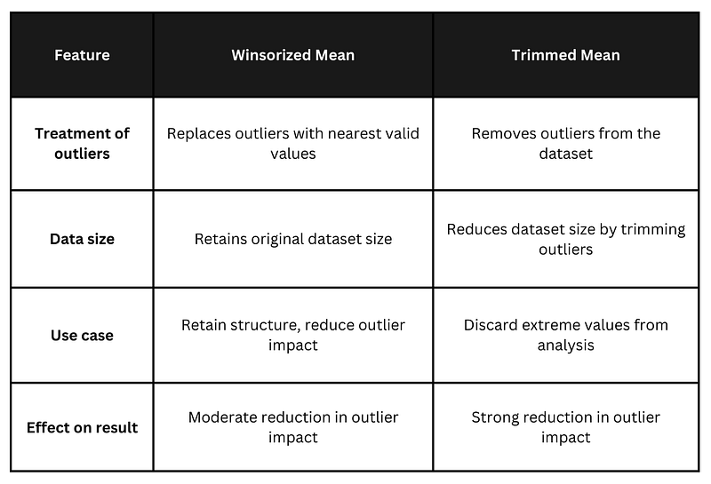

## Table of Contents

## What is the Winsorized mean and why is it used?

The Winsorized mean is a way to find the average of a set of numbers, but it's a bit different from the regular average. When you calculate the Winsorized mean, you change the very highest and very lowest numbers in the set to be closer to the middle numbers. For example, if you have the numbers 1, 2, 3, 4, 100, you might change the 100 to a smaller number, like 4, and the 1 to a bigger number, like 2. Then, you find the average of these new numbers.

People use the Winsorized mean when they want to make sure that a few very high or very low numbers don't mess up the average too much. These extreme numbers are called outliers. By changing the outliers, the Winsorized mean gives a better idea of what the "typical" number in the set is. This can be really helpful in fields like finance or medicine, where outliers can happen but might not represent the usual situation.

## How does the Winsorized mean differ from the regular mean?

The Winsorized mean and the regular mean both help us find the average of a set of numbers, but they do it in different ways. The regular mean, or average, is found by adding up all the numbers and then dividing by how many numbers there are. This means that if there are any very high or very low numbers, they can pull the average up or down a lot. For example, if you have the numbers 1, 2, 3, 4, and 100, the regular mean would be much higher because of the 100.

The Winsorized mean, on the other hand, changes the very highest and lowest numbers before finding the average. This is done to make sure that those extreme numbers, called outliers, don't affect the average too much. Using the same example of 1, 2, 3, 4, and 100, you might change the 100 to a smaller number, like 4, and the 1 to a bigger number, like 2. Then, you find the average of these new numbers. This way, the Winsorized mean gives a better idea of what the "typical" number in the set is, without letting the outliers mess it up.

## What are the steps to calculate the Winsorized mean?

To calculate the Winsorized mean, first decide how many of the highest and lowest numbers you want to change. This is called the trimming percentage. For example, if you choose a 10% trim, you will change the highest 10% and the lowest 10% of the numbers. Arrange all your numbers from smallest to largest. If you have 10 numbers, a 10% trim means you will change the highest number and the lowest number.

Next, change the highest numbers to the next highest number that wasn't changed, and change the lowest numbers to the next lowest number that wasn't changed. For example, if your numbers are 1, 2, 3, 4, 5, 6, 7, 8, 9, 100, and you're using a 10% trim, you would change the 100 to 9 and the 1 to 2. Now your new set of numbers is 2, 2, 3, 4, 5, 6, 7, 8, 9, 9. Add up all these new numbers and divide by the total number of numbers to find the Winsorized mean. In this case, the sum is 55, and divided by 10, the Winsorized mean is 5.5.

## Can you explain the concept of trimming in the context of Winsorized mean?

Trimming in the context of the Winsorized mean is about deciding how many of the highest and lowest numbers in a set you want to change. You pick a percentage, like 10% or 20%, and that tells you how many numbers at each end to adjust. For example, if you have 10 numbers and you choose a 10% trim, you'll change the highest number and the lowest number. This is different from just cutting them out, which is what you do with the trimmed mean. With the Winsorized mean, you keep all the numbers but make the extreme ones less extreme.

Once you know how many numbers to change, you replace the highest numbers with the next highest number that wasn't changed, and you replace the lowest numbers with the next lowest number that wasn't changed. So, if your numbers are 1, 2, 3, 4, 5, 6, 7, 8, 9, 100, and you're using a 10% trim, you would change the 100 to 9 and the 1 to 2. This way, you're not losing any data, but you're making sure that the very high or very low numbers don't pull the average too far in one direction. This helps give a better picture of what the "typical" number in the set is.

## What percentage of data is typically trimmed when calculating the Winsorized mean?

When calculating the Winsorized mean, the percentage of data that is typically trimmed can vary, but common choices are 5% or 10% at each end of the data set. This means that if you choose a 10% trim, you will change the highest 10% and the lowest 10% of the numbers. For example, if you have 100 numbers, you would change the highest 10 numbers and the lowest 10 numbers.

The choice of the trimming percentage depends on how much you want to reduce the impact of outliers without losing too much information from your data. A 5% trim is often used when you want to be a bit more conservative, while a 10% trim might be chosen if you think the outliers are more extreme and need to be adjusted more. The key is to find a balance that gives you a good picture of the "typical" value in your data set.

## How does the choice of trimming percentage affect the Winsorized mean?

The choice of trimming percentage when calculating the Winsorized mean can make a big difference. If you pick a small percentage, like 5%, you'll only change a few of the highest and lowest numbers. This means the Winsorized mean will still be pretty close to the regular mean, but it will be a bit less affected by the very high or very low numbers. It's a good choice if you want to keep most of your data the same but still smooth out the effect of a few outliers.

On the other hand, if you choose a bigger percentage, like 10% or 20%, you'll change more numbers at the ends of your data set. This will pull the Winsorized mean even closer to the middle of your data, making it less influenced by outliers. A bigger trim can be useful if you think the extreme numbers in your data are really far from what's typical and you want your average to show what's more common. But, you have to be careful not to trim too much, or you might lose important information about your data.

## Can you provide a simple example of calculating the Winsorized mean with a small dataset?

Let's say you have a small set of numbers: 1, 2, 3, 4, 100. You want to find the Winsorized mean with a 10% trim. First, you need to figure out how many numbers to change. Since you have 5 numbers, a 10% trim means you'll change the highest number and the lowest number. So, you'll change the 100 and the 1.

Next, you replace the highest number with the next highest number that wasn't changed, and the lowest number with the next lowest number that wasn't changed. In this case, you'll change the 100 to 4 (the next highest number after 100) and the 1 to 2 (the next lowest number after 1). Now your new set of numbers is 2, 2, 3, 4, 4. Add these up to get 15, and then divide by the total number of numbers, which is 5. So, the Winsorized mean is 15 divided by 5, which equals 3.

## What are the advantages of using the Winsorized mean over other measures of central tendency?

The Winsorized mean is really helpful because it makes sure that a few very high or very low numbers don't mess up the average too much. These extreme numbers are called outliers, and they can make the regular mean not show what's typical in the data. By changing the outliers to be closer to the middle numbers, the Winsorized mean gives a better idea of what the "typical" number is. This can be especially useful in fields like finance or medicine, where outliers can happen but might not represent the usual situation.

Another advantage of the Winsorized mean is that it keeps all the data in the calculation. Unlike the trimmed mean, which cuts out the highest and lowest numbers completely, the Winsorized mean changes them but still uses them. This means you don't lose any information, which can be important when you're working with data. So, the Winsorized mean is a good middle ground between the regular mean and the trimmed mean, giving you a more accurate picture of the center of your data without throwing away any numbers.

## In what types of data distributions is the Winsorized mean most beneficial?

The Winsorized mean is most helpful when you have data with a lot of outliers. Outliers are numbers that are much higher or lower than the rest. In these cases, the regular mean can be pulled way off from what's typical because of those extreme numbers. The Winsorized mean fixes this by changing the outliers to be closer to the middle numbers, so the average shows what's more common in the data.

This method is really useful in fields like finance or medicine, where you might see some very high or very low numbers that don't represent the usual situation. For example, in finance, a few very big or very small stock prices might not show what's normal for the market. By using the Winsorized mean, you get a better idea of what's typical without letting those extreme numbers mess up your average.

## How can the Winsorized mean be implemented in statistical software like R or Python?

In R, you can use the `winsorize` function from the `robustHD` package to calculate the Winsorized mean. First, you need to install and load the package. Then, you can use the function by giving it your data and the trimming percentage you want. For example, if you have a set of numbers called `data` and you want to use a 10% trim, you would write `winsorized_data <- winsorize(data, probs = c(0.1, 0.9))`. After that, you can find the mean of the new data with `mean(winsorized_data)`. This way, R will change the highest 10% and lowest 10% of your numbers and then find the average of the new set.

In Python, you can use the `scipy.stats` module to calculate the Winsorized mean. You'll need to import the `mstats` function from `scipy.stats`. Then, you can use the `winsorize` function to change your data. For example, if your data is in a list called `data` and you want a 10% trim, you would write `from scipy.stats import mstats; winsorized_data = mstats.winsorize(data, limits=[0.1, 0.1])`. After that, you can find the mean of the new data with `import numpy as np; winsorized_mean = np.mean(winsorized_data)`. This will change the highest 10% and lowest 10% of your numbers and then find the average of the new set.

## What are the potential drawbacks or limitations of using the Winsorized mean?

One potential drawback of using the Winsorized mean is that it can still be affected by outliers, just not as much as the regular mean. If you choose a small trimming percentage, the extreme numbers might still pull the average a bit. Also, deciding on the right trimming percentage can be tricky. If you trim too much, you might lose important information about your data. If you don't trim enough, the outliers might still mess up your average.

Another limitation is that the Winsorized mean changes the original data. This can be a problem if you need to keep the data exactly as it is for other analyses or reports. By changing the highest and lowest numbers, you're not using the real data anymore, which might not be okay in some situations. So, while the Winsorized mean can help with outliers, it's important to think about whether changing the data is the right thing to do for your specific needs.

## Can you discuss a real-world application where the Winsorized mean provided more insightful results than other measures?

In the world of finance, the Winsorized mean can be really helpful when looking at stock prices. Imagine you're studying the average price of a stock over a year, but there were a few days when the price jumped super high or dropped really low because of some unusual news. These big changes can make the regular average price look way off from what's normal. By using the Winsorized mean, you can change those extreme prices to be closer to the usual prices, so your average shows what's more typical for that stock. This can give investors a better idea of what to expect from the stock's price in the future.

For example, a financial analyst might be looking at the daily returns of a stock to see how risky it is. If there are a few days with huge gains or losses, the regular mean return might make the stock look much riskier than it really is. By using the Winsorized mean, the analyst can smooth out those extreme days and get a clearer picture of the stock's typical performance. This can help them make better decisions about whether to buy, sell, or hold the stock, based on a more accurate understanding of its usual behavior.

## References & Further Reading

[1]: Rousseeuw, P. J., & Leroy, A. M. (2005). ["Robust Regression and Outlier Detection."](https://onlinelibrary.wiley.com/doi/book/10.1002/0471725382) Wiley.

[2]: Wilcox, R. R. (2011). ["Introduction to Robust Estimation and Hypothesis Testing."](https://www.sciencedirect.com/book/9780128047330/introduction-to-robust-estimation-and-hypothesis-testing) Academic Press.

[3]: Tukey, J. W. (1962). ["The Future of Data Analysis."](https://projecteuclid.org/journals/annals-of-mathematical-statistics/volume-33/issue-1/The-Future-of-Data-Analysis/10.1214/aoms/1177704711.full) The Annals of Mathematical Statistics, 33(1), 1-67.

[4]: Hampel, F. R., Ronchetti, E. M., Rousseeuw, P. J., & Stahel, W. A. (1986). ["Robust Statistics: The Approach Based on Influence Functions."](https://www.researchgate.net/publication/346630632_Robust_Statistics_The_Approach_Based_on_Influence_Functions) Wiley.

[5]: Maronna, R. A., Martin, R. D., & Yohai, V. J. (2006). ["Robust Statistics: Theory and Methods."](https://onlinelibrary.wiley.com/doi/book/10.1002/9781119214656) Wiley.