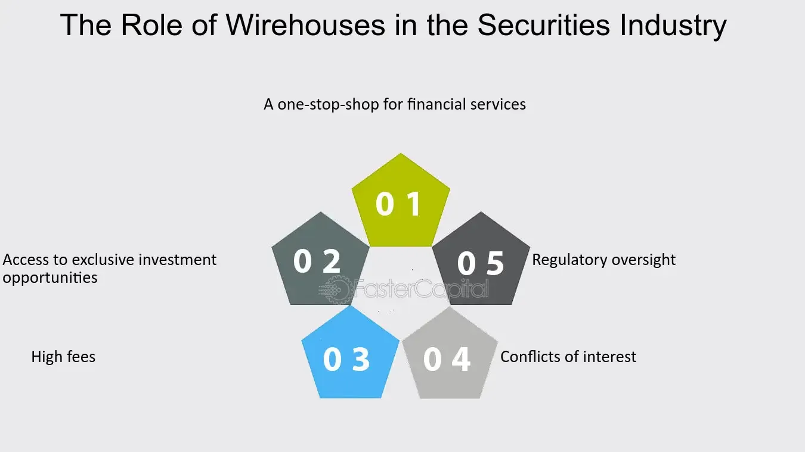

## Table of Contents

## What is a wirehouse?

A wirehouse is a type of large brokerage firm that provides a wide range of financial services to its clients. These firms are called wirehouses because they were originally connected through telegraph wires, which allowed them to communicate and process transactions quickly across different locations. Today, major wirehouses include companies like Morgan Stanley, Merrill Lynch, and UBS.

Wirehouses typically employ financial advisors who work directly with clients to manage their investments, plan for retirement, and handle other financial needs. These advisors often have access to a variety of investment products and research tools provided by the firm. While wirehouses offer comprehensive services, they may also have higher fees compared to smaller, independent firms.

## How does a wirehouse differ from other financial institutions?

A wirehouse is different from other financial institutions because it is a big brokerage firm that offers many financial services all in one place. They have financial advisors who help clients with their money, like investing and planning for the future. Wirehouses are known for being connected through a network, which helps them work quickly and efficiently. Some well-known wirehouses are Morgan Stanley, Merrill Lynch, and UBS.

Other financial institutions, like banks or independent brokerages, might not offer as many services as wirehouses. Banks focus more on saving and lending money, while independent brokerages might be smaller and offer fewer investment options. Wirehouses often have higher fees because they provide a lot of services and have a big network. This can be good for clients who want everything in one place, but it might not be the best choice for everyone.

## What services do wirehouses typically offer to their clients?

Wirehouses offer a lot of services to help people with their money. They have financial advisors who work closely with clients to manage their investments. This means they help pick stocks, bonds, and other things to invest in. They also help with planning for the future, like saving for retirement or buying a house. Wirehouses give clients access to a lot of different investment options and tools to help them make good choices.

Another big part of what wirehouses do is financial planning. They help clients figure out how to reach their money goals, whether it's saving for their kids' college or planning for when they stop working. They also offer services like estate planning, which is about making sure your money goes where you want it to after you're gone. Wirehouses are good at giving all these services in one place, which can make things easier for clients who want everything handled by one company.

## How do wirehouses generate revenue?

Wirehouses make money in a few main ways. One big way is through commissions. When a financial advisor at a wirehouse helps a client buy or sell investments like stocks or bonds, the wirehouse gets a small percentage of the money from that trade. This is called a commission. Another way wirehouses earn money is by charging fees for managing a client's investments. These fees are often a percentage of the total amount of money the client has invested with the wirehouse.

Wirehouses also make money from other services they offer. For example, they might charge fees for financial planning, which helps clients figure out how to reach their money goals. They can also earn money from things like estate planning, where they help clients decide what happens to their money after they're gone. All these different fees and commissions add up to help wirehouses make a profit.

## What is the historical background of wirehouses in the financial industry?

The term "wirehouse" comes from a time long ago when big brokerage firms used telegraph wires to talk to each other quickly. This was important because it let them share information and do business faster than smaller firms. The first wirehouses started in the late 1800s and early 1900s. Companies like Merrill Lynch and Morgan Stanley were among the first to use this system. They grew big and powerful because they could serve clients all over the country, not just in one city.

Over the years, wirehouses changed a lot. They started offering more than just buying and selling stocks. They began to help people plan for their future, like saving for retirement or college. They also started using computers instead of telegraphs, which made things even faster and easier. Today, wirehouses are still big players in the financial world. They offer a lot of services in one place, but they also face competition from smaller, more specialized firms that might charge less.

## How do wirehouses impact the economy on a macro level?

Wirehouses have a big effect on the economy because they handle a lot of people's money. They help move money around by buying and selling investments like stocks and bonds. This movement of money can affect how the stock market does, which is a big part of the economy. When wirehouses help their clients invest, they are putting money into businesses, which can help those businesses grow and create jobs. This can make the economy stronger.

Also, wirehouses give financial advice that can change how people spend and save their money. If a lot of people follow the advice to save more for retirement, that can mean less money is spent on things right now. This can slow down the economy a bit. But if wirehouses encourage investing in new businesses or projects, that can help the economy grow. So, what wirehouses do can have a big impact on how the whole economy works.

## What role do wirehouses play in wealth management and investment?

Wirehouses are big in helping people manage their money and make investments. They have financial advisors who work with clients to pick the best investments, like stocks and bonds. These advisors use the wirehouse's tools and research to make smart choices. Wirehouses also help with planning for the future, like saving for retirement or buying a house. They look at all of a client's money and make a plan to help them reach their goals.

Wirehouses also play a big role in the investment world. They buy and sell a lot of investments, which can affect the stock market. When they help clients invest, they are putting money into businesses, which can help those businesses grow and create jobs. This can make the economy stronger. Wirehouses also give advice that can change how people spend and save their money, which can have a big impact on the economy.

## How do regulatory environments affect the operations of wirehouses?

Regulatory environments have a big impact on how wirehouses work. Governments make rules to make sure that wirehouses treat their clients fairly and keep their money safe. These rules can be about how wirehouses give advice, how they handle clients' money, and what they can and can't do with it. For example, wirehouses have to follow rules from the Securities and Exchange Commission (SEC) in the United States. These rules can make wirehouses spend more time and money to make sure they are following the law, which can affect how much they charge their clients.

These regulations also affect what services wirehouses can offer. Sometimes, new rules can limit the kinds of investments wirehouses can sell or how they can charge for their services. This can make wirehouses change their business plans or find new ways to make money. But, these rules are important because they help protect people's money and make sure the financial system works fairly. So, while regulations can make things harder for wirehouses, they are also good for keeping the industry honest and safe.

## What are the advantages and disadvantages of using a wirehouse for financial services?

Using a wirehouse for financial services has some big advantages. They offer a lot of different services all in one place, like helping you invest in stocks and bonds, planning for retirement, and even figuring out what happens to your money after you're gone. This can make things easier because you don't have to go to different places for different services. Wirehouses also have a lot of tools and research to help you make good choices about your money. Plus, they are big and well-known, which can make you feel more secure about where your money is.

But there are also some disadvantages to using a wirehouse. They often charge higher fees than smaller firms because they offer so many services and have a big network. This can mean you pay more for the same services you might get cheaper somewhere else. Also, because wirehouses are so big, you might not get as much personal attention as you would from a smaller, independent advisor. Sometimes, the financial advisors at wirehouses might be pushed to sell certain products, which might not always be the best for you. So, it's important to think about these things when deciding if a wirehouse is right for you.

## How have technological advancements influenced the operations and strategies of wirehouses?

Technological advancements have changed a lot about how wirehouses work. They used to use telegraph wires to talk to each other, but now they use computers and the internet. This makes everything faster and easier. Wirehouses can now give their clients access to a lot of information and tools online. They can also use technology to keep track of their clients' investments and make better decisions. This helps them offer better services and reach more people.

Technology also affects the strategies wirehouses use. They can use data and computer programs to figure out what their clients might need and how to help them better. This can mean creating new products or finding new ways to make money. But technology also brings competition. New companies that use technology to offer financial services can challenge wirehouses. So, wirehouses have to keep up with technology to stay ahead and keep their clients happy.

## What are the current trends and future predictions for wirehouses in the global economy?

Right now, wirehouses are seeing a few big trends. One is that more people want to do their banking and investing online. This means wirehouses are working hard to make their websites and apps better so clients can do everything from their phones or computers. Another trend is that people are looking for advice that fits their own personal goals and values. So, wirehouses are trying to give more personalized services. They are also using new technology like [artificial intelligence](/wiki/ai-artificial-intelligence) to help them understand what their clients need and to make better investment choices.

In the future, wirehouses will probably keep changing to meet these trends. They will likely use even more technology to make their services faster and easier to use. They might also start working with other kinds of financial companies to offer even more services in one place. But they will have to keep an eye on new rules and competition from smaller, tech-savvy firms. If wirehouses can stay ahead of these changes, they will keep being important in the global economy, helping people manage their money and invest in the future.

## How do wirehouses contribute to financial stability and market liquidity?

Wirehouses help keep the financial system stable by managing a lot of people's money. They help clients invest in things like stocks and bonds, which can make the economy stronger. When wirehouses help their clients buy and sell investments, they are moving money around. This can help keep the market balanced and prevent big ups and downs. Wirehouses also have to follow strict rules, which makes sure they are careful with people's money and helps keep the financial system safe.

Wirehouses also add to market [liquidity](/wiki/liquidity-risk-premium), which means they help make it easier to buy and sell investments. Because wirehouses are big and have a lot of clients, they can handle a lot of trades every day. This means there are always people ready to buy or sell, which keeps the market moving smoothly. When the market is liquid, it's easier for everyone to get in and out of investments without big price changes. So, wirehouses play a big role in keeping the market working well and helping the economy stay stable.

## References & Further Reading

[1]: Bergstra, J., Bardenet, R., Bengio, Y., & Kégl, B. (2011). ["Algorithms for Hyper-Parameter Optimization."](https://papers.nips.cc/paper/4443-algorithms-for-hyper-parameter-optimization) Advances in Neural Information Processing Systems 24.

[2]: ["Advances in Financial Machine Learning"](https://www.amazon.com/Advances-Financial-Machine-Learning-Marcos/dp/1119482089) by Marcos Lopez de Prado

[3]: ["Evidence-Based Technical Analysis: Applying the Scientific Method and Statistical Inference to Trading Signals"](https://www.amazon.com/Evidence-Based-Technical-Analysis-Scientific-Statistical/dp/0470008741) by David Aronson

[4]: ["Machine Learning for Algorithmic Trading"](https://github.com/stefan-jansen/machine-learning-for-trading) by Stefan Jansen

[5]: ["Quantitative Trading: How to Build Your Own Algorithmic Trading Business"](https://www.amazon.com/Quantitative-Trading-Build-Algorithmic-Business/dp/1119800064) by Ernest P. Chan