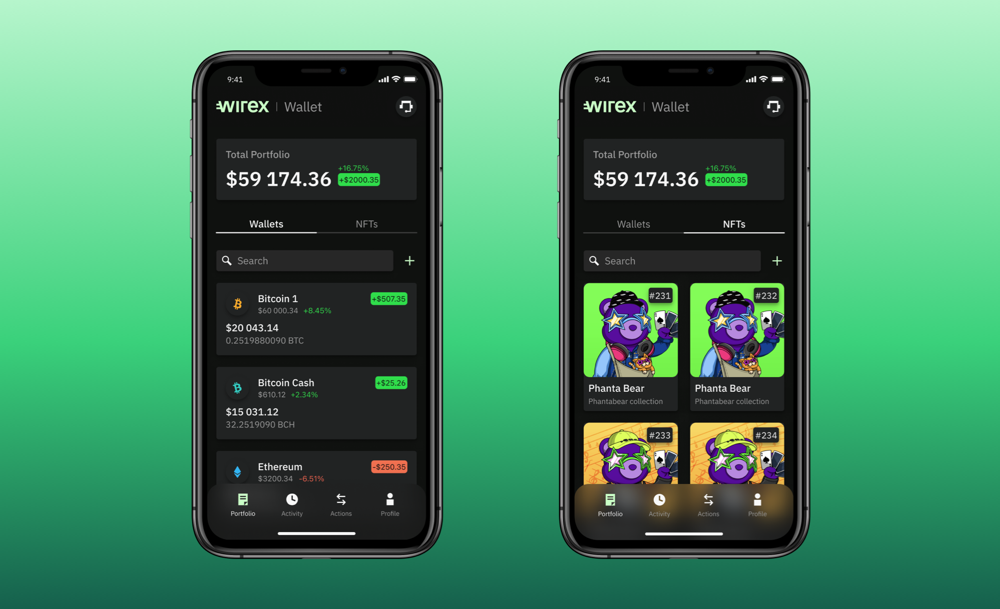

The cryptocurrency world is rapidly evolving, with platforms continuously striving to enhance the user experience for both experienced traders and newcomers. Among these innovative platforms is Wirex, a digital payment system that effectively manages both cryptocurrencies and traditional currencies. Wirex bridges the gap between the two financial realms, providing users with a versatile tool for managing their finances. This article will explore the Wirex cryptocurrency wallet, discussing its key features, the advantages and disadvantages it offers, and examining its role in algorithmic trading. By the end of this article, readers will have a comprehensive understanding of Wirex's offerings and its positioning in the dynamic cryptocurrency landscape.

## Table of Contents



## What is Wirex?

Wirex is a borderless digital payment platform created to facilitate interactions between traditional and cryptocurrencies. It performs a critical role in fostering the integration of these two financial sectors by providing users with tools and services to manage their finances efficiently. Founded in 2014, Wirex has rapidly expanded its scope to encompass over 150 different fiat and cryptocurrencies, offering users unparalleled flexibility to conduct transactions on a global scale.

The platform supports a suite of services accessible via a mobile application and a state-of-the-art card, enabling users to purchase, store, and spend using both digital and traditional assets. This dual capability allows users to maintain a diversified portfolio that can be easily managed through a single interface. The mobile app functions as a command center where users can monitor their balances, execute transactions, and benefit from the array of services that Wirex provides.

Wirex's card integrates seamlessly with the platform, providing a physical representation of one's digital wallet. This next-generation card is engineered to allow instant conversion from cryptocurrency to fiat at the point of sale, facilitating the direct spending of digital assets in everyday transactions. This capability transforms the manner in which crypto enthusiasts utilize their holdings, supporting both online and physical store purchases.

In summary, Wirex stands out as a pioneering tool in the digital payment sector, delivering essential services to users navigating the confluence of traditional and cryptocurrency markets. Through its comprehensive support of multiple currencies and user-centric tools, Wirex sets the stage for a more integrated and user-friendly financial ecosystem.

## Key Features of Wirex

Wirex’s platform is designed to provide a seamless experience for users navigating both traditional and digital currencies. One of the key features of Wirex is its support for a wide variety of currencies, encompassing both fiat and cryptocurrencies. Users can effortlessly exchange between these diverse currencies using Wirex’s multi-currency exchange services. This functionality is bolstered by over-the-counter (OTC) exchange rates, which allow for free and instant currency transfers. The advantage of OTC rates lies in their ability to offer more competitive rates compared to conventional exchanges, often resulting in cost savings for users.

The Wirex Card stands as a significant component of the platform, offering users the convenience to convert cryptocurrencies to fiat and use them directly at Point of Sale (POS) terminals. This seamless crypto-to-fiat conversion process eliminates the need for intermediaries and is conducted without any annual or foreign exchange fees, making everyday transactions both efficient and economical. This feature is particularly advantageous for individuals who frequently travel or engage in international transactions, as it mitigates the typically high costs associated with currency conversion.

Additionally, Wirex provides unique financial services such as X-Accounts and Wirex Credit, broadening the financial flexibility for its users. Through X-Accounts, users have the opportunity to earn interest on their [cryptocurrency](/wiki/cryptocurrency) holdings. These accounts enable users to accrue returns on dormant assets without the typical constraints of traditional banking systems. Meanwhile, Wirex Credit offers a feature that allows users to employ their cryptocurrency as collateral for obtaining loans. This function caters to individuals seeking [liquidity](/wiki/liquidity-risk-premium) without having to sell off their digital assets, thereby maintaining their investment portfolio while accessing necessary funds.

Overall, the combined features of multi-currency support, zero-fee conversion at POS, and financial products like X-Accounts and Wirex Credit, position Wirex as a versatile and innovative solution for users seeking comprehensive management of both traditional and digital financial assets.

## Pros and Cons of Using Wirex

Wirex offers several advantages to its users, making it a notable choice for managing both cryptocurrency and traditional currency assets. One of the primary benefits of using Wirex is its support for a wide range of currencies, both fiat and crypto, which provides users with significant flexibility in how they manage and transact their assets. This diversity allows for global transactions with minimal hassle, enabling users to seamlessly convert and spend their cryptocurrency holdings in everyday scenarios.

Another standout feature is the transparency of Wirex's fee structure. Users benefit from the lack of annual or foreign exchange fees when using the Wirex Card, which simplifies budgeting and financial planning. Additionally, the platform offers over-the-counter (OTC) exchange rates, which can be more favorable compared to standard rates, potentially resulting in cost savings for users who frequently exchange currencies.

The innovative Cryptoback™ rewards program is another attractive element, offering up to 8% back in cryptocurrency on purchases. This rewards program is particularly enticing for users who wish to maximize their earnings from regular transactions, providing an incentive to use Wirex for everyday spending.

However, there are some reported drawbacks to using Wirex, mainly concerning customer support and the platform's accessibility. Users have noted that customer support can sometimes be lacking, which may be frustrating for those encountering issues or requiring assistance. Additionally, accessing the platform can be challenging due to the rigorous Know Your Customer (KYC) requirements that must be fulfilled before service use. These stringent measures are necessary for regulatory compliance and security but may deter users who seek more immediate access.

Despite these challenges, Wirex continues to hold its ground as a competitive option in the financial technology sector. It particularly appeals to users interested in the rewards aspect of their transactions, combining ease of use with financial incentives. For potential users, understanding these pros and cons is crucial for determining if Wirex aligns with their specific financial goals and requirements.

## Wirex and Algorithmic Trading

Algorithmic trading utilizes pre-programmed strategies to automate trading activities, enabling higher speed and frequency than human traders could achieve. This approach is popular among traders aiming to capitalize on real-time market conditions, reduce transaction costs, and minimize emotional bias.

Wirex, a digital payment platform, does not provide direct [algorithmic trading](/wiki/algorithmic-trading) services but supports integration with other platforms through its API. This functionality allows users to connect their Wirex accounts to third-party applications and platforms that specialize in algorithmic trading. By leveraging the API, traders can execute automated trading strategies on platforms that support such activities while managing their assets via Wirex.

The integration potential is beneficial for users who develop and deploy algorithmic strategies to optimize cryptocurrency investments. Traders can program algorithms to interact with the Wirex API for actions such as transferring funds or converting currencies, thereby creating a streamlined workflow. Here is a simple implementation concept using Python:

```python
import requests

def wirex_transfer(api_key, amount, currency_from, currency_to, address):
    url = "https://api.wirexapp.com/transfer"
    headers = {"Authorization": f"Bearer {api_key}"}
    payload = {
        "amount": amount,
        "currency_from": currency_from,
        "currency_to": currency_to,
        "address": address
    }
    response = requests.post(url, headers=headers, json=payload)
    return response.json()

# Example usage
api_key = "your_api_key"
transfer_data = wirex_transfer(api_key, 100, "BTC", "USD", "recipient_address")
print(transfer_data)
```

Traders can programmatically use such scripts to automate the transfer and exchange of cryptocurrencies, making Wirex a versatile tool for those employing computational techniques in trading. This capacity is particularly valuable in the volatile cryptocurrency markets where speed and efficiency are critical for optimizing portfolio performance.

## Competitors Comparison: Wirex vs Others

Competitive platforms like Binance, Coinbase, and Bybit offer distinct benefits in the cryptocurrency exchange and financial services landscape. Binance has established itself as a leader due to its extensive range of cryptocurrency offerings, supporting hundreds of digital currencies, which provide traders with a wide array of investment opportunities. This platform is also known for its robust trading engine that processes over a million transactions per second, making it ideal for high-frequency trading activities. Additionally, Binance supports advanced trading features like futures and options, appealing to seasoned traders looking for sophisticated financial instruments.

Coinbase is another major player, renowned for its commitment to security and user experience. It has gained a reputation for being one of the most secure platforms, employing advanced security protocols such as two-[factor](/wiki/factor-investing) authentication (2FA) and biometric logins. Furthermore, Coinbase provides insurance coverage for digital assets stored on its platform, offering an added layer of protection for users. Its user-friendly interface makes it a popular choice for beginners who seek a straightforward and intuitive trading experience. In addition, Coinbase's ease of use extends to its mobile application, providing users with a seamless transition from desktop to mobile transaction management.

Bybit distinguishes itself with competitive low trading fees and high leverage options, catering specifically to seasoned traders interested in derivatives trading. Bybit offers a maximum leverage of up to 100x on its futures contracts, making it a preferred choice for those looking to maximize their exposure to price movements with relatively small capital. The platform's advanced risk management tools, such as stop-loss and take-profit orders, assist traders in managing their positions effectively and potentially mitigate significant losses.

Wirex, in contrast, stands out in the competitive landscape through its innovative multi-currency card and reward features, targeting both cryptocurrency enthusiasts and regular consumers. The Wirex card allows seamless spending of multiple cryptocurrencies and fiat currencies, addressing the needs of users who wish to integrate their crypto holdings into everyday transactions. This card supports real-time crypto-to-fiat conversion at the point of sale, simplifying the process of using digital assets for purchases in traditional markets.

Moreover, Wirex offers an attractive reward program that gives up to 8% Cryptoback™ rewards on in-store purchases made with the Wirex card. This reward system is particularly appealing to users who want to earn cryptocurrency rewards effortlessly through their daily spending activities. By providing easy access to both crypto and fiat financial services, Wirex caters to a diverse consumer base that spans beyond the typical cryptocurrency trader, making it a versatile platform in the market.

## Conclusion

Wirex offers a robust platform for those aiming to integrate traditional financial systems with the advancing world of cryptocurrency. By providing an array of services, including seamless multi-currency transactions, crypto-backed loans, and a revolutionary rewards program, Wirex stands out as a versatile option for managing finances in both domains. Users benefit from features like the Wirex card, which facilitates an easy transition between crypto and fiat currencies, making it a practical solution for everyday use.

However, the platform is not without its challenges. The stringent Know Your Customer (KYC) procedures, while ensuring security and compliance, may pose accessibility issues for some users. Nevertheless, these measures also help maintain the integrity and safety of user transactions, a crucial factor in cryptocurrency dealings.

The flexibility and innovative rewards system offered by Wirex provide tangible benefits, enticing users with incentives like Cryptoback™ rewards on purchases. Such features demonstrate Wirex's commitment to adding value beyond mere transaction processing. The extensive currency support further amplifies its attractiveness, catering to a global audience with diverse financial needs.

Before committing to Wirex, potential users should evaluate their individual requirements and rigorously assess the platform's offerings. Conducting thorough research and understanding both the capabilities and limitations of Wirex will enable users to make informed decisions aligned with their personal or business financial strategies. This due diligence is essential to leveraging Wirex's potential fully while navigating the rapidly evolving financial landscape.

## References & Further Reading

[1]: ["Cryptocurrency: How Bitcoin and Digital Money are Challenging the Global Economic Order"](https://www.amazon.com/Age-Cryptocurrency-Bitcoin-Challenging-Economic/dp/1250065631) by Paul Vigna and Michael J. Casey

[2]: Narayanan, A., Bonneau, J., Felten, E., Miller, A., & Goldfeder, S. (2016). ["Bitcoin and Cryptocurrency Technologies: A Comprehensive Introduction"](https://press.princeton.edu/books/hardcover/9780691171692/bitcoin-and-cryptocurrency-technologies). Princeton University Press.

[3]: Gandal, N., & Halaburda, H. (2014). ["Competition in the Cryptocurrency Market"](https://papers.ssrn.com/sol3/papers.cfm?abstract_id=2501640). SSRN.

[4]: Antonopoulos, A. M. (2017). ["Mastering Bitcoin: Unlocking Digital Cryptocurrencies"](https://books.google.com/books/about/Mastering_Bitcoin.html?id=IXmrBQAAQBAJ). O'Reilly Media.

[5]: Iansiti, M., & Lakhani, K. R. (2017). ["The Truth About Blockchain"](https://hbr.org/2017/01/the-truth-about-blockchain). Harvard Business Review.

[6]: Tapscott, D., & Tapscott, A. (2016). ["Blockchain Revolution: How the Technology Behind Bitcoin and Other Cryptocurrencies is Changing the World"](https://dl.acm.org/doi/10.5555/3051781). Portfolio.

[7]: Yermack, D. (2015). ["Is Bitcoin a Real Currency? An Economic Appraisal"](https://www.nber.org/papers/w19747). National Bureau of Economic Research.

[8]: Nakamoto, S. (2008). ["Bitcoin: A Peer-to-Peer Electronic Cash System"](https://nakamotoinstitute.org/library/bitcoin/).

[9]: Lee, D. K. C. (Ed.). (2015). ["Handbook of Digital Currency"](https://www.sciencedirect.com/book/9780128021170/handbook-of-digital-currency). Academic Press.