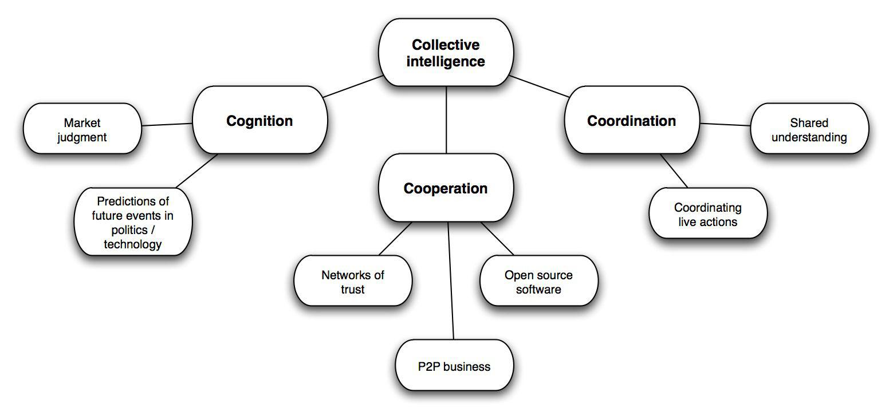

The concept of the 'wisdom of crowds' posits that large groups of individuals, when aggregated appropriately, possess the capacity to make decisions and solve problems with greater efficacy than isolated experts. This notion is grounded in the idea that the collective judgments of many can surpass those of a single individual, no matter how knowledgeable or skilled they may be. 

This article examines the interplay between the wisdom of crowds, collective intelligence, and algorithmic trading. Collective intelligence refers to the enhanced capacity for decision-making that arises from crowd-based insight. When applied to financial markets, this collective wisdom can serve as a powerful tool to optimize trading strategies and improve market predictions. By tapping into diverse perspectives, it becomes possible to mitigate individual biases and generate more holistic assessments of market conditions.



Algorithmic trading, which employs computer programs to execute trades at high speeds and volumes, stands to benefit substantially from the integration of crowd intelligence. As these algorithms are tasked with interpreting vast data streams to identify trading opportunities, incorporating insights derived from the crowd can lead to more nuanced and dynamic trading models. The ability to harness crowd wisdom in algorithmic trading could potentially transform how the financial industry approaches decision-making, offering a competitive advantage in a complex and fast-paced environment. 

Ultimately, the synthesis of crowd intelligence and algorithmic trading strategies holds significant promise for enhancing decision-making capabilities in finance. By leveraging collective insights, traders and analysts are presented with the opportunity to refine their strategies and improve their overall effectiveness in the market.

## Table of Contents

## Understanding the Wisdom of Crowds

The concept of the 'wisdom of crowds' was brought into the spotlight by James Surowiecki in his book, "The Wisdom of Crowds". This theory posits that large groups of people, when structured appropriately, can make more accurate decisions and predictions than individual experts. The ability for a crowd to be 'wise' relies on four critical conditions: diversity, independence, decentralization, and aggregation of opinions.

Diversity of thought is essential as it ensures a wide range of perspectives are considered. This diversity can provide a more comprehensive understanding of a problem and generate innovative solutions. Unlike a homogenous group where everyone might think similarly, a diverse crowd can pool together different information and interpretations, which can lead to better decision-making.

Independence refers to the freedom of individuals in the crowd to express their own opinions without being influenced by others. This prevents a herding effect where individuals might conform to the majority view or follow influential leaders. Independence helps in maintaining a variety of opinions and reduces the chances of systematic errors that can occur when many people follow the same line of thinking.

Decentralization implies that crowd members can draw on their personal, local knowledge and contribute uniquely to the group's understanding. Rather than relying on a central authority to provide information, decentralization empowers individuals within the crowd, each with their own expertise and experience, to contribute to a more nuanced picture of the issue at hand.

Finally, the aggregation of opinions is the process by which diverse and independent judgments are compiled into a collective decision. Effective aggregation mechanisms are crucial as they synthesize individual inputs into a comprehensive insight or verdict. These mechanisms can range from voting systems to complex algorithms that weigh individual decisions based on various factors.

The wisdom of crowds is not confined to theoretical discussions but has practical applications across many fields. In pop culture, crowd-sourced platforms like IMDb and Rotten Tomatoes reflect the collective judgment of audiences on films and television shows. In financial markets, the aggregation of buying and selling decisions across vast numbers of traders can lead to more accurate pricing of securities, reflecting the collective information and sentiment of all participants involved.

In essence, when these conditions are met, the collective intelligence of a crowd can surpass that of individual experts, providing valuable insights and solutions to complex problems.

## Application in Financial Markets

Financial markets often mirror the principles of the wisdom of crowds by utilizing the aggregated insights and behaviors of numerous participants to guide market dynamics. At its core, the concept suggests that the collective decisions of a diverse group can lead to more accurate outcomes, reflecting both efficiencies and inefficiencies that arise from investor actions.

In efficient markets, the collective intelligence of participants promotes a rapid integration of information into asset prices, aligning closely with the Efficient Market Hypothesis (EMH). According to EMH, prices on traded assets, such as stocks or bonds, reflect all available information at any point in time. Therefore, when large groups of investors act on diverse information sources, their aggregated decisions can lead to market efficiency where asset prices reflect the collective knowledge of the crowd.

Conversely, market inefficiencies can also arise when collective intelligence is misapplied, leading to phenomena like bubbles or crashes. In these instances, the wisdom of crowds veers into herd behavior, where market participants mimic the actions of others rather than making independent, informed decisions. This can lead to significant deviations from intrinsic values, causing mispriced assets that eventually correct, often abruptly.

Algorithmic trading strategies can harness these principles by analyzing patterns and behavioral dynamics across a wide array of market participants. By employing algorithms that assess sentiment, trading [volume](/wiki/volume-trading-strategy), and price [momentum](/wiki/momentum), traders can identify trends that reflect the aggregated insights of the crowd. For example, a simple moving average crossover strategy may be used to capture trends influenced by collective behaviors:

```python
import numpy as np
import pandas as pd

# Simulated price data
price_data = pd.Series([100 + np.sin(x/5) + np.random.normal(scale=3) for x in range(100)])

# Moving average calculation
short_window = 5
long_window = 20

signals = pd.DataFrame(index=price_data.index)
signals['price'] = price_data
signals['short_mavg'] = price_data.rolling(window=short_window, min_periods=1, center=False).mean()
signals['long_mavg'] = price_data.rolling(window=long_window, min_periods=1, center=False).mean()

# Generate trading signals
signals['signal'] = 0.0
signals['signal'][short_window:] = np.where(signals['short_mavg'][short_window:] > signals['long_mavg'][short_window:], 1.0, 0.0)

# Calculate daily positions
signals['positions'] = signals['signal'].diff()

print(signals.head(20))
```

The code above demonstrates a simplistic approach where short-term moving averages cross long-term averages to signal potential trading opportunities, reflecting a common method whereby [algorithmic trading](/wiki/algorithmic-trading) can benefit from patterns often rooted in collective behavior.

By integrating insights derived from the crowd, algorithmic trading strategies can be refined to adapt to dynamic market environments, aiming to leverage the strengths of collective intelligence while mitigating associated risks, such as herd behavior. This optimization makes it possible to enhance trading success and build more resilient portfolios.

## The Role of Collective Intelligence in Algo Trading

Algorithmic trading is increasingly benefiting from data-driven insights generated from collective intelligence. By aggregating information from a diverse pool of market participants—ranging from institutional investors to individual traders—algorithmic trading systems can discern patterns and identify market trends with remarkable precision. This approach helps in developing robust trading algorithms that are capable of anticipating shifts and anomalies in the market.

The effectiveness of collective intelligence in algorithmic trading stems from its inherent diversity and independence. When algorithms are designed to process diverse viewpoints, they naturally reduce the influence of outliers and biases, resulting in more balanced decision-making. For instance, by using data analytics to combine insights from various market data sources, trading algorithms are better equipped to predict future price movements or [volatility](/wiki/volatility-trading-strategies), leading to more informed trading strategies.

The incorporation of crowd wisdom in trading algorithms can also foster adaptability. Algorithms that leverage collective intelligence are often designed to be dynamic, allowing them to adjust in real-time as new data is presented. This adaptiveness is crucial in volatile markets where conditions can change rapidly. By continuously learning from the collective input, these adaptive algorithms can recalibrate their models and strategies, maintaining their relevance and efficiency over time.

Moreover, the integration of advanced technologies such as [machine learning](/wiki/machine-learning) with crowd-sourced intelligence can significantly enhance the predictive power of trading algorithms. Through machine learning, algorithms can identify complex non-linear relationships within the data that might elude traditional analysis methods. This capability allows for more nuanced forecasts and strategic decisions, ultimately improving the efficacy and profitability of algorithmic trading operations.

In summary, the role of collective intelligence in algorithmic trading is transformative, providing a framework for creating intelligent, responsive, and effective trading systems. This synergy not only leverages the broad spectrum of market knowledge available but also enhances the overall agility and precision of trading strategies.

## Advantages and Limitations

The concept of the "wisdom of crowds" provides several potential advantages when applied to decision-making processes, particularly in fields like finance and algorithmic trading. One primary benefit is diversity of thought. Crowds are typically composed of individuals with different backgrounds, experiences, and perspectives. This diversity can lead to a more comprehensive analysis of problems and the generation of creative solutions that may not emerge from a homogenous group. Diverse viewpoints contribute to a broader spectrum of ideas, enhancing the overall decision-making process.

Reduced bias is another significant advantage. When decisions are made by a single individual or a small, uniform group, personal biases can heavily influence the outcome. By contrast, larger groups can offset individual biases through the aggregation of many independent judgments. The averaging effect inherent in crowd-based decision-making tends to minimize the influence of extreme opinions, leading to more balanced and objective outcomes.

Enriched decision-making arises from the combined effect of diversity and reduced bias. Crowds, when properly managed, can synthesize vast amounts of data and viewpoints into a coherent and informed conclusion. This collective processing mirrors the concept of a highly adaptive, self-correcting system capable of effectively handling complex scenarios, like those found in financial markets.

However, the wisdom of crowds is not exempt from limitations. Groupthink can arise when the desire for consensus overrides individual opinions, leading to suboptimal decisions. Such scenarios often result in conformity and a reduction in critical judgment, undermining the potential benefits of collective intelligence.

Misinformation is another risk. If the information within the crowd is inaccurate or misleading, the collective decision will reflect these flaws. This is particularly dangerous in financial markets, where erroneous data or herd behavior can lead to irrational market movements and significant financial consequences.

To mitigate these limitations, it is critical to ensure diversity and independence within the group. Diversity helps maintain a range of perspectives, while independence ensures that individuals make judgments based on their own information rather than succumbing to peer pressure. Techniques such as anonymous polling or structured decision-making frameworks can help preserve these attributes, thereby maximizing the effectiveness of crowd-sourced intelligence. 

In summary, while the wisdom of crowds offers substantial benefits for enhancing decision-making through diverse and unbiased insights, it requires careful management to prevent pitfalls such as groupthink and misinformation. By prioritizing diversity and independence, organizations can leverage the full potential of collective intelligence.

## Real-World Examples and Case Studies

The application of the wisdom of crowds in financial markets has demonstrated significant potential, particularly in improving algorithmic trading strategies. This section examines notable examples and case studies where crowd insights have been utilized effectively, providing both challenges and practical applications.

One notable example of the wisdom of crowds in financial markets is QuantConnect, a platform that allows a crowd of developers and data scientists to create and backtest trading algorithms using a wide range of data. By leveraging the collective knowledge and ideas of its community, QuantConnect can identify profitable strategies faster and more efficiently than relying on individual expertise. The platform's open-source nature encourages diversity and independence, key components of crowd wisdom, which help to reduce biases and enhance decision-making.

Another compelling case is Numerai, a [hedge fund](/wiki/hedge-fund-trading-strategies) that employs a unique approach to trading by sourcing predictions from a global network of data scientists. Participants submit predictive models on anonymized financial data, competing to generate the most accurate predictions. Numerai aggregates these models into a meta-model, which it uses to inform trading decisions. This approach harnesses the diversity of thought and collective intelligence of thousands of contributors, illustrating how crowdsourcing can improve hedge fund performance.

In practice, integrating crowd insights into algorithmic trading involves several challenges. One of the primary hurdles is ensuring the quality and relevance of the data used in developing trading algorithms. For example, ideas42, a behavioral science lab, has stressed the importance of filtering significant market signals from noise, ensuring crowd-sourced inputs are reliable and valuable. Moreover, guardrails against risks such as groupthink and misinformation must be established, which could otherwise undermine the effectiveness of collectively generated insights.

These examples underline the advantages of using the wisdom of crowds but also highlight the need for careful management of data and crowd-sourcing processes. As these case studies demonstrate, when properly harnessed, collective intelligence can provide a competitive edge in financial markets, offering valuable alternatives and improvements to traditional algorithmic trading methods.

## Future Prospects

As technology continues to advance, the integration of [artificial intelligence](/wiki/ai-artificial-intelligence) (AI) and machine learning (ML) in crowd-based intelligence systems is increasingly prominent, offering significant potential for the future of algorithmic trading. These technologies enhance the ability to analyze extensive datasets generated by crowd activities, thereby improving the precision and efficacy of trading algorithms.

The fusion of AI and ML allows for more sophisticated processing of crowd-sourced data, enabling algorithmic trading systems to identify patterns, trends, and anomalies within financial markets more effectively. By utilizing AI-driven natural language processing, for instance, trading algorithms can extract valuable insights from textual data such as news articles, social media posts, and financial reports, contributing to a comprehensive understanding of market sentiment.

Moreover, the potential for advancements in algorithmic trading is further amplified by the development of predictive models that capitalize on crowd wisdom. These models leverage the collective forecasting ability of large, diverse groups to anticipate market movements. Machine learning algorithms can continually refine these predictions by learning from historical data and real-time inputs, thereby increasing their accuracy and reliability over time.

Future research may focus on hybrid models that combine human judgment with machine precision. This approach seeks to harness the nuanced understanding and contextual knowledge of human experts while benefiting from the scalability, speed, and objectivity of machine-based analysis. For example, human intuition and expertise can be used to set parameters and interpret complex scenarios, whereas machines can efficiently process and analyze vast amounts of data.

One conceivable direction involves developing ensemble methods that integrate multiple machine learning models, each processing different aspects of crowd intelligence. Through techniques such as bagging or boosting, these ensemble models can aggregate insights from varied data sources, enhancing the robustness of trading strategies. Here is a simple example of a Python code illustrating how ensemble methods could be implemented using libraries like Scikit-learn:

```python
from sklearn.ensemble import RandomForestRegressor, GradientBoostingRegressor
from sklearn.model_selection import train_test_split
from sklearn.metrics import mean_squared_error
import numpy as np

# Hypothetical dataset
X, y = np.random.rand(100, 10), np.random.rand(100)

# Split into training and testing sets
X_train, X_test, y_train, y_test = train_test_split(X, y, test_size=0.2, random_state=42)

# Initialize models
rf = RandomForestRegressor(n_estimators=100, random_state=42)
gb = GradientBoostingRegressor(n_estimators=100, random_state=42)

# Train models
rf.fit(X_train, y_train)
gb.fit(X_train, y_train)

# Predictions
rf_pred = rf.predict(X_test)
gb_pred = gb.predict(X_test)

# Ensemble prediction
ensemble_pred = (rf_pred + gb_pred) / 2

# Evaluate
mse = mean_squared_error(y_test, ensemble_pred)
print("Mean Squared Error of Ensemble Model:", mse)
```

In conclusion, the future of algorithmic trading lies in deeper integration of crowd wisdom with AI and machine learning, presenting opportunities for innovative research and development. By combining human insights and technological advancements, financial markets can leverage the strengths of both to achieve superior decision-making capabilities.

## Conclusion

The wisdom of crowds has emerged as a significant enhancement to financial market analysis and algorithmic trading. By capitalizing on the collective intelligence of large groups, traders and analysts can refine their decision-making processes. This collective insight facilitates the identification of market trends and the prediction of future movements, thereby potentially improving the accuracy and efficacy of trading strategies. 

Addressing the limitations of crowd wisdom, such as the dangers of groupthink or misinformation, is essential. Ensuring diversity and independence among contributors can mitigate these risks, thus enhancing the reliability of the insights gained. When carefully managed, the amalgamation of diverse perspectives leads to enriched decision-making and reduced bias. 

Algorithmic trading benefits significantly from integrating collective intelligence. Algorithms that adapt based on crowd insights can react more dynamically to market shifts, resulting in more robust trading strategies. This synergy between collective intelligence and algorithmic trading is shaping an evolving frontier in financial technology. As this field progresses, the potential for more sophisticated and successful trading algorithms continues to grow, heralding a future where crowd-based insights play a pivotal role in financial decision-making.

## References & Further Reading

[1]: Surowiecki, J. (2005). ["The Wisdom of Crowds."](https://psycnet.apa.org/record/2004-20179-000) Anchor.

[2]: Baruch, S., Karolyi, G. A., & Lemmon, M. L. (2007). ["Multimarket Trading and Liquidity: Theory and Evidence."](https://onlinelibrary.wiley.com/doi/abs/10.1111/j.1540-6261.2007.01272.x) Journal of Finance.

[3]: Taleb, N. N. (2010). ["The Black Swan: The Impact of the Highly Improbable."](https://www.jstor.org/stable/23045073) Random House Trade Paperbacks.

[4]: Hong, H., & Stein, J. C. (1999). ["A Unified Theory of Underreaction, Momentum Trading, and Overreaction in Asset Markets."](https://www.jstor.org/stable/797990) The Review of Financial Studies.

[5]: Tetlock, P. C. (2007). ["Giving Content to Investor Sentiment: The Role of Media in the Stock Market."](https://onlinelibrary.wiley.com/doi/abs/10.1111/j.1540-6261.2007.01232.x) The Journal of Finance.