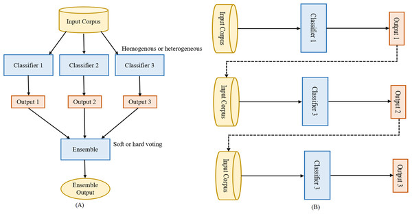

## Table of Contents

## What is the basic concept of Wisdom of the Crowd in machine learning?

The Wisdom of the Crowd is a concept in machine learning that suggests that the collective opinion of a group of individuals can be more accurate than the opinion of a single expert. This idea is based on the principle that when many people make predictions or estimates, their average can often be closer to the true value than any single prediction. For example, if you ask a large group of people to guess the number of jelly beans in a jar, the average of all the guesses is usually closer to the actual number than most individual guesses.

In machine learning, this concept is often applied in ensemble methods, where multiple models are combined to improve prediction accuracy. By aggregating the predictions of several models, such as decision trees or neural networks, the final output can be more reliable and accurate than that of any single model. This approach leverages the diversity of the individual models, reducing the impact of errors from any one model and enhancing the overall performance of the system.

## How does Wisdom of the Crowd differ from traditional machine learning methods?

Wisdom of the Crowd in machine learning is different from traditional methods because it uses the power of many opinions instead of just one model's prediction. In traditional machine learning, you might train one model, like a decision tree or a neural network, to make predictions. This single model learns from the data and tries to make the best guess it can. But sometimes, even the best single model can make mistakes or miss important patterns in the data.

On the other hand, Wisdom of the Crowd takes a different approach by combining the predictions of many models. Imagine you have a group of friends, and each friend guesses how many jelly beans are in a jar. If you take the average of all their guesses, you often get a number that's closer to the truth than any single guess. In [machine learning](/wiki/machine-learning), this means training lots of different models and then averaging their predictions. This way, the errors from one model can be balanced out by the others, leading to more accurate and reliable results overall.

## Can you explain the role of collective intelligence in Wisdom of the Crowd?

Collective intelligence plays a big role in the Wisdom of the Crowd. It's the idea that a group of people can be smarter together than any one person alone. When lots of people share their thoughts or guesses, their combined knowledge can lead to better decisions or predictions. In machine learning, this means using many models instead of just one. Each model might see things a bit differently, but when you put all their ideas together, you can get a clearer picture of what's really going on.

This idea works because the mistakes made by some models can be canceled out by the correct guesses of others. Imagine if you and your friends are guessing the number of jelly beans in a jar. Some might guess too high, and some too low, but when you average all the guesses, you often get close to the right number. In machine learning, this means the final prediction from many models can be more accurate than any single model's guess. This is why using collective intelligence, or the Wisdom of the Crowd, can make machine learning models work better.

## What are some common applications of Wisdom of the Crowd in machine learning?

One common application of Wisdom of the Crowd in machine learning is in ensemble methods. These methods combine the predictions of multiple models to improve accuracy. For example, in a random forest, many decision trees are trained on different parts of the data, and their predictions are averaged to make a final prediction. This approach can help reduce errors and improve the reliability of the model because the mistakes of one tree can be balanced out by the correct predictions of others.

Another application is in crowd-sourced data labeling. When training machine learning models, especially for tasks like image recognition or natural language processing, it's important to have accurately labeled data. Instead of relying on one expert, many people can label the data, and their collective input can lead to more accurate labels. This is often used in platforms like Amazon's Mechanical Turk, where many people contribute to labeling tasks, and the consensus of their labels is used to train the model.

Wisdom of the Crowd is also used in forecasting and prediction markets. For instance, in stock market predictions, aggregating the predictions of many traders can lead to more accurate forecasts than relying on a single analyst. Similarly, in weather forecasting, combining the predictions of multiple models can provide a more reliable forecast. By leveraging the collective intelligence of many, these applications can achieve better results than traditional single-model approaches.

## How is data typically collected and aggregated in Wisdom of the Crowd systems?

In Wisdom of the Crowd systems, data is often collected from a large number of people or sources. For example, if you're trying to guess the number of jelly beans in a jar, you might ask many people to give their guesses. Each person's guess is like a small piece of data. This can be done through surveys, online platforms, or even social media, where people can share their opinions or predictions easily. The key is to get as many different perspectives as possible to make sure the data is diverse and covers a wide range of possibilities.

Once the data is collected, it needs to be aggregated to make a final prediction or decision. This often involves taking an average or a median of all the guesses or predictions. For example, if you have a list of guesses about the number of jelly beans, you might add them all up and divide by the number of guesses to get the average. This average is then used as the final prediction. In machine learning, this could mean combining the outputs of many different models to get a more accurate result. The idea is that by putting all these different pieces of information together, you can cancel out individual errors and come closer to the truth.

## What are the key challenges in implementing Wisdom of the Crowd in machine learning?

One of the main challenges in implementing Wisdom of the Crowd in machine learning is dealing with the diversity of the data. When you collect predictions or opinions from a lot of people or models, you want them to be different from each other. This diversity helps to make the final prediction more accurate. But it can be hard to make sure that all these different sources are really independent and not just copying each other. If too many people or models are making similar guesses, it won't help to improve the overall accuracy.

Another challenge is figuring out how to combine all the different predictions in the best way. You might think that just taking the average of all the guesses is enough, but sometimes a simple average isn't the best way to go. Some predictions might be more reliable than others, so you need to find a way to give more weight to the better ones. This can be tricky because it's not always clear which predictions are the best. Also, dealing with a lot of data can be hard, especially if you're trying to do it quickly and efficiently.

## How does Wisdom of the Crowd handle bias and inaccuracies in large datasets?

Wisdom of the Crowd can help reduce bias and inaccuracies in large datasets by averaging out the mistakes made by individual models or people. When many different models or people make predictions, some might be biased or inaccurate, but if you combine all their guesses, the errors can cancel each other out. This means that the final prediction is often more accurate than any single prediction because the biases of some are balanced by the correct guesses of others.

However, Wisdom of the Crowd is not a perfect solution. If a lot of the models or people in the crowd share the same biases, those biases can still show up in the final prediction. For example, if most of the people guessing the number of jelly beans in a jar are from the same group and they all tend to guess too low, the average will still be too low. So, it's important to make sure the crowd is diverse and includes different kinds of people or models to really reduce bias and inaccuracies.

## What algorithms are commonly used to process and analyze data in Wisdom of the Crowd?

In Wisdom of the Crowd systems, one common algorithm used to process and analyze data is the simple average. This means you take all the guesses or predictions and add them up, then divide by the number of guesses. For example, if you have guesses of 100, 150, and 200 for the number of jelly beans in a jar, the average would be $$(100 + 150 + 200) / 3 = 150$$. This method is easy to understand and works well when the guesses are diverse and independent.

Another algorithm often used is weighted averaging. This is a bit more complicated because it gives more importance to some guesses than others. If you think some people or models are better at guessing, you can give their guesses more weight. For example, if you trust the first guess more, you might use weights like 0.5, 0.3, and 0.2 for the guesses of 100, 150, and 200. The weighted average would then be $$(100 \times 0.5 + 150 \times 0.3 + 200 \times 0.2) / (0.5 + 0.3 + 0.2) = 135$$. This method can help make the final prediction more accurate by focusing on the better guesses.

In machine learning, ensemble methods like bagging and boosting are also used to process and analyze data in Wisdom of the Crowd systems. Bagging, or Bootstrap Aggregating, involves training many models on different subsets of the data and then combining their predictions, often by averaging. Boosting, on the other hand, trains models one after another, with each new model focusing on the errors of the previous ones. Both methods help to reduce bias and improve accuracy by leveraging the collective intelligence of multiple models.

## Can you discuss a case study where Wisdom of the Crowd significantly improved prediction accuracy?

A well-known case study where Wisdom of the Crowd significantly improved prediction accuracy is the Netflix Prize competition held between 2006 and 2009. Netflix wanted to improve its movie recommendation algorithm, so they invited people from around the world to submit their best models. The goal was to beat the accuracy of Netflix's existing system by at least 10%. Many teams participated, and they used different approaches to predict how users would rate movies. The winning team, called "BellKor's Pragmatic Chaos," combined the predictions of many different models to create a final prediction that was 10.06% more accurate than Netflix's original algorithm.

The key to their success was using an ensemble method, specifically a technique called blending. They trained many different models, each looking at the data in a slightly different way. Then, they combined the predictions of these models using a weighted average. This approach helped them to reduce the errors that any single model might make. By leveraging the Wisdom of the Crowd, or in this case, the collective intelligence of many different models, they were able to achieve a much higher accuracy than any single model could have on its own. This case study shows how powerful the Wisdom of the Crowd can be in improving prediction accuracy when many diverse models work together.

## How do you measure the effectiveness of a Wisdom of the Crowd model?

To measure the effectiveness of a Wisdom of the Crowd model, you typically look at how well the model's predictions match the real outcomes. One common way to do this is by using metrics like accuracy, mean squared error (MSE), or mean absolute error (MAE). For example, if you're trying to guess the number of jelly beans in a jar, you would compare the average guess from the crowd to the actual number of jelly beans. If the average guess is close to the real number, the model is effective. You can calculate the difference between the guessed number and the real number using formulas like $$ \text{MSE} = \frac{1}{n} \sum_{i=1}^{n} (y_i - \hat{y}_i)^2 $$ where $$ y_i $$ is the real number and $$ \hat{y}_i $$ is the guessed number.

Another way to measure effectiveness is by comparing the Wisdom of the Crowd model to a single model or other benchmarks. If the Wisdom of the Crowd model does better than a single model, it shows that combining many guesses or predictions helps. For example, in the Netflix Prize competition, the winning team's model was more accurate than Netflix's original model by over 10%. This showed that their Wisdom of the Crowd approach worked well. By testing the model on new data that it hasn't seen before, you can see if it keeps doing well, which is a good sign of its effectiveness.

## What are the latest advancements in Wisdom of the Crowd techniques in machine learning?

Recent advancements in Wisdom of the Crowd techniques in machine learning have focused on improving how we combine the predictions from many models. One exciting development is the use of [deep learning](/wiki/deep-learning) to create better ensemble methods. Deep learning models, like neural networks, can learn how to weigh the predictions of different models in a way that makes the final prediction more accurate. For example, researchers have used deep neural networks to figure out the best way to combine the guesses from many different models. This can lead to better results because the [neural network](/wiki/neural-network) can find patterns in the data that simpler methods might miss.

Another advancement is in the area of federated learning, which is a way to use Wisdom of the Crowd across many different devices without sharing the data directly. In federated learning, each device, like a smartphone or a computer, trains its own model on its local data. Then, these models share their predictions with a central server, which combines them to make a final prediction. This method helps protect privacy because the raw data stays on the devices, but it still uses the power of many models to improve accuracy. By using these new techniques, Wisdom of the Crowd can be even more effective in making accurate predictions.

## How can Wisdom of the Crowd be integrated with other AI and machine learning technologies for enhanced performance?

Wisdom of the Crowd can be integrated with other AI and machine learning technologies to boost performance by combining the strengths of different approaches. For example, you can use Wisdom of the Crowd with deep learning models. Deep learning models can learn how to best combine the predictions from many different models. This means the final prediction can be more accurate because the deep learning model can find patterns that simpler methods might miss. Imagine you have a bunch of friends guessing the number of jelly beans in a jar. A deep learning model could figure out which friends are usually right and give their guesses more importance, making the final guess closer to the actual number.

Another way to integrate Wisdom of the Crowd is with federated learning. In federated learning, many devices, like smartphones, each train their own model on their own data. These models then share their predictions with a central server, which combines them to make a final prediction. This method keeps the data private because it stays on the devices, but still uses the power of many models to improve accuracy. By combining Wisdom of the Crowd with federated learning, you can get better predictions without sharing sensitive data. This can be really useful in areas like healthcare or finance, where privacy is important.