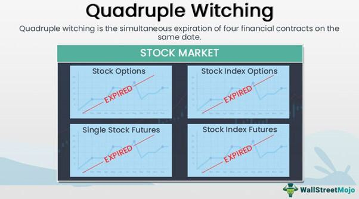

The concept of the witching hour has intrigued many, blending elements of supernatural folklore with modern phenomena. Traditionally, this period, often considered to be from midnight to 3 a.m., is linked to heightened paranormal activity as the boundary between the physical and spiritual worlds is believed to be thinnest. Tales of ghosts, witches, and other supernatural entities becoming more active during this time have persisted across various cultures, infusing folklore with eerie speculations and narratives.

Interestingly, the notion of the witching hour transcends the mystical, finding significance in the financial world as well. In financial markets, the witching hour refers to a period of increased volatility, particularly during the expiration of stock options and futures contracts. Known as triple or quadruple witching, this event occurs on the third Friday of every March, June, September, and December, when contracts for stock index futures, stock index options, and stock options all simultaneously expire. These expirations can lead to substantial trading volume and sudden market shifts, making it a focal point for traders and investors.

The rise of algorithmic trading further enriches the mystique of the witching hour in the financial domain. Utilizing advanced computer algorithms, traders can optimize the timing of trades, particularly during the volatile sessions of the witching hour. These systems are designed to exploit inefficiencies and capture fleeting arbitrage opportunities, transforming what was once a speculative venture into a strategic endeavor.

This article explores the various dimensions of the witching hour, from its origins and implications in folklore to its practical relevance and challenges in contemporary financial markets. By examining these diverse aspects, we gain insight into how myth and modernity continue to intersect and evolve.

## Table of Contents

## The Witching Hour in Folklore

Traditionally, the witching hour is regarded as a period when supernatural entities exhibit heightened activity. This concept dates back to as early as the 16th century, a time believed to be when the barrier between the material and spiritual worlds is at its most permeable. This notion has permeated various cultures, often linking the witching hour with increased paranormal phenomena such as hauntings and witchcraft rituals.

The mystique of the witching hour is deeply embedded in folklore, endowing it with a range of mystical attributes that have inspired numerous ghost stories and legends. This period is frequently portrayed as a time ripe for supernatural occurrences, a moment when the laws of the natural world appear to bend and allow otherworldly encounters. Even with such daunting myths, the witching hour is simultaneously perceived as a time for introspection and spiritual enlightenment, particularly for those who feel connected to the mystical and the supernatural.

In many cultural narratives, the witching hour serves not only as a backdrop for eerie tales and phenomena but as an invitation to explore one's inner depth. It encourages a contemplative state that could lead to personal revelations and a deeper understanding of the metaphysical aspects of existence. Consequently, the witching hour remains a compelling subject, celebrated for its ability to bridge the familiar with the unexplained.

## The Witching Hour in Financial Markets

In the financial context, the term "witching hour" denotes the final trading hour when various stock options and futures expire, leading to increased activity and [volatility](/wiki/volatility-trading-strategies) in the market. This period is notably observed during phenomena known as triple and quadruple witching days. These occur when stock options, stock index futures, and stock index options expire simultaneously, with quadruple witching also including single stock futures. Such synchronous expirations heighten market complexity and induce significant price movements as traders engage in frantic adjustments to their portfolios.

The witching hour is characterized by heightened trading volumes as market participants, including institutional investors and hedge funds, either close out positions or roll them over to future contracts. This flurry of activity is driven by the necessity to settle expiring contracts, along with the desire to take advantage of [arbitrage](/wiki/arbitrage) opportunities that arise due to temporary inefficiencies in pricing.

Traders implement various strategies during the financial witching hour to manage risks and optimize outcomes. Common approaches include adjusting portfolios to mitigate exposure from expiring derivatives or taking calculated risks to profit from predicted price swings and anomalies. Arbitrage strategies, in particular, are prevalent during this period; these involve exploiting price differentials between related markets or instruments.

The market behavior during this time has parallels with the chaotic and unpredictable essence of the witching hour in folklore. Both contexts share a common theme of heightened activity and uncertainty, albeit manifesting in vastly different domains. Understanding the mechanics of the witching hour in financial markets provides insight into the sophisticated approaches traders use to navigate periods of volatility and manage their financial interests effectively.

## Algorithmic Trading During the Witching Hour

Algorithmic trading leverages sophisticated computer programs to optimize trading executions, especially during highly volatile periods known as the witching hour. This period, characterized by the expiration of stock options and futures, presents unique opportunities and challenges due to rapid market fluctuations. Traders utilize advanced algorithms to identify and capitalize on price inefficiencies that emerge as volatility spikes.

Programs designed for [algorithmic trading](/wiki/algorithmic-trading) utilize complex mathematical models and statistical techniques to analyze vast amounts of market data in real time. These algorithms are capable of processing information far more quickly than human traders, offering insights into potential pricing anomalies or arbitrage opportunities. This rapid analysis allows for the execution of trades at the most advantageous moments, despite the chaotic nature of the witching hour.

One of the key benefits of algorithmic trading during this period is risk management. Algorithms can quickly adapt to sudden market changes, modifying strategies almost instantaneously to mitigate potential losses. This adaptability is crucial during the witching hour when prices can swing dramatically within short time spans. By adjusting positions in real time, traders maintain a competitive edge, reducing risk while maximizing returns.

Ethical considerations also play a role in algorithmic trading. The ability for these systems to make multiple trades in mere milliseconds has raised concerns about market fairness and the potential for manipulation. However, when deployed responsibly, algorithmic trading provides [liquidity](/wiki/liquidity-risk-premium) to the markets and often results in tighter bid-ask spreads, benefiting all participants.

The integration of high-frequency trading technologies in algorithmic systems has transformed a traditionally speculative period like the witching hour into a calculated, strategic opportunity. By leveraging these advanced tools, traders can not only survive but thrive in this dynamic environment. This evolution underscores the growing importance of technology in modern financial markets, where the ability to rapidly process and react to information is paramount.

## Paranormal Activity Reports During the Witching Hour

According to anecdotal reports, the witching hour is said to see a rise in paranormal activities, attracting the curiosity and attention of ghost hunters and paranormal investigators. This period, typically between midnight and three in the morning, is believed to coincide with a thinning of the veil that separates the living world from the spiritual realm. As a result, it is a favored time for various supernatural experiments and observations.

Ghost hunters often report capturing Electronic Voice Phenomena (EVP) during the witching hour. These are sounds that are believed to be the voices of spirits, which are often caught on electronic recording devices in otherwise silent environments. Spectral sightings, where entities or apparitions are visually perceived, are also commonly reported. Such experiences are believed to be facilitated by the stillness and quiet of the late-night hour, which seemingly amplifies the presence of spiritual energies.

Cultural narratives from various societies have long described this time as a period when barriers are lowered, allowing for more frequent encounters with the ethereal and the unknown. This belief compels many explorers and investigators of the supernatural to seek out experiences and answers during these hours. The notion of the witching hour as a bridge between the mundane and the mystical world continues to inspire fascination and exploration, as individuals are drawn to uncover what lies beyond the physical world during this enigmatic time.

## Conclusion

The witching hour serves as both a metaphorical and literal threshold, bridging the realms of traditional beliefs and modern practices. In the financial markets, it signifies a period marked by strategic maneuvers, where traders engage in calculated strategies amid heightened volatility. This intersection of opportunity and unpredictability transforms the witching hour into a critical phase for executing intricate trading operations. Algorithmic trading plays a pivotal role during this time, providing a competitive edge by leveraging technology to navigate the chaos of simultaneous expirations and market fluctuations.

Conversely, in folklore and the paranormal, the witching hour evokes a profound sense of wonder and mysticism. It is a time steeped in cultural narratives and legends, often associated with heightened spiritual and supernatural activity. This contrast between the calculative nature of financial markets and the ethereal allure of folklore underscores the multifaceted essence of the witching hour.

Appreciating these varied dimensions allows for a comprehensive understanding of how folklore and contemporary phenomena intertwine. Whether navigating through financial complexities or exploring supernatural mysteries, the witching hour remains a captivating subject of curiosity and speculation. As enigmas associated with this time of day persist, humanity's quest to decipher its secrets continues across both empirical and mystical paradigms.

## References & Further Reading

[1]: ["Advances in Financial Machine Learning"](https://www.amazon.com/Advances-Financial-Machine-Learning-Marcos/dp/1119482089) by Marcos Lopez de Prado

[2]: ["Evidence-Based Technical Analysis: Applying the Scientific Method and Statistical Inference to Trading Signals"](https://www.amazon.com/Evidence-Based-Technical-Analysis-Scientific-Statistical/dp/0470008741) by David Aronson

[3]: ["Machine Learning for Algorithmic Trading"](https://github.com/PacktPublishing/Machine-Learning-for-Algorithmic-Trading-Second-Edition) by Stefan Jansen

[4]: ["Quantitative Trading: How to Build Your Own Algorithmic Trading Business"](https://www.amazon.com/Quantitative-Trading-Build-Algorithmic-Business/dp/1119800064) by Ernest P. Chan

[5]: ["Algorithms for Hyper-Parameter Optimization"](https://papers.nips.cc/paper/4443-algorithms-for-hyper-parameter-optimization.pdf) by Bergstra, J., Bardenet, R., Bengio, Y., & Kégl, B.