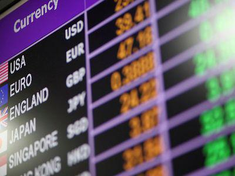

Algorithmic trading has seen a profound transformation in recent years, fundamentally altering how portfolio managers assess their performance. Central to this evaluation are reliable benchmarks, which offer a means to measure performance against a standard. Among these benchmarks, the WM/Reuters benchmark rates stand out as critical reference points within the foreign exchange (forex) market. Introduced to provide consistency and accuracy across diverse financial landscapes, these rates are indispensable for crafting effective trading strategies and ensuring precise portfolio valuation. 

The WM/Reuters benchmark rates serve as a cornerstone for traders and money managers alike. By providing standardized exchange rates, they facilitate the comparison of portfolios across different currencies and financial environments. This standardization is essential for accurately assessing the value and performance of international portfolios, which may be subject to fluctuations in currency values. Consequently, these rates have become an integral part of portfolio management and algorithmic trading strategies, offering the transparency and reliability that traders need to make informed decisions.



This article explores the intricacies of the WM/Reuters benchmark rates, spotlighting their pivotal role in the forex market. By understanding these rates, traders can enhance their portfolio management practices and develop robust algorithmic trading strategies that align with real-time market conditions. Through continuous improvements in transparency and technology, the significance of WM/Reuters benchmarks in modern trading is poised for sustained growth, ensuring that they remain a vital tool in the ever-evolving financial landscape.

## Table of Contents

## Understanding WM/Reuters Benchmark Rates

WM/Reuters benchmark rates are critical components in the global financial landscape, functioning as both spot and forward exchange rates. These rates are employed worldwide as standardized markers for evaluating and measuring the performance of investment portfolios. Introduced in 1994, their purpose was to offer a cohesive and precise basis for comparison, enabling portfolio managers to assess performance reliably across varied financial environments.

Initially, these rates were calculated by the World Markets Company, ensuring a level of standardization that was previously lacking in the market. In 2016, a significant transition occurred when Thomson Reuters acquired the rate calculation business from the World Markets Company. This acquisition allowed Thomson Reuters to continue delivering these rates, thereby maintaining continuity and reliability in their provision.

The standardization offered by the WM/Reuters rates ensures that financial institutions and investment managers can confidently compare performance outcomes despite the multifaceted nature of global financial markets. The inclusion of both spot and forward rates enhances their utility by accommodating both immediate and future valuations. This dual function is essential for managing the diverse needs of international portfolio management and safeguarding against currency fluctuation risks.

Their introduction has been a pivotal development in the financial industry, enabling a more unified approach to portfolio valuation and performance analysis. As these rates are used extensively across the globe, they remain indispensable tools in sustaining equilibrium and integrity in [forex](/wiki/forex-system) transactions and positioning separate portfolios against each other convincingly. With Thomson Reuters at the helm of their provision, WM/Reuters benchmark rates are expected to sustain their centrality in financial assessments globally, adapting over time to meet the evolving demands of the marketplace and technological advancements.

## How WM/Reuters Rates Are Determined

The determination of WM/Reuters benchmark rates is a precise process focused on ensuring accuracy and reliability in the global forex market. These rates are calculated during a defined five-minute fix period, capturing a snapshot of bid and offer rates from various trading systems. This methodology aims to provide a representative market rate that reflects the prevailing exchange rate dynamics.

The critical aspect of this process is the timing of the rate calculations, which most notably occur at 4 PM London time. This time is chosen to coincide with the closing of major markets, thereby capturing a broad spectrum of international currency activities and minimizing market [volatility](/wiki/volatility-trading-strategies). During this window, transactions across multiple platforms are considered to derive a fair representation of the currency pair's value.

To arrive at the final benchmark rate, the median of the collected bid and offer rates is utilized. The median is calculated by organizing all valid bid and offer prices received during the five-minute period, and selecting the middle value. This approach minimizes the impact of outliers and reflects a more stable market rate, reducing the risk of manipulation that could arise from individual large trades or volatile price movements.

Mathematically, the process can be outlined as follows:

1. Collect $(n)$ valid bid and offer rates within the designated time window.
2. Sort these rates in numerical order.
3. Determine the median by:

   - If $n$ (the number of observations) is odd, the median is the value at position $(n + 1)/2$.
   - If $n$ is even, the median is the average of the values at positions $n/2$ and $(n/2) + 1$.

The resulting mid-rate, derived from the median of bid and offer prices, provides a standardized and reliable reference point for forex transactions and portfolio valuations. This process underscores the importance of methodological consistency and transparent calculations in producing credible benchmark rates critical for financial markets and trading strategies.

## Importance of WM/Reuters Rates in Portfolio Management

WM/Reuters benchmark rates hold a vital position in the global financial ecosystem, especially for valuation and performance analysis of international portfolios. Covering over 155 closing spot currencies hourly, these rates provide a standardized method for assessing the value of investments on a large scale. This level of coverage ensures that portfolio managers can accurately measure the performance across different markets, which is essential given the dynamic nature of currency values.

The utilization of WM/Reuters rates is crucial for money managers and pension funds. These financial entities rely on precise evaluations to manage international portfolios effectively. Accurate assessments help in decision-making processes, such as asset allocation and risk management, ensuring that they are reflective of current market conditions. By using consistent benchmark rates, these institutions can maintain standardized reporting and comparability of financial returns, which is crucial for both internal assessments and external performance evaluations.

In 2013, the credibility of WM/Reuters rates faced challenges under the scrutiny of manipulation allegations. Accusations arose concerning potential collusion among traders to influence these benchmark rates, which are used universally to gauge financial performance. This issue highlighted the necessity of robust oversight and regulation to ensure the integrity of the benchmarks. Subsequent reforms have strengthened the governance surrounding these rates, including enhancing transparency and oversight in their calculation processes. These measures have been instrumental in restoring trust and reliability, ensuring that WM/Reuters rates remain an indispensable component in global portfolio management. 

Through these improvements, the financial community has reinforced the importance of WM/Reuters rates, upholding them as a critical tool for accurate portfolio valuation even amidst market fluctuations. This ensures that they continue to play a pivotal role in aiding comprehensive financial analysis and strategic decision-making on a global scale.

## Algorithmic Trading and WM/Reuters Rates

Algorithmic trading has grown substantially due to the increasing need for efficiency and precision in financial markets. Key to this growth is the use of reliable benchmarks like the WM/Reuters rates, which are instrumental in crafting effective trading strategies. These benchmark rates offer algorithmic traders a stable reference point, pivotal for executing trades that align with real-time market conditions.

WM/Reuters rates provide transparency and consistency, crucial for algorithmic strategies that require accurate inputs to make informed decisions. Traders utilize these benchmarks to gauge market sentiments and anticipate price movements. By offering a standardized rate that reflects the broad market consensus at a specific time, these benchmarks help mitigate the discrepancies that might arise from using different data sources, thereby maintaining the efficacy of algorithmic systems.

Sophisticated algorithms contribute to the calculation of WM/Reuters rates, ensuring their relevance in today's dynamic trading environment. These algorithms analyze extensive amounts of market data, including bid and offer rates, to compute the mid-rate effectively. This process involves high-frequency data analysis, which aligns with the needs of [algorithmic trading](/wiki/algorithmic-trading), where rapid execution and precision are paramount.

For instance, consider an algorithm designed to execute trades based on currency fluctuations. The algorithm might use Python's libraries like NumPy and Pandas for data analysis. Here's a simple example to demonstrate how one might use such a benchmark rate in an algorithmic trading strategy:

```python
import numpy as np
import pandas as pd

# Simulated data of currency rates
currency_data = pd.DataFrame({
    'time': pd.date_range(start='2023-10-01', periods=5, freq='T'),
    'rate': [1.12, 1.13, 1.11, 1.14, 1.10]
})

# Calculate mean rate as a simple strategy
mean_rate = np.mean(currency_data['rate'])

# Trading logic based on the mean rate
def trade_decision(current_rate):
    if current_rate < mean_rate:
        return "Buy"
    elif current_rate > mean_rate:
        return "Sell"
    else:
        return "Hold"

# Example of making a trade decision
current_rate = 1.12
decision = trade_decision(current_rate)
print(f"Current Rate: {current_rate}, Decision: {decision}")
```

This example illustrates a basic strategy where decisions are made based on the current rate relative to the mean rate. In practice, algorithms would integrate WM/Reuters benchmarks to enhance decision-making processes by providing a dependable reference in the rapidly fluctuating forex market.

The seamless integration of these benchmarks ensures that algorithmic strategies remain robust and adaptable to market changes. By utilizing such reliable data sources, traders can optimize their strategies, reduce risks, and improve their overall market performance. Consequently, the consistent and transparent nature of WM/Reuters rates continues to underpin their significance, facilitating the advancement of algorithmic trading strategies in modern financial markets.

## Challenges and Controversies

The financial industry has encountered various controversies surrounding the potential manipulation of benchmark rates like the WM/Reuters rates. A notable concern arose in 2013 when allegations surfaced regarding traders attempting to manipulate these rates for profit. The accusations centered around traders conspiring to influence the fix rates during the critical five-minute windows, exploiting the system before significant market closures at 4 PM London time.

In response to these controversies, regulatory bodies implemented enhancements aimed at promoting transparency and trust in the calculation and publication of benchmark rates. These enhancements include strengthening regulatory oversight and adapting longer calculation windows. This change in the calculation period from the original five minutes helps dilute the effects of large trades at the fix, minimizing the possibility of manipulation.

Moreover, continuous improvements in the regulatory frameworks have contributed to securing the reliability of the WM/Reuters rates. Authorities have focused on monitoring trade activities more closely and improving the methodologies used in determining these reference rates. Such measures have bolstered confidence among investors and traders, ensuring a more robust financial environment.

Despite previous challenges, the financial industry remains resilient in its pursuit to uphold the integrity of benchmark rates. Ongoing reforms and technological advancements promise to maintain the relevance and trustworthiness of WM/Reuters rates within the global market, providing a solid foundation for their continued use in portfolio management and algorithmic trading.

## Conclusion

The WM/Reuters benchmark rates are crucial to the global foreign exchange market, serving as a reliable standard for portfolio management and algorithmic trading. These rates, with their precision and transparency, have established themselves as essential components in evaluating and executing financial strategies. As the trading landscape evolves, continuous improvements in transparency and the incorporation of advanced technologies are poised to maintain the significance of these benchmarks in modern trading strategies.

Notably, algorithmic advancements will likely enhance the precision and efficiency of these rates, reinforcing their position as a cornerstone in finance. The integration of [machine learning](/wiki/machine-learning) and [artificial intelligence](/wiki/ai-artificial-intelligence) could lead to more accurate and timely calculations, thereby providing even greater reliability for traders and investors. This progression ensures that the WM/Reuters benchmark rates remain indispensable tools, capable of adapting to future developments in the financial sector. As new methodologies and technologies emerge, these benchmarks will continue to support fair and transparent market operations, facilitating informed decision-making in complex trading environments.

## References & Further Reading

[1]: ["The Foreign Exchange Market: Institutions, Instruments, and Risks"](https://www.bauer.uh.edu/rsusmel/7386/ln1.pdf) by Thomas J. O'Brien

[2]: Elliott, D., & Yuyun, C. (2006). ["WM/Reuters Foreign Exchange Rates"](https://www.financestrategists.com/wealth-management/investment-management/wm-reuters-benchmark-rates/). Edward Elgar Publishing.

[3]: ["Benchmarking in Institutional Business: The WM/Reuters Currency Benchmark Rates"](https://www.investopedia.com/terms/w/wmreuters-benchmark-rates.asp) by CAIA Association

[4]: Financial Stability Board. (2014). ["Foreign Exchange Benchmarks"](https://www.fsb.org/2014/09/r_140930/). A report detailing the integrity and reliability of FX benchmarks.

[5]: Galati, G., & Melvin, M. (2004). ["Why has FX trading surged? Explaining the 2004 triennial survey"](https://papers.ssrn.com/sol3/papers.cfm?abstract_id=1967461). BIS Quarterly Review. 

[6]: ["Algorithmic and High-Frequency Trading"](https://assets.cambridge.org/97811070/91146/frontmatter/9781107091146_frontmatter.pdf) by Alvaro Cartea, Sebastián Jaimungal, & José Penalva.

[7]: Rime, D., & Schrimpf, A. (2013). ["The anatomy of the global FX market through the lens of the 2013 triennial survey"](https://www.bis.org/publ/qtrpdf/r_qt1312e.htm). BIS Quarterly Review.

[8]: ["The Man Who Solved the Market: How Jim Simons Launched the Quant Revolution"](https://www.amazon.com/Man-Who-Solved-Market-Revolution/dp/073521798X) by Gregory Zuckerman.