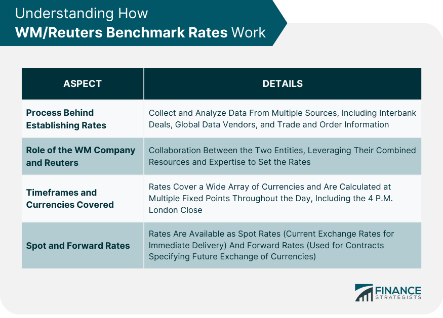

## Table of Contents

## What are WM/Reuters Benchmark Rates?

WM/Reuters Benchmark Rates are used to determine the value of different currencies at a specific time each day. They are important for people who trade currencies or need to convert money from one currency to another. The rates are calculated by looking at many trades that happen around the world at the same time every day.

These rates are managed by two companies, WM and Reuters. They work together to make sure the rates are fair and accurate. Many banks, businesses, and investors use these rates to make decisions about buying and selling currencies. This helps keep the global money market stable and trustworthy.

## How are WM/Reuters Benchmark Rates calculated?

WM/Reuters Benchmark Rates are calculated by looking at a lot of currency trades that happen at the same time every day. This time is usually at 4 PM London time. They use a special method called the "closing snapshot" to take a quick picture of all the trades happening right at that moment. This helps make sure the rates are fair and show what is really happening in the market.

After they take this snapshot, they use a computer program to figure out the average price of all those trades. This average price becomes the benchmark rate for that day. By using this method, WM and Reuters make sure the rates are accurate and trusted by everyone who uses them, like banks and businesses around the world.

## Why are WM/Reuters Benchmark Rates important in portfolio management?

WM/Reuters Benchmark Rates are important in portfolio management because they help managers know the value of different currencies. When a portfolio includes investments in different countries, the value of those investments can change based on the exchange rates between currencies. By using the WM/Reuters Benchmark Rates, portfolio managers can accurately convert the value of foreign investments into their home currency. This helps them understand the true performance of their portfolio and make better decisions about where to invest.

These rates are also used to measure the performance of currency-hedged investments. Some portfolio managers use strategies to protect their investments from changes in currency values. They do this by using financial tools that depend on accurate exchange rates. The WM/Reuters Benchmark Rates provide a reliable reference point for these tools, ensuring that the hedging strategies work as intended. This is crucial for maintaining the stability and predictability of a portfolio's returns.

## How can WM/Reuters Benchmark Rates be used to assess portfolio performance?

WM/Reuters Benchmark Rates help portfolio managers see how well their investments are doing when they are in different countries. If a portfolio has money in places like the United States, Europe, and Japan, the value of those investments can change because of the exchange rates between the dollar, euro, and yen. By using the WM/Reuters Benchmark Rates, managers can change the value of these foreign investments into their own country's money. This helps them see the real performance of their portfolio and decide if they need to make changes.

These rates are also important for checking how well strategies to protect against changes in currency values are working. Some managers use special financial tools to keep their investments safe from big swings in exchange rates. These tools need accurate exchange rates to work right. The WM/Reuters Benchmark Rates give a reliable way to measure these rates, so managers can see if their protection strategies are helping their portfolio stay stable and predictable.

## What are the different types of WM/Reuters Benchmark Rates available?

WM/Reuters Benchmark Rates come in different types to help people with different needs. The main type is the spot rate, which shows the current value of one currency compared to another. This is used a lot by people who trade currencies every day. Another type is the forward rate, which shows what people think the value of a currency will be in the future. This is helpful for people who want to plan ahead and protect their money from changes in currency values.

There are also special rates for certain times of the day, like the London 4 PM fix, which is used a lot in the financial world. This rate is taken at exactly 4 PM London time and is used by many banks and businesses to value their investments. Besides these, there are rates for different kinds of currency pairs, like major pairs (like USD/EUR) and minor pairs (like USD/SGD). Each type of rate helps people in different ways, depending on what they need to do with their money.

## How frequently are WM/Reuters Benchmark Rates updated?

WM/Reuters Benchmark Rates are updated every day at a specific time. This time is usually 4 PM London time. This daily update helps people know the value of different currencies at the same time every day, which is important for making decisions about buying and selling money.

These rates are not updated more than once a day because they are meant to give a clear picture of the market at one specific moment. If they were updated more often, it might be confusing for people who use them to make plans and decisions. So, everyone can rely on the rates being the same for a whole day until the next update.

## What are the common challenges faced when using WM/Reuters Benchmark Rates in portfolio management?

One common challenge when using WM/Reuters Benchmark Rates in portfolio management is the timing of the rates. Since these rates are updated only once a day at 4 PM London time, portfolio managers might find it hard to react quickly to changes in the market. If something big happens in the currency market after the rates are set, managers have to wait until the next day to see the new rates. This can make it tough to make fast decisions about buying or selling investments.

Another challenge is the accuracy of the rates. Even though WM/Reuters Benchmark Rates are very reliable, they are based on a snapshot of trades at one specific time. This means they might not always show the full picture of what's happening in the market. If the market is very busy or if there are big changes right before or after the snapshot, the rates might not be as accurate as needed. This can affect how well portfolio managers can value their investments and plan their strategies.

## How do WM/Reuters Benchmark Rates compare to other financial benchmarks?

WM/Reuters Benchmark Rates are one way to measure the value of different currencies, but there are other financial benchmarks too. One example is the LIBOR (London Interbank Offered Rate), which shows the [interest rate](/wiki/interest-rate-trading-strategies) banks charge each other for loans. Unlike WM/Reuters rates, which focus on currency values, LIBOR is used more for understanding borrowing costs. Another benchmark is the Federal Funds Rate, set by the U.S. Federal Reserve, which influences interest rates in the U.S. and can affect currency values indirectly. Each of these benchmarks serves a different purpose and is used by different people in the financial world.

Compared to other benchmarks, WM/Reuters rates are unique because they are updated once a day at a specific time, which helps keep things consistent for people who use them. Other benchmarks like stock market indices, such as the S&P 500, are updated throughout the day and show how well a group of stocks is doing. This makes them more useful for people who need to see changes in the market quickly. On the other hand, WM/Reuters rates are more about giving a clear, daily snapshot of currency values, which is important for people who manage money across different countries.

## Can WM/Reuters Benchmark Rates be used for risk management in portfolios?

Yes, WM/Reuters Benchmark Rates can be used for risk management in portfolios. They help portfolio managers understand how changes in currency values might affect their investments. If a portfolio has money in different countries, the value of those investments can go up or down because of changes in exchange rates. By using the WM/Reuters Benchmark Rates, managers can see these changes clearly and decide if they need to do something to protect their money. For example, if they think a currency will lose value, they might use financial tools to reduce the risk.

These rates are also important for strategies that protect against currency changes. Some managers use special financial tools to keep their investments safe from big swings in exchange rates. These tools need accurate exchange rates to work right, and the WM/Reuters Benchmark Rates give a reliable way to measure these rates. By using these rates, managers can make sure their protection strategies are working well and help keep their portfolio stable and predictable.

## What are the regulatory considerations when using WM/Reuters Benchmark Rates?

When using WM/Reuters Benchmark Rates, there are important rules that need to be followed. These rules come from different places, like governments and financial groups. They want to make sure that the rates are fair and correct. For example, in many countries, there are laws that say how benchmarks like these should be made and used. These laws help stop people from cheating or making mistakes that could hurt others.

Also, groups like the International Organization of Securities Commissions (IOSCO) have special rules for benchmarks. They say that the people who make the rates need to be honest and careful. They also need to keep good records and be open about how they do things. This helps everyone trust the rates and use them safely in their work.

## How can advanced statistical models enhance the use of WM/Reuters Benchmark Rates in portfolio management?

Advanced statistical models can help portfolio managers use WM/Reuters Benchmark Rates better by making predictions about how currency values might change. These models look at past data and find patterns that can show what might happen next. For example, they can use something called time series analysis to see how currency values have moved in the past and guess where they might go in the future. This can help managers decide when to buy or sell currencies to make their portfolio perform better.

These models can also help managers understand how much risk they are taking with their investments. By using something called risk analysis, they can see how changes in currency values might affect their portfolio. This can help them use the WM/Reuters Benchmark Rates to make smart choices about protecting their money from big swings in exchange rates. By using these advanced tools, managers can make their portfolios more stable and predictable, even when the currency market is changing a lot.

## What future trends might impact the relevance of WM/Reuters Benchmark Rates in portfolio management?

In the future, technology might change how we use WM/Reuters Benchmark Rates in managing portfolios. As computers get better, they can look at more data and make better guesses about what will happen with currency values. This could mean that portfolio managers will use these rates in new ways, like with special computer programs that help them make quick decisions. Also, if more people start using digital money like Bitcoin, it might change how important these rates are. Digital money doesn't always follow the same rules as regular money, so managers might need to think about both types of money when they plan their portfolios.

Another trend that could affect WM/Reuters Benchmark Rates is how rules and laws change. Governments and big financial groups might make new rules about how these rates should be used. This could make them more or less important for portfolio managers. For example, if new rules make it easier to use these rates in new ways, more people might start using them. But if the rules get stricter, it might be harder to use them, and managers might look for other ways to understand currency values. Keeping up with these changes will be important for anyone who uses these rates to manage their money.

## References & Further Reading

[1]: ["The Foreign Exchange Market: Institutions, Instruments, and Risks"](https://www.bauer.uh.edu/rsusmel/7386/ln1.pdf) by Thomas J. O'Brien

[2]: Elliott, D., & Yuyun, C. (2006). ["WM/Reuters Foreign Exchange Rates"](https://www.financestrategists.com/wealth-management/investment-management/wm-reuters-benchmark-rates/). Edward Elgar Publishing.

[3]: ["Benchmarking in Institutional Business: The WM/Reuters Currency Benchmark Rates"](https://www.investopedia.com/terms/w/wmreuters-benchmark-rates.asp) by CAIA Association

[4]: Financial Stability Board. (2014). ["Foreign Exchange Benchmarks"](https://www.fsb.org/2014/09/r_140930/). A report detailing the integrity and reliability of FX benchmarks.

[5]: Galati, G., & Melvin, M. (2004). ["Why has FX trading surged? Explaining the 2004 triennial survey"](https://papers.ssrn.com/sol3/papers.cfm?abstract_id=1967461). BIS Quarterly Review. 

[6]: ["Algorithmic and High-Frequency Trading"](https://assets.cambridge.org/97811070/91146/frontmatter/9781107091146_frontmatter.pdf) by Alvaro Cartea, Sebastián Jaimungal, & José Penalva.

[7]: Rime, D., & Schrimpf, A. (2013). ["The anatomy of the global FX market through the lens of the 2013 triennial survey"](https://www.bis.org/publ/qtrpdf/r_qt1312e.htm). BIS Quarterly Review.

[8]: ["The Man Who Solved the Market: How Jim Simons Launched the Quant Revolution"](https://www.amazon.com/Man-Who-Solved-Market-Revolution/dp/073521798X) by Gregory Zuckerman.