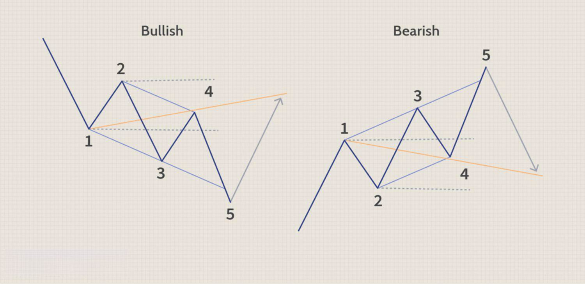

Algorithmic trading is a rapidly evolving field that encompasses a myriad of strategies and patterns, each designed to provide traders with an advantage in the financial markets. Among these is the Wolfe Wave, a technical chart pattern that offers significant insights into potential market reversals. Recognized for its predictive capabilities, the Wolfe Wave can assist traders in identifying turning points in the market, enabling more informed trading decisions.

Wolfe Waves consist of five waves that form a distinct pattern, analogous to the Elliott Wave theory. This pattern reflects the natural ebb and flow of market prices, highlighting an equilibrium price that the market is likely to gravitate toward over time. Each wave adheres to specific rules and time intervals, making the pattern identifiable through its unique oscillations.



Understanding and identifying Wolfe Waves can enhance a trader's ability to predict market reversals and set potential price targets. This article explores the structure of Wolfe Waves, the criteria for their identification, and their application within algorithmic trading frameworks. By integrating Wolfe Waves into trading strategies, traders can potentially improve trading outcomes by anticipating market movements with greater accuracy. This approach not only leverages the natural patterns inherent in market behavior but also aligns with the data-driven precision of algorithmic trading.

## Table of Contents

## Understanding Wolfe Waves

Wolfe Waves are distinctive chart patterns that arise naturally across various financial markets. They share similarities with the well-known Elliott Wave theory but have unique characteristics that traders use to predict price movements. This pattern is characterized by five sequential waves that suggest an equilibrium price the market tends to gravitate towards over time. 

The formation of Wolfe Waves starts with a sequence of consecutively rising or falling price peaks and troughs. Specifically, the pattern involves five waves, labeled 1 to 5, each representing significant shifts in market direction. The first four waves create a channel between waves 1 to 4, and wave 5 marks an exit from this channel, suggesting an imminent market reversal.

**Identification and Structure:**

1. **Wave 1-2:** This initial wave begins when the current trend has reached an extreme point and is about to reverse. It sets the foundation for subsequent waves in the pattern.

2. **Wave 3-4:** This wave retraces back towards wave 2, visually forming the shape of either an expanding or converging channel when combined with wave 1-2. The line connecting waves 1 and 3 is crucial for projecting future price movements.

3. **Wave 5:** The fifth wave is the defining feature of a Wolfe Wave. It extends outside the trendline between waves 1 and 3, suggesting a potential market reversal. This breakout signals traders about possible buying or selling opportunities depending on the wave direction. Importantly, the point at which wave 5 breaks is often used as an entry point for trades.

The identification of Wolfe Waves requires adherence to specific criteria concerning the symmetry of time and amplitude, which ensures the waves maintain an ordered and balanced pattern. Traders analyze these oscillations not only for their visual symmetry but also by employing tools and indicators that enhance pattern recognition over varying time frames.

Successfully identifying a Wolfe Wave can greatly enhance a trader's ability to forecast market reversals and target future price levels. By accurately pinpointing where wave 5 will occur, traders have the potential to optimize entry and [exit](/wiki/exit-strategy) points, thereby leveraging the predictive nature of the Wolfe Wave pattern.

In conclusion, Wolfe Waves establish a structured pattern that, when accurately identified, provides traders with insightful projections on market dynamics. This recognition assists in anticipating reversals and formulating robust trading strategies.

## How to Identify Wolfe Waves

The Wolfe Wave pattern is characterized by its emphasis on symmetry, necessitating a balance in both the duration and amplitude of its waves. This pattern comprises five distinct waves that reflect the psychological underpinnings of market participants, guiding traders in anticipating potential reversals. To accurately identify a Wolfe Wave, several specific criteria must be met:

1. **Channel Formation**: The first step in recognizing a Wolfe Wave pattern involves identifying a price channel. This channel is established by drawing two trendlines: one connecting points 1 and 3, and the other connecting points 2 and 4. These lines should form a converging channel, indicating that the market is consolidating and a breakout may be imminent.

2. **Oscillation Consistency**: Each wave within the Wolfe Wave pattern should exhibit consistent oscillations, adhering to the established channel. This consistency is pivotal for validating the formation of the pattern. The waves need to alternate between the support and resistance levels defined by the channel trendlines.

3. **Identification of Critical Points**: Recognizing the five critical points in the Wolfe Wave structure is essential. They are labeled as follows:
   - **Point 1**: The starting point of the wave sequence, usually at the beginning of a downtrend or an uptrend.
   - **Point 2**: The first reversal point, marking the completion of wave 1.
   - **Point 3**: The second reversal point, establishing the end of wave 2.
   - **Point 4**: The third reversal point, marking the end of wave 3 and the beginning of wave 4.
   - **Point 5**: The most significant point in the pattern, which signals an impending reversal and the ideal entry point for a trade. This point should ideally align with the apex of the channel formed by the trendlines drawn from points 1 to 3.

4. **Symmetry Consideration**: A crucial aspect of the Wolfe Wave pattern is ensuring symmetry in both the time duration and price amplitude of waves 1-3 and 2-4. This helps in predicting where point 5 will occur, enhancing the accuracy of the pattern prediction.

5. **Implementation of Trading Tools and Indicators**: Traders can utilize various technical trading indicators and tools to aid in accurately identifying Wolfe Waves. Tools such as the Relative Strength Index (RSI) and Moving Averages can help confirm wave formation and potential reversals. Software platforms with pattern recognition capabilities can automate the identification process, providing traders with timely alerts when a Wolfe Wave pattern forms.

Adhering to these criteria increases the likelihood of recognizing a valid Wolfe Wave pattern, which can serve as a robust predictive tool in the trader's arsenal. By methodically applying these criteria, traders can pinpoint high-probability trading opportunities that align with the underlying market dynamics.

## Implementing Wolfe Wave in Algorithmic Trading

Wolfe Waves can play a crucial role in [algorithmic trading](/wiki/algorithmic-trading), enabling traders to harness the predictive potential of this pattern through the automation of trade execution. By embedding Wolfe Waves into algorithmic strategies, traders can systematically identify these configurations and make data-driven decisions.

Automating the detection of Wolfe Waves involves programming algorithms with specific criteria that define the pattern. These criteria include the identification of five waves with certain time and amplitude characteristics, consistent oscillation, and the crucial symmetry of the pattern. Advanced algorithms use these predefined parameters to automatically recognize Wolfe Waves in real-time market data, thus facilitating proactive trade actions. For example, the algorithm can be programmed to trigger buy or sell orders when the fifth wave is detected, marking a potential market reversal.

Here is a simplified Python example of how an algorithm might be structured to detect Wolfe Waves:

```python
import numpy as np

class WolfeWaveDetector:
    def __init__(self, data):
        self.data = data

    def detect_waves(self):
        # Assume 'peaks' and 'troughs' are detected using a peak detection algorithm
        peaks, troughs = self.find_peaks_and_troughs(self.data)
        patterns = []

        for i in range(len(peaks) - 4):
            pattern = [troughs[i], peaks[i+1], troughs[i+2], peaks[i+3], troughs[i+4]]
            if self.is_valid_wolfe_wave(pattern):
                patterns.append(pattern)

        return patterns

    def is_valid_wolfe_wave(self, wave):
        # Add specific criteria that define Wolfe Waves
        return self.check_symmetry(wave) and self.check_wave_criteria(wave)

    def check_symmetry(self, wave):
        # Ensure symmetry requirements are fulfilled
        wave_lengths = [wave[i+1] - wave[i] for i in range(len(wave)-1)]
        return np.std(wave_lengths) < 0.1  # Example of symmetry check

    # Additional helper methods...

# Example usage:
data = np.random.randn(1000)  # Sample market data
detector = WolfeWaveDetector(data)
wolfe_patterns = detector.detect_waves()
```

The integration of automation in detecting Wolfe Waves mitigates emotional [volatility](/wiki/volatility-trading-strategies), allowing traders to operate based on objective market signals. This precision ensures timely trade execution, which is often challenging in manual trading.

However, before implementing any strategy, it is imperative to backtest Wolfe Wave patterns extensively. Backtesting involves simulating the algorithm on historical market data to evaluate its performance and ensure its robustness across different market conditions. This process highlights potential weaknesses and allows for iterative refinement, ultimately aiding in the development of a reliable algorithmic trading strategy.

Overall, the automated identification and implementation of Wolfe Waves through algorithmic trading provide traders with a significant advantage by combining advanced technical analysis with the efficiency of technology-driven trade execution.

## Advantages and Limitations of Wolfe Waves in Algo Trading

Wolfe Waves are a compelling component of algorithmic trading, providing precision in predicting potential market reversals. This pattern helps traders establish a clear roadmap for executing trades. By effectively identifying the five-wave structure representative of market equilibrium, traders can anticipate price movements, thus refining their strategies to maximize returns.

One of the significant advantages of using Wolfe Waves in algorithmic trading is their predictive nature, which allows traders to set precise profit targets and stop-loss orders. This enhances risk management, a critical aspect of algorithmic trading. The ability to predefine exact entry and exit points based on this pattern minimizes emotional trading decisions and aligns with algorithmic strategies that demand stringent adherence to predefined rules.

### Advantages

1. **Predictive Precision**: Wolfe Waves can forecast market reversals with remarkable accuracy. This predictive ability enables traders to make informed decisions, optimizing trade entries and exits to align with market trends.

2. **Risk Management**: The use of Wolfe Waves allows traders to establish clear profit targets and stop-loss orders. These thresholds help manage risk effectively, ensuring that losses are contained, and profits are maximized.

3. **Automation and Efficiency**: In algorithmic trading, Wolfe Waves can be automatically identified and integrated into trading algorithms. This automation reduces the likelihood of human error and increases the efficiency of trade execution, allowing traders to capitalize on opportunities swiftly.

### Limitations

1. **Market Volatility**: The effectiveness of Wolfe Waves can be compromised by high market volatility. Market conditions can influence the pattern’s reliability, leading to potential false signals which may impact trading outcomes.

2. **Pattern Identification Accuracy**: Accurately identifying Wolfe Waves is crucial. Misidentification can result in erroneous trading decisions. Algorithmic tools can aid in pattern recognition, but there's still a requirement for careful validation and backtesting to ensure reliability.

3. **Need for Complementary Tools**: To mitigate potential false signals, traders should combine Wolfe Waves with other indicators. This diversified approach provides a comprehensive trading strategy, enhancing the robustness of the trading system.

Here is an example of how an algorithm might be structured in Python to detect Wolfe Waves:

```python
import numpy as np

def detect_wolfe_wave(data):
    points = []
    for index in range(2, len(data) - 2):
        if (data[index - 2] < data[index - 1] > data[index] < data[index + 1] > data[index + 2]):
            points.append(index)
    # Identify the five-wave pattern
    if len(points) >= 5:
        wave_points = points[-5:]
        return wave_points
    return None

prices = np.array([100, 102, 101, 104, 103, 106, 102, 107, 101, 105])
wolfe_wave = detect_wolfe_wave(prices)

if wolfe_wave:
    print(f"Wolfe Wave detected at points: {wolfe_wave}")
else:
    print("No Wolfe Wave detected.")
```

The integration of Wolfe Waves in algorithmic trading offers substantial benefits but demands a balance with other analytical tools to achieve optimal trading efficacy. Their strategic use can enhance a trader’s ability to anticipate and act on market trends, making them a valuable asset in automated trading systems.

## Conclusion

Wolfe Waves are a powerful component within algorithmic trading systems, providing traders with valuable insights into the behavior and potential future movements of financial markets. The pattern's predictive power allows traders to anticipate market reversals, offering opportunities for strategic trade placements. However, the effective utilization of Wolfe Waves requires thorough [backtesting](/wiki/backtesting) and validation against specific trading environments to ensure their applicability and reliability.

The financial markets are subject to constant fluctuation, driven by a myriad of factors, making it crucial for traders to maintain a continuous learning approach. This ongoing education enables traders to refine their strategies and adapt to new market conditions. Understanding the nuances of Wolfe Waves and their integration into trading algorithms can significantly improve a trader’s ability to recognize and respond to emerging market signals.

Implementing Wolfe Waves within algorithmic trading frameworks highlights the synergy between human insight and technological capabilities. Algorithms can detect these patterns and execute trades with precision, reducing emotional biases inherent in manual trading methods. For example, a Python script can be used to automate the identification of Wolfe Waves by analyzing historical data for patterns that match the required criteria, allowing traders to act swiftly and decisively.

Ultimately, integrating Wolfe Waves with advanced technological tools empowers traders to anticipate and capitalize on market signals effectively. This integration provides an edge, enhancing both the strategic planning and execution phases of trading. Embracing such methodologies within one's trading strategy not only enriches a trader's toolkit but also fosters a proactive approach to navigating the complex dynamics of financial markets.

## References & Further Reading

[1]: Bulkowski, T. (2005). ["Encyclopedia of Chart Patterns."](https://books.google.com/books/about/Encyclopedia_of_Chart_Patterns.html?id=tIwlEAAAQBAJ) John Wiley & Sons.

[2]: Williams, B. (1998). ["Trading Chaos: Maximize Profits with Proven Technical Techniques."](https://play.google.com/store/books/details/Trading_Chaos_Maximize_Profits_with_Proven_Technic?id=DguaGNqw-b8C&hl=en-US) John Wiley & Sons.

[3]: Prechter, R. R. (2005). ["Elliott Wave Principle: Key to Market Behavior."](https://www.amazon.com/Elliott-Wave-Principle-Market-Behavior/dp/1616040459) New Classics Library.

[4]: Lopez de Prado, M. (2018). ["Advances in Financial Machine Learning."](https://www.amazon.com/Advances-Financial-Machine-Learning-Marcos/dp/1119482089) John Wiley & Sons.

[5]: Chan, E. P. (2009). ["Quantitative Trading: How to Build Your Own Algorithmic Trading Business."](https://github.com/ftvision/quant_trading_echan_book) John Wiley & Sons.