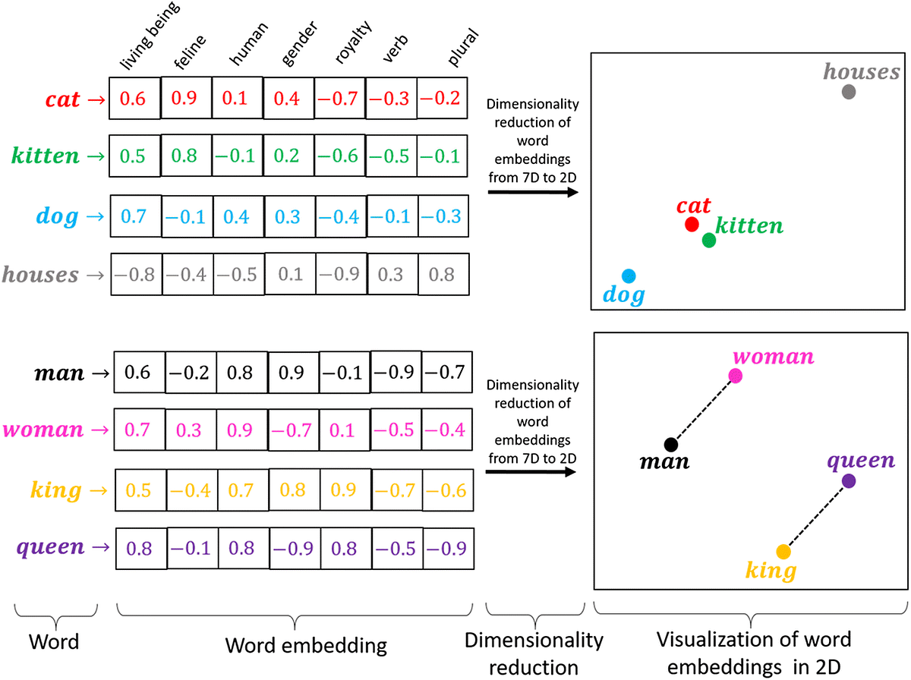

## Table of Contents

## What is word embedding in the context of machine learning?

Word embedding is a way to represent words as numbers that computers can understand. In machine learning, words are turned into vectors, which are lists of numbers. These vectors help machines see how words relate to each other. For example, words that often appear together, like "king" and "queen," will have similar vectors. This makes it easier for machines to process and understand language.

The process of creating these vectors is called "embedding." One popular method is called Word2Vec. It looks at how words are used in a large amount of text and creates vectors based on that. Another method is GloVe, which uses a different approach but also results in vectors that capture word relationships. These embeddings can then be used in various machine learning tasks, like translating languages or answering questions, making them very useful tools in natural language processing.

## How does word embedding differ from traditional bag-of-words models?

Word embedding and bag-of-words models are two different ways to represent text for machines. In a bag-of-words model, each word in a document is counted, and the text is represented as a long list of numbers where each number shows how often a word appears. This method treats each word as separate and doesn't consider the order or the context in which words appear. For example, if you have a sentence like "The cat sat on the mat," the bag-of-words model would just count "the," "cat," "sat," "on," and "mat" without noting that "the" appears twice or that "cat" and "mat" are related.

In contrast, word embedding captures the meaning and relationships between words by turning them into vectors. These vectors are created by looking at how words are used together in a large amount of text. For instance, words like "king" and "queen" will have similar vectors because they often appear in similar contexts. This means that word embedding can understand that "king" is to "queen" as "man" is to "woman," a relationship that bag-of-words can't capture. Word embedding helps machines understand language better because it considers the context and nuances of word usage, making it more powerful for tasks like translation and sentiment analysis.

## What are some common algorithms used to create word embeddings?

One common algorithm for creating word embeddings is Word2Vec. This method looks at how words are used together in a large amount of text. It has two main ways to do this: Continuous Bag of Words (CBOW) and Skip-gram. CBOW predicts a target word based on the context words around it. Skip-gram does the opposite; it predicts the context words from a target word. Both methods help create vectors that show how words relate to each other. For example, if "king" and "queen" often appear in similar contexts, their vectors will be similar, showing their relationship.

Another popular algorithm is GloVe (Global Vectors for Word Representation). Unlike Word2Vec, which looks at local context, GloVe looks at how often words appear together across the entire text. It uses a large matrix of word co-occurrence counts to create word vectors. This means it can capture broader patterns in language. For instance, if "dog" and "bark" often appear together, their vectors will reflect this relationship. GloVe's approach can sometimes give better results because it considers the global statistics of word usage.

A newer method is FastText, developed by Facebook. FastText is similar to Word2Vec but with an important difference: it treats each word as made up of smaller parts called subwords. This helps handle words that are not in the training data, like new or misspelled words. For example, if "walking" is in the training data, FastText can understand "walked" because it breaks down words into smaller pieces like "walk" and "ing." This makes FastText very useful for languages with many word forms and for dealing with typos.

## Can you explain how the Word2Vec algorithm works?

The Word2Vec algorithm is a way to turn words into numbers that computers can understand. It does this by looking at how words are used together in a large amount of text. There are two main ways Word2Vec does this: Continuous Bag of Words (CBOW) and Skip-gram. In CBOW, the algorithm tries to guess a target word from the words around it. For example, if you have the sentence "The cat sat on the mat," CBOW might use "the," "cat," "on," and "mat" to predict "sat." On the other hand, Skip-gram does the opposite; it uses a target word to predict the words around it. So, if "sat" is the target word, Skip-gram would try to predict "the," "cat," "on," and "mat."

Both CBOW and Skip-gram create vectors for words by training a neural network. The vectors are adjusted over time to get better at predicting the right words. For example, if the vector for "king" is good at predicting words like "queen," "throne," and "crown," it means the vector is capturing the meaning of "king." These vectors can show relationships between words, like $$ \text{king} - \text{man} + \text{woman} \approx \text{queen} $$. This means that by subtracting the vector for "man" from "king" and adding the vector for "woman," you get a vector close to "queen." This shows that Word2Vec can understand that "king" is to "queen" as "man" is to "woman."

## What is the difference between CBOW and Skip-gram models in Word2Vec?

The CBOW (Continuous Bag of Words) model in Word2Vec tries to guess a target word from the words around it. Imagine you have the sentence "The cat sat on the mat." CBOW would use "the," "cat," "on," and "mat" to predict "sat." It looks at the context words to figure out what the missing word might be. This method works well when you have a lot of context words helping to predict the target word, making it faster and sometimes more accurate for common words.

The Skip-gram model does the opposite; it uses a target word to predict the words around it. So, if "sat" is the target word, Skip-gram would try to predict "the," "cat," "on," and "mat." This method is good at capturing the relationships between words, even if they don't appear together often. For example, it can understand that $$ \text{king} - \text{man} + \text{woman} \approx \text{queen} $$. Skip-gram is often better for tasks where you need to understand less common words and their meanings in different contexts.

## How does GloVe (Global Vectors for Word Representation) approach word embedding?

GloVe (Global Vectors for Word Representation) creates word embeddings by looking at how often words appear together in a big set of text. It uses a large matrix to keep track of how often each word appears near every other word. This way, GloVe can see the overall patterns of word usage, not just what happens in small parts of the text. For example, if "dog" and "bark" often appear together, their vectors will show this relationship. By looking at these patterns across the whole text, GloVe can create vectors that capture the meaning of words better.

Unlike Word2Vec, which focuses on local context with CBOW and Skip-gram, GloVe's approach is more about the global statistics of word co-occurrences. This means it can understand broader relationships between words. For instance, if "doctor" and "hospital" appear together a lot, their vectors will be close to each other, showing they are related. This global view can sometimes make GloVe's embeddings more useful for tasks where understanding the overall structure of language is important.

## What are the advantages of using pre-trained word embeddings?

Pre-trained word embeddings are useful because they save time and resources. Instead of training your own embeddings from scratch, which requires a lot of data and computing power, you can use embeddings that have already been created by others. These pre-trained embeddings are often made using huge amounts of text, so they can understand a lot about how words are used in language. This means you can start working on your machine learning project right away, without waiting for your own training to finish.

Another advantage is that pre-trained embeddings can work well for many different tasks. For example, if you want to do sentiment analysis or translate languages, you can use embeddings like Word2Vec or GloVe that have already learned a lot about word relationships. These embeddings can help your models understand words better, even if the specific words or contexts in your task are a bit different from what the embeddings were trained on. This makes them very flexible and useful in a lot of different situations.

## How can word embeddings be fine-tuned for specific tasks?

To fine-tune word embeddings for a specific task, you start with pre-trained embeddings and then adjust them using your own data. This process involves training a model on your task-specific data while allowing the embeddings to change a bit. For example, if you're working on a sentiment analysis project, you might use pre-trained embeddings and then fine-tune them with data from product reviews. This helps the embeddings better understand the language and context of your specific task, making your model more accurate.

Fine-tuning can be done in different ways. One common method is to use the pre-trained embeddings as a starting point and then train your model on your task while allowing the embeddings to update. This can be done by setting a learning rate that lets the embeddings change gradually. Another approach is to freeze the embeddings at first and only train the rest of the model, and then later unfreeze the embeddings to fine-tune them. This way, you make sure the embeddings stay useful while still adapting to your task. By fine-tuning, you can make the most out of pre-trained embeddings and improve how well your model works for your specific needs.

## What are some challenges and limitations of word embeddings?

Word embeddings have some challenges and limitations. One big problem is that they can be biased. If the text used to train the embeddings has biases, like stereotypes about certain groups of people, the embeddings will learn these biases too. For example, if the training data often links "doctor" with "man" and "nurse" with "woman," the embeddings will show this bias. This can make the embeddings unfair and cause problems when used in real-world applications.

Another challenge is that word embeddings don't always understand the context well. They treat each word the same way, no matter where it appears. For instance, the word "bank" can mean a place to keep money or the side of a river, but word embeddings might not tell the difference. This can lead to mistakes in tasks like translation or answering questions. Also, word embeddings can struggle with new words or words that are used in new ways, because they are based on past data and might not adapt well to changes in language.

## How do contextual embeddings like BERT differ from static word embeddings?

Contextual embeddings like BERT are different from static word embeddings because they look at the whole sentence to understand each word. Static word embeddings, like Word2Vec or GloVe, give each word a single vector that doesn't change no matter where the word appears. For example, the word "bank" always has the same vector, whether it's talking about a place to keep money or the side of a river. But BERT reads the entire sentence and gives each word a different vector based on the context. So, "bank" could have different vectors if it's used in "I went to the bank to deposit money" versus "I sat by the river bank."

This makes contextual embeddings much better at understanding language because they can capture the different meanings of words based on how they're used. For example, BERT can understand that in the sentence "The dog bit the man," "bit" means something different than in "I bit into the apple." This helps with tasks like answering questions or translating languages, where understanding context is important. While static embeddings are simpler and faster to use, contextual embeddings like BERT are more powerful and can handle the complexities of real language better.

## What metrics are used to evaluate the quality of word embeddings?

To evaluate the quality of word embeddings, people often use something called word similarity tasks. This means they check how well the embeddings can show that words with similar meanings have similar vectors. One common way to do this is to use a dataset like WordSim-353, which has pairs of words and scores for how similar they are. If the embeddings make words like "dog" and "puppy" have similar vectors, but words like "dog" and "car" have different vectors, then the embeddings are doing a good job. Another way is to use the cosine similarity measure, which looks at the angle between two vectors. If the cosine similarity between "dog" and "puppy" is high, it means their vectors are close, which is good.

Another important way to evaluate word embeddings is through analogy tasks. These tasks check if the embeddings can understand relationships between words. A famous example is the analogy "king is to man as queen is to woman." This can be written as $$ \text{king} - \text{man} + \text{woman} \approx \text{queen} $$. If the embeddings can make this equation work well, it shows they understand the relationships between words. A popular dataset for this is the Google Analogy Test Set, which has many such analogies to test. Both word similarity and analogy tasks help see if the embeddings are capturing the meaning and relationships of words well.

## How can word embeddings be applied in real-world applications like sentiment analysis or machine translation?

Word embeddings are really helpful for sentiment analysis, which is about figuring out if people like or dislike something based on what they write. Imagine you're looking at reviews for a new phone. With word embeddings, you can turn words like "good," "bad," "love," and "hate" into numbers that a computer can understand. These numbers show how the words relate to each other. For example, if "good" and "great" often appear together, their vectors will be similar. By using these vectors, a computer can add up the feelings in a review and decide if it's positive or negative. This makes sentiment analysis more accurate and helps businesses understand what customers think about their products.

Word embeddings also make machine translation better. When translating from one language to another, it's important to understand the meaning of words and how they relate to each other. For instance, if you're translating from English to Spanish, knowing that "king" is to "man" as "queen" is to "woman" can help the computer figure out the right word to use. This relationship can be shown with word vectors, like $$ \text{king} - \text{man} + \text{woman} \approx \text{queen} $$. By using word embeddings, the translation software can better understand the context and nuances of language, leading to more accurate translations. This makes it easier for people to communicate across different languages.