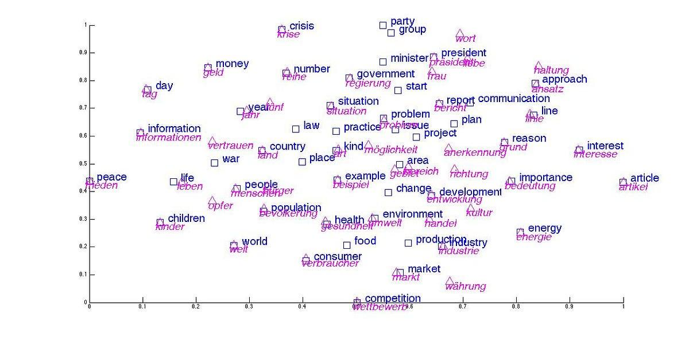

## Table of Contents

## What are word embeddings and why are they important in machine learning?

Word embeddings are a way to represent words as numbers that computers can understand. Instead of just treating words as symbols, word embeddings turn words into lists of numbers, called vectors. These vectors can show how similar or different words are to each other. For example, if two words often appear in similar contexts, their vectors will be close to each other in a space we call a "vector space." This is useful because it helps computers understand language in a more human-like way.

These embeddings are important in machine learning because they help machines process and understand text better. Many machine learning tasks, like translating languages, recognizing speech, or answering questions, rely on understanding the meaning of words. By using word embeddings, machines can capture the nuances and relationships between words, which makes them perform better at these tasks. For instance, if a machine knows that "king" and "queen" are related in a certain way, it can use this knowledge to make better predictions or translations.

## How do word embeddings capture semantic meaning?

Word embeddings capture semantic meaning by turning words into vectors in a way that similar words have vectors close to each other in a vector space. Imagine a big map where each word is a point. If two words often appear in similar contexts or have similar meanings, their points on the map will be close together. For example, "dog" and "puppy" would be near each other because they are related, while "dog" and "car" would be far apart. This closeness in the vector space helps machines understand that certain words are more similar or related to each other than others.

This is done by training models on large amounts of text data. The models learn to predict which words are likely to appear near each other. As the model learns, it adjusts the vectors so that words with similar meanings end up with similar vectors. For instance, if "king" and "queen" often appear in similar contexts, their vectors will be adjusted to be close to each other. This process allows the model to capture not just the words themselves but also their relationships and nuances, making it possible for machines to understand and process language in a more human-like way.

## What is the difference between static and contextual word embeddings?

Static word embeddings, like Word2Vec or GloVe, give each word a fixed vector that doesn't change no matter where the word appears in a sentence. For example, the word "bank" will have the same vector whether it's used in the context of a river or a financial institution. This can be a problem because the same word can have different meanings depending on the context. Static embeddings are good for understanding general word similarities, but they can't capture the nuances of language where the meaning changes based on surrounding words.

Contextual word embeddings, like those from BERT or ELMo, solve this problem by giving each word a vector that changes based on its context in a sentence. If "bank" is used near "river," its vector will be different than if it's used near "money." This means that contextual embeddings can capture the different meanings of a word in different situations. They are trained on large amounts of text and learn to predict words based on their context, which makes them more powerful for tasks like understanding natural language or answering questions where the context is important.

## Can you explain the basic principle behind the Skip-gram Word2Vec model?

The Skip-gram Word2Vec model is a way to turn words into numbers so computers can understand them better. It works by looking at a word and trying to predict the words that come before and after it. Imagine you have the sentence "I love to eat pizza." The model would look at "eat" and try to guess that "love" and "pizza" are likely to be nearby. By doing this over and over with lots of text, the model learns how words relate to each other. If two words often appear near each other, their number representations, or vectors, will be close in a big space called a "vector space."

To make this work, the Skip-gram model uses something called a [neural network](/wiki/neural-network). When the model sees a word, it turns it into a vector and then uses that vector to predict nearby words. The model keeps adjusting the vectors to make better predictions. This process is called training. The goal is to make the vectors so good that they capture the meaning and relationships between words. For example, if the model learns that "king" and "queen" often appear in similar contexts, their vectors will be close together, showing that they are related. This way, the model can understand language in a more human-like way.

## How does the Continuous Bag of Words (CBoW) Word2Vec model work?

The Continuous Bag of Words (CBoW) Word2Vec model is another way to turn words into numbers that computers can understand. It does this by looking at the words around a target word and using them to guess what the target word is. Imagine you have the sentence "I love to eat pizza." The model would look at "I," "love," "to," and "pizza" to predict that the missing word is "eat." By doing this with lots of text, the model learns how words relate to each other. If words often appear near each other, their number representations, or vectors, will be close together in a big space called a "vector space."

To make this work, the CBoW model uses a neural network. When the model sees the words around a target word, it turns them into vectors and then uses those vectors to predict the target word. The model keeps adjusting the vectors to make better predictions. This process is called training. The goal is to make the vectors so good that they capture the meaning and relationships between words. For example, if the model learns that "king" and "queen" often appear in similar contexts, their vectors will be close together, showing that they are related. This way, the model can understand language in a more human-like way.

## What are the advantages of using GloVe over traditional Word2Vec models?

GloVe, or Global Vectors for Word Representation, has some advantages over traditional Word2Vec models like Skip-gram and CBoW. One big advantage is that GloVe looks at the whole set of word co-occurrences in a large text, not just the words that are close to each other. This means GloVe can capture more of the overall patterns in how words are used together. For example, if "dog" and "bark" often appear together in many different texts, GloVe can use this information to make their vectors closer together, even if they are not always right next to each other.

Another advantage of GloVe is that it can be faster to train because it uses a different way to learn the word vectors. Instead of predicting nearby words like Word2Vec, GloVe tries to make the dot product of two word vectors equal to the logarithm of their co-occurrence count. This can be written as $$w_i^T w_j = \log(X_{ij})$$, where $$w_i$$ and $$w_j$$ are the vectors for words i and j, and $$X_{ij}$$ is how often they appear together. This approach can lead to word vectors that are just as good or even better at capturing word meanings and relationships, but with less time needed to train the model.

## How does fastText improve upon the limitations of Word2Vec?

fastText improves upon Word2Vec by considering the internal structure of words. Word2Vec treats each word as a single unit, but fastText breaks words into smaller parts called subwords. For example, the word "playing" can be broken into subwords like "play" and "ing." By doing this, fastText can better understand new words or words that were not in the training data. If it sees a new word like "playful," it can use what it knows about "play" and "ful" to guess its meaning. This makes fastText more useful for languages with many word forms or for tasks where new words often appear.

Another way fastText improves on Word2Vec is by being faster to train and use. fastText uses a simpler model that can handle large amounts of text more quickly. It also allows for efficient use of memory, which means it can be used on computers that are not very powerful. This makes fastText a good choice for people who need to work with big datasets or who need quick results. Overall, fastText's ability to handle subwords and its speed make it a powerful tool for understanding and processing language.

## What is ELMo and how does it use deep contextualized embeddings?

ELMo, or Embeddings from Language Models, is a way to understand words in sentences better by looking at the whole context. Unlike older models like Word2Vec that give each word a fixed number, ELMo gives each word a number that changes based on the other words around it. This means that if you see the word "bank" in a sentence about a river, its number will be different than if it's in a sentence about money. ELMo does this by using a special kind of computer program called a neural network, which is trained on a lot of text to predict words based on their context.

ELMo uses what are called deep contextualized embeddings. This means it looks at many layers of the neural network to understand a word's meaning. Each layer of the network can see different things about the word and its context. By combining the information from all these layers, ELMo can create a very rich and detailed understanding of what a word means in a specific sentence. This makes ELMo really good at tasks like understanding questions or translating languages, where the meaning of words can change a lot depending on the context.

## How does the Universal Sentence Encoder (USE) differ from word-level embeddings?

The Universal Sentence Encoder (USE) is different from word-level embeddings because it works with whole sentences instead of just single words. Word-level embeddings, like Word2Vec or GloVe, turn each word into a number that shows its meaning. But USE takes a whole sentence and turns it into one number that captures the meaning of the entire sentence. This means USE can understand the context and meaning of a sentence better than just looking at the words one by one.

USE is useful because it can handle tasks that need to understand the whole sentence, like answering questions or finding similar sentences. For example, if you have two sentences that mean the same thing but use different words, USE can tell they are similar. This is harder for word-level embeddings because they might not see the overall meaning if the words are different. By looking at the whole sentence, USE can do a better job at understanding and working with language in a way that feels more natural to humans.

## What are Poincaré Embeddings and how are they used in hierarchical data?

Poincaré Embeddings are a way to turn things that have a tree-like structure into numbers that computers can understand. Think of a family tree where you have grandparents, parents, and children. Poincaré Embeddings place these family members in a special kind of space called a "hyperbolic space." In this space, things that are higher up in the tree, like grandparents, are placed further away from the center, while things lower down, like children, are closer to the center. This helps to show the relationships between them in a way that makes sense.

These embeddings are useful for working with data that has a clear hierarchy, like categories in a store or the structure of a company. For example, if you have a store with categories like "Electronics," "Computers," and "Laptops," Poincaré Embeddings can show that "Laptops" is a part of "Computers," which is a part of "Electronics." By using the formula $$d(u, v) = \cosh^{-1}(1 + 2\frac{\|u - v\|^2}{(1 - \|u\|^2)(1 - \|u\|^2)})$$ to measure distances in this hyperbolic space, computers can better understand and work with these hierarchical relationships.

## Can you describe how UNITER uses word embeddings for vision-and-language tasks?

UNITER, which stands for UNiversal Image-TExt Representation, is a model that helps computers understand both pictures and words at the same time. It uses word embeddings to turn the words in a sentence into numbers that the computer can work with. These numbers, or vectors, help the computer see how words relate to each other and to the objects in a picture. For example, if you have a picture of a dog and the sentence "The dog is playing," UNITER uses word embeddings to understand that "dog" and "playing" are connected, and then it looks at the picture to see if there's a dog doing something that looks like playing.

UNITER is trained on a lot of pairs of pictures and sentences, which helps it learn how to match the words to the right parts of the picture. By using word embeddings, UNITER can understand the meaning of the words and how they fit with what's in the picture. This makes it really good at tasks like answering questions about pictures or describing what's happening in them. For instance, if you ask, "What is the dog doing?" UNITER can use the word embeddings to understand the question and then look at the picture to answer, "The dog is playing."

## What is Mirror-BERT and how does it utilize cross-lingual word embeddings?

Mirror-BERT is a way to help computers understand different languages better by using something called cross-lingual word embeddings. It works by taking sentences in two different languages and turning them into numbers that the computer can understand. These numbers, or embeddings, are made so that words with similar meanings in different languages have similar numbers. For example, the English word "dog" and the Spanish word "perro" would have close numbers because they mean the same thing. By doing this, Mirror-BERT can help computers translate sentences or understand what people are saying in different languages.

Mirror-BERT uses a special kind of computer program called a neural network to learn these cross-lingual embeddings. It looks at a lot of sentences in different languages and tries to match them up so that the numbers for similar sentences are close together. This helps the computer see that "The dog is playing" in English and "El perro está jugando" in Spanish are saying the same thing. By using these cross-lingual embeddings, Mirror-BERT can make it easier for computers to work with many languages at the same time, which is really helpful for things like translating text or understanding what people are saying in different parts of the world.

## References & Further Reading

[1]: Mikolov, T., Chen, K., Corrado, G., & Dean, J. (2013). ["Efficient Estimation of Word Representations in Vector Space."](https://arxiv.org/abs/1301.3781) arXiv:1301.3781.

[2]: Pennington, J., Socher, R., & Manning, C. D. (2014). ["GloVe: Global Vectors for Word Representation."](https://aclanthology.org/D14-1162/) Proceedings of the 2014 Conference on Empirical Methods in Natural Language Processing (EMNLP), 1532-1543.

[3]: Bojanowski, P., Grave, E., Joulin, A., & Mikolov, T. (2017). ["Enriching Word Vectors with Subword Information."](https://aclanthology.org/Q17-1010/) Transactions of the Association for Computational Linguistics, 5, 135-146.

[4]: Peters, M. E., Neumann, M., Iyyer, M., Gardner, M., Clark, C., Lee, K., & Zettlemoyer, L. (2018). ["Deep Contextualized Word Representations."](https://arxiv.org/abs/1802.05365) arXiv:1802.05365.

[5]: Devlin, J., Chang, M.-W., Lee, K., & Toutanova, K. (2019). ["BERT: Pre-training of Deep Bidirectional Transformers for Language Understanding."](https://arxiv.org/abs/1810.04805) arXiv:1810.04805.

[6]: Conneau, A., Kiela, D., Schwenk, H., Barrault, L., & Bordes, A. (2018). ["Supervised Learning of Universal Sentence Representations from Natural Language Inference Data."](https://aclanthology.org/D17-1070/) arXiv:1705.02364.

[7]: Dhingra, B., Liu, Z., Yang, Y., Cohen, W., & Salakhutdinov, R. (2018). ["Gated-Attention Readers for Text Comprehension."](https://users.cs.duke.edu/~bdhingra/papers/ga_reader.pdf) arXiv:1606.01549.

[8]: Nickel, M., & Kiela, D. (2017). ["Poincaré Embeddings for Learning Hierarchical Representations."](https://arxiv.org/abs/1705.08039) arXiv:1705.08039.