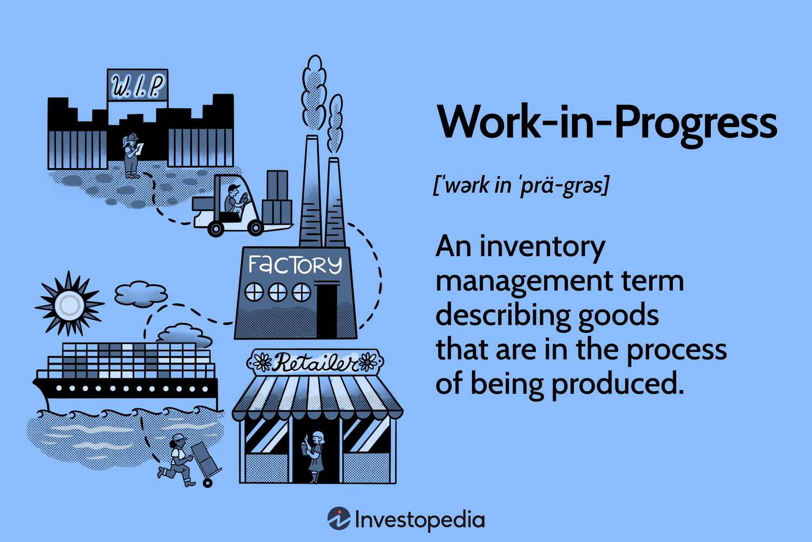

## Table of Contents

## What is a current asset?

A current asset is something a company owns that can be turned into cash or used up within one year. This includes things like money in the bank, money that customers owe the company, and supplies that the company will use soon. These assets are important because they help a company pay its bills and keep running smoothly.

For example, if a company has a lot of cash, it can easily pay for things like rent and salaries. If customers owe the company money, the company expects to get that money soon, which also helps with paying bills. Keeping track of current assets helps a company know if it has enough money to cover its short-term needs.

## What does 'Work in Progress' (WIP) mean in accounting?

In accounting, 'Work in Progress' (WIP) refers to the costs of unfinished goods that are still being made. This includes the cost of raw materials, labor, and overhead that have been put into products that are not yet complete. Companies track WIP to know how much money is tied up in products that are in the middle of being made.

WIP is important because it helps businesses understand their production process and manage their inventory. By keeping an eye on WIP, a company can see if it is spending too much time or money on making products. This information can help them make their production more efficient and plan better for the future.

## How is Work in Progress classified as a current asset?

Work in Progress (WIP) is classified as a current asset because it represents the value of goods that a company is still making and expects to finish within one year. Since these goods will be completed soon, they can be sold and turned into cash quickly, which is a key feature of current assets.

Tracking WIP as a current asset helps a company know how much money is tied up in products that are not yet finished. This is important for managing cash flow and making sure the company can pay its short-term bills. By understanding how much is in WIP, a business can better plan its production and inventory to keep everything running smoothly.

## What types of businesses typically have Work in Progress as a current asset?

Businesses that make things usually have Work in Progress (WIP) as a current asset. This includes factories that make cars, machines, or electronics. These companies buy materials, use workers to put them together, and spend money on running the factory. All these costs add up while the products are being made but not yet finished. When the products are done, they can be sold, so the money spent on them is considered a current asset.

Construction companies also have WIP as a current asset. They work on big projects like buildings or roads that take time to finish. The costs of materials, labor, and other expenses pile up while the project is ongoing. Since these projects are expected to be completed within a year, the money spent on them counts as a current asset. This helps the company know how much money is tied up in projects that are still being built.

## How is the value of Work in Progress calculated?

The value of Work in Progress (WIP) is calculated by adding up the costs of the materials, labor, and overhead that have gone into making the unfinished products. Materials are the things a company buys to make its products, like wood for furniture or steel for cars. Labor is the money paid to workers for their time spent making the products. Overhead includes other costs like rent for the factory, utilities, and machine maintenance. All these costs are tracked as the products move through the production process.

To find the total value of WIP, a company adds up all these costs for all the unfinished products at a certain point in time. This gives them a snapshot of how much money is tied up in products that are not yet finished. By keeping track of this value, a company can see how much it is spending on production and make sure it has enough money to keep making products until they are done.

## What are the components that make up the Work in Progress inventory?

Work in Progress (WIP) inventory is made up of three main parts: materials, labor, and overhead. Materials are the things a company buys to make its products, like fabric for clothes or metal for machines. These materials are counted as part of WIP as soon as they start being used in making the product. Labor is the money the company pays to workers for the time they spend working on the unfinished products. This includes the wages of people who are directly involved in making the product.

Overhead includes other costs that are needed to keep the production going but are not directly tied to making one specific product. This can include things like the rent for the factory, the cost of electricity to run machines, and the money spent on maintaining equipment. All these costs are added together to find the total value of the WIP inventory. By keeping track of these components, a company can see how much money is tied up in products that are not yet finished and plan better for their production process.

## How does Work in Progress affect a company's financial statements?

Work in Progress (WIP) shows up on a company's balance sheet as a current asset. This means it is part of the money the company has that can turn into cash within a year. When a company spends money on materials, labor, and overhead to make products that are not finished yet, it adds these costs to the WIP account. This helps the company know how much money is tied up in making things that are not ready to sell. If the WIP number is high, it might mean the company is spending a lot on making products, which could affect how much cash it has for other things.

WIP also affects the income statement when the products are finished and sold. Until then, the costs stay in the WIP account. When the products are done, the costs move from WIP to finished goods inventory. When the finished goods are sold, the costs go to the cost of goods sold on the income statement. This reduces the company's profit for that period. So, WIP is important because it helps the company keep track of costs and know when to expect money back from selling the finished products.

## What are the accounting standards that govern the reporting of Work in Progress?

The main accounting standards that govern the reporting of Work in Progress (WIP) are the Generally Accepted Accounting Principles (GAAP) used in the United States and the International Financial Reporting Standards (IFRS) used in many other countries. Both sets of standards require companies to report WIP as a current asset on their balance sheet. This means that the costs of materials, labor, and overhead that go into making products that are not yet finished must be tracked and shown clearly. GAAP and IFRS help make sure that companies report their WIP in a way that is fair and easy to understand.

Under GAAP, companies must use the cost accumulation method to calculate WIP, which means adding up all the costs that go into making the unfinished products. IFRS also requires companies to report WIP at cost, but it allows for some flexibility in how costs are calculated. Both standards aim to give a clear picture of how much money a company has tied up in products that are not yet finished. This helps investors and other people who look at the company's financial statements understand its financial health and how well it is managing its production process.

## How can mismanagement of Work in Progress impact a company's liquidity?

Mismanagement of Work in Progress (WIP) can hurt a company's [liquidity](/wiki/liquidity-risk-premium). Liquidity means how easily a company can turn its assets into cash to pay bills. If a company spends too much money on making products that stay in WIP for a long time, it might not have enough cash to pay for things like rent or salaries. This can make it hard for the company to keep running smoothly. If the products take too long to finish, the company can't sell them and get money back quickly.

If WIP is not managed well, it can also mean that a company is not using its money wisely. For example, if the company buys too many materials that sit in WIP without being used, it ties up money that could be used elsewhere. This can lead to a situation where the company runs out of cash and struggles to pay its short-term debts. Good management of WIP helps a company keep enough cash on hand to stay liquid and meet its financial needs.

## What are the best practices for managing Work in Progress to optimize a company's current assets?

To manage Work in Progress (WIP) well and make the most of a company's current assets, it's important to keep a close eye on the production process. This means checking how long it takes to make products and making sure they move quickly from WIP to finished goods. By doing this, a company can reduce the time and money tied up in making things. It's also helpful to use good inventory systems to track the costs of materials, labor, and overhead. This helps the company know exactly how much money is in WIP at any time and plan better for the future.

Another good practice is to set clear goals for how much WIP should be at any time. This can help stop the company from spending too much on making things that aren't finished yet. Regularly reviewing the WIP numbers can show if there are any problems, like too many materials sitting around or delays in production. By fixing these issues, a company can make its production more efficient and keep more cash on hand. This makes it easier to pay bills and keep the business running smoothly.

## How does the treatment of Work in Progress differ in various industries?

In different industries, the way Work in Progress (WIP) is handled can be quite different. For example, in manufacturing, WIP includes the costs of raw materials, the time workers spend making products, and other costs like factory rent and electricity. These costs are tracked carefully because it can take a while to turn raw materials into finished products. In this industry, managing WIP well is important to make sure the company doesn't run out of cash while waiting for products to be finished and sold.

In the construction industry, WIP is also important but looks a bit different. Here, WIP includes the costs of materials, labor, and other expenses for projects that are still being built, like buildings or roads. These projects can take months or even years to finish, so the costs can add up over time. Construction companies need to keep a close eye on WIP to make sure they have enough money to keep working on projects until they are done and can be paid for.

## What advanced techniques can be used to analyze the efficiency of Work in Progress management?

One advanced technique for analyzing the efficiency of Work in Progress (WIP) management is using lean manufacturing principles. Lean manufacturing focuses on cutting out waste and making the production process smoother. By looking at how long products stay in WIP, a company can see where there might be delays or extra costs. They can then make changes to speed up production and reduce the time and money spent on WIP. This helps the company use its resources better and keep more cash on hand.

Another technique is using data analytics and software tools to track and analyze WIP in real time. These tools can show how much money is tied up in WIP at any moment and help find patterns or problems in the production process. For example, if the data shows that certain products are taking longer to finish than others, the company can look into why this is happening and fix it. By using data to make smart decisions, a company can manage its WIP better, make its production more efficient, and improve its overall financial health.

## What is the impact of WIP on financial ratios and performance metrics?

Work in Progress (WIP) plays a significant role in impacting several key financial ratios, which are crucial for assessing a company's operational efficiency and profitability. Among the most affected financial metrics are inventory turnover, gross margin, and the current ratio.

Inventory turnover is a critical measure of how efficiently a company converts its inventory into sales. It is defined as:

$$
\text{Inventory Turnover} = \frac{\text{Cost of Goods Sold (COGS)}}{\text{Average Inventory}}
$$

High levels of WIP can lead to a reduction in inventory turnover ratios. This suggests that the inventory management process is experiencing delays or inefficiencies, which could hinder cash flow and business operations. A low inventory turnover rate may imply that products are not selling as quickly as they should, possibly due to overproduction or poor demand forecasting.

The gross margin ratio, another essential metric impacted by WIP, reflects the difference between sales and the cost of goods sold, expressed as a percentage of sales. It is calculated as follows:

$$
\text{Gross Margin Ratio} = \left(\frac{\text{Sales} - \text{COGS}}{\text{Sales}}\right) \times 100
$$

Changes in WIP levels directly affect COGS, as incomplete inventory items contribute to the valuation of COGS when they become finished. If WIP is overstated, COGS will be lower, artificially inflating the gross margin and potentially misleading stakeholders about the company's profitability.

The current ratio, which evaluates a firm's ability to cover its short-term liabilities with its short-term assets, is defined as:

$$
\text{Current Ratio} = \frac{\text{Current Assets}}{\text{Current Liabilities}}
$$

As WIP is classified as a current asset, fluctuations in its level can significantly alter the current ratio. High WIP can inflate the current asset component, potentially giving a skewed view of liquidity. If WIP levels remain consistently high without converting into finished goods and sales, it may raise concerns about the company's liquidity and operational efficiency.

Management's understanding of WIP's impact on these financial ratios is crucial. It allows for better decision-making concerning inventory control, pricing strategies, and financial forecasting. By keeping WIP management under control, using techniques that enhance production efficiency, firms can optimize these key financial metrics, promoting healthier financial statements and more robust investment profiles.

## References & Further Reading

#