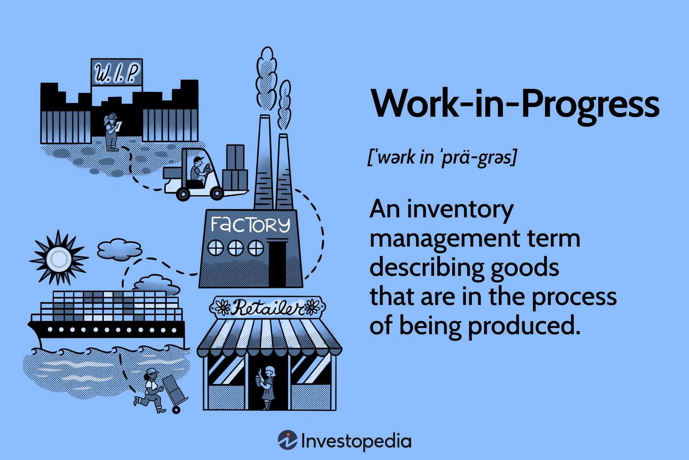

Algorithmic trading, often referred to as algo trading, has revolutionized financial markets by enabling quick, efficient, and high-frequency trading executions based on complex algorithmic strategies, effectively reducing human intervention. This technological advancement has shifted the landscape of the trading industry by introducing new levels of precision, efficiency, and data-driven decision-making.

Understanding the intersection of work-in-progress (WIP) concepts from manufacturing and finance provides valuable insights into the workings of the algo trading business model. Much like manufacturing processes where goods may be in various stages of completion, algo trading involves multiple evolving elements, such as incomplete algorithms and trading strategies awaiting full implementation. The notion of WIP highlights these ongoing processes and their potential for optimization before they become fully operational.



This article investigates how WIP principles are utilized within the algo trading industry. By examining real-world examples, it showcases how ongoing developments are managed and refined to reach their full potential. Illustrating this intersection sheds light on how trading firms handle the lifecycle of trading strategies, from their inception and development through to their final deployment.

The aim is to demonstrate the parallels between traditional inventory management and the intricate world of algorithmic trading. The strategic management of WIP in trading mirrors the practices in manufacturing, where careful oversight ensures efficiency and innovation. These comparisons highlight how the business practices in one domain can inform and enhance methodologies in another, particularly in managing projects in-progress to meet strategic goals effectively.

## Table of Contents

## Understanding Work in Progress (WIP) in Business

Work in Progress (WIP) refers to products that are in various stages of completion but are not yet finalized for sale. This concept is well-established in manufacturing and involves managing the costs associated with partially finished goods, including materials, labor, and manufacturing overhead. Proper tracking of these costs allows companies to optimize their production process, identify bottlenecks, and focus on areas for improvement, ultimately enhancing overall efficiency.

In the context of manufacturing, WIP items are integral to understanding the flow and efficiency of production. By analyzing WIP, firms can gain insights into their production cycles, assess resource allocation, and ensure timely project completion. Tracking these partially completed products is a critical component in refining production planning and control systems.

Understanding the notion of WIP is crucial not only in traditional manufacturing but also in sectors such as [algorithmic trading](/wiki/algorithmic-trading), where startups must manage incomplete algorithms and trading strategies. Similarly, these businesses must continually refine and perfect their offerings over time. In this domain, developing and tweaking algorithms often constitute ongoing projects, similar to how WIP items undergo continuous processing in manufacturing. As a result, WIP becomes an essential element in measuring progress and facilitating improvements in trading strategy execution.

The concept of WIP is also a fundamental aspect of financial reporting and inventory management, providing a more precise representation of a company's assets and expenditures. It allows businesses to account for partially completed assets on balance sheets accurately, ensuring that financial statements reflect the true status of both current assets and work underway.

Incorporating WIP data into financial reports requires a thorough understanding of how labor, materials, and overhead are allocated within ongoing projects. This allocation follows specific accounting principles and methods, such as the percentage of completion or completed contract method, to accurately reflect project progress and its financial implications. Consequently, WIP tracking not only enhances operational efficiency but also contributes significantly to the integrity and accuracy of financial documentation within the business landscape.

## Application of WIP in Algorithmic Trading

In algorithmic trading, the concept of Work in Progress (WIP) plays a crucial role during the development and testing phases of new trading algorithms. Much like the staged development seen in manufacturing, algorithmic trading strategies are iteratively refined until deemed market-ready. During this development period, algorithms undergo numerous iterations, starting from the initial design to extensive back-testing on historical data. Only after rigorous testing and performance evaluations can these algorithms transition from WIP to live deployment in financial markets.

Ongoing back-testing represents a vital component of the WIP in algorithmic trading. It allows developers to assess the viability and robustness of a strategy under various market conditions. Back-testing involves simulating the trading strategy using historical data to forecast its behavior and performance. Until such testing is complete and the strategy proves reliable, it remains in a WIP state.

Efficient management of WIP in algo trading requires a systematic approach involving research data analytics, defined software development cycles, and comprehensive testing iterations. These processes aim to enhance trading efficiency and minimize potential risks. The integration of data-driven insights and software engineering principles helps in streamlining the development cycle, ensuring that trading strategies are not only innovative but also well-optimized for execution speed and reliability.

Leading financial institutions provide real-world examples of managing WIP effectively. These organizations handle substantial volumes of pending trades and continuously adjust their algorithms as part of their WIP management practice. Treating these trades and algorithms as WIP allows firms to focus on the intricate balancing act of aligning strategic objectives with market dynamics. For example, these institutions might use pipelines that incorporate [machine learning](/wiki/machine-learning) algorithms to adjust trade parameters automatically based on real-time data analytics.

A practical illustration of this concept can be demonstrated using a simplified Python example for back-testing a hypothetical trading strategy:

```python
import pandas as pd
import numpy as np

# Sample historical price data
data = pd.DataFrame({
    'price': [100, 101, 102, 101, 100, 98, 97, 99, 100, 101]
})

# Moving average strategy
data['short_mavg'] = data['price'].rolling(window=3, min_periods=1).mean()
data['long_mavg'] = data['price'].rolling(window=5, min_periods=1).mean()

# Define position: 1 for buy, -1 for sell
data['position'] = np.where(data['short_mavg'] > data['long_mavg'], 1, -1)

# Backtesting: calculate returns
data['log_return'] = np.log(data['price'] / data['price'].shift(1))
data['strategy_return'] = data['log_return'] * data['position'].shift(1)

# Assume no trading costs for simplicity
cumulative_strategy_return = data['strategy_return'].cumsum().apply(np.exp)

print(cumulative_strategy_return)
```

In this code, a basic moving average strategy is back-tested against historical price data. The strategy assigns a buy or sell position based on the relationship between the short-term and long-term moving averages, representing the WIP nature of strategy refinement. Such iterative back-testing and refinement ensure that by the time algorithms handle substantial real-world trades, they are thoroughly vetted and optimized.

The WIP concept, therefore, allows algorithmic trading firms to maintain a state of constant iteration and improvement, which is vital in adapting to the fluid and unpredictable nature of financial markets.

## Examples of WIP in Algo Trading Businesses

Algorithmic trading firms often treat the development of new trading algorithms as projects, with each algorithm representing a work in progress (WIP) until it can consistently achieve the desired outcomes. This perspective allows these firms to manage algorithm development with a focus on achieving specific performance indicators. Milestones such as accuracy, execution speed, and adaptability to changing market conditions are utilized to assess the advancement of an algorithm from its inception to its final, operational stage.

For instance, milestones can be quantitatively assessed using back-testing results, wherein the precision of an algorithm is measured by comparing its predicted outcomes to historical market data. The speed is typically evaluated by analyzing the latency from data reception to order execution, while market adaptability is assessed based on the algorithm's performance across different market regimes.

Leading algorithmic trading firms such as Renaissance Technologies and Two Sigma exemplify this WIP-centric approach. These firms are known for their continuous iteration and refinement of trading models. By systematically developing and testing numerous algorithms, they strive to align their trading strategies with dynamic market conditions, thereby maintaining a competitive edge.

Renaissance Technologies, renowned for its Medallion Fund, reportedly utilizes sophisticated statistical models and algorithms that are frequently adjusted and improved upon. This ongoing development cycle is indicative of treating each strategy as WIP, allowing the firm to swiftly adapt its models in response to market anomalies or emerging trends.

Similarly, Two Sigma, another prominent firm, applies a data-driven approach where an extensive research environment facilitates the development of algorithms. They employ advanced analytics and machine learning techniques to optimize their models, which are considered WIP until they effectively meet predefined benchmarks.

Insights from such firms highlight the importance of the WIP concept in prioritizing project development, resource allocation, and strategic decision-making. The continuous assessment and refinement of algorithms ensure that resources are efficiently distributed, projects are aligned with strategic goals, and decision-making processes are informed by the latest empirical data. These practices underscore the necessity of managing WIP effectively to drive innovation and maintain an operational edge in the competitive landscape of algorithmic trading.

## Challenges and Strategies in Managing WIP in Algo Trading

Managing work-in-progress (WIP) in algorithmic trading encompasses a range of challenges and requires strategic approaches to ensure efficiency and competitiveness. Key challenges include maintaining data integrity, optimizing computational resources, and rapidly adapting to evolving market conditions. Effective management strategies combine methodological approaches and advanced technologies to address these complexities.

Data integrity forms the backbone of reliable algorithmic trading operations. Ensuring the accuracy and consistency of data throughout the lifecycle of trading algorithms is crucial. Data breaches, inconsistencies, or inaccuracies can lead to faulty trading decisions and significant financial losses. Therefore, implementing robust data validation and verification processes, along with encryption techniques, is essential to safeguard data quality.

Optimizing computational resources is another critical challenge in managing WIP for algo trading. The high-speed pace of transactions requires substantial computational power and efficient use of resources. Implementing parallel processing, efficient algorithm designs, and leveraging cloud computing can contribute to enhanced computational efficiencies. For example, parallel processing can be used to run simultaneous backtests of various trading strategies, thus accelerating the development process.

Adapting to rapidly changing market conditions necessitates flexible and responsive trading systems. Market conditions can fluctuate based on geopolitical events, economic indicators, and other unforeseen factors. Employing lean development methodologies—such as Agile and DevOps—enables firms to iterate quickly and integrate new functionalities as market conditions evolve. These methodologies promote adaptability by encouraging incremental changes and continuous feedback throughout the development cycle.

Continuous integration and testing frameworks are vital. By automating the deployment and testing phases, trading firms can ensure that new algorithms and updates are integrated smoothly without disrupting existing operations. Tools such as Jenkins or Travis CI can facilitate continuous integration processes, reducing manual intervention and potential errors in deploying new algorithms.

Artificial intelligence (AI) and machine learning (ML) play pivotal roles in streamlining WIP processes. These technologies enhance predictive analytics and execution strategies. AI models can analyze vast datasets to identify patterns and trends, allowing for more informed decision-making in trading strategies. Machine learning algorithms can adapt to market changes autonomously, optimizing algorithm performance over time.

Furthermore, establishing robust risk management systems is essential to mitigate potential losses and manage exposure to various risks. Strategies might include setting predefined thresholds for algorithm activation, employing stop-loss mechanisms, and continuously monitoring risk exposure levels. These measures ensure that the firm's risk appetite aligns with its trading objectives, maintaining financial stability.

Regular audits and revisions are integral to ensuring continual progress and innovation. Conducting periodic reviews of ongoing projects, assessing the performance of trading algorithms, and revisiting risk management frameworks help in refining strategies and aligning with market dynamics. This practice fosters a culture of continuous improvement, enabling trading firms to remain competitive and innovative amidst the fast-paced trading environment. 

Ultimately, successfully managing WIP in algorithmic trading requires a synergistic approach, combining efficient methodologies, cutting-edge technologies, and proactive risk management to maintain a competitive edge.

## Conclusion

The concept of work in progress (WIP) extends beyond traditional manufacturing and is pivotal in the dynamic sector of algorithmic trading. By integrating WIP principles, trading firms can adeptly manage the delicate balance between operational efficiency and continuous innovation, thereby facilitating the successful rollout of trading strategies and the execution of market interventions. This balance is crucial as it allows firms to iterate rapidly on trading algorithms, improving performance without sacrificing time-efficiency or market responsiveness.

As algorithmic trading evolves with advancements in technology and data analytics, the discipline of understanding and managing WIP remains a cornerstone in optimizing trading operations. Firms that excel in this area gain a competitive edge through superior strategy deployment and adaptability to ever-changing market conditions. The ability to handle WIP effectively equates to improved decision-making and resource allocation, which are critical for sustaining growth and achieving strategic objectives in the highly competitive trading landscape.

Drawing lessons from manufacturing processes, businesses involved in algorithmic trading can apply best practices from inventory management and production optimization to the management of unfinished projects. By doing so, they can enhance their frameworks for developing and refining trading algorithms, ensuring more robust and adaptive systems. This cross-industry learning not only bolsters the efficiency of algorithm development processes but also fosters a culture of continuous improvement and innovation that is essential for thriving in the fast-paced world of financial markets.

## References & Further Reading

[1]: Bergstra, J., Bardenet, R., Bengio, Y., & Kégl, B. (2011). ["Algorithms for Hyper-Parameter Optimization."](https://dl.acm.org/doi/10.5555/2986459.2986743) Advances in Neural Information Processing Systems 24.

[2]: ["Advances in Financial Machine Learning"](https://www.amazon.com/Advances-Financial-Machine-Learning-Marcos/dp/1119482089) by Marcos Lopez de Prado

[3]: ["Evidence-Based Technical Analysis: Applying the Scientific Method and Statistical Inference to Trading Signals"](https://www.amazon.com/Evidence-Based-Technical-Analysis-Scientific-Statistical/dp/0470008741) by David Aronson

[4]: ["Machine Learning for Algorithmic Trading"](https://github.com/stefan-jansen/machine-learning-for-trading) by Stefan Jansen

[5]: ["Quantitative Trading: How to Build Your Own Algorithmic Trading Business"](https://www.amazon.com/Quantitative-Trading-Build-Algorithmic-Business/dp/1119800064) by Ernest P. Chan