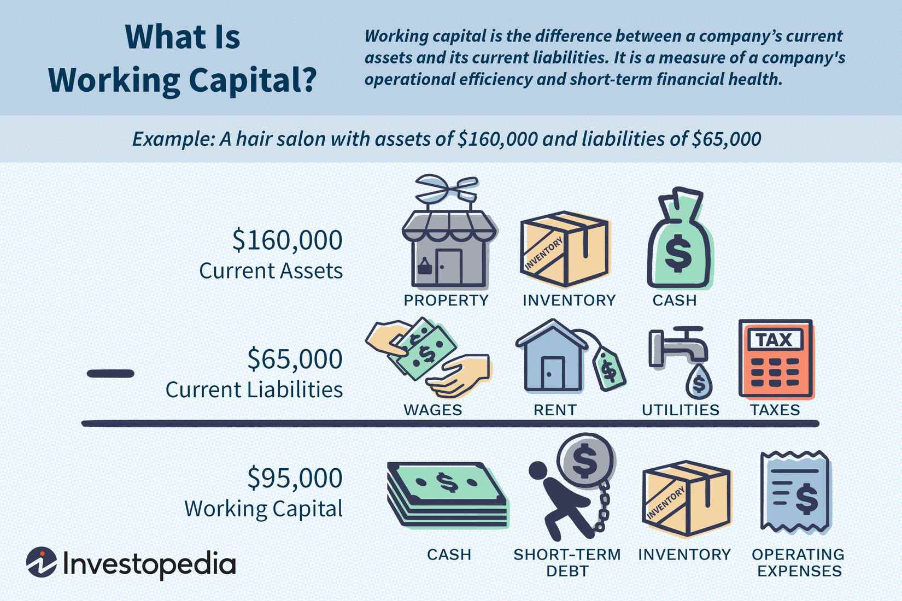

In today's complex financial landscape, comprehending the nuances of various financial mechanisms is essential for effective management and decision-making. This article focuses on four critical areas: financial adjustments, transfer pricing, working capital, and algorithmic trading. Each of these elements plays a significant role in modern business operations and impacts how organizations structure their financial strategies.

Financial adjustments involve meticulous modifications to financial statements, ensuring they accurately represent the company's financial position. These adjustments are fundamental for assessing asset values, adhering to accounting standards, and enhancing transparency, which is vital for stakeholder trust.

Transfer pricing, the practice of setting prices for transactions between related business entities within a multinational company, is crucial for appropriate income allocation across different jurisdictions. This concept seeks alignment with the arm's length standard, which aims to mirror the pricing that would occur between unrelated parties.

Working capital, indicative of a company's short-term financial health, showcases its capability to meet immediate obligations. It is intricately linked with transfer pricing, as adjustments to working capital are often required to ensure comparability among subsidiaries and maintain market-aligned pricing.

Algorithmic trading, a transformative force in financial markets, employs sophisticated algorithms to execute trades with exceptional speed and volume, frequently surpassing human capabilities. This technology influences market liquidity, volatility, and trading efficiency, integrating artificial intelligence to refine strategies further and provide competitive advantages.

Understanding these financial concepts not only aids in optimizing individual aspects of financial operations but also highlights their interconnectedness. Adjustments in financial reporting can impact transfer pricing decisions, subsequently affecting working capital management and influencing the effectiveness of algorithmic trading strategies. Mastery of these areas provides a comprehensive understanding essential for enhancing decision-making and securing competitive edges in financial management.

## Table of Contents

## Financial Adjustments: An Overview

Financial adjustments are critical modifications made to financial statements to accurately portray a company's financial position. These adjustments ensure the financial data reflects the organization's true condition, facilitating informed decision-making by management, investors, and other stakeholders. They are integral to the compliance with accounting standards, enhancing transparency, and providing a clear view of asset values.

One key reason for financial adjustments is error correction. Errors in financial statements may arise from data entry mistakes, misclassification of financial transactions, or inaccuracies in applying accounting principles. Regular audits and reviews can identify discrepancies, which are then rectified to align with the Generally Accepted Accounting Principles (GAAP) or International Financial Reporting Standards (IFRS).

Depreciation is another crucial financial adjustment. Depreciation accounts for the allocation of an asset's cost over its useful life, reflecting wear and tear. This adjustment ensures that financial statements convey the declining value of tangible assets such as machinery, vehicles, or buildings. For example, using the straight-line method, depreciation can be calculated as:

$$
\text{Depreciation Expense} = \frac{\text{Cost of Asset} - \text{Residual Value}}{\text{Useful Life of Asset}}
$$

Adjusting for inflation impacts is also a significant aspect. Inflation can distort the real value of financial figures, particularly in hyperinflationary environments. Financial adjustments for inflation involve restating financials to account for changes in purchasing power, ensuring stakeholders can compare financial data across different periods accurately.

In summary, financial adjustments are essential for presenting a true and fair view of an organization's financial status. They involve error correction, accounting for depreciation, and making necessary modifications for inflation. These adjustments are foundational for complying with accounting standards and providing stakeholders with transparent and reliable financial information.

## Understanding Transfer Pricing

Transfer pricing is a critical concept in international finance and taxation, as it involves setting prices for goods, services, and intellectual property exchanged between related business entities within a multinational corporation. The primary objective of transfer pricing is to allocate income among the various subsidiaries of a multinational company in a manner that aligns with the arm's length standard. This standard requires that the terms and conditions of intercompany transactions are consistent with those which would be agreed upon by unrelated parties under comparable circumstances. Compliance with the arm's length principle is crucial to ensure that multinational corporations are not engaging in profit shifting, which can lead to tax avoidance and the erosion of the tax base in different jurisdictions.

### Methods of Transfer Pricing

There are several methods for determining transfer prices, with the choice of method depending on the nature of the transaction and the availability of comparable data. Two commonly employed methods are the Comparable Uncontrolled Price (CUP) Method and the Transaction Net Margin Method (TNMM).

#### Comparable Uncontrolled Price (CUP) Method

The CUP method is considered the most direct and reliable approach when exact comparables are available. Under this method, the price charged for property or services transferred in a controlled transaction is compared to the price charged in a comparable uncontrolled transaction in comparable circumstances. If an identical or very similar product is sold under the same terms and conditions, the CUP method can be highly effective.

$$
\text{Transfer Price (CUP)} = \text{Price in Uncontrolled Transaction}
$$

Finding a precise comparable can be challenging, particularly for unique goods or services where an exact match does not exist. In such cases, adjustments may be necessary to account for differences in terms, characteristics, or economic circumstances.

#### Transaction Net Margin Method (TNMM)

The TNMM focuses on the net profit margin that a taxpayer realizes from a controlled transaction relative to an appropriate base like costs, sales, or assets. This method examines the net profit margin relative to an appropriate base that a taxpayer realises from a controlled transaction.

$$
\text{Net Profit Margin} = \frac{\text{Net Profit}}{\text{Sales}} \quad \text{or} \quad \frac{\text{Net Profit}}{\text{Assets}}
$$

Unlike the CUP method, TNMM is less sensitive to differences in product or service comparability, making it more widely applicable across industries where direct comparisons are challenging. However, it may still require careful consideration of functional comparability and risk allocations.

### Importance of Transfer Pricing Compliance

Compliance with transfer pricing regulations is mandated by tax authorities worldwide to prevent base erosion and profit shifting (BEPS). The Organisation for Economic Co-operation and Development (OECD) provides guidelines on transfer pricing, emphasizing accurate reflection of where value is created within a multinational corporation. Failure to adhere to these guidelines can result in significant financial penalties, double taxation, and reputational damage.

Through a combination of these methods, multinational corporations can ensure that their internal pricing strategies foster transparency, enhance shareholder confidence, and maintain good standing with regulatory bodies globally.

## The Role of Working Capital in Transfer Pricing

Working capital plays a critical role in the context of transfer pricing, as it is a key indicator of a company's short-term financial health and its ability to meet short-term obligations. In transfer pricing, adjustments to working capital are often necessary to ensure comparability between different entities within a multinational corporation. These adjustments are crucial because they help align the transfer prices with market norms, allowing for a fair and consistent allocation of income among subsidiaries.

Working capital is typically calculated using the formula:

$$
\text{Working Capital} = \text{Current Assets} - \text{Current Liabilities}
$$

Here, current assets might include cash, accounts receivable, and inventory, while current liabilities cover obligations such as accounts payable and other short-term debts. Differences in receivables, payables, and inventory levels between entities can lead to discrepancies that must be normalized for accurate transfer pricing.

For example, if one subsidiary maintains lower inventory levels due to just-in-time manufacturing processes, while another holds larger inventories to buffer against supply chain disruptions, these differences must be accounted for in the transfer pricing model. Adjustments can be made by considering factors such as the average inventory turnover ratio or the average collection and payment periods. Such adjustments aim to ensure that any variations due to operational efficiencies or business strategies do not distort the reported profitability of the entities involved.

In practical terms, these adjustments might involve using comparability analysis to benchmark working capital levels against similar firms in the industry. The Comparable Uncontrolled Price (CUP) method, for instance, might require adjustment of the comparable firms' working capital components to align with those of the associated entity being evaluated. This ensures that the differences in working capital do not lead to unfair tax assessments or incorrect income attributions.

By normalizing these financial metrics, businesses can prevent the manipulation of profits between subsidiaries, maintaining compliance with tax regulations and avoiding potential disputes with tax authorities. In the context of financial management, ensuring that working capital is appropriately adjusted in transfer pricing helps maintain operational efficiency and supports strategic financial decisions across the organization.

## Algorithmic Trading: Revolutionizing Markets

Algorithmic trading utilizes sophisticated algorithms to conduct trades with remarkable speed and [volume](/wiki/volume-trading-strategy). These algorithms are designed to analyze market data, identify trading opportunities, and execute transactions much faster than human traders. In the current financial markets, [algorithmic trading](/wiki/algorithmic-trading) plays a pivotal role by enhancing [liquidity](/wiki/liquidity-risk-premium), influencing [volatility](/wiki/volatility-trading-strategies), and improving trading efficiency.

One of the primary advantages of algorithmic trading is its capacity to execute trades at high speeds across various markets and securities simultaneously. This swift execution is achieved through pre-programmed instructions that react to market conditions in real-time, thereby mitigating the impact of human emotions on trading decisions and reducing transaction costs.

The impact of algorithmic trading on liquidity is substantial. By facilitating a higher frequency of trades and enabling market makers to quote tighter spreads, liquidity increases, allowing for more efficient price discovery. However, there are concerns about its effect on market volatility, especially during periods of extreme market conditions when algorithmic trading can exacerbate price swings due to the rapid execution of large volumes of trades.

Furthermore, the integration of [artificial intelligence](/wiki/ai-artificial-intelligence) (AI) in algorithmic trading is revolutionizing strategy development. AI algorithms can process massive datasets, adapt to new information, and refine trading strategies with minimal human intervention. These AI-driven systems utilize [machine learning](/wiki/machine-learning) techniques to continuously improve from historical data, enhancing decision-making processes and offering traders a substantial competitive advantage.

Risk management is another area where algorithmic trading, enhanced by AI, provides benefits. Advanced risk management tools are embedded in the algorithms to monitor and mitigate potential losses by adjusting trading strategies in response to market fluctuations. This dynamic approach to risk management not only protects trader portfolios but also maintains market stability.

As a whole, algorithmic trading is transforming financial markets by leveraging technological advancements to optimize trading processes. Its influence on liquidity, volatility, and overall market efficiency highlights the critical role it plays in modern finance. With the ongoing integration of AI, the evolution of algorithmic trading promises further innovations, making it imperative for financial professionals to maintain an acute understanding of these technologies and their implications.

## Interconnectivity of Financial Concepts

Financial adjustments, transfer pricing, working capital, and algorithmic trading, while distinct in their functions, are closely interconnected within financial management. Adjustments made in financial reports are integral as they can alter the foundation upon which transfer pricing decisions are made. Accurate financial adjustments ensure that financial statements present a true representation of a company's financial situation, which is crucial for setting transfer prices that comply with regulatory standards and align with the arm's length principle. For instance, when tangible assets are re-evaluated or inflation impacts are accounted for, the asset values directly influence the transfer pricing strategies. Such influence could lead to recalibrated pricing between related parties, affecting how profit is allocated among subsidiaries and impacting corporate taxation.

Furthermore, transfer pricing decisions can have significant implications for a company's working capital management. Effective transfer pricing ensures that subsidiaries in different jurisdictions are accurately charged for goods and services, affecting their cash flow, inventory levels, and overall liquidity. Ensuring comparability in prices and income allocation aids in maintaining optimal working capital levels by balancing receivables and payables. Achieving equilibrium in working capital is fundamental for sustaining a company's operational efficiency and financial agility.

Algorithmic trading represents another layer of complexity and integration in financial management, reliant on a deep understanding of financial adjustments, transfer pricing, and working capital to optimize strategies. Algorithmic trading algorithms, often based on complex financial models, must account for changes in market behaviors influenced by corporate financial strategies, including those arising from transfer pricing adjustments. Algorithms that trade high volumes at high speed can benefit from insights into a company’s financial health, derived from accurate financial reporting and effective working capital management. These algorithms also depend heavily on understanding pricing structures and their implications for market performance. By leveraging a computed balance of working capital metrics, and pricing strategies in real-time, algorithmic trading can significantly enhance trading efficiency and profitability.

Overall, the synchronization across these areas is critical for the holistic financial management of modern enterprises. A comprehensive grasp of how adjustments in one area reverberate through others enables more robust financial strategy formulation and execution, ultimately contributing to a firm’s competitive edge and compliance with ever-evolving financial regulations.

## Conclusion

Understanding the intricacies of financial adjustments, transfer pricing, working capital, and algorithmic trading is crucial for professionals navigating today's financial landscape. These components collectively underpin a firm's financial robustness, ensuring not only its operational efficiency but also its alignment with regulatory standards. Financial adjustments provide a true representation of a company's financial position, aiding in accurate asset valuation and compliance with accounting standards. Transfer pricing strategies, on the other hand, are critical for multinationals, ensuring that intercompany transactions are evaluated fairly and align with global tax regulations.

Similarly, working capital management is vital for maintaining liquidity and operational stability, contributing directly to the smooth execution of transfer pricing adjustments. Algorithmic trading introduces an advanced layer of efficiency and precision in trading activities, affecting liquidity and market behavior.

As financial markets and regulations evolve, staying informed and adaptable in these areas offers a competitive edge. Financial professionals who master these domains can better optimize financial strategies, exploit new opportunities, and mitigate risks, thereby enhancing their organization's competitive standing in the marketplace. Ensuring a deep-seated knowledge and staying abreast of technological and regulatory advancements is essential for sustaining success in the financial sector.

## References & Further Reading

[1]: ["Transfer Pricing Guidelines for Multinational Enterprises and Tax Administrations"](https://www.oecd.org/en/publications/oecd-transfer-pricing-guidelines-for-multinational-enterprises-and-tax-administrations-2022_0e655865-en.html) by Organisation for Economic Co-operation and Development (OECD)

[2]: ["Transfer Pricing: Rules, Compliance, and Controversy"](https://www.amazon.com/TRANSFER-PRICING-RULES-COMPLIANCE-CONTROVERSY/dp/080805385X) by Marc M. Levey, Steven C. Wrappe, and David E. Jolliffe

[3]: ["Working Capital Management: Applications and Case Studies"](https://books.google.com/books/about/Working_Capital_Management.html?id=hJstBAAAQBAJ) by James Sagner

[4]: ["Algorithmic Trading: Winning Strategies and Their Rationale"](https://www.wiley.com/en-us/Algorithmic+Trading%3A+Winning+Strategies+and+Their+Rationale-p-9781118746912) by Ernie Chan

[5]: ["International Financial Statement Analysis"](https://www.amazon.com/International-Financial-Statement-Institute-Investment/dp/1119628059) by Thomas R. Robinson, Elaine Henry, Wendy L. Pirie, and Michael A. Broihahn