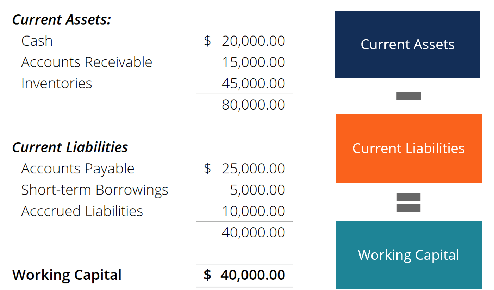

## Table of Contents

## What is working capital and why is it important for a business?

Working capital is the money a business has available to use for its day-to-day operations. It is calculated by subtracting a company's current liabilities from its current assets. This includes things like cash, inventory, and accounts receivable minus any short-term debts the business needs to pay.

Having enough working capital is important because it helps a business run smoothly. If a company doesn't have enough working capital, it might struggle to pay its bills on time, buy inventory, or handle unexpected expenses. Good working capital management can help a business grow and take advantage of new opportunities without running into financial trouble.

## How do you calculate working capital?

To calculate working capital, you take the total amount of a company's current assets and subtract its current liabilities. Current assets are things like cash, money that customers owe you (accounts receivable), and inventory. Current liabilities are the debts that a company needs to pay within a year, like bills or loans.

Knowing the working capital number helps a business understand if it has enough money to keep running day to day. If the working capital is positive, it means the company has more assets than liabilities, which is good. If it's negative, the company might have trouble paying its bills and needs to find more money or cut costs.

## What are the components of working capital?

The components of working capital are made up of current assets and current liabilities. Current assets include things like cash, which is money the business has on hand; accounts receivable, which is money that customers owe the business; and inventory, which are the products the business has ready to sell or use. These assets are important because they help the business keep running every day.

On the other hand, current liabilities are the debts the business needs to pay soon, usually within a year. This can include bills, like rent or utilities, and short-term loans. Keeping an eye on these liabilities is crucial because the business needs to make sure it can pay them without running out of money.

By balancing these two parts, current assets and current liabilities, a business can figure out its working capital. This balance helps the business know if it has enough money to cover its daily needs and handle any unexpected costs that might come up.

## Can you explain the difference between current assets and current liabilities?

Current assets are things that a business owns and can turn into cash within a year. This includes cash in the bank, money that customers owe the business (called accounts receivable), and the products the business has ready to sell (called inventory). These assets are important because they help the business pay for its daily needs, like buying more supplies or paying employees.

Current liabilities are the opposite. They are the bills and debts that a business needs to pay within a year. This can include things like rent, utility bills, and short-term loans. It's important for a business to keep track of these liabilities because it needs to make sure it has enough money to pay them on time.

By understanding the difference between current assets and current liabilities, a business can see if it has enough money to keep running smoothly. If the current assets are more than the current liabilities, the business has positive working capital, which is a good sign. If the liabilities are more than the assets, the business might struggle to pay its bills and could face financial trouble.

## What is a good working capital ratio and how is it calculated?

A good working capital ratio, also known as the current ratio, is usually between 1.5 and 2. This means that for every dollar of short-term debt, a business has 1.5 to 2 dollars of assets that can be turned into cash quickly. A ratio in this range shows that the business has enough money to pay its bills and handle unexpected costs, but it's not holding onto too much cash that could be used to grow the business.

To calculate the working capital ratio, you divide the total current assets by the total current liabilities. Current assets are things like cash, money customers owe you, and inventory. Current liabilities are the debts you need to pay within a year, like bills and short-term loans. For example, if a business has $100,000 in current assets and $50,000 in current liabilities, the working capital ratio would be $100,000 divided by $50,000, which equals 2. This means the business has twice as many current assets as current liabilities, which is a good sign.

## How does working capital management affect a company's financial health?

Working capital management is important for a company's financial health because it helps make sure the business has enough money to pay its bills and keep running smoothly. If a company manages its working capital well, it can pay its suppliers on time, keep enough inventory to meet customer demand, and handle unexpected costs without running out of cash. This can help the company grow and take advantage of new opportunities without worrying about money troubles.

On the other hand, if a company doesn't manage its working capital well, it might face problems. For example, if the company doesn't have enough cash to pay its bills, it could damage relationships with suppliers or even go out of business. Also, if the company holds onto too much cash or inventory, it might miss out on chances to invest in growth or pay down debts. Good working capital management helps a company find the right balance, so it can stay financially healthy and grow over time.

## What are some strategies to improve working capital?

One way to improve working capital is to speed up the collection of money from customers. This means getting paid faster for the products or services you sell. You can do this by offering discounts for early payments, using electronic invoices, or setting clear payment terms with your customers. When you get paid quicker, you have more cash on hand to use for your business needs.

Another strategy is to manage your inventory better. Too much inventory sitting around can tie up your money. By keeping just enough stock to meet customer demand, you can free up cash that would otherwise be stuck in products. You can also work on selling off old or slow-moving inventory at a discount to turn it into cash faster.

Lastly, you can look at your expenses and see if there are ways to cut costs or delay payments to suppliers without hurting your business relationships. Negotiating better payment terms with suppliers can give you more time to pay your bills, which helps keep more cash in your business. By managing your expenses carefully, you can improve your working capital and keep your business financially healthy.

## How does seasonality impact working capital requirements?

Seasonality can have a big impact on a business's working capital needs. During busy times of the year, like the holidays for a toy store, a business might need more working capital to buy extra inventory and hire more staff to meet the higher demand. This means the business needs to have enough cash on hand to cover these extra costs. If the business doesn't plan for this, it might run out of money when it needs it the most.

On the other hand, during slow times, like the off-season for a beach resort, a business might not need as much working capital. There's less demand for products or services, so the business can cut back on inventory and staff. But this can also mean less money coming in, so the business needs to be careful not to spend too much during the busy times, so it has enough cash to get through the slow periods. Good planning and managing cash flow can help a business handle the ups and downs of seasonal changes.

## What are the common challenges businesses face in managing working capital?

One common challenge businesses face in managing working capital is dealing with late payments from customers. When customers don't pay on time, it can tie up money that the business needs for other things, like buying inventory or paying bills. This can make it hard for the business to keep running smoothly and can even lead to cash flow problems. To manage this, businesses need to have good systems in place to collect payments quickly and maybe offer incentives for early payments.

Another challenge is managing inventory levels. If a business has too much inventory, it ties up money that could be used elsewhere. But if there's not enough inventory, the business might miss out on sales. Finding the right balance can be tricky, especially if demand changes a lot. Businesses need to keep a close eye on their inventory and adjust it based on what customers are buying.

Lastly, businesses often struggle with managing their expenses and debts. Paying suppliers on time is important for maintaining good relationships, but if the business pays too early, it might run out of cash. On the other hand, if payments are delayed too long, it can harm these relationships. Also, managing short-term debts like loans can be challenging, as the business needs to make sure it has enough money to cover these debts without hurting its cash flow. Good planning and communication with suppliers and lenders can help businesses navigate these challenges.

## How can advanced analytics and technology help in optimizing working capital?

Advanced analytics and technology can help businesses optimize their working capital by giving them better insights into their cash flow and operations. For example, using data analytics, a business can predict when customers are likely to pay their bills. This helps the business plan better and make sure they have enough money to cover their costs. Also, technology like automated invoicing systems can speed up the process of sending out bills and collecting payments, which means the business gets paid faster and has more cash on hand.

Another way technology helps is by improving inventory management. With advanced analytics, a business can look at sales data to figure out how much inventory they need to keep on hand. This helps them avoid having too much stock, which ties up money, or too little, which can lead to missed sales. Technology can also help businesses track their expenses and manage their debts better. For example, software can help a business see where they're spending too much and find ways to cut costs, or it can help them manage their loan payments so they don't run out of cash. By using these tools, businesses can keep their working capital in good shape and run more efficiently.

## What are the implications of negative working capital and how can it be addressed?

Negative working capital means a business has more short-term debts than assets it can quickly turn into cash. This can be a big problem because it might not have enough money to pay its bills on time. If this happens, the business could struggle to buy the things it needs, pay its employees, or even keep the lights on. It can also damage relationships with suppliers who might stop doing business with the company if they don't get paid. In the worst case, negative working capital can lead to the business going bankrupt if it can't find a way to get more cash.

To fix negative working capital, a business needs to find ways to get more money coming in or cut down on its debts. One way to do this is by speeding up how quickly it collects money from customers. This could mean offering discounts for early payments or using technology to send out invoices faster. Another way is to manage inventory better, so the business isn't holding onto too much stock that ties up money. The business can also talk to its suppliers about getting better payment terms, so it has more time to pay its bills. By taking these steps, a business can turn its working capital around and get back on track financially.

## How do different industries vary in their working capital needs and management practices?

Different industries have different needs for working capital because of how they operate. For example, a retail business like a clothing store needs a lot of working capital to buy inventory before the busy shopping season. They have to pay for clothes and other products before they sell them, so they need enough cash to cover these costs until customers start buying. On the other hand, a service business like a consulting firm might not need as much working capital. They don't have to buy a lot of inventory, and they usually get paid soon after they do the work, so their cash flow is more predictable.

The way industries manage their working capital can also be different. In the manufacturing industry, companies need to carefully manage their inventory and raw materials because it can take a long time to turn these into finished products that can be sold. They might use just-in-time inventory systems to make sure they only have what they need, which helps keep their working capital in good shape. In contrast, a tech company might focus more on managing its accounts receivable, making sure they get paid quickly for the software or services they provide. By understanding these differences, businesses can use the best strategies for their industry to keep their working capital healthy.

## What is Working Capital Management?

Working capital is the lifeblood of any business, ensuring operations run smoothly on a daily basis. It is defined as the difference between a company’s current assets and current liabilities, and this measure of short-term financial health is crucial for a company's day-to-day functioning and its ability to meet expenses and obligations.

Efficient working capital management ensures liquidity, which is the ability of a business to meet its short-term obligations without running into financial distress. This involves crafting strategies for managing inventory, accounts receivable, and accounts payable effectively.

Inventory management involves maintaining an optimal stock level to prevent overstocking or stockouts. This can be achieved by adopting just-in-time (JIT) inventory systems, which reduce the holding costs and improve cash flow. For example, companies can employ forecasting techniques to predict demand and adjust their inventory levels accordingly.

Managing accounts receivable is another critical strategy. This includes setting clear credit policies and terms for customers, and implementing efficient collection processes. For instance, offering discounts for early payments or using electronic invoicing can accelerate the collection process, thus improving cash inflow.

On the other hand, managing accounts payable involves negotiating favorable terms with suppliers, such as extended payment terms or bulk purchase discounts, which can enhance a company’s leverage and prolong liquidity. It is essential to balance payable timelines to optimize cash flow without compromising supplier relationships.

In addition to these strategies, businesses need to maintain sufficient working capital to withstand economic cycles. During downturns, having an adequate working capital cushion allows businesses to continue operations without resorting to expensive short-term borrowing.

Continuous monitoring of working capital is vital for maintaining financial health. Businesses often use the working capital ratio, also known as the current ratio, which is calculated as:

$$
\text{Current Ratio} = \frac{\text{Current Assets}}{\text{Current Liabilities}}
$$

A ratio above 1 indicates that a company has more assets than liabilities, signifying a buffer to cover short-term obligations. However, a very high ratio might also indicate inefficient use of assets or excessive inventory.

Python can be used to automate and optimize parts of this process. For example, a simple Python script can be developed to monitor working capital metrics and generate alerts when ratios fall below a predetermined threshold. Here is a basic example:

```python
def calculate_current_ratio(current_assets, current_liabilities):
    return current_assets / current_liabilities

current_assets = 500000  # Example value
current_liabilities = 300000  # Example value

if calculate_current_ratio(current_assets, current_liabilities) < 1:
    print("Warning: Current ratio is below 1, indicating potential liquidity issues.")
else:
    print("Current ratio is healthy.")
```

Effective working capital management not only supports operational efficiency but also positions businesses to seize growth opportunities and manage risks effectively, thereby contributing to long-term financial stability.

## References & Further Reading

[1]: Bergstra, J., Bardenet, R., Bengio, Y., & Kégl, B. (2011). ["Algorithms for Hyper-Parameter Optimization."](https://dl.acm.org/doi/10.5555/2986459.2986743) Advances in Neural Information Processing Systems 24.

[2]: ["Advances in Financial Machine Learning"](https://www.amazon.com/Advances-Financial-Machine-Learning-Marcos/dp/1119482089) by Marcos Lopez de Prado

[3]: ["Evidence-Based Technical Analysis: Applying the Scientific Method and Statistical Inference to Trading Signals"](https://www.amazon.com/Evidence-Based-Technical-Analysis-Scientific-Statistical/dp/0470008741) by David Aronson

[4]: ["Machine Learning for Algorithmic Trading"](https://github.com/stefan-jansen/machine-learning-for-trading) by Stefan Jansen

[5]: ["Quantitative Trading: How to Build Your Own Algorithmic Trading Business"](https://www.amazon.com/Quantitative-Trading-Build-Algorithmic-Business/dp/1119800064) by Ernest P. Chan