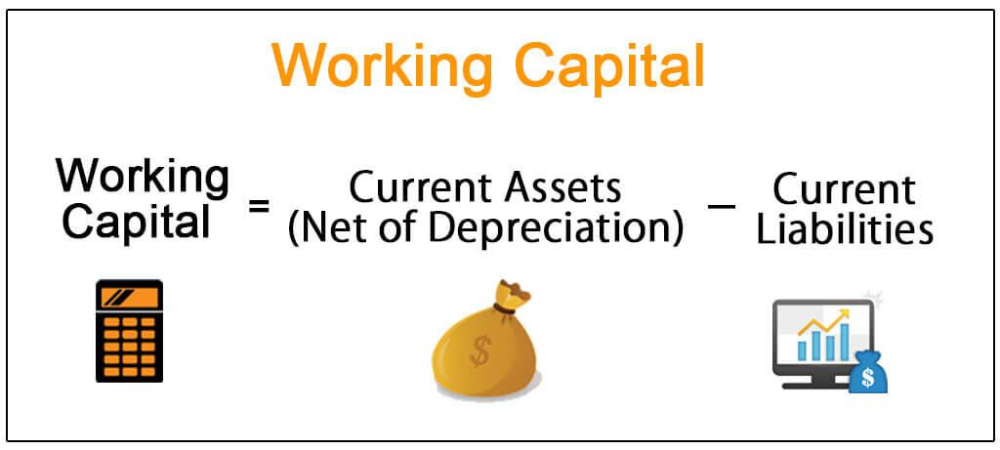

In the rapidly evolving world of business finance, mastering financial management is crucial for sustaining growth and achieving stability. Financial management involves the strategic planning, organizing, directing, and controlling of financial undertakings within an organization. It extends to the application of management principles to the financial assets of these entities, playing a pivotal role in ensuring that resources are used optimally to support long-term business objectives.

Working capital management is a fundamental aspect of financial management, essential for the seamless operation of any business. It involves the management of a firm's short-term assets and liabilities, ensuring that a business has sufficient cash flow to meet its short-term obligations and operational expenses. Proper working capital management keeps a business financially solvent and can significantly affect overall profitability.



The rise of technology in recent years has brought about significant shifts in financial management practices, among which algorithmic trading, or algo trading, has emerged as a prominent trend. Algorithmic trading uses complex algorithms to automate and optimize trading decisions. This technology allows businesses to engage with financial markets in real-time and execute trades at speeds unimaginable in the past, minimizing human error and maximizing efficiency.

Understanding the interplay between effective financial management, working capital optimization, and the strategic implementation of algo trading can propel a business towards enhanced performance and competitive edges in the marketplace. This comprehensive approach equips businesses with the tools to not only meet immediate financial needs but also anticipate future opportunities and challenges.

This article will explore these key areas in business finance and offer insights and strategies for effective management, ensuring that businesses can adapt and thrive in today's dynamic and technology-driven financial landscape.

## Table of Contents

## Understanding Business Finance

Business finance is a fundamental element in the landscape of corporate success, encompassing the processes of acquiring and managing financial resources. A comprehensive grasp of business finance equips enterprises with the ability to strategize effectively and achieve sustainable growth. This financial competence lies at the heart of effective management and operational stability.

Financial management is integral to the efficient utilization of resources. It involves meticulous planning and control mechanisms which ensure that a company operates within its financial limits while pursuing its objectives. The key components of financial management include budgeting, forecasting, and the analysis of financial performance. Budgeting allows organizations to plan for future expenditures and cash flows, laying the groundwork for sound financial decision-making. Forecasting provides insight into future market conditions and company performance, enabling businesses to prepare and adjust strategies accordingly.

Analyzing financial performance is crucial for identifying trends, assessing the viability of projects, and evaluating the overall health of an enterprise. Techniques such as ratio analysis play a vital role in this process, allowing businesses to compare their financial metrics against industry standards or historical data. Commonly used ratios include the current ratio, which evaluates [liquidity](/wiki/liquidity-risk-premium) by comparing current assets with current liabilities, and the return on investment (ROI), which measures the profitability of an investment.

Good financial management extends its impact beyond immediate operational efficiency by supporting the long-term strategic goals and stability of a business. This is achieved through the development and execution of financial strategies that align with the company's vision for future growth and sustainability. Such strategies often involve investment planning, capital structure optimization, and risk management. 

By maintaining a balanced approach to financial management, businesses can ensure they are well-positioned to adapt to changing economic conditions and seize opportunities for innovation and expansion. In conclusion, mastering business finance is of paramount importance for organizations aiming to achieve resilience and prosperity in an increasingly competitive environment.

## The Role of Financial Management

Financial management plays a pivotal role in guiding organizational decision-making and resource allocation. By overseeing balance sheets, income statements, and cash flow, financial managers ensure that businesses maintain financial stability and transparency. Effective financial management is central to identifying, assessing, and mitigating potential risks, thereby maximizing returns on investment. This strategic oversight provides a foundation for businesses to invest in innovation and growth, fostering a competitive edge in the market.

Financial managers are tasked with the challenging role of balancing short-term operational needs with the business's long-term strategic objectives. This requires a comprehensive understanding of the company's financial health, including its liquidity and solvency positions. The balance sheet provides insights into the company's assets, liabilities, and equity, allowing managers to evaluate the company’s net worth at a given point in time. Meanwhile, income statements offer a view of the company's profitability over a specific period, highlighting revenue generation and expense management.

Cash flow management is another critical component of financial management, emphasizing the timing and magnitude of cash inflows and outflows. By ensuring adequate cash flow, financial managers help businesses meet their immediate obligations and invest in opportunities that promise significant returns. Effective cash flow management also reduces the reliance on external financing, thereby lowering interest costs and enhancing profitability.

Investment decisions, another facet of financial management, demand a thorough analysis of potential projects or acquisitions. Managers often utilize techniques such as net present value (NPV) and internal rate of return (IRR) to gauge the viability of investments. The goal is to allocate resources efficiently to projects that align with the company's strategic goals and yield the highest returns on investment.

Ultimately, financial managers serve as navigators, steering their organizations through the complexities of the financial landscape. They must continuously analyze financial data, forecast future trends, and adapt strategies to ensure sustainable growth and stability. As businesses face evolving market dynamics, the role of financial management becomes increasingly integral to achieving long-term success.

## Working Capital Management

Working capital is the lifeblood of any business, ensuring operations run smoothly on a daily basis. It is defined as the difference between a company’s current assets and current liabilities, and this measure of short-term financial health is crucial for a company's day-to-day functioning and its ability to meet expenses and obligations.

Efficient working capital management ensures liquidity, which is the ability of a business to meet its short-term obligations without running into financial distress. This involves crafting strategies for managing inventory, accounts receivable, and accounts payable effectively.

Inventory management involves maintaining an optimal stock level to prevent overstocking or stockouts. This can be achieved by adopting just-in-time (JIT) inventory systems, which reduce the holding costs and improve cash flow. For example, companies can employ forecasting techniques to predict demand and adjust their inventory levels accordingly.

Managing accounts receivable is another critical strategy. This includes setting clear credit policies and terms for customers, and implementing efficient collection processes. For instance, offering discounts for early payments or using electronic invoicing can accelerate the collection process, thus improving cash inflow.

On the other hand, managing accounts payable involves negotiating favorable terms with suppliers, such as extended payment terms or bulk purchase discounts, which can enhance a company’s leverage and prolong liquidity. It is essential to balance payable timelines to optimize cash flow without compromising supplier relationships.

In addition to these strategies, businesses need to maintain sufficient working capital to withstand economic cycles. During downturns, having an adequate working capital cushion allows businesses to continue operations without resorting to expensive short-term borrowing.

Continuous monitoring of working capital is vital for maintaining financial health. Businesses often use the working capital ratio, also known as the current ratio, which is calculated as:

$$
\text{Current Ratio} = \frac{\text{Current Assets}}{\text{Current Liabilities}}
$$

A ratio above 1 indicates that a company has more assets than liabilities, signifying a buffer to cover short-term obligations. However, a very high ratio might also indicate inefficient use of assets or excessive inventory.

Python can be used to automate and optimize parts of this process. For example, a simple Python script can be developed to monitor working capital metrics and generate alerts when ratios fall below a predetermined threshold. Here is a basic example:

```python
def calculate_current_ratio(current_assets, current_liabilities):
    return current_assets / current_liabilities

current_assets = 500000  # Example value
current_liabilities = 300000  # Example value

if calculate_current_ratio(current_assets, current_liabilities) < 1:
    print("Warning: Current ratio is below 1, indicating potential liquidity issues.")
else:
    print("Current ratio is healthy.")
```

Effective working capital management not only supports operational efficiency but also positions businesses to seize growth opportunities and manage risks effectively, thereby contributing to long-term financial stability.

## The Impact of Algo Trading on Business Finance

Algorithmic trading, commonly known as algo trading, leverages technology to automate trading decisions using pre-defined criteria. This innovation has revolutionized financial strategies by providing improved speed, accuracy, and the ability to handle complex computations. As financial markets become increasingly sophisticated, businesses turn to algorithmic systems for real-time market analysis and efficient transaction execution.

Algo trading introduces a new dimension to financial strategies by integrating advanced data analytics and [machine learning](/wiki/machine-learning) algorithms. These systems enable businesses to assess vast datasets, identify trends, and make informed trading decisions. For example, portfolio optimization, a task that traditionally required extensive manual calculations, can be significantly enhanced through algorithms that can quickly process and analyze market variables. Algorithms can reduce human error by consistently executing trades based on data-driven signals, thereby minimizing emotional or irrational decision-making.

Algorithmic systems also offer improvements in portfolio management. By automating tasks such as asset allocation, hedging, and [arbitrage](/wiki/arbitrage), algo trading ensures that portfolios are balanced in accordance with specified risk profiles and market conditions. This is achieved by employing strategies such as mean-reversion or [momentum](/wiki/momentum)-based trading, which require rapid and precise execution that only automated systems can reliably deliver.

To illustrate, consider a simple moving average crossover strategy, where trades are executed based on the positions of short-term and long-term moving averages:

```python
def moving_average_strategy(prices, short_window, long_window):
    short_mavg = prices.rolling(window=short_window).mean()
    long_mavg = prices.rolling(window=long_window).mean()

    signals = pd.DataFrame(index=prices.index)
    signals['signal'] = 0.0
    signals['short_mavg'] = short_mavg
    signals['long_mavg'] = long_mavg
    signals['signal'][short_window:] = np.where(signals['short_mavg'][short_window:] > signals['long_mavg'][short_window:], 1.0, 0.0)
    signals['position'] = signals['signal'].diff()

    return signals
```

This code snippet illustrates how [algorithmic trading](/wiki/algorithmic-trading) can be implemented using Python to generate buy and sell signals based on moving averages.

Understanding the influence of algo trading on financial markets is vital for business strategists. The widespread adoption of these technologies has increased market liquidity and improved price discovery mechanisms. However, it also introduces challenges, such as increased market [volatility](/wiki/volatility-trading-strategies) and the potential for systemic risks in the form of flash crashes—rapid market declines and recoveries caused by malfunctioning algorithms.

Moreover, algo trading has implications for market engagement, as it reduces the time between identifying an opportunity and executing a trade. This capacity for rapid response empowers businesses to capitalize on transient market conditions, providing a competitive edge in global markets.

In conclusion, algo trading profoundly impacts business finance by enhancing market engagement and strategy formulation. Its capability to process large volumes of data with speed and precision not only optimizes trading performance but also reshapes portfolio management and risk assessment frameworks. Consequently, a thorough understanding of algo trading is integral for financial professionals aiming to navigate and succeed in contemporary financial markets.

## Integrating Financial Management with Algo Trading

Integrating financial management with algorithmic (algo) trading presents an opportunity to enhance decision-making processes within businesses by leveraging technology. Financial managers can utilize algorithms to increase the accuracy and speed of trading decisions, thereby potentially improving financial outcomes. This integration allows businesses to gain deeper market insights and refine financial forecasting, making it a powerful tool in strategic planning.

Algorithms can process large volumes of data quickly, providing a real-time analysis of financial markets. This capability enables financial managers to respond swiftly to market changes, optimizing asset allocation and trading strategies. For instance, machine learning algorithms can identify patterns and trends that might be invisible to human analysts, offering a competitive edge.

The integration of financial management and algo trading requires a blend of financial acumen and technological expertise. Financial managers must possess a comprehension of algorithmic models and their practical applications within financial markets. Additionally, a strong grasp of data analytics platforms and programming languages such as Python can be invaluable. For instance, Python libraries like `Pandas` for data manipulation and `SciPy` for statistical calculations can be used to develop and implement trading algorithms.

```python
import pandas as pd
import numpy as np

# Example of simple moving average strategy
def simple_moving_average(prices, window):
    """Compute simple moving average for a given period."""
    return prices.rolling(window=window).mean()

# Generate random stock prices data
np.random.seed(0)
dates = pd.date_range('20230101', periods=10)
prices = pd.Series(np.random.randn(10), index=dates)

# Calculate the 3-day moving average
sma = simple_moving_average(prices, window=3)
```

Businesses must also be cognizant of the regulatory and ethical considerations that accompany algo trading. With the increased use of automated trading systems, the potential for market manipulation and other unethical practices rises, necessitating strict compliance with financial regulations. Moreover, transparency in algorithmic operations and decision-making processes is crucial to maintain trust with stakeholders and regulatory bodies.

In summary, merging financial management with algo trading can optimize decision-making and strengthen a firm's market position. However, it equally demands a careful navigation of technological and regulatory landscapes to ensure ethical and effective implementation.

## Conclusion

The convergence of financial management, working capital, and algo trading is reshaping the landscape for businesses seeking growth and sustainability. By effectively integrating these elements, companies can unlock significant competitive advantages. Financial management ensures optimal resource allocation and strategic decision-making, while efficient working capital management guarantees liquidity and operational efficacy. Meanwhile, algo trading adds a technological dimension, providing sophisticated tools for market analysis and execution.

Businesses that successfully harness these facets stand to benefit immensely. The integration of traditional financial strategies with modern technologies like algo trading necessitates a continuous learning process and adaptive strategies. As markets evolve, so too must the methods businesses employ to manage and optimize their financial resources.

Future success in this area depends critically on embracing both established and emerging financial practices. This integration requires both financial and technical expertise, creating a need for a workforce skilled in both domains. Moreover, the adoption of these innovations should be guided by regulatory frameworks and ethical considerations to mitigate risks and ensure compliance.

Developing a robust framework that seamlessly blends these financial components is essential for long-term sustainability. This structured approach supports not only operational stability but also positions businesses to capitalize on market opportunities. By fostering an environment of continuous adaptation and learning, enterprises can ensure their growth within an increasingly complex financial landscape. 

In conclusion, the strategic convergence of financial management, working capital, and algo trading offers a pathway to enhanced business efficacy. Companies that adeptly navigate this integration are better equipped to thrive amid the demands and challenges of modern financial markets.

## References & Further Reading

[1]: Bergstra, J., Bardenet, R., Bengio, Y., & Kégl, B. (2011). ["Algorithms for Hyper-Parameter Optimization."](https://dl.acm.org/doi/10.5555/2986459.2986743) Advances in Neural Information Processing Systems 24.

[2]: ["Advances in Financial Machine Learning"](https://www.amazon.com/Advances-Financial-Machine-Learning-Marcos/dp/1119482089) by Marcos Lopez de Prado

[3]: ["Evidence-Based Technical Analysis: Applying the Scientific Method and Statistical Inference to Trading Signals"](https://www.amazon.com/Evidence-Based-Technical-Analysis-Scientific-Statistical/dp/0470008741) by David Aronson

[4]: ["Machine Learning for Algorithmic Trading"](https://github.com/stefan-jansen/machine-learning-for-trading) by Stefan Jansen

[5]: ["Quantitative Trading: How to Build Your Own Algorithmic Trading Business"](https://www.amazon.com/Quantitative-Trading-Build-Algorithmic-Business/dp/1119800064) by Ernest P. Chan