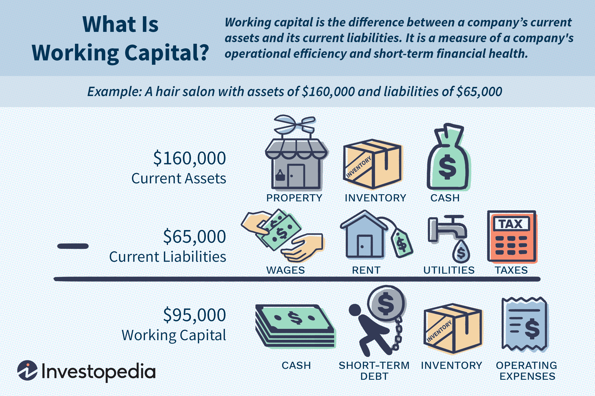

Working capital is the difference between a company's current assets and current liabilities. It is a fundamental aspect of financial management as it represents the capital necessary for daily operations, ensuring that a company can meet its short-term obligations and sustain operational liquidity. A robust working capital position is vital for maintaining business continuity and operational efficiency, as it enables companies to manage cash flow, invest in opportunities, and buffer against unexpected financial challenges.

Efficient management of working capital is crucial for businesses because it directly affects their liquidity, operational capacity, and profitability. Proper management ensures that the company can operate smoothly without financial disruptions, minimizes costs associated with borrowing, and optimizes returns on excess capital. By balancing current assets and liabilities, businesses can minimize the risk of insolvency and enhance their financial stability.



Algorithmic trading, a practice gaining prominence in financial markets, involves using pre-defined and automated algorithms to execute trades at optimal speeds and accuracy, surpassing traditional trading methods. This technology leverages complex mathematical models and software to make trade decisions, capitalizing on market conditions and price discrepancies in seconds. Algorithmic trading's importance has grown due to its potential for reduced trading costs, minimized human errors, and enhanced execution efficiency.

This article will explore the intricate relationship between working capital management and algorithmic trading, examining how they intersect and influence each other. It will discuss key facets of working capital, including its limitations and financial components, such as inventory management, accounts receivable, and accounts payable. Additionally, the paper will consider how these financial components, when managed effectively, can support the dynamics of algorithmic trading. Furthermore, the role of algorithmic trading in addressing limitations of working capital and offering dynamic solutions for liquidity management will be evaluated.

A comprehensive understanding of working capital and algorithmic trading's interdependencies is paramount for improving financial performance. Learning how these elements work together can empower managers to optimize financial strategies, enhance competitiveness, and better position companies for sustainable growth in the fast-evolving financial landscape.

## Table of Contents

## Understanding Working Capital

Working capital is a critical element in financial management, representing the difference between a company's current assets and current liabilities. It is essential for maintaining a company's operational liquidity, enabling it to meet its short-term obligations and continue its day-to-day operations without financial strain. The efficient management of working capital ensures that a company can smoothly conduct its business activities, pay its debts, and invest in resources necessary for growth.

### Components of Working Capital

1. **Current Assets**: These are assets that a company expects to convert into cash or consume within a year or a standard business cycle, whichever is longer. Typical current assets include:
   - **Cash and Cash Equivalents**: Liquid assets readily available to meet immediate expenses.
   - **Accounts Receivable**: Money owed to the company by its customers for goods or services delivered on credit. Effective management of accounts receivable is crucial to ensure timely cash inflows.
   - **Inventory**: Products or raw materials held by the company for the purpose of sale or production. Maintaining optimal inventory levels is vital to avoid excess holding costs and stockouts.

2. **Current Liabilities**: These are liabilities that a company expects to settle within the same one-year period or business cycle. Common current liabilities include:
   - **Accounts Payable**: Obligations to pay suppliers for goods or services received. Managing payment terms with suppliers can optimize cash outflows.
   - **Short-term Debt**: Loans or other borrowings that are due within a year. This can include lines of credit or notes payable.

### Role in Ensuring Operational Liquidity

Working capital plays a crucial role in a company's operational [liquidity](/wiki/liquidity-risk-premium), which refers to its ability to cover short-term expenses and debts. Adequate working capital ensures that a company can maintain its operations without disruption. A positive working capital indicates more current assets than current liabilities, which implies liquidity and financial health.

Conversely, insufficient working capital can lead to financial strain, hindering a company's ability to meet its short-term obligations, and potentially leading to insolvency. This situation can arise from poor management of current assets and liabilities, inefficient inventory control, or extended accounts receivable periods.

### Impact on Business Operations and Financial Health

Working capital affects not only day-to-day operations but also a company's financial health. Adequate working capital allows a business to invest in growth opportunities, reduce financing costs, and improve creditworthiness. For example, a company with positive working capital is more likely to secure favorable loan terms from lenders due to reduced financial risk.

### Mathematical Perspective

The basic formula to calculate working capital is:

$$
\text{Working Capital} = \text{Current Assets} - \text{Current Liabilities}
$$

Maintaining a stable working capital ratio is also critical:

$$
\text{Working Capital Ratio} = \frac{\text{Current Assets}}{\text{Current Liabilities}}
$$

A ratio above 1 indicates sufficient liquidity, while a ratio below 1 could be a warning signal of financial distress.

In summary, understanding and managing working capital is fundamental for sustaining a company's liquidity, operational efficiency, and overall financial stability. By optimizing its components, companies can enhance their ability to meet short-term obligations and maintain a competitive edge in their respective markets.

## Limitations of Working Capital

Working capital, though critical for maintaining a company's operational liquidity, is not without its challenges. Effective management of working capital components is essential to mitigate these limitations and ensure the robust financial health of an organization.

One of the primary challenges faced in managing working capital is the impact of insufficient capital on business operations. When a company lacks adequate working capital, it may struggle to meet its short-term liabilities, such as supplier payments, employee salaries, and other operational expenses. This shortage can lead to operational disruptions, delays in production, and damaged supplier and employee relationships. Ultimately, insufficient working capital can impede a company's growth and its ability to take advantage of market opportunities.

Conversely, holding too much working capital also poses risks, primarily through opportunity costs. Excessive working capital indicates that a company is holding more short-term assets than necessary, potentially resulting in underutilization of resources. The funds tied up in excess inventory or high cash reserves could otherwise be used for investment in growth opportunities, research and development, or expanding market presence. Therefore, companies must strike a balance between maintaining sufficient working capital and allocating funds to areas that generate higher returns.

External factors such as economic fluctuations also play a significant role in influencing working capital management. During economic downturns, companies may face decreased sales and longer collection periods, leading to cash flow challenges. Similarly, inflation can increase costs and reduce purchasing power, impacting the company's ability to manage inventories and accounts payable efficiently. Companies must be adaptable, implementing flexible working capital strategies to respond to these external conditions and maintain liquidity.

In summary, while working capital is indispensable for a company's smooth functioning, its management requires careful attention to balance liquidity with investment opportunities. A strategic approach to managing working capital helps firms navigate economic cycles, ensure operational efficiency, and maintain financial stability.

## Financial Components of Working Capital

Working capital is a critical aspect of financial management that ensures a company can meet its short-term obligations and operational needs. It is composed of various financial components, primarily current assets and current liabilities. The primary constituents of these include inventory, accounts receivable, and accounts payable, each playing a significant role in determining a company's liquidity and operational efficiency.

**Inventory Management**

Inventory represents the goods and materials a company holds with the intent to sell or use in production. Effective inventory management ensures that a company maintains the optimal inventory level to meet customer demand without overstocking or understocking, both of which can lead to higher costs or lost sales. Keeping this balance is crucial for operational efficiency.

To optimize inventory management, companies can adopt strategies such as Just-In-Time (JIT) inventory systems, which align inventory orders with production schedules and customer demand, thereby reducing carrying costs. Another approach is employing inventory management software, which uses real-time data to predict demand accurately, track stock levels, and automate reorder processes.

**Accounts Receivable**

Accounts receivable reflect the credit a company extends to its customers, and efficient management ensures prompt collection of outstanding invoices, thereby improving cash flow. Key strategies for optimizing accounts receivable include implementing strict credit policies to assess customer creditworthiness, offering early payment discounts as incentives for prompt payment, and employing robust invoicing practices that ensure clarity and timeliness.

Companies may also use accounts receivable aging reports to monitor outstanding invoices and identify overdue accounts. This proactive approach allows firms to address any collection issues promptly and maintain liquidity.

**Accounts Payable**

Accounts payable refer to a company’s obligations to pay off short-term debts to its suppliers. Effective management involves balancing the timing of payments to maintain liquidity while ensuring creditworthiness and strong supplier relationships. Strategies include negotiating favorable payment terms with suppliers and utilizing electronic payment systems for timely disbursement.

Companies should aim to extend payment periods without incurring penalties or damaging supplier relationships. Regular monitoring of payment schedules helps in aligning outflows with inflows, ensuring that cash reserves are optimized for other operational needs.

**Financial Ratios**

Financial ratios serve as vital tools in assessing the efficiency of working capital management. Two key ratios used are:

1. **Current Ratio**: This ratio, calculated as Current Assets ÷ Current Liabilities, measures a company’s ability to cover its short-term obligations with its short-term assets. A higher ratio indicates better liquidity, although excessively high values may suggest unused capital tied up in non-productive assets.

2. **Quick Ratio**: Similar to the current ratio but more stringent, it is defined as (Current Assets - Inventory) ÷ Current Liabilities. By excluding inventory, this ratio provides a clearer picture of a firm's liquidity by focusing on the most liquid assets.

Maintaining optimal levels in these financial components and balanced ratios ensures a company can meet its obligations and invest in growth opportunities, contributing to overall financial health and sustainability.

 to Algorithmic Trading

Algorithmic trading, often referred to as algo trading, is the process of executing orders in the financial markets using automated pre-defined instructions without human intervention. These instructions, or algorithms, can encompass a variety of parameters such as timing, price, and quantity, which allow for rapid and efficient trades. The primary function of [algorithmic trading](/wiki/algorithmic-trading) in stock markets is to facilitate high-speed and high-frequency trading, enabling participants to capitalize on even the smallest price fluctuations.

The benefits of using algorithms for trading activities are multifaceted. One significant advantage is speed; algorithms can execute trades in milliseconds, far surpassing the capabilities of human traders. This speed allows market participants to respond almost instantaneously to market movements, gaining a competitive edge. Additionally, algorithms enhance accuracy and consistency by eliminating human errors and emotions that often influence trading decisions. The deterministic nature of algorithms ensures that trades are executed under pre-defined conditions, upholding consistency in trading strategies.

Algorithmic trading differs significantly from traditional trading methods, which rely heavily on manual order placement by traders. Traditional trading is often slower and subject to the trader's subjective judgment and emotional biases, whereas algorithmic trading processes large volumes of orders with precision and minimal latency. The automation of trading strategies also allows market participants to exploit multiple trading opportunities simultaneously, something that manual trading cannot achieve efficiently.

There are several common strategies employed in algorithmic trading:

1. **Market Making**: This involves creating liquidity by simultaneously placing both buy and sell limit orders in a particular asset to earn the bid-ask spread.

2. **Arbitrage**: Exploiting price differentials of the same asset in different markets or forms, capitalizing on discrepancies before they are corrected.

3. **Trend Following**: Leveraging momentum indicators to determine the buying or selling signals based on the prevailing trends.

4. **Statistical Arbitrage**: Using statistical methods and models to identify inefficiencies and mispricings among financial instruments.

5. **Mean Reversion**: Based on the assumption that prices will revert to their mean, this strategy involves buying assets when prices are low and selling when prices are high relative to their historical averages.

In coding terms, implementing a basic trend-following strategy could look something like this in Python:

```python
import pandas as pd

def moving_average_strategy(data, short_window=40, long_window=100):
    signals = pd.DataFrame(index=data.index)
    signals['price'] = data['close']
    signals['short_mavg'] = data['close'].rolling(window=short_window, min_periods=1).mean()
    signals['long_mavg'] = data['close'].rolling(window=long_window, min_periods=1).mean()
    signals['signal'] = 0.0
    signals['signal'][short_window:] = np.where(signals['short_mavg'][short_window:] > signals['long_mavg'][short_window:], 1.0, 0.0)
    signals['positions'] = signals['signal'].diff()
    return signals

# Example usage
# data = pd.read_csv('historical_stock_prices.csv')
# signals = moving_average_strategy(data)
```

Algorithmic trading continues to revolutionize the landscape of financial markets with its efficiency, precision, and ability to handle complex trading strategies effortlessly, making it an indispensable tool for modern-[day trading](/wiki/day-trading-spy).

## Interplay Between Working Capital and Algorithmic Trading

Efficient working capital management is vital for supporting algorithmic trading activities, as it ensures the availability of liquid assets necessary for executing trades swiftly. Working capital, comprising current assets minus current liabilities, guarantees that a firm has sufficient resources to meet its short-term obligations and invest in trading opportunities. In the dynamic environment of algorithmic trading, the prompt availability of capital enables traders to take advantage of fleeting market inefficiencies, enhancing profitability and competitiveness.

Algorithmic trading algorithms, designed to execute pre-determined strategies at high speed, can be challenged by working capital limitations. Insufficient working capital may lead to suboptimal trading outcomes, as algorithms may be forced to bypass potentially profitable trades due to liquidity constraints. Furthermore, substantial fluctuations in variables affecting working capital, such as accounts receivable or inventory, can unpredictably restrict or free up financial resources, requiring algorithms to adjust dynamically. For instance, if accounts receivable turnover slows unexpectedly, the resultant reduced cash flow may impede the execution of intended trades.

Case studies have illustrated instances where working capital considerations influenced trading strategies. A notable example involved a trading firm that leveraged excess working capital to aggressively pursue [arbitrage](/wiki/arbitrage) opportunities. The firm strategically increased its inventory through acquired financial instruments, taking advantage of temporary discrepancies in pricing across markets. Conversely, another firm that maintained minimal working capital struggled during a market downturn due to its inability to cover margin calls, exemplifying the critical role of well-managed working capital in ensuring stable algorithm trading performance.

The potential of algorithmic trading in dynamically managing working capital needs can be expounded through adaptive capital allocation algorithms. These algorithms can optimize liquidity management by continuously assessing current market conditions and working capital status. For example, a Python-based algorithm might be employed to reallocate cash reserves and adjust trading positions in real time:

```python
def adjust_trading_positions(current_cash, market_conditions):
    risk_factor = assess_risk(market_conditions)
    if current_cash > threshold:
        allocate_cash_to_trades(current_cash, risk_factor)
    else:
        conserve_cash(rescale_trading_strategy(risk_factor))

adjust_trading_positions(current_cash, current_market_conditions)
```

In such scenarios, algorithmic trading does not solely rely on transactional execution but also plays a proactive role in optimizing financial resources. By enabling continual adjustments in response to liquidity shifts, algorithmic systems can mitigate risks associated with working capital fluctuations, ensuring smoother operation and sustained trading efficacy. This integration of real-time data analysis and capital management capabilities underscores the transformative potential of algorithmic trading in both enhancing trading performance and optimizing working capital utilization.

## Conclusion

In summarizing the key insights discussed on working capital, it is evident that efficient management of working capital is crucial for maintaining a business's operational liquidity and overall financial health. Working capital, composed of current assets and current liabilities, plays a pivotal role in ensuring that a company can meet its short-term obligations and continue its operations smoothly. However, managing it comes with challenges, such as the risks associated with holding too much or too little working capital and the influence of external economic factors.

Effective working capital management is advantageous for algorithmic trading by ensuring the necessary liquidity to capitalize on trading opportunities swiftly. Algorithmic trading, characterized by its ability to execute trades with high speed and accuracy, relies heavily on the available capital to function optimally. Insufficient working capital could restrict the execution of promising trades, while an excess might result in missed opportunity costs. Balancing working capital, therefore, is essential to maximize the benefits of algorithmic trading.

To overcome challenges in working capital management, continued investment in technology and research is paramount. Technological advancements can offer innovative solutions for real-time capital management, enabling businesses to adapt swiftly to market changes. Future developments in financial management will likely see an increased integration of algorithmic trading strategies aligned with robust working capital management. This synergy between sound financial management and cutting-edge trading technology has the potential to enhance business performance significantly, paving the way for a more dynamic and responsive financial landscape.

## References & Further Reading

[1]: ["Working Capital Management: Applications and Case Studies"](https://www.wiley.com/en-us/Working+Capital+Management%3A+Applications+and+Case+Studies-p-9781118933848) by James Sagner

[2]: Lo, A. W. & MacKinlay, A. C. (1999). ["A Non-Random Walk Down Wall Street"](https://www.jstor.org/stable/j.ctt7tccx). Princeton University Press.

[3]: ["Algorithmic Trading: Winning Strategies and Their Rationale"](https://www.wiley.com/en-us/Algorithmic+Trading%3A+Winning+Strategies+and+Their+Rationale-p-9781118460146) by Ernest P. Chan

[4]: Tirole, J. (2006). ["The Theory of Corporate Finance"](https://press.princeton.edu/books/hardcover/9780691125565/the-theory-of-corporate-finance). Princeton University Press.

[5]: Pinedo, M. & Verma, R. (eds) (1999). ["Operations Scheduling with Applications in Manufacturing and Services"](https://archive.org/details/operationsschedu0000chao) McGraw-Hill Series in Industrial Engineering and Management Science.