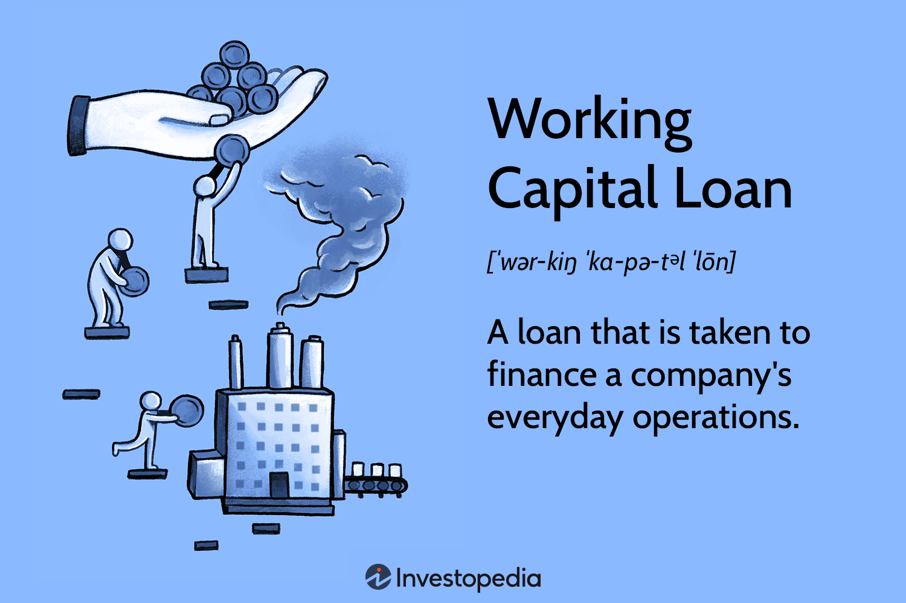

In today's dynamic financial landscape, effective financial management is crucial for businesses to thrive. This article explores the interconnected facets of financial management including working capital, banks, and algorithmic trading. Each of these elements plays a vital role in shaping modern financial strategies, influencing how businesses and financial institutions operate and compete in a global market.

Understanding how these components interplay is essential for enhancing financial efficiency and securing a competitive advantage. For instance, algorithmic trading, which utilizes complex algorithms to execute trades at high speed, has become increasingly influential in financial markets. This rise highlights a significant shift towards data-driven decision-making processes that can optimize trade execution and reduce human biases.



Simultaneously, the role of working capital in maintaining a company's operational liquidity is foundational for efficient financial management. Businesses need to effectively balance their current assets and liabilities to ensure they can meet short-term obligations and invest in immediate opportunities. Efficient working capital management ensures that a company is well-positioned to maintain smooth operations without relying excessively on external financing.

As the article unfolds, the focus will be on identifying the synergies between working capital management, banking services, and algorithmic trading. By examining these connections, we aim to uncover practical implications for both businesses and financial institutions. These insights can help inform more robust financial strategies that support sustainable growth and long-term success.

## Table of Contents

## Understanding Working Capital in Financial Management

Working capital is a critical indicator of a company's short-term financial health and operational efficiency, gauging its ability to cover immediate expenses and invest in opportunities without relying on new financing. At its core, working capital is the difference between a company's current assets and current liabilities. Mathematically, it can be expressed as:

$$
\text{Working Capital} = \text{Current Assets} - \text{Current Liabilities}
$$

Maintaining a healthy balance between these assets and liabilities ensures smooth business operations and financial stability. Current assets typically include cash reserves, inventories, accounts receivable, and other liquid assets that are expected to be converted to cash or consumed within a year. Conversely, current liabilities encompass all obligations that a company needs to settle within the same period, such as accounts payable, short-term debt, and other similar commitments.

Evaluating and managing working capital effectively allows businesses to navigate the financial demands of everyday operations. Companies that maintain substantial working capital can easily meet their short-term liabilities, thus reducing the risk of financial distress. Moreover, a well-managed working capital structure provides the flexibility to capitalize on immediate opportunities, such as acquiring essential raw materials at discounted prices or investing in initiatives that require swift action.

Several key elements contribute to effective working capital management:

1. **Cash Reserves:** Ensuring a sufficient level of cash reserves is vital for covering unforeseen expenses and leveraging business opportunities when they arise.

2. **Inventories:** Efficient inventory management reduces storage costs and minimizes the risk of obsolescence. Techniques such as Just-In-Time (JIT) inventory can enhance liquidity by aligning inventory levels closely with production schedules.

3. **Accounts Receivable:** By optimizing the collection process and reducing the accounts receivable turnover period, businesses can enhance cash flows and improve liquidity positions.

4. **Accounts Payable:** Negotiating favorable payment terms with suppliers can extend the period available before liabilities must be settled, thereby optimizing cash flows.

Understanding and actively managing these elements is crucial for financial managers tasked with ensuring operational efficiency and [liquidity](/wiki/liquidity-risk-premium). Through prudent working capital management, businesses can balance their short-term financial activities, enhance liquidity, and ultimately support their long-term strategic objectives.

## The Role of Banks in Managing Working Capital

Banks are integral to managing working capital by providing vital financial services that ensure businesses maintain liquidity and operational efficiency. Among these services, one of the most crucial is the provision of lines of credit and working capital loans. These instruments enable companies to address short-term liquidity issues, thereby allowing them to meet operational expenses and seize immediate opportunities without resorting to costly, long-term financing options.

Additionally, banks are pivotal in facilitating efficient transaction flows through payment processing and cash management services. These services ensure that businesses can conduct transactions smoothly, manage their receivables and payables effectively, and ultimately maintain adequate cash flow. Such mechanisms are essential for mitigating the risk of liquidity shortfalls and for optimizing the use of financial resources.

Unlike other sectors, banks operate with a unique working capital structure, as they do not typically hold traditional inventories. Instead, they manage deposits and loans as part of their strategy to balance their short-term financial positioning. This involves the careful management of the amount of money that is readily available for operations versus long-term investments to ensure sustainability and regulatory compliance.

A critical metric used by banks to appraise their financial health and manage working capital is the Net Interest Margin (NIM). NIM is defined as the difference between the interest income generated by banks and the amount of interest paid out to lenders, relative to the bank's interest-[earning](/wiki/earning-announcement) assets. Mathematically, NIM can be expressed as:

$$
\text{NIM} = \frac{\text{Interest Income} - \text{Interest Expense}}{\text{Average Earning Assets}}
$$

This metric provides insights into the profitability of a bank's lending activities by illustrating how well a bank is managing the difference between the interest it earns on loans and the interest it pays on its deposits. A higher NIM is generally indicative of a bank's efficiency in managing its capital and optimizing its loan-deposit spread.

In conclusion, by offering credit lines, facilitating cash management services, and using alternative metrics like NIM to adapt the concept of working capital, banks play a fundamental role in ensuring the liquidity and operational efficiency of businesses.

## Algorithmic Trading: Revolutionizing Financial Markets

Algorithmic trading leverages sophisticated algorithms to execute trades at rapid speeds with high precision based on real-time market data. This approach optimizes trade execution by minimizing human intervention, thereby reducing biases and enhancing market liquidity. Algorithms are adept at analyzing extensive datasets to identify trading opportunities, performing trade executions faster than any human trader could manage. The extensive adoption of [algorithmic trading](/wiki/algorithmic-trading) among financial institutions marks a substantial shift towards automated trading strategies, prioritizing data-driven decision-making.

The efficiency of algorithmic trading stems from its capability to process and react to market conditions in milliseconds, a critical [factor](/wiki/factor-investing) in high-frequency trading. Algorithms are designed to follow a set of predefined instructions for trading, which can include timing, price, quantity, or other mathematical models. One of the most common algorithms used is the "Mean Reversion" strategy, which is based on the notion that prices will eventually revert to their historical mean. 

For instance, consider a simple moving average crossover strategy, where a buy signal is generated when a short-term moving average crosses above a long-term moving average, and a sell signal when the opposite occurs. This can be implemented in Python as follows:

```python
import pandas as pd

def moving_average_crossover_strategy(data, short_window, long_window):
    data['Short_MA'] = data['Close'].rolling(window=short_window, min_periods=1).mean()
    data['Long_MA'] = data['Close'].rolling(window=long_window, min_periods=1).mean()

    data['Signal'] = 0
    data['Signal'][short_window:] = np.where(data['Short_MA'][short_window:] > data['Long_MA'][short_window:], 1, -1)

    data['Position'] = data['Signal'].shift()

    return data
```

Despite its numerous benefits, algorithmic trading necessitates a substantial technological infrastructure, including hardware capable of handling large volumes of data and sophisticated software to execute complex algorithms. Furthermore, algorithmic trading is subject to challenges such as market impact—where large orders ripple through the market, causing adverse price movements—and regulatory scrutiny, as authorities establish frameworks to prevent market manipulation and ensure fair trading practices.

In summary, while algorithmic trading revolutionizes financial markets by enhancing execution speed and accuracy, it also imposes challenges that must be managed with an appropriate blend of technological investment and regulatory compliance.

## Interconnection of Financial Management Elements

The integration of working capital management, banking services, and algorithmic trading is pivotal in crafting a comprehensive financial strategy. These elements collectively contribute to enhancing a firm’s financial performance and market agility. 

Algorithmic trading significantly enhances cash flow management. By automating transactions, it minimizes the time and costs associated with traditional trading. Algorithms are designed to execute trades based on pre-set criteria derived from real-time market data, thus reducing processing times and increasing transaction efficiency. For instance, using financial APIs and data analytics, businesses can streamline their trading activities, ensuring optimal timing and pricing for asset purchases and sales. 

Banks can harness the power of algorithmic trading to refine their investment strategies. By leveraging data-driven insights, banks can manage assets and liabilities with improved accuracy and responsiveness. Algorithmic models can predict market trends and assess risks more efficiently than traditional methods, providing banks with a strategic advantage in financial decision-making. This capability is crucial for managing portfolios, optimizing [interest rate](/wiki/interest-rate-trading-strategies) margins, and enhancing overall financial health. 

The synergy between these financial elements also leads to improved fiscal performance and trading accuracy. An integrated approach allows businesses to better anticipate market conditions, adjust their strategies accordingly, and ultimately achieve higher returns on investment. For example, a company employing a sophisticated algorithmic trading platform can adjust its investment allocations in real-time, responding swiftly to emerging market opportunities and mitigating potential risks.

By understanding the interplay between working capital management, banking services, and algorithmic trading, businesses can effectively anticipate market opportunities and manage risks. This comprehensive understanding enables firms to maintain liquidity, optimize resource allocation, and achieve sustained growth. Consequently, an integrated financial strategy that capitalizes on these components is crucial for navigating the complexities of today's financial environment, ensuring long-term success and resilience.

## Challenges and Opportunities

Algorithmic trading and advanced working capital strategies are integral components of modern financial management, providing substantial benefits but also presenting distinct challenges. Market [volatility](/wiki/volatility-trading-strategies) is a prominent obstacle for algorithmic trading strategies. These strategies must be agile and responsive to fluctuations, necessitating continual adjustments to trading algorithms to align with dynamic market conditions. Effective algorithmic trading requires sophisticated models that can predict and react to unexpected market moves, ensuring sustained profitability and risk mitigation.

Technological reliance is another critical issue. The backbone of algorithmic trading is its technological infrastructure, which introduces risks such as system failures that can disrupt trading operations, leading to significant financial losses. Moreover, the susceptibility to cybersecurity threats highlights the necessity for robust security measures to protect sensitive financial information and maintain trading integrity. Businesses must prioritize cybersecurity protocols and systems resilience to safeguard against potential disruptions.

On the flip side, the advancement of [artificial intelligence](/wiki/ai-artificial-intelligence) (AI) and [machine learning](/wiki/machine-learning) offers promising pathways for developing more predictive and personalized trading strategies. AI and machine learning algorithms are adept at processing massive datasets, identifying patterns, and optimizing trading decisions with minimal human intervention. By leveraging these technologies, financial institutions can enhance decision-making processes, improve trading accuracy, and achieve higher returns on investments.

Balancing the benefits of these technologies with their associated risks is crucial for effective financial management. Businesses must adopt a comprehensive risk management approach that incorporates technological advancements while addressing potential vulnerabilities. This includes investing in cutting-edge technology, continuous monitoring of market conditions, and maintaining a proactive stance towards emerging threats. By doing so, companies can harness the full potential of algorithmic trading and advanced working capital strategies, optimizing financial outcomes in an increasingly complex market environment.

## Conclusion

The convergence of financial management, working capital strategies, and algorithmic trading offers significant advantages to businesses striving for financial excellence and market leadership. Firms that adeptly integrate these components are likely to see substantial improvements in financial health and operational efficiency. This integrated approach not only enhances liquidity management but also optimizes investment strategies, fostering a more competitive market stance.

Strategic financial management that incorporates effective working capital strategies ensures that businesses can maintain liquidity while capitalizing on immediate market opportunities. This approach is essential for minimizing financial strain and maximizing operational agility. The rise of algorithmic trading further amplifies these benefits by offering precision and speed in trade execution, allowing firms to respond swiftly to market changes and trends.

As technological advancements continue to reshape financial practices, it is imperative for businesses to remain adaptable and forward-thinking. Embracing new technologies, such as AI and machine learning, can provide predictive insights and personalized strategies that align with evolving market demands. Companies capable of bridging technology with traditional financial management are more likely to sustain growth and secure long-term success.

In conclusion, a well-integrated financial strategy is critical for navigating the complexities of today's financial landscape. Businesses that successfully blend financial management, working capital optimization, and algorithmic trading will be well-equipped to seize opportunities, manage risks, and achieve sustainable growth. This holistic approach underscores the necessity of agility and strategic foresight in maintaining a competitive edge in the ever-evolving financial world.

## References & Further Reading

Books, articles, and online resources provide a wealth of information on the intricacies of financial management, working capital, and algorithmic trading. Notable [books](/wiki/algo-trading-books) include:

- "Financial Management: Theory & Practice" by Eugene F. Brigham and Michael C. Ehrhardt, which offers an in-depth understanding of corporate finance and working capital management principles.
- "Introduction to Algorithmic Trading: Basic to Advanced Strategies" by By Edward Leshik and Jane Cralle, which details various algorithmic trading strategies and their implementation.
- "The Machine That Changed the World: The Story of Lean Production" by James P. Womack, Daniel T. Jones, and Daniel Roos, providing insights into efficient management practices that can apply to financial strategies.

Numerous articles and journals explore the implementation and success of algorithmic trading within financial markets. For example, "Algorithmic Trading and its Impacts on Market Quality" by Hendershott, Jones, and Menkveld (2011) presents case studies illustrating algorithmic trading's influence on market efficiency and liquidity.

Research articles such as "The Impact of Working Capital Management on Firm Profitability: Evidence from Listed Firms in Ghana" by Charles Opoku and Kabiru Alhassan (2014) analyze how effective working capital management correlates with business success, providing empirical support for firms striving to enhance profitability.

For those interested in technology's intersection with finance, further reading on artificial intelligence and machine learning within the market is recommended. "Machine Learning for Asset Managers" by Marcos López de Prado is an accessible resource on leveraging AI for trading strategies and risk management.

Online learning platforms such as Coursera and edX offer courses and tutorials on algorithmic trading and financial management. For instance, courses like "Algorithmic Trading and Finance Models with Python, R, and Stata Essential Training" provide practical skills in developing data-driven trading algorithms.

These resources collectively offer enriched knowledge and tools that are essential for adapting to and excelling in today's rapidly evolving financial markets.

