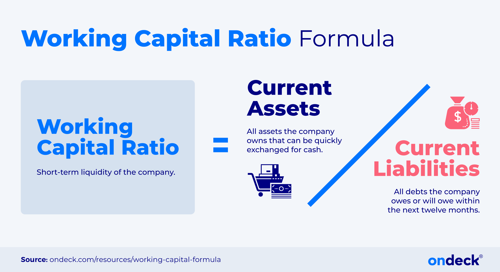

## Table of Contents

## What is working capital and why is it important for a business?

Working capital is the money a business has available to use for its daily operations. It is calculated by subtracting a company's current liabilities from its current assets. Current assets include things like cash, inventory, and accounts receivable, while current liabilities are debts and obligations that need to be paid within a year. Having enough working capital means a business can pay its bills on time, buy more inventory, and keep running smoothly.

Working capital is important for a business because it helps keep the company running day-to-day. If a business does not have enough working capital, it might struggle to pay its bills, which can lead to bigger problems like not being able to buy new inventory or pay employees. On the other hand, having too much working capital can mean that money is not being used effectively to grow the business. So, it's important for a business to manage its working capital carefully to make sure it has enough to operate but not so much that it's wasting resources.

## How do you calculate working capital?

Working capital is calculated by taking a company's current assets and subtracting its current liabilities. Current assets are things the company owns that can be turned into cash within a year, like money in the bank, inventory, and money that customers owe the company (accounts receivable). Current liabilities are what the company needs to pay within a year, like bills, loans, and money owed to suppliers (accounts payable).

This calculation helps show if a company has enough money to run its daily operations. If the working capital is a positive number, it means the company has more current assets than liabilities, which is good because it can pay its bills and keep running smoothly. If it's negative, it means the company might struggle to pay its bills on time, which could lead to bigger problems.

## What is liquidity and how does it relate to working capital?

Liquidity is how easily a company can turn its assets into cash to pay its bills. Think of it like having money in your pocket that you can use right away. If a company has high liquidity, it means it can quickly get cash to pay for things it needs without waiting or selling off big things like buildings or machines.

Liquidity is closely related to working capital because working capital is made up of current assets and current liabilities, which are the things that affect a company's liquidity. If a company has a lot of working capital, it usually means it has good liquidity because it has more current assets than current liabilities. This makes it easier for the company to pay its bills on time and keep running smoothly. If a company has low working capital or even negative working capital, it might struggle with liquidity, making it hard to pay bills and keep the business going.

## What are the common ratios used to assess liquidity?

Two common ratios used to assess liquidity are the current ratio and the quick ratio. The current ratio is calculated by dividing a company's current assets by its current liabilities. This tells you how well a company can pay its short-term bills with what it owns right now. A current ratio above 1 means the company has more assets than liabilities, which is good. A ratio below 1 means the company might struggle to pay its bills.

The quick ratio is a bit stricter. It's calculated by taking current assets minus inventory and then dividing by current liabilities. This ratio looks at how well a company can pay its bills without selling its inventory. Inventory can take time to turn into cash, so the quick ratio gives a clearer picture of a company's immediate liquidity. A quick ratio above 1 is generally seen as a sign of good liquidity.

Both these ratios help show if a company has enough cash or things it can quickly turn into cash to keep running smoothly. They are important tools for businesses to make sure they can pay their bills and avoid financial trouble.

## How can a business improve its working capital management?

A business can improve its working capital management by first looking at its cash flow. This means keeping a close eye on when money comes in and when it goes out. A business can do this by making sure customers pay their bills on time. One way to do this is by offering discounts for early payments or by being strict about late payments. Also, a business can try to pay its own bills a bit later if suppliers allow it, but not so late that it hurts the relationship with them. By managing when money comes in and goes out, a business can have more cash on hand to use for daily operations.

Another way to improve working capital management is by managing inventory better. A business should not keep too much inventory because that ties up money that could be used elsewhere. It's a good idea to only keep enough inventory to meet customer demand. Using technology to track inventory and predict what customers will need can help a business do this. Also, selling off slow-moving inventory or returning it to suppliers can free up cash. By keeping inventory levels just right, a business can have more working capital to use for other important things.

Lastly, a business can look at its debts and see if it can get better terms from lenders or suppliers. Sometimes, negotiating for longer payment terms or lower interest rates can help a business keep more cash on hand. Also, if a business has extra cash, it might want to pay off some debts early to reduce interest costs. By managing debts wisely, a business can improve its working capital and make sure it has enough money to run smoothly every day.

## What are the signs of poor liquidity in a business?

Poor liquidity in a business can show up in a few clear ways. One big sign is if the business often struggles to pay its bills on time. This might mean the business has to delay payments to suppliers, which can hurt relationships and even lead to losing important business partners. Another sign is if the business needs to borrow money just to cover day-to-day costs. If a business is always taking out short-term loans or using credit lines to pay for things like inventory or payroll, it's a red flag that it doesn't have enough cash on hand.

Another way poor liquidity shows up is if the business has a lot of inventory that isn't selling. When money is tied up in inventory that sits on shelves, it means less cash is available for other needs. This can lead to a cycle where the business can't buy new inventory to meet customer demand, which can hurt sales even more. If a business is also seeing a lot of customers not paying their bills on time, this can make the liquidity problem worse because the business is waiting on money that it needs right away. Recognizing these signs early can help a business take steps to improve its liquidity before the problem gets too big.

## How does inventory management affect working capital and liquidity?

Inventory management is really important for a business's working capital and liquidity. Working capital is the money a business has to run its day-to-day operations. When a business has too much inventory, it ties up money that could be used for other things like paying bills or buying new supplies. If inventory is not selling quickly, it means the business has less cash on hand, which can make it hard to pay bills on time. This can lead to problems with suppliers and make it tough to keep the business running smoothly.

On the other hand, having too little inventory can also cause issues. If a business doesn't have enough products to meet customer demand, it might lose sales and customers. This can hurt the business's cash flow, which is the money coming in and going out. Good inventory management means finding the right balance. By keeping just enough inventory to meet customer needs without tying up too much cash, a business can improve its working capital and liquidity. This helps the business pay its bills on time and keep running smoothly without running out of cash.

## What role does credit management play in working capital optimization?

Credit management is very important for making sure a business has enough working capital. When a business gives credit to its customers, it means it lets them pay later instead of right away. This can help the business make more sales, but it also means the business has to wait for the money to come in. Good credit management means making sure customers pay on time. A business can do this by checking if customers are good at paying their bills before giving them credit, and by setting clear rules about when payments are due. If customers pay late, it can hurt the business's working capital because it doesn't have that money to use for other things like paying bills or buying inventory.

By managing credit well, a business can keep its working capital strong. This means it can use the money it has more effectively to keep running smoothly. For example, if a business can get customers to pay earlier, it will have more cash on hand to use right away. This can help the business pay its own bills on time and avoid needing to borrow money. Good credit management also means the business can have better relationships with its suppliers because it can pay them on time. Overall, managing credit well helps a business keep enough working capital to meet its daily needs and stay healthy financially.

## How do seasonal fluctuations impact working capital requirements?

Seasonal fluctuations can really change how much working capital a business needs. During busy times of the year, like holidays or summer, a business might need more inventory to meet customer demand. This means they have to spend more money upfront to buy or make more products. They might also need to hire extra help or pay for more advertising to take advantage of the busy season. All these costs add up and can make the business need more working capital to keep running smoothly during these peak times.

On the other hand, during slower times, like after the holidays or in the off-season, a business might not need as much inventory or staff. This can free up some cash, but it also means less money is coming in from sales. If a business doesn't plan well for these quieter times, it might struggle to pay its bills. Good planning means saving some of the extra money made during busy times to use during slower periods. This way, the business can make sure it always has enough working capital to keep going, no matter what time of year it is.

## What advanced techniques can be used to forecast working capital needs?

One advanced technique to forecast working capital needs is using cash flow forecasting. This means looking at past sales, expenses, and seasonal trends to guess how much money will come in and go out in the future. Businesses can use special software that helps them see patterns in their cash flow and make better guesses about what they'll need. By looking at these patterns, a business can plan ahead to make sure it has enough money for busy times and can save some during slower times. This helps them avoid surprises and keep their working capital strong.

Another technique is using financial modeling. This involves creating a detailed plan of the business's future finances based on different scenarios. For example, a business might make a model that shows what happens if sales go up or down, or if costs change. By playing around with these models, a business can see how different situations might affect its working capital. This helps them prepare for changes and make smart decisions about when to borrow money, how much inventory to keep, and how to manage credit with customers and suppliers. Using financial modeling can give a business a clearer picture of its future working capital needs and help it stay financially healthy.

## How can financial modeling help in assessing liquidity risks?

Financial modeling can help a business see if it might run into problems with liquidity in the future. By creating different scenarios, a business can look at what might happen if sales go down, costs go up, or if there are delays in getting paid by customers. These models can show if the business might not have enough cash to pay its bills on time. By looking at these different situations, the business can plan ahead and take steps to make sure it always has enough money to keep running smoothly.

Using financial modeling also helps a business understand how changes in the market or in its own operations might affect its cash flow. For example, if a business knows it will need more inventory for a busy season, it can use the model to see if it will have enough money to buy that inventory without running into liquidity problems. By playing around with different numbers and situations in the model, the business can make better decisions about borrowing money, managing inventory, and setting payment terms with customers and suppliers. This helps the business stay prepared and avoid liquidity risks.

## What are the strategic implications of working capital and liquidity management for long-term business growth?

Managing working capital and liquidity well is really important for a business that wants to grow over the long term. If a business can keep enough cash on hand to pay its bills and buy what it needs, it can take advantage of new opportunities without worrying about running out of money. This means the business can invest in new products, expand to new markets, or even buy other companies to grow bigger. Good working capital management also helps the business build strong relationships with suppliers and customers because it can pay on time and offer good credit terms. This makes the business more reliable and attractive to work with, which can lead to more sales and growth.

But if a business doesn't manage its working capital and liquidity well, it can face big problems that stop it from growing. If the business often struggles to pay its bills or has to borrow money just to keep going, it won't have the cash it needs to invest in new opportunities. This can make the business miss out on chances to grow and can even hurt its reputation with suppliers and customers. By focusing on keeping a healthy balance of working capital and liquidity, a business can make sure it's always ready to grow and take on new challenges, setting it up for success in the long run.

## What is the relationship between liquidity and working capital?

Liquidity is a vital financial metric that assesses a company's ability to fulfill its short-term obligations. It serves as an indicator of a company's financial health, ensuring that it can meet its immediate liabilities without facing financial strain. Typically, liquidity is evaluated using ratios such as the current ratio and the quick ratio. The formulas for these ratios are as follows:

$$
\text{Current Ratio} = \frac{\text{Current Assets}}{\text{Current Liabilities}}
$$

$$
\text{Quick Ratio} = \frac{\text{Current Assets} - \text{Inventories}}{\text{Current Liabilities}}
$$

These ratios provide insights into whether a company has enough resources to cover its short-term debts, with a higher ratio suggesting a more favorable [liquidity](/wiki/liquidity-risk-premium) position.

Working capital is another crucial parameter, calculated as the difference between a company's current assets and current liabilities. It indicates operational efficiency and is expressed as:

$$
\text{Working Capital} = \text{Current Assets} - \text{Current Liabilities}
$$

A positive working capital reflects that a company has sufficient assets to pay off its debts promptly, ensuring smooth business operations. Conversely, negative working capital may signal potential financial distress or operational inefficiencies, as it suggests that the company is struggling to cover its current liabilities with its current assets.

These metrics are essential considerations in financial analysis as they reveal a company's underlying strength and stability. They inform investors and creditors about the company's short-term financial health and operational efficiency, influencing decisions regarding investment and creditworthiness. Therefore, monitoring liquidity and working capital is vital for maintaining the overall financial stability and fostering business growth.

## What are the drivers of working capital and liquidity?

Key components of working capital consist of current assets such as cash, accounts receivable, and inventory, and current liabilities, including accounts payable and other short-term obligations. Efficient management of these elements is crucial, as their equilibrium directly impacts a company’s liquidity and financial flexibility.

To understand how these elements interact, it's essential to consider the characteristics of current assets and liabilities. Current assets are those that a company expects to convert into cash within a year, making them critical for meeting short-term obligations. Conversely, current liabilities represent the debts and obligations due within the same period. The effective balance between these components is quantified by the working capital formula:

$$
\text{Working Capital} = \text{Current Assets} - \text{Current Liabilities}
$$

By maintaining positive working capital, companies ensure they have enough resources to fund ongoing operations and absorb any unforeseen expenses or investment opportunities. This balance not only provides operational certainty but also enhances a company's ability to capitalize on market opportunities, thus offering a competitive edge.

Inventory management plays a pivotal role in optimizing working capital. Holding excessive inventory ties up capital unnecessarily, while holding too little may lead to stockouts and lost sales. Consequently, strategies such as just-in-time inventory systems, which minimize inventory levels while ensuring timely availability, can improve liquidity and operational efficiency.

Accounts receivable management is another critical driver. Shortening the receivables collection period enhances cash flow, providing funds for immediate operational needs. Techniques such as offering discounts for early payments and stringent credit control policies can aid in optimizing this component.

Accounts payable management similarly influences liquidity strategies. Delaying payments to suppliers without incurring penalties can be a cost-effective source of short-term financing, allowing a company to utilize its cash for other purposes. However, this must be balanced carefully to maintain supplier relationships and avoid any adverse impact on the supply chain.

By understanding and strategically managing these drivers, businesses can optimize their financial health and stability. This involves regularly monitoring financial metrics, using forecasting tools to predict cash flow needs accurately, and remaining adaptable to changing market conditions. Companies that manage these dynamics effectively are better positioned to remain competitive and resilient in today's economic environment.

## How can financial analysis be integrated into trading strategies?

Incorporating financial analysis into trading strategies has become a cornerstone of modern [algorithmic trading](/wiki/algorithmic-trading). Central to this integration are financial ratios, such as the current ratio and quick ratio, which provide insights into a company's short-term financial health. These ratios are foundational in evaluating market conditions and forecasting stock movements.

The current ratio, defined as:

$$
\text{Current Ratio} = \frac{\text{Current Assets}}{\text{Current Liabilities}}
$$

gives a snapshot of a company's ability to cover its short-term obligations with its short-term assets. A ratio above one generally indicates robustness in meeting these obligations.

Similarly, the quick ratio, calculated as:

$$
\text{Quick Ratio} = \frac{\text{Current Assets} - \text{Inventories}}{\text{Current Liabilities}}
$$

provides a more stringent measure by excluding inventories, representing assets that might not be readily convertible into cash.

Trading algorithms utilize these ratios to analyze financial data and adapt strategies dynamically. Machine learning techniques are leveraged to refine trading models continuously, using historical and real-time data to improve prediction accuracy. These advanced algorithms evaluate patterns and trends, optimizing strategies to capture market opportunities effectively.

Here's an example of how a basic Python script could be structured to assess these ratios and inform trading decisions:

```python
def calculate_current_ratio(current_assets, current_liabilities):
    return current_assets / current_liabilities

def calculate_quick_ratio(current_assets, inventories, current_liabilities):
    return (current_assets - inventories) / current_liabilities

def evaluate_ratios(current_assets, inventories, current_liabilities):
    current_ratio = calculate_current_ratio(current_assets, current_liabilities)
    quick_ratio = calculate_quick_ratio(current_assets, inventories, current_liabilities)

    if current_ratio > 1 and quick_ratio > 1:
        return "Strong Position"
    elif current_ratio > 1:
        return "Satisfactory Position"
    else:
        return "Weak Position"

# Example data 
current_assets = 200000
inventories = 50000
current_liabilities = 150000

position = evaluate_ratios(current_assets, inventories, current_liabilities)
print(f"The company's financial position is: {position}")
```

The real-time integration of such financial metrics enables traders to make prompt, informed decisions by automating the processing of large datasets. This automation minimizes human error, enhances responsiveness to market changes, and capitalizes on emerging trends more swiftly than manual methods.

Integrating these methodologies into trading algorithms not only fosters accuracy but also unlocks significant potential in market efficiencies. As the financial landscape continues to evolve, the synergy between financial analysis and advanced algorithms will be pivotal in achieving superior trading performance.

## References & Further Reading

[1]: Bergstra, J., Bardenet, R., Bengio, Y., & Kégl, B. (2011). ["Algorithms for Hyper-Parameter Optimization."](https://dl.acm.org/doi/10.5555/2986459.2986743) Advances in Neural Information Processing Systems 24.

[2]: ["Advances in Financial Machine Learning"](https://www.amazon.com/Advances-Financial-Machine-Learning-Marcos/dp/1119482089) by Marcos Lopez de Prado

[3]: ["Evidence-Based Technical Analysis: Applying the Scientific Method and Statistical Inference to Trading Signals"](https://www.amazon.com/Evidence-Based-Technical-Analysis-Scientific-Statistical/dp/0470008741) by David Aronson

[4]: ["Machine Learning for Algorithmic Trading"](https://github.com/stefan-jansen/machine-learning-for-trading) by Stefan Jansen

[5]: ["Quantitative Trading: How to Build Your Own Algorithmic Trading Business"](https://www.amazon.com/Quantitative-Trading-Build-Algorithmic-Business/dp/1119800064) by Ernest P. Chan