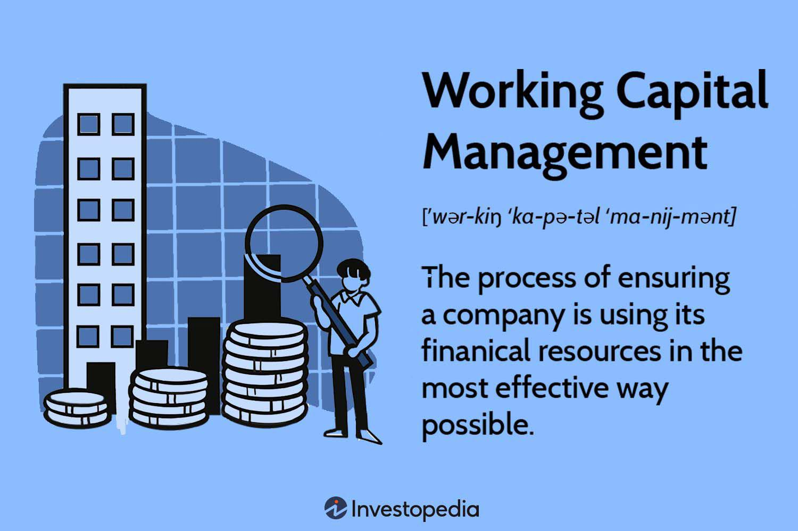

In the rapidly evolving business environment, understanding financial management and innovative trading practices is crucial. Businesses today operate in a landscape characterized by increasing complexity and competition, necessitating a comprehensive approach to financial strategy. This article explores the intersection of business finance, financial management, working capital, and algorithmic trading, which together form the foundation of an efficient and robust financial strategy for businesses.

Business finance serves as the core, ensuring that organizations can effectively allocate resources to meet their objectives. It incorporates financial planning, control, and analysis, encompassing activities such as procuring and using funds. The ability to manage these financial operations efficiently enables businesses to maintain sustainability and establish a competitive advantage.



Financial management takes this a step further by involving strategic decision-making processes that aim to maximize a firm's return on investment. Key objectives include maintaining liquidity, ensuring profitability, and optimizing capital structure. These practices are essential for informed investment decisions, precise budgeting, and accurate forecasting.

An integral aspect of financial management is working capital, which focuses on balancing current assets and liabilities. Effective working capital management ensures that a company can meet its short-term obligations and operate seamlessly. This involves efficient management of inventories, accounts receivable/payable, and cash reserves.

Algorithmic trading represents a revolutionary approach in financial markets, utilizing computer programs to execute trades based on predefined criteria. By enhancing market liquidity and ensuring efficient, emotion-free trading, algorithmic trading leverages advanced mathematical models and high-speed financial data access to identify opportunities.

These elements, namely business finance, financial management, working capital, and algorithmic trading, are interlinked, contributing to a more integrated and effective financial strategy. By understanding how they work together, businesses can improve fiscal performance and trading accuracy, yielding significant strategic and operational benefits.

## Table of Contents

## Business Finance: An Overview

Business finance represents a fundamental component of a company, responsible for managing funds effectively to fulfill the organization's objectives. It encompasses a comprehensive suite of activities, including the planning, analysis, and management of financial resources. This facilitates efficient allocation and utilization of funds, which are essential for the financial health and operational success of the business.

The primary aim of business finance is to ensure the availability of necessary funds at the right time and at favorable terms. This involves strategic financial planning where businesses identify their financial needs and sources of funding. Effective financial planning often includes forecasting future revenue, estimating operating expenses, and making provisions for unforeseen liabilities. A clear understanding of these elements aids in establishing a road map for financial success.

The analysis aspect involves evaluating financial statements to assess the company's financial performance and condition. This includes inspecting balance sheets, profit and loss statements, and cash flow statements. By scrutinizing these documents, businesses can interpret vital financial ratios such as [liquidity](/wiki/liquidity-risk-premium) ratios, profitability ratios, and solvency ratios. For instance, liquidity ratios, like the current ratio and quick ratio, indicate a company's ability to meet its short-term obligations, which is critical for maintaining operational smoothness without financial disruptions.

Control of financial activities is another critical facet of business finance. It ensures that the financial resources are utilized judiciously and aligned with the organization's objectives. Control mechanisms may include budgeting control, where financial plans are compared to actual results to identify deviations, and implementing corrective measures when necessary. For instance, variance analysis is a commonly used tool that compares budgeted outcomes with actual performance, enabling companies to pinpoint inefficiencies and areas for financial optimization.

Furthermore, a well-structured business finance strategy is pivotal for sustaining competitive advantage. It equips businesses to respond effectively to changing market dynamics and economic conditions. Companies that manage their finances efficiently are typically better positioned to invest in growth opportunities, weather economic downturns, and innovate without excessive reliance on external funding, which can be costly and impact financial flexibility.

In conclusion, a robust business finance strategy is indispensable for the sustainability and competitiveness of an organization. It ensures the judicious planning, analysis, and control of financial activities, which collectively empower businesses to thrive in a competitive market environment.

## Financial Management: Objectives and Importance

Financial management serves as a cornerstone in driving a firm's profitability and growth by ensuring efficient allocation and utilization of resources. The strategic decisions made within this domain aim to maximize the return on investment (ROI), a critical indicator of financial performance. Effective financial management is not only about enhancement of shareholder value but also about maintaining strategic control over the company's finances.

The objectives of financial management can be categorized into three primary areas:

1. **Ensuring Liquidity**: Liquidity management involves maintaining an optimal level of cash and other liquid assets to meet short-term obligations. This is a crucial element for any business to function smoothly without interruptions. Maintaining liquidity ensures that a firm can cover its immediate expenses such as salaries, rent, and supplier payments. An ideal liquidity ratio, such as the current ratio, which is calculated as:
$$
   \text{Current Ratio} = \frac{\text{Current Assets}}{\text{Current Liabilities}}

$$

   aids in determining the firm's short-term financial health. A ratio greater than 1 indicates that the firm has more current assets than its liabilities, reflecting a sound liquidity position.

2. **Profitability Maximization**: Achieving a balance between profitability and risk is essential for long-term growth. Financial management focuses on creating strategies to enhance revenue while controlling costs. Techniques such as break-even analysis and margin assessment are utilized to understand profit dynamics better. For example, the Gross Profit Margin, calculated as:
$$
   \text{Gross Profit Margin} = \left(\frac{\text{Revenue} - \text{Cost of Goods Sold}}{\text{Revenue}}\right) \times 100

$$

   provides insights into how well a company is managing its production and sales processes to generate profit.

3. **Optimal Capital Structure**: Deciding the best mix of debt and equity financing is central to maintaining an optimal capital structure. This balance is pivotal in minimizing the overall cost of capital and enhancing shareholder value. The Weighted Average Cost of Capital (WACC), which can be expressed as:
$$
   \text{WACC} = \left(\frac{E}{V} \times \text{Re}\right) + \left(\frac{D}{V} \times \text{Rd} \times (1 - \text{Tax Rate})\right)

$$

   where $E$ is the market value of equity, $D$ is the market value of debt, $V$ is the total value of capital (equity and debt), $\text{Re}$ is the cost of equity, and $\text{Rd}$ is the cost of debt, is a tool used to determine the average rate that a company is expected to pay to all its security holders to finance its assets.

Good financial management practices are indispensable for informed decision-making processes such as investment appraisals, resource allocation, budgeting, and forecasting. These practices enable firms to anticipate future financial needs and devise strategies to meet these needs effectively. Accurate financial forecasting allows businesses to plan for growth, manage risks, and allocate resources efficiently, thereby ensuring sustainable development and competitive advantage in the market.

## Working Capital: Definition and Significance

Working capital represents the difference between a company's current assets and current liabilities, serving as a crucial measure of a firm's short-term financial health and operational efficiency. It directly impacts a company's capability to meet its short-term obligations and invest in its long-term growth.

Effective working capital management includes maintaining an optimal balance between different elements such as inventories, accounts receivable, accounts payable, and cash reserves. This balance ensures that the firm has enough liquidity to cover its immediate obligations while avoiding wasteful over-commitment of funds to non-productive assets. 

A company with robust working capital management can seamlessly handle unexpected expenses or opportunities for investment without needing additional financing. For example, reducing inventory holding times can minimize capital tied up in stock, while efficient accounts receivable processes can speed up cash inflows. 

Mathematically, working capital can be expressed as:
$$
\text{Working Capital} = \text{Current Assets} - \text{Current Liabilities}
$$

In Python, a simple calculation of working capital could be represented as follows:

```python
def calculate_working_capital(current_assets, current_liabilities):
    return current_assets - current_liabilities

# Example usage
current_assets = 50000
current_liabilities = 30000

working_capital = calculate_working_capital(current_assets, current_liabilities)
print(f"Working Capital: {working_capital}")
```

This balance helps ensure the company remains operationally efficient and financially healthy. Mismanagement can lead to liquidity crises or underutilized resources, making working capital management a fundamental aspect of financial strategy.

## Algorithmic Trading: Revolutionizing Financial Markets

Algorithmic trading leverages computer programs to automatically execute trading strategies with speed and precision that far exceed human capabilities. This approach is fundamentally changing the landscape of financial markets, offering significant advantages in terms of market liquidity and trading efficiency.

One of the primary benefits of [algorithmic trading](/wiki/algorithmic-trading) is its ability to enhance market liquidity. By automating the execution of trades based on predetermined criteria, algorithmic trading strategies can process large volumes of transactions almost instantaneously. This rapid execution reduces bid-ask spreads, thereby increasing market depth and improving prices for all market participants. As a result, algorithmic trading contributes to a more efficient market by effectively matching buy and sell orders, decreasing the time and cost of transactions.

Algorithmic trading also ensures trading decisions are free from human emotion. Traditional trading is often subject to biases and emotional responses, such as fear and greed, which can lead to irrational decision-making and market inefficiencies. By employing algorithmic strategies, trades are executed purely based on data and models, eliminating emotional interference and enabling consistent application of trading logic.

The backbone of algorithmic trading is formed by sophisticated mathematical models and algorithms. These models analyze vast amounts of financial data at high speeds to detect patterns and identify potential trading opportunities. For instance, a simple moving average crossover strategy might be implemented as follows:

```python
# Example of a simple moving average crossover strategy in Python
def moving_average_crossover(prices, short_window=40, long_window=100):
    signals = pd.DataFrame(index=prices.index)
    signals['price'] = prices
    signals['short_mavg'] = signals['price'].rolling(window=short_window, min_periods=1).mean()
    signals['long_mavg'] = signals['price'].rolling(window=long_window, min_periods=1).mean()
    signals['signal'] = 0.0  
    signals['signal'][short_window:] = \
        np.where(signals['short_mavg'][short_window:] > signals['long_mavg'][short_window:], 1.0, 0.0)   
    signals['positions'] = signals['signal'].diff()
    return signals
```

In this example, the algorithm generates trading signals based on the crossing of short-term and long-term moving averages, which are simple yet effective indicators used in trading strategies.

Furthermore, the efficiency of algorithmic trading is greatly enhanced by access to high-speed financial data. Advanced systems and technologies such as co-location and direct market access allow firms to capture and respond to market data in microseconds, ensuring minimal latency and maximizing the speed of trade execution. This capability is crucial in environments where even milliseconds can determine the success or failure of a trading strategy.

In summary, algorithmic trading is revolutionizing financial markets by offering unprecedented levels of speed, efficiency, and emotional neutrality in trading activities. Its reliance on mathematical models and high-speed data access enables traders to capitalize on market opportunities with far greater precision and at a significantly reduced cost compared to traditional methods. As technological advancements continue to evolve, the role of algorithmic trading is poised to expand further, solidifying its critical position in the future of global financial markets.

## Interconnection of Financial Elements

Understanding the interconnection of business finance, financial management, working capital, and algorithmic trading demonstrates the potential for optimizing a firm's financial strategy. Algorithmic trading, through systematic and data-driven approaches, facilitates effective working capital management by optimizing cash flow. This process can automate decisions, reducing the time required for transaction settlements and improving consistency in cash flow.

Algorithmic trading allows real-time tracking of transactions and financial flows using large datasets to predict trends and make informed decisions. For instance, automated trading systems can evaluate the timing for acquiring inventory or paying off liabilities, thus helping maintain a balance between the firm's current assets and liabilities. With algorithmic trading, companies can perform real-time adjustments to working capital cycles, minimizing cash tied up in accounts receivable or excess inventory.

Furthermore, financial management synchronization with algorithmic strategies can enhance investment outcomes. By integrating algorithms designed to monitor market conditions and financial health, businesses can make precise adjustments to their capital allocation, ensuring optimal liquidity and profitability. This involves using algorithms to project short-term and long-term financial needs, incorporating predictive models to enhance investment portfolios, and adopting dynamic shifts in strategy based on market conditions.

Incorporating these systems requires robust data processing and analysis capability to handle large datasets efficiently, which Python can execute through libraries like NumPy, Pandas, and Scikit-learn. As an example:

```python
import pandas as pd

# Simulate a simple cash flow optimization system
cash_flows = pd.DataFrame({
    'Date': pd.date_range(start='2023-01-01', periods=10, freq='M'),
    'Inflow': [10000, 15000, 12000, 13000, 14000, 16000, 10000, 17000, 18000, 19000],
    'Outflow': [8000, 11000, 10000, 9000, 11000, 12000, 9000, 15000, 16000, 17000]
})

cash_flows['NetFlow'] = cash_flows['Inflow'] - cash_flows['Outflow']
cash_flows['CumulativeFlow'] = cash_flows['NetFlow'].cumsum()

# Print a summary of cash flow management
print(cash_flows)
```

This simple program demonstrates tracking and optimizing cash flow—a crucial aspect of working capital management. By analyzing net and cumulative cash flows, businesses can anticipate cash needs and optimize allocation, aligning with algorithmically-driven financial management goals. Synchronizing these strategies offers a comprehensive approach, fostering improved financial stability and investment outcomes.

## Benefits and Challenges

An integrated approach to financial management and algorithmic trading can significantly improve financial performance by leveraging the strengths of both disciplines. Financial management provides the framework for making informed decisions regarding investments, budgeting, and forecasting, while algorithmic trading offers a powerful tool for executing these decisions with precision and speed.

One of the primary benefits of this integration is the enhancement of market execution accuracy. Algorithmic trading, driven by complex algorithms and advanced mathematical models, allows businesses to capitalize on real-time market opportunities without the hindrance of human emotion. This ensures optimal timing in buying and selling assets, leading to potentially higher returns on investment.

Furthermore, this synergy helps in the optimization of cash flow management. By automating trading strategies, businesses can achieve better liquidity management, facilitating an efficient allocation of resources, and ultimately maintaining a balanced working capital. This automated approach reduces the risk of manual errors and enhances decision-making speed, contributing to improved operational efficiency.

However, integrating financial management with algorithmic trading is not without challenges. Market [volatility](/wiki/volatility-trading-strategies) presents a constant threat, as rapid and unexpected changes in market conditions can affect algorithmic trading outcomes. Algorithms need to be continuously refined to adapt to such conditions, which requires significant resources and expertise.

Technological risks also pose a challenge. The reliance on sophisticated technology means that any system glitches or disruptions can have profound impacts on trading activities, potentially leading to financial losses. Robust cybersecurity measures and system redundancies are essential to mitigate these risks.

The complexity of developing and maintaining advanced algorithms is another hurdle. Creating a model that accurately predicts market movements and executes effective trading strategies requires a deep understanding of financial markets, mathematical modeling, and programming. Companies need to invest in skilled personnel and continuous training to keep pace with advancements in this field.

In conclusion, while the integration of financial management and algorithmic trading offers significant opportunities for enhanced financial performance, it is imperative for businesses to address associated challenges through meticulous planning, resource allocation, and risk management strategies. This approach can lead to a more robust and adaptive financial strategy, positioning businesses to thrive in dynamic market environments.

## Future Trends in Financial Management and Algorithmic Trading

The integration of [artificial intelligence](/wiki/ai-artificial-intelligence) (AI) and [machine learning](/wiki/machine-learning) (ML) in algorithmic trading is transforming the landscape of financial management, offering the potential for a more predictive and efficient market environment. These technologies enhance the ability of trading algorithms to analyze vast datasets, adapt to market changes, and execute trades with increased precision.

One significant trend is the development of personalized trading algorithms. These sophisticated algorithms leverage AI to tailor strategies to individual investor profiles, risk appetites, and investment goals. By incorporating [deep learning](/wiki/deep-learning) techniques, the algorithms can learn from historical data and adjust trading strategies dynamically, improving the chances of meeting specific financial objectives.

Moreover, the trend toward greater transparency in trading strategies is gaining traction. As regulatory pressures increase and investors demand more clarity, algorithmic trading systems are being designed to provide detailed insights into their decision-making processes. This involves the use of explainable AI (XAI) techniques, which aim to make the outcomes of machine learning models more understandable to humans. Consequently, traders can better assess the risk and rationale behind automated trading decisions, fostering trust and compliance.

Additionally, the integration of AI and ML facilitates the development of predictive analytics tools. These tools can forecast market trends and potential price movements by processing and analyzing real-time financial data. With predictive analytics, traders can gain a competitive edge by identifying profitable trading opportunities before they become apparent to the broader market.

Python, a popular programming language in finance, serves as a backbone for implementing these advanced trading systems. Below is a simple example demonstrating how Python can be used to incorporate machine learning in a trading strategy using a basic decision tree algorithm:

```python
import pandas as pd
from sklearn.model_selection import train_test_split
from sklearn.tree import DecisionTreeClassifier

# Load the financial dataset
data = pd.read_csv('financial_data.csv')

# Define features and target
features = data[['feature1', 'feature2', 'feature3']]  # Example financial indicators
target = data['price_movement']  # Target: price up (+1) or down (-1)

# Split the dataset into training and test sets
X_train, X_test, y_train, y_test = train_test_split(features, target, test_size=0.2, random_state=42)

# Train the decision tree model
model = DecisionTreeClassifier()
model.fit(X_train, y_train)

# Predict market movements
predictions = model.predict(X_test)

# Evaluate model accuracy
accuracy = model.score(X_test, y_test)
print(f'Model Accuracy: {accuracy:.2f}')
```

In summary, future trends in financial management and algorithmic trading are being shaped by AI and machine learning innovations. These developments promise personalized trading experiences, enhanced transparency, and better predictive capabilities, ultimately leading to improved financial decision-making and market efficiency.

## Conclusion

Business finance, financial management, working capital, and algorithmic trading are integral to the success of modern enterprises. By effectively leveraging these elements, companies can significantly enhance their financial health. Strategic financial management enables firms to maximize returns while maintaining liquidity and stability. Working capital management ensures seamless operational continuity by balancing assets and liabilities, which contributes to improved cash flow and operational efficiency.

Moreover, the incorporation of algorithmic trading into financial strategies can enhance market performance. This technology not only facilitates efficient trading through the use of complex algorithms but also mitigates the influence of human emotions on trading decisions. By processing vast amounts of data at high speeds, algorithmic trading identifies profitable opportunities and executes trades with precision and speed.

Understanding and capitalizing on the synergy between business finance, financial management, working capital, and algorithmic trading provide companies with substantial strategic and operational advantages. Integrating these elements enables businesses to optimize resource allocation, drive innovation, and maintain a competitive edge in the volatile financial markets. As a result, enterprises that successfully manage these critical components are better positioned to achieve sustainable growth and long-term success.

## References & Further Reading

[1]: Bergstra, J., Bardenet, R., Bengio, Y., & Kégl, B. (2011). ["Algorithms for Hyper-Parameter Optimization."](https://dl.acm.org/doi/10.5555/2986459.2986743) Advances in Neural Information Processing Systems 24.

[2]: ["Advances in Financial Machine Learning"](https://www.amazon.com/Advances-Financial-Machine-Learning-Marcos/dp/1119482089) by Marcos Lopez de Prado

[3]: ["Evidence-Based Technical Analysis: Applying the Scientific Method and Statistical Inference to Trading Signals"](https://www.amazon.com/Evidence-Based-Technical-Analysis-Scientific-Statistical/dp/0470008741) by David Aronson

[4]: ["Machine Learning for Algorithmic Trading"](https://github.com/PacktPublishing/Machine-Learning-for-Algorithmic-Trading-Second-Edition) by Stefan Jansen

[5]: ["Quantitative Trading: How to Build Your Own Algorithmic Trading Business"](https://www.amazon.com/Quantitative-Trading-Build-Algorithmic-Business/dp/1119800064) by Ernest P. Chan