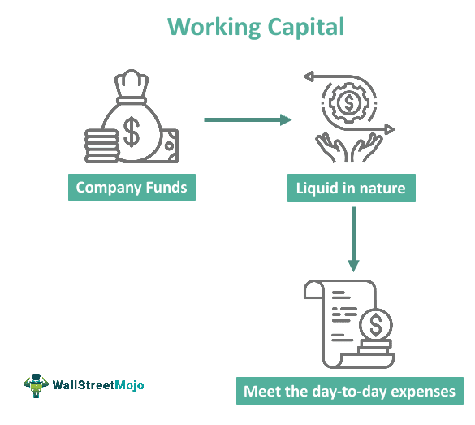

## Table of Contents

## What is the working capital ratio?

The working capital ratio, also known as the current ratio, is a measure used to assess a company's ability to pay off its short-term liabilities with its short-term assets. It is calculated by dividing a company's current assets by its current liabilities. This ratio helps investors and creditors understand the financial health of a business by showing whether the company has enough assets to cover its debts that are due within a year.

A working capital ratio of 1 means that a company's current assets are exactly equal to its current liabilities. A ratio above 1 indicates that the company has more current assets than liabilities, suggesting good financial health and the ability to pay off its short-term debts. On the other hand, a ratio below 1 can signal potential financial trouble, as it means the company might struggle to meet its short-term obligations. However, the ideal ratio can vary by industry, and a very high ratio might suggest that the company is not using its assets efficiently.

## How do you calculate the working capital ratio?

The working capital ratio is calculated by dividing a company's current assets by its current liabilities. Current assets are things a company owns that can be turned into cash within a year, like cash, inventory, and accounts receivable. Current liabilities are debts the company needs to pay within a year, like short-term loans and accounts payable.

To find the working capital ratio, you just take the total of the current assets and divide it by the total of the current liabilities. For example, if a company has $50,000 in current assets and $25,000 in current liabilities, the working capital ratio would be $50,000 divided by $25,000, which equals 2. This number shows if the company can pay its short-term bills with its short-term assets.

## Why is the working capital ratio important for corporate management?

The working capital ratio is really important for corporate management because it helps them see if their company can pay its short-term bills. If the ratio is good, it means the company has enough cash and other short-term assets to cover what it owes. This is key for keeping the business running smoothly without worrying about money troubles.

Also, by keeping an eye on the working capital ratio, managers can make smart decisions about how to use the company's money. If the ratio is too low, they might need to find ways to get more cash or cut back on spending. If it's too high, they might be able to invest more in growing the business. This helps keep the company healthy and ready for the future.

## What does a working capital ratio above 1 indicate?

A working capital ratio above 1 means that a company has more current assets than current liabilities. This is a good sign because it shows that the company can pay off its short-term debts without any problems. It means the business has enough cash, inventory, and other short-term assets to cover what it owes in the next year.

Having a working capital ratio above 1 is important for keeping the business stable and healthy. It gives managers the confidence that they can keep the business running smoothly and handle any unexpected expenses. It also makes the company look good to investors and lenders, who like to see that a business can manage its money well.

## What are the implications of a working capital ratio below 1?

A working capital ratio below 1 means that a company's current liabilities are more than its current assets. This is a warning sign that the company might struggle to pay its short-term bills. It could mean the company doesn't have enough cash or other quick assets to cover what it owes soon. This situation can cause stress for the business because it might need to borrow more money or sell assets just to keep going.

If a company keeps having a working capital ratio below 1, it might face bigger problems. Creditors and suppliers might get worried and stop giving the company credit or supplies. This can make it even harder for the business to operate. Also, investors might lose confidence in the company, which could make it tough to raise more money or attract new investment. Keeping the working capital ratio above 1 is important for the company's health and growth.

## How can a company improve its working capital ratio?

A company can improve its working capital ratio by increasing its current assets or decreasing its current liabilities. One way to boost current assets is by speeding up the collection of money from customers. This means making sure invoices are sent out quickly and following up on late payments. Another way is to sell off any inventory that's not moving fast enough, turning it into cash. The company could also look for short-term investments that can be easily turned into cash when needed.

On the other hand, reducing current liabilities can also help. This might mean paying off short-term loans faster or negotiating better terms with suppliers to delay payments. The company could also try to cut back on any unnecessary spending that adds to its short-term debts. By managing both sides of the equation—assets and liabilities—the company can work towards a healthier working capital ratio.

Keeping a close eye on the working capital ratio and making smart decisions based on it can really help a company stay financially stable. It's all about finding the right balance so the business has enough cash to cover its bills and keep running smoothly. By doing this, the company can avoid money troubles and be ready for future growth.

## What industries typically have higher or lower working capital ratios?

Some industries usually have higher working capital ratios because they need a lot of cash and inventory to run their businesses. For example, retail and grocery stores often have higher ratios. They need to keep a lot of products on their shelves to sell to customers, and they might have to wait a while to get paid by those customers. So, they need more current assets to cover their bills. Manufacturing companies also tend to have higher ratios because they need raw materials and finished goods on hand, and it can take time to turn those into cash.

On the other hand, some industries can get by with lower working capital ratios. Service industries like consulting or software companies often have lower ratios. They don't need a lot of inventory because they're selling their time or expertise instead of physical products. They also usually get paid faster, so they don't need as much cash on hand to cover their bills. Utilities and telecom companies might also have lower ratios because they have steady income from customers and don't need to keep a lot of inventory.

## How does the working capital ratio affect a company's liquidity?

The working capital ratio is a big deal when it comes to a company's liquidity. Liquidity is about how easily a company can turn its assets into cash to pay its bills. If a company has a high working capital ratio, it means it has a lot of current assets compared to its current liabilities. This is good because it shows the company can easily pay its short-term bills and has enough cash or other quick assets to do so. It's like having money in your pocket when you need to pay for something right away.

On the other hand, if a company's working capital ratio is low, it might have trouble with its liquidity. A low ratio means the company doesn't have enough current assets to cover its current liabilities. This can be risky because the company might struggle to pay its bills on time. It might need to borrow money quickly or sell off assets to get the cash it needs. Keeping an eye on the working capital ratio helps a company make sure it stays liquid and can handle its financial obligations without stress.

## What are the limitations of using the working capital ratio as a sole measure of financial health?

The working capital ratio is a helpful tool, but it's not perfect if you use it by itself to check a company's financial health. One big problem is that it doesn't show how fast a company can turn its current assets into cash. For example, a company might have a lot of inventory, but if it can't sell it quickly, that inventory isn't very helpful for paying bills. Also, the ratio doesn't tell you about the quality of the assets. Some assets might be hard to sell or worth less than what's on the books.

Another issue is that the working capital ratio doesn't consider the timing of when bills are due. A company might have enough assets to cover its liabilities, but if all the bills are due right away and the money is coming in later, it could still have cash flow problems. Plus, different industries have different normal ratios, so what's a good ratio for one company might not be good for another. That's why it's smart to look at other financial measures too, like the quick ratio or cash flow statements, to get a full picture of a company's health.

## How does working capital management impact overall corporate strategy?

Working capital management is really important for a company's overall strategy because it helps keep the business running smoothly. If a company manages its working capital well, it can make sure it always has enough cash to pay its bills and keep operations going. This means the company can take advantage of new opportunities, like expanding into new markets or investing in new products, without worrying about money problems. Good working capital management also helps build trust with suppliers and lenders, which can lead to better deals and more support for the company's growth plans.

On the other hand, if a company doesn't manage its working capital well, it can run into big problems. It might struggle to pay its bills on time, which can hurt its reputation and make it hard to get credit or supplies. This can slow down the company's growth and make it harder to compete with other businesses. So, working capital management is a key part of a company's strategy because it affects everything from daily operations to long-term plans for growth and stability.

## Can the working capital ratio be manipulated, and if so, how?

Yes, the working capital ratio can be manipulated by a company if it wants to make its financial health look better than it really is. One way to do this is by playing around with the timing of when they record their sales or expenses. For example, a company might delay paying its bills until after the end of a reporting period, which would make its current liabilities look smaller and boost its working capital ratio. Or, it might record sales before the money is actually collected, making its current assets look bigger.

Another way to manipulate the working capital ratio is by changing how the company values its inventory. If a company uses a method that makes its inventory look more valuable, this can increase its current assets and improve the ratio. But this can be risky because if the inventory can't be sold at that high value, it could lead to problems later. It's important for people looking at a company's financials to be careful and check other financial measures too, to make sure the working capital ratio isn't being used to hide the real situation.

## How do different financial analysts interpret varying levels of the working capital ratio?

Financial analysts look at the working capital ratio to see if a company can pay its short-term bills. If the ratio is above 1, most analysts think it's a good sign. It means the company has more current assets than liabilities, so it should be able to cover what it owes without problems. But some analysts might worry if the ratio is too high, like above 2 or 3, because it could mean the company isn't using its money wisely. They might think the company is holding onto too much cash or inventory instead of investing it to grow.

If the working capital ratio is below 1, analysts usually see it as a warning sign. It means the company might struggle to pay its bills because it has more liabilities than assets. This can make analysts think the company is in financial trouble and might need to borrow more money or sell assets to stay afloat. However, some analysts might look at the industry the company is in before making a final judgment. For example, in industries where companies usually have lower ratios, like service businesses, a ratio slightly below 1 might not be as big of a concern.

## What is the Working Capital Ratio and why is it a key metric?

The working capital ratio is paramount for assessing a company's short-term financial health and operational efficiency. It is intrinsically linked to a firm's ability to navigate its day-to-day financial obligations without compromising its operational stability. This metric is calculated as:

$$
\text{Working Capital Ratio} = \frac{\text{Current Assets}}{\text{Current Liabilities}}
$$

Understanding the working capital ratio enables businesses to evaluate their efficiency in managing current assets and liabilities. A ratio between 1.5 and 2.0 is typically deemed ideal, suggesting that the firm has sufficiently liquid resources to cover its short-term liabilities. However, this ideal range can fluctuate based on industry-specific factors. For instance, companies in industries with longer operational cycles might require a higher ratio to ensure uninterrupted operations.

The importance of maintaining an optimal working capital ratio is multifaceted. Firstly, it provides a cushion against unforeseen financial disturbances, allowing operations to continue smoothly without resorting to high-cost short-term borrowings. Secondly, it reflects strong operational management, which can positively influence investor perception and credit ratings.

Consider a manufacturing company with significant inventory as a part of its current assets. A high working capital ratio might indicate overstocking, potentially tying up cash in non-liquid inventories. Conversely, a low ratio could signal financial distress or impending liquidity issues. Therefore, companies must monitor this ratio vigilantly, ensuring an optimal balance that considers all operational variables.

Here are examples illustrating effective working capital management:

1. **Efficient Inventory Management**: A retail business might employ just-in-time (JIT) inventory systems to minimize surplus stock, thereby optimizing its working capital ratio by converting inventory into sales more swiftly.

2. **Streamlined Receivables**: A consulting firm could use stricter credit control policies to shorten the collection period for receivables, thus enhancing its liquidity position.

3. **Dynamic Payables Strategy**: A tech company could negotiate longer payment terms with suppliers while taking advantage of early payment discounts, balancing its payables to optimize available cash.

By proactively managing the working capital ratio, companies can enhance their liquidity and operational efficiency, ensuring sustainable and uninterrupted growth.

## References & Further Reading

- **Brealey, R. A., Myers, S. C., & Allen, F. (2019). Principles of Corporate Finance. McGraw-Hill Education.**  
  This foundational text provides comprehensive insights into corporate finance, exploring the principles that underpin financial management, investment decisions, and the intricate relationship between risk and return. Understanding these fundamentals is crucial for navigating the financial landscape effectively.

- **Jansen, S. (2020). Machine Learning for Algorithmic Trading. Packt Publishing.**  
  Jansen discusses the integration of machine learning into algorithmic trading, offering a practical guide to building trading algorithms that leverage data-driven techniques. The book covers the process of implementing machine learning algorithms in Python, enabling traders to optimize their strategies and improve predictive accuracy.

- **Chan, E. P. (2009). Quantitative Trading: How to Build Your Own Algorithmic Trading Business. Wiley.**  
  Chan provides a hands-on approach to establishing a [quantitative trading](/wiki/quantitative-trading) business, emphasizing the importance of research, strategy development, and technical execution. This resource is pivotal for understanding how to harness quantitative techniques to achieve trading success.

- **Investopedia articles on working capital and algorithmic trading.**  
  Investopedia offers accessible articles that break down complex financial concepts, including working capital management and algorithmic trading. These resources serve as a solid foundation for those seeking to understand key financial metrics and the mechanics of modern trading systems.

- **Research papers and case studies on financial analysis and strategy optimization.**  
  Numerous academic papers and case studies have explored strategic financial management topics, such as working capital optimization and algorithmic trading. These publications provide in-depth analyses and real-world applications that highlight effective financial strategies and innovative trading techniques. Accessing these materials can deepen one's understanding of financial analysis and strategic decision-making.

