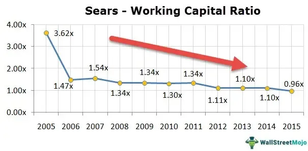

In the fast-paced world of business finance, possessing a thorough understanding of financial ratios and the concept of working capital is crucial for making informed decisions. This article will examine key financial ratios, elucidate the importance of working capital, and discuss the integration of algorithmic trading in modern finance. Financial ratios are vital analytical tools utilized for evaluating a company's performance and financial health, offering insights into various aspects such as liquidity, profitability, and solvency.

Working capital, on the other hand, serves as a fundamental yardstick for measuring a company's short-term liquidity and operational efficiency. Calculated by subtracting current liabilities from current assets, it provides an essential overview of a company's ability to cover its short-term obligations. Proper management of working capital is indispensable for maintaining sound cash flow and ensuring the uninterrupted operation of business activities.



Furthermore, algorithmic trading, often referred to as algo trading, is revolutionizing finance by leveraging technology to automate trading processes. This approach enhances efficiency and profitability by executing trades at optimal times based on predefined criteria. By minimizing human error and offering reduced transaction costs, algo trading facilitates high-frequency trades and can dynamically adapt to market conditions.

The interplay between traditional financial analysis and cutting-edge technological solutions like algorithmic trading marks a transformative era in finance. Understanding these foundational concepts is key to navigating financial markets and making strategic investment decisions. As technology continues to advance, integrating financial ratios with algorithmic systems presents new opportunities for improving asset allocation, risk management, and overall profitability.

## Table of Contents

## Understanding Financial Ratios

Financial ratios are essential tools in assessing the financial status of a company, providing insights into various dimensions such as liquidity, profitability, and solvency. They offer a quantitative analysis that is critical for investors, analysts, and managers to make informed decisions about a company's performance and long-term viability.

Liquidity ratios such as the current ratio and quick ratio are crucial for understanding a company’s ability to meet its short-term obligations. The current ratio, calculated as current assets divided by current liabilities, indicates a company's capacity to pay off its short-term debts with its available assets. A current ratio above 1 suggests that the company has more assets than liabilities, which is generally considered a positive sign. The quick ratio, also known as the acid-test ratio, refines this analysis by excluding inventory from current assets, offering a stricter view of liquidity.

Profitability ratios, including return on assets (ROA), are vital for evaluating how effectively a company uses its resources to generate earnings. ROA is calculated by dividing net income by total assets. It reflects how efficiently management is using the company’s assets to produce profits. A higher ROA indicates a more competent management team and better asset utilization.

Solvency ratios like the debt-to-equity ratio provide insights into a company’s financial leverage and long-term viability. This ratio is obtained by dividing total liabilities by shareholders' equity. It reveals the proportion of company financing that comes from creditors versus shareholders. A lower debt-to-equity ratio is generally favored as it indicates a more financially stable and less risky company.

These financial ratios not only help in evaluating a company's current performance but also enable comparisons with industry benchmarks, thereby assessing relative performance. They are crucial indicators that can signal potential issues or robust financial health. For example, consistently low [liquidity](/wiki/liquidity-risk-premium) ratios might indicate potential financial distress. In contrast, favorable profitability and solvency ratios can be indicative of a healthy financial status.

Overall, understanding and analyzing these financial ratios equips stakeholders with the necessary insights for strategic decision-making and financial planning.

## The Role of Working Capital

Working capital is a fundamental metric that indicates a company's operational efficiency and short-term financial health. It is calculated by subtracting current liabilities from current assets:

$$

\text{Working Capital} = \text{Current Assets} - \text{Current Liabilities} 
$$

This calculation provides critical insights into a company's ability to cover its short-term obligations with its short-term assets, such as cash, inventory, and receivables. A company with positive working capital is generally considered to be in a good position to cover its debts and continue its operations without financial strain.

A healthy working capital ratio, commonly expressed as current assets divided by current liabilities, typically falls between 1.5 and 2. This range suggests that the company has sufficient assets to cover its liabilities, with room for unexpected expenses or downturns:

$$

\text{Working Capital Ratio} = \frac{\text{Current Assets}}{\text{Current Liabilities}}
$$

Efficient working capital management is crucial as it can prevent cash flow problems, ensuring that the business can maintain its operations smoothly. Effective strategies might include optimizing inventory levels, speeding up accounts receivable, and strategically managing accounts payable.

By maintaining an appropriate level of working capital, businesses can improve their liquidity position, reduce the need for external borrowing, and enhance their overall financial flexibility. Companies that manage their working capital well often have a competitive edge, as they can respond quicker to market opportunities and withstand economic challenges more effectively.

## Algorithmic Trading: Revolutionizing Finance

Algorithmic trading utilizes computer algorithms to execute trades accurately and efficiently, in alignment with predefined criteria. This approach significantly minimizes human error, curbs transaction costs, and enables high-frequency trading ([HFT](/wiki/high-frequency-trading-strategies)), a practice characterized by executing a large number of orders at extremely high speeds. Notable strategies within the algo trading domain include trend-following strategies, which analyze historical data to identify potential market direction changes; [arbitrage](/wiki/arbitrage) opportunities, which exploit price differentials across different markets or instruments; and index fund rebalancing, which automates the adjustment of portfolio compositions to match a benchmark index.

Trend-following strategies rely heavily on algorithmic models to predict potential market movements based on historical data and prevailing trends. These strategies often employ technical indicators, such as moving averages, to guide trading decisions. For example, an exponential moving average (EMA) can provide a weighted average of past prices, highlighting recent price activity more heavily than older data.

Arbitrage, another popular algo trading strategy, seeks to capitalize on fleeting efficiency gaps between correlated assets across different markets. By simultaneously buying and selling equivalent assets to profit from price discrepancies, these algorithms lock in near-riskless profits before the market corrects itself.

Index fund rebalancing automates the process of adjusting portfolio holdings to reflect changes in market indices. This type of trading requires sophisticated algorithms to ensure trades are executed in a manner that closely mirrors the index, maintaining a low tracking error and minimizing transaction costs.

Despite its many advantages, [algorithmic trading](/wiki/algorithmic-trading) is met with challenges. The initial setup costs can be high due to the necessity of developing sophisticated software and investing in the required hardware infrastructure. Additionally, the dependence on technology makes it susceptible to system failures, network issues, and potential cybersecurity threats. Moreover, the regulatory aspects of algorithmic trading have attracted scrutiny, particularly concerning market manipulation and fairness. This has led to the establishment of various regulatory norms globally, tasked with monitoring and governing the usage of algorithmic trading to ensure market integrity and protect investors.

Overall, while algorithmic trading presents transformative benefits in financial markets, its implementation requires careful consideration of operational challenges and adherence to regulatory guidelines.

## Integrating Financial Ratios and Algo Trading

Integrating financial ratio analysis with algorithmic trading represents a significant advancement in financial markets, combining traditional financial metrics with modern technological solutions. Automated trading systems can leverage financial ratios to make informed decisions and dynamically adjust trading strategies based on real-time financial data. This integration allows for the analysis and interpretation of data at speeds and volumes beyond human capability, thus potentially enhancing the asset allocation, risk management, and profitability of trading strategies.

Financial ratios, such as the current ratio, quick ratio, and return on assets (ROA), provide valuable insights into various aspects of a company's financial health, including liquidity and operational efficiency. These metrics can be programmed into trading algorithms to automatically respond to changes in a company's financial condition. For example, an algorithm can be programmed to prioritize stocks with a strong return on assets or to trigger buy/sell actions based on changes in a company's debt-to-equity ratio.

Implementing this integration involves using sophisticated technologies that continuously update datasets and apply financial models to anticipate market movements. Machine learning and [artificial intelligence](/wiki/ai-artificial-intelligence) further enhance the capability of these systems by identifying patterns and predictions that inform trading decisions. For instance, a [machine learning](/wiki/machine-learning) model can be trained to predict stock price movements based on historical financial ratios and market conditions.

Python is an ideal programming language for developing such systems due to its extensive libraries and frameworks for financial data analysis and algorithmic trading. Libraries like Pandas and Numpy are invaluable for data manipulation, while libraries like Scikit-learn offer powerful tools for implementing machine learning algorithms. Below is a simple Python example that demonstrates how a basic algorithm might incorporate financial ratio data:

```python
import pandas as pd
from sklearn.linear_model import LinearRegression

# Sample financial data
data = pd.DataFrame({
    'current_ratio': [1.2, 1.5, 1.7, 1.4, 1.6],
    'ROA': [0.05, 0.07, 0.08, 0.06, 0.09],
    'market_movement': [1, 1, 0, 1, 0] # 1 for up, 0 for down
})

# Model setup
X = data[['current_ratio', 'ROA']]
y = data['market_movement']

model = LinearRegression()
model.fit(X, y)

# Predictive analysis
test_data = pd.DataFrame({'current_ratio': [1.8], 'ROA': [0.06]})
prediction = model.predict(test_data)

print("Predicted market movement:", "Up" if prediction >= 0.5 else "Down")
```

This simple model predicts market movement based on current ratio and return on assets, demonstrating how financial ratios can be incorporated into an algorithmic trading strategy.

As technology and data availability continue to advance, the integration of financial ratios in algorithmic trading will become more sophisticated, enhancing the efficiency and decision-making capabilities of financial systems. This evolution is crucial for navigating the complexities of modern finance and capitalizing on market opportunities.

## Conclusion

Understanding and applying financial ratios is crucial for evaluating a company's financial health and making informed investment decisions. These ratios offer a succinct view of a firm’s performance and stability, allowing stakeholders to gauge aspects such as liquidity, profitability, and solvency. By closely monitoring key metrics like the current ratio and return on assets, businesses can identify strengths and weaknesses in their operational and financial strategies, thereby guiding future decisions and investments.

Effective management of working capital is vital for sustaining business operations and ensuring short-term liquidity. This involves maintaining an optimal balance between current assets and liabilities to prevent cash flow disruptions. A working capital ratio typically between 1.5 and 2 indicates healthy liquidity levels, ensuring that a company can meet its near-term obligations without straining resources. This balance is critical for maintaining operational continuity and avoiding the pitfalls of financial distress.

Algorithmic trading is reshaping the financial landscape by providing enhanced efficiency and reduced costs in trading. The automation of trade execution through predefined criteria minimizes human errors and enables rapid transactions, capitalizing on market opportunities that may last only milliseconds. Despite challenges such as high initial costs and regulatory scrutiny, the benefits of high-frequency, cost-effective trades continue to drive widespread adoption of algorithmic systems.

The future of finance lies in the integration of traditional financial analysis with cutting-edge technological solutions like algorithmic trading. By incorporating real-time data and systematic trading strategies into financial decision-making, businesses can achieve enhanced asset allocation, improved risk management, and superior profitability. As technology and data analytics evolve, the sophistication and efficiency of financial systems are set to advance, revolutionizing the way markets operate and offering unprecedented opportunities for strategic growth and innovation.

## References & Further Reading

[1]: "Advances in Financial Machine Learning" by Marcos Lopez de Prado. Available at: [Amazon](https://www.amazon.com/Advances-Financial-Machine-Learning-Marcos/dp/1119482089).

[2]: "Evidence-Based Technical Analysis: Applying the Scientific Method and Statistical Inference to Trading Signals" by David Aronson. Available at: [Wiley](https://www.wiley.com/en-us/Evidence+Based+Technical+Analysis%3A+Applying+the+Scientific+Method+and+Statistical+Inference+to+Trading+Signals-p-9780470008744).

[3]: "Machine Learning for Algorithmic Trading" by Stefan Jansen. Available at: [Amazon](https://www.amazon.com/Machine-Learning-Algorithmic-Trading-alternative/dp/1839217715).

[4]: "Quantitative Trading: How to Build Your Own Algorithmic Trading Business" by Ernest P. Chan. Available at: [Amazon](https://www.amazon.com/Quantitative-Trading-Build-Algorithmic-Business/dp/0470284889).

[5]: Bergstra, J., Bardenet, R., Bengio, Y., & Kégl, B. (2011). "Algorithms for Hyper-Parameter Optimization." Advances in Neural Information Processing Systems 24. Available at: [NIPS](https://dl.acm.org/doi/10.5555/2986459.2986743).