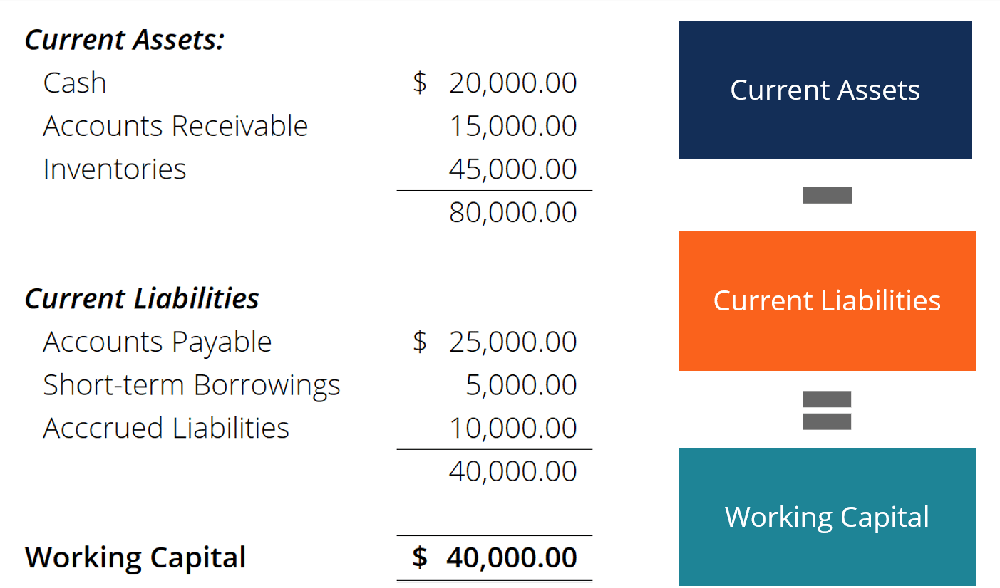

## Table of Contents

## What is the working capital ratio?

The working capital ratio, also known as the current ratio, is a measure used to assess a company's ability to pay off its short-term liabilities with its short-term assets. It is calculated by dividing a company's current assets by its current liabilities. This ratio helps investors and creditors understand whether a company has enough liquid assets to cover its immediate financial obligations.

A working capital ratio greater than 1 indicates that the company has more current assets than current liabilities, suggesting it can easily cover its short-term debts. A ratio below 1 means the company might struggle to meet its short-term obligations, which could be a red flag for potential investors or creditors. However, the ideal ratio can vary by industry, and a very high ratio might indicate that the company is not efficiently using its assets.

## How is the working capital ratio calculated?

The working capital ratio is figured out by dividing a company's current assets by its current liabilities. Current assets are things a company owns that can be turned into cash within a year, like money in the bank, inventory, and money owed by customers. Current liabilities are what a company owes and needs to pay within a year, like bills and loans.

This ratio helps people see if a company can pay its short-term bills. If the ratio is more than 1, it means the company has more assets than liabilities, so it should be able to pay its debts easily. If it's less than 1, the company might have trouble paying what it owes. But what's a good ratio can be different for different types of businesses.

## Why is the working capital ratio important for businesses?

The working capital ratio is important for businesses because it shows if they can pay their short-term bills. It tells business owners, investors, and lenders if the company has enough money and other things that can be quickly turned into cash to cover what they owe soon. If the ratio is more than 1, it means the business is in a good spot to pay its debts. This makes people feel more confident about the business's health and its ability to keep running smoothly.

On the other hand, if the working capital ratio is less than 1, it can be a warning sign. It means the business might not have enough money to pay what it owes, which could lead to problems like not being able to buy more supplies or pay workers. This can make it hard for the business to keep going and might scare away investors or make it tough to get loans. So, keeping an eye on this ratio helps businesses make sure they stay financially healthy and can plan better for the future.

## What does a working capital ratio of less than 1 indicate?

A working capital ratio of less than 1 means that a business does not have enough short-term assets to cover its short-term debts. This can be a warning sign that the company might struggle to pay its bills on time. When a business's current liabilities are more than its current assets, it might need to borrow more money or sell assets to meet its obligations, which can be risky.

Having a ratio below 1 can make it harder for a business to get loans or attract investors. Lenders and investors see a low working capital ratio as a sign that the business might be in financial trouble. This can lead to higher borrowing costs or difficulty in raising capital, which can make it even harder for the business to improve its financial situation.

## What does a working capital ratio greater than 1 suggest?

A working capital ratio greater than 1 suggests that a business has more short-term assets than short-term debts. This means the company can easily pay its bills that are due soon. Having more assets than liabilities is a good sign that the business is financially healthy and can keep running smoothly without worrying about money problems.

When a business has a working capital ratio above 1, it can make people like investors and lenders feel more confident. They see it as a sign that the business is doing well and can handle its debts. This can help the business get loans more easily and at better rates, and it might also attract more investment because people believe in its ability to succeed.

## What is considered a good working capital ratio?

A good working capital ratio is usually thought to be between 1.5 and 2. This means the business has enough short-term assets to cover its short-term debts and still have some money left over. Having a ratio in this range shows that the business is doing well and can pay its bills without trouble. It also gives the business some extra money to use for growth or to handle unexpected costs.

But what's considered a good working capital ratio can change depending on the type of business. Some industries might need more money to keep running smoothly, so they might aim for a higher ratio. On the other hand, a very high ratio might mean the business is not using its money wisely. It's important for a business to find the right balance that works for them and their industry.

## How does industry affect the standard for working capital ratio?

Different industries have different needs when it comes to money and how they use it, so what's considered a good working capital ratio can change from one industry to another. For example, a retail business might need a lot of money to keep enough products in stock, so they might aim for a higher working capital ratio to make sure they can buy more inventory when needed. On the other hand, a service business like a consulting firm might not need as much money tied up in stock, so they might be okay with a lower ratio because they don't have to worry about keeping lots of things in storage.

Also, some industries have different times of the year when they make more or less money, which can affect their working capital needs. A business that sells more during the holiday season might need a higher working capital ratio to prepare for the busy time, while a business with steady sales all year might be fine with a lower ratio. So, it's important for businesses to look at what's normal in their own industry to figure out what working capital ratio is best for them.

## How can a company improve its working capital ratio?

A company can improve its working capital ratio by increasing its current assets or decreasing its current liabilities. One way to increase current assets is by speeding up the collection of money from customers. If the company can get paid faster, it will have more cash on hand. Another way is to manage inventory better. By selling off old stock or buying less new stock, the company can free up money that was tied up in goods. A company can also look for ways to bring in more money, like offering new products or services.

On the other hand, a company can decrease its current liabilities by paying off debts sooner or negotiating better terms with suppliers. If the company can delay when it has to pay its bills without hurting its relationship with suppliers, it can keep more money in the bank for a longer time. Sometimes, a company might also choose to take out a long-term loan to pay off short-term debts, which can help improve the working capital ratio because it moves the debt out of the short-term category. By carefully managing both assets and liabilities, a company can work towards a healthier working capital ratio.

## What are the limitations of using the working capital ratio as a financial metric?

The working capital ratio is a helpful tool, but it has some limits. One big problem is that it only looks at the total numbers of current assets and current liabilities. It doesn't think about how quickly the company can turn those assets into cash. For example, if a company has a lot of inventory that's hard to sell, the working capital ratio might look good, but the company might still have trouble paying its bills on time. Also, the ratio doesn't show how well the company is using its money. If the ratio is very high, it might mean the company is not using its cash efficiently.

Another issue with the working capital ratio is that it can be different from one industry to another. What's a good ratio in one type of business might not be good in another. So, just looking at the ratio without knowing the industry can lead to wrong ideas about how healthy a company's money situation is. Plus, the working capital ratio is just a snapshot at one point in time. It doesn't show changes over time or future money needs, which can be important for understanding the full picture of a company's financial health.

## How does the working capital ratio relate to liquidity and solvency?

The working capital ratio is a good way to see if a company can pay its short-term bills, which is what [liquidity](/wiki/liquidity-risk-premium) is all about. Liquidity means having enough money or things you can quickly turn into money to cover what you owe soon. If a company's working capital ratio is more than 1, it means it has enough short-term assets to pay off its short-term debts, so it's pretty liquid. But if the ratio is less than 1, the company might not have enough money to pay its bills, which means it's not very liquid and could be in trouble.

The working capital ratio also gives a hint about solvency, but it's not the whole story. Solvency is about being able to pay all your debts, both short-term and long-term, over time. A good working capital ratio shows that a company can handle its short-term debts, which is a part of being solvent. But to really understand if a company is solvent, you need to look at more than just the working capital ratio. You need to check all the debts and see if the company can keep making money to pay them off in the long run.

## Can the working capital ratio be used to predict financial distress?

The working capital ratio can give some clues about if a company might be heading into financial trouble, but it's not perfect for predicting financial distress all by itself. If the working capital ratio drops below 1, it means the company doesn't have enough short-term assets to pay its short-term debts. This can be a warning sign that the company might struggle to pay its bills soon, which could lead to financial problems. But, just looking at this ratio isn't enough because it doesn't show the whole picture of a company's money situation.

To really predict financial distress, you need to look at more than just the working capital ratio. Other things like how much cash the company has, how well it's making money, and how much debt it has overall are important too. The working capital ratio is just one piece of the puzzle. It's helpful to use it along with other financial measures to get a better idea of whether a company might be in trouble.

## How do different accounting practices impact the working capital ratio?

Different ways of doing accounting can change the working capital ratio. For example, if a company uses the cash method of accounting instead of the accrual method, it can make the working capital ratio look different. With the cash method, a company only counts money when it gets paid or when it pays out. This means the working capital ratio might go up when the company gets paid a lot and go down when it has to pay a lot of bills. But with the accrual method, the company counts money when it earns it or owes it, even if the cash hasn't moved yet. This can make the working capital ratio more stable but might not show the real cash situation as clearly.

Also, how a company decides to value its inventory can affect the working capital ratio. If a company uses the Last-In, First-Out (LIFO) method, it might show lower inventory values and lower current assets, making the working capital ratio lower. On the other hand, using the First-In, First-Out (FIFO) method could show higher inventory values and higher current assets, making the working capital ratio higher. Different accounting choices like these can make it hard to compare the working capital ratios of different companies, especially if they use different methods.

## What is the Role of Working Capital?

Working capital is a fundamental metric that indicates a company's operational efficiency and short-term financial health. It is calculated by subtracting current liabilities from current assets:

$$

\text{Working Capital} = \text{Current Assets} - \text{Current Liabilities} 
$$

This calculation provides critical insights into a company's ability to cover its short-term obligations with its short-term assets, such as cash, inventory, and receivables. A company with positive working capital is generally considered to be in a good position to cover its debts and continue its operations without financial strain.

A healthy working capital ratio, commonly expressed as current assets divided by current liabilities, typically falls between 1.5 and 2. This range suggests that the company has sufficient assets to cover its liabilities, with room for unexpected expenses or downturns:

$$

\text{Working Capital Ratio} = \frac{\text{Current Assets}}{\text{Current Liabilities}}
$$

Efficient working capital management is crucial as it can prevent cash flow problems, ensuring that the business can maintain its operations smoothly. Effective strategies might include optimizing inventory levels, speeding up accounts receivable, and strategically managing accounts payable.

By maintaining an appropriate level of working capital, businesses can improve their liquidity position, reduce the need for external borrowing, and enhance their overall financial flexibility. Companies that manage their working capital well often have a competitive edge, as they can respond quicker to market opportunities and withstand economic challenges more effectively.

## References & Further Reading

[1]: "Advances in Financial Machine Learning" by Marcos Lopez de Prado. Available at: [Amazon](https://www.amazon.com/Advances-Financial-Machine-Learning-Marcos/dp/1119482089).

[2]: "Evidence-Based Technical Analysis: Applying the Scientific Method and Statistical Inference to Trading Signals" by David Aronson. Available at: [Wiley](https://www.wiley.com/en-us/Evidence+Based+Technical+Analysis%3A+Applying+the+Scientific+Method+and+Statistical+Inference+to+Trading+Signals-p-9780470008744).

[3]: "Machine Learning for Algorithmic Trading" by Stefan Jansen. Available at: [Amazon](https://www.amazon.com/Machine-Learning-Algorithmic-Trading-alternative/dp/1839217715).

[4]: "Quantitative Trading: How to Build Your Own Algorithmic Trading Business" by Ernest P. Chan. Available at: [Amazon](https://www.amazon.com/Quantitative-Trading-Build-Algorithmic-Business/dp/0470284889).

[5]: Bergstra, J., Bardenet, R., Bengio, Y., & Kégl, B. (2011). "Algorithms for Hyper-Parameter Optimization." Advances in Neural Information Processing Systems 24. Available at: [NIPS](https://dl.acm.org/doi/10.5555/2986459.2986743).