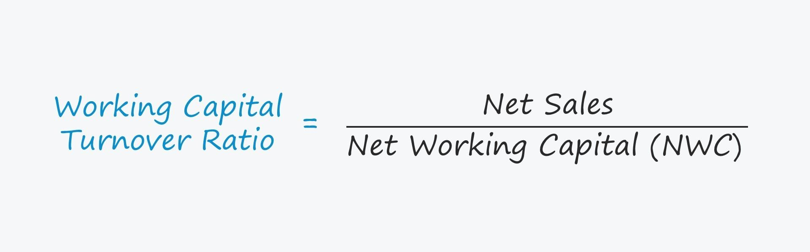

The financial world is constantly undergoing transformation as businesses and investors relentlessly pursue sustainability and growth within competitive markets. A vital component of this endeavor is financial analysis, which provides critical insights into a company's performance and strategic direction. Central to financial analysis is the understanding and application of various financial ratios, with the Working Capital Turnover Ratio being notably significant. This ratio serves as an indicator of how efficiently a company utilizes its working capital to generate sales, supporting operational efficiency evaluations and investment decision-making.

Simultaneously, technological advancements have given rise to algorithmic trading, a sophisticated approach to financial markets. Algorithmic trading employs computer programs to execute trading strategies based on predefined criteria, capable of processing large volumes of data at high speed. This methodology permits faster and more accurate results than traditional manual trading and incorporates various financial ratios, including the Working Capital Turnover Ratio, to identify trading opportunities.



The intersection of financial analysis, working capital turnover ratios, and algorithmic trading is an emerging area of interest. By integrating these elements, businesses can optimize their operational strategies and investors can enhance their trading precision. As technology continues to evolve, the synergy between financial analysis and algorithmic trading is expected to grow, underscoring the importance of adaptability and continual learning for staying competitive in financial markets.

## Table of Contents

## Understanding Working Capital Turnover Ratio

The Working Capital Turnover Ratio is a financial metric crucial for understanding how efficiently a company utilizes its working capital to drive sales. This ratio is calculated using the formula:

$$
\text{Working Capital Turnover} = \frac{\text{Net Sales}}{\text{Average Working Capital}}
$$

Here, net sales represent the total revenue from a company's core business operations, while average working capital is derived by subtracting current liabilities from current assets, averaged over a specific period.

A high Working Capital Turnover Ratio suggests that a company is managing its working capital efficiently, converting its assets into sales effectively. This can indicate strong operational performance and a robust capability to meet short-term liabilities with ease. Companies achieving a high ratio are generally seen as efficient in managing their inventories, receivables, and payables, leading to improved [liquidity](/wiki/liquidity-risk-premium) and profitability.

On the other hand, a low Working Capital Turnover Ratio may point to operational inefficiencies. This can arise from several factors, such as overinvestment in inventories, slow-moving stock, or excessive credit periods extended to customers. Such inefficiencies can impede a company’s ability to generate sales and meet short-term obligations, potentially leading to liquidity issues.

Financial analysts and investors utilize this ratio to gain insights into a company's operational efficiency. They assess whether the company is effectively converting its working capital into sales, maintaining optimal levels of inventories, efficiently managing receivables, and paying off short-term debts in a timely manner. This understanding aids stakeholders in making informed decisions regarding investment, credit, and strategic management initiatives.

By evaluating the Working Capital Turnover Ratio, stakeholders can ascertain whether a company is functioning efficiently and sustaining its market position effectively. As part of broader financial analysis, this ratio is indispensable for strategic planning and optimizing operational processes to foster growth and stability.

## Algorithmic Trading: An Overview

Algorithmic trading, commonly referred to as algo trading, is the use of computer programs to execute trading strategies based on a set of predefined criteria. These criteria are often designed to capitalize on market inefficiencies or to execute orders at optimal times and prices. By leveraging algorithms, traders can process large volumes of data at high speeds, often achieving results more quickly and accurately than through traditional manual trading methods. This speed and precision can lead to higher profitability and reduced transaction costs due to improved execution strategies.

A key advantage of [algorithmic trading](/wiki/algorithmic-trading) is its ability to incorporate various financial metrics, including financial ratios like the working capital turnover ratio, to identify potential trading opportunities. By integrating these ratios, algorithms can make informed decisions about market entries and exits, enhancing the precision and consistency of trading strategies. For example, an algorithm might be programmed to identify stocks with favorable working capital turnover ratios, signaling operational efficiency, and thus potential for growth. This ability to systematically utilize financial data underscores the importance of metrics in shaping successful trading approaches.

Despite the numerous benefits, algorithmic trading is not without its challenges. The technology required to support sophisticated algorithms is often costly and complex, necessitating substantial investment in both hardware and software. Additionally, there is a risk of algorithmic errors, which can arise from coding mistakes or unforeseen market conditions. These errors can lead to significant financial losses if not identified and rectified swiftly.

Moreover, algorithmic trading requires a thorough understanding of market dynamics and the ability to adapt to changes. The success of an algorithm hinges on the quality of its design—algorithms must be continually updated and tested to ensure they remain effective under a range of market conditions. Traders and firms must also remain vigilant about regulatory compliance, as the use of algorithms in financial markets is subject to increased scrutiny to prevent market manipulation and ensure fair trading practices.

In summary, algorithmic trading represents a significant advancement in the field of financial markets, offering enhanced efficiency and effectiveness in executing trading strategies. However, the complexity and potential risks associated with algo trading highlight the need for skilled execution and careful management.

## The Role of Working Capital Turnover in Algo Trading

Incorporating financial ratios, such as the working capital turnover ratio, into algorithmic trading strategies offers traders a significant advantage. This ratio is pivotal in evaluating a company's liquidity and operational efficiency, which are critical factors for long-term investment decisions. By assessing how effectively a company utilizes its working capital to generate sales, investors can gain insights into the company’s operational prowess and financial health.

High-frequency traders, who benefit from executing trades with remarkable speed, can utilize fluctuations in working capital turnover ratios as a metric for rapid decision-making. When these ratios indicate a shift—be it an improvement or a decline—algorithms can be programmed to execute buy or sell orders swiftly, capitalizing on market movements. This dynamic utilization allows traders to maintain a competitive edge, as their operations can swiftly align with real-time financial data.

Algorithmic trading strategies can be fine-tuned to react to changes in working capital turnover, providing adaptability in investment strategies. This adaptability ensures that trading activities are aligned with ongoing financial performance assessments, optimizing returns. The integration of financial ratios into algorithmic systems underscores the importance of rigorous financial analysis in the creation of effective trading strategies.

To implement such strategies programmatically, algorithms can be developed using Python, a prevalent language in finance due to its robust libraries and easy code readability. Consider the following Python snippet as a basic representation of how an algorithm might incorporate working capital turnover:

```python
def calculate_working_capital_turnover(net_sales, average_working_capital):
    return net_sales / average_working_capital

def trading_signal(turnover_ratio, threshold_buy, threshold_sell):
    if turnover_ratio > threshold_buy:
        return "Buy"
    elif turnover_ratio < threshold_sell:
        return "Sell"
    else:
        return "Hold"

# Example usage with hypothetical values
net_sales = 150000
average_working_capital = 30000
threshold_buy = 5.0
threshold_sell = 3.0

turnover_ratio = calculate_working_capital_turnover(net_sales, average_working_capital)
signal = trading_signal(turnover_ratio, threshold_buy, threshold_sell)

print(f"Working Capital Turnover Ratio: {turnover_ratio}")
print(f"Trading Signal: {signal}")
```

In this example, the algorithm calculates the working capital turnover ratio and assesses it against predefined thresholds to generate trading signals. The ability to respond to real-time changes in financial metrics highlights the dynamic nature of algorithmic systems, which, when grounded in solid financial analysis, can effectively navigate complex market scenarios. This strategic integration of financial metrics into trading algorithms is anticipated to play an increasingly significant role in future trading methodologies, blending traditional financial analysis with technological innovation.

## Challenges and Considerations

Despite its advantages, working capital analysis in algorithmic trading requires careful management. One of the main challenges is market [volatility](/wiki/volatility-trading-strategies), which can lead to rapid changes in financial metrics. This volatility can make it difficult for algorithms to produce accurate predictions consistently. For example, fluctuations in economic conditions can cause unexpected shifts in a company’s working capital, impacting the working capital turnover ratio and subsequently the outcomes of trading strategies based on this ratio.

There is also the risk of over-reliance on specific financial ratios, such as the working capital turnover ratio. Relying heavily on a single metric may not provide a complete picture of a company’s financial health or market potential. A comprehensive analysis often requires a combination of multiple financial ratios and qualitative factors to form a more holistic understanding.

Developing and maintaining sophisticated algorithms is another significant challenge. This process requires substantial investment in technology and expertise. Financial institutions need to employ skilled professionals knowledgeable in both finance and technology to design, implement, and refine these algorithms. Additionally, the software and hardware required for high-frequency trading demand significant resources and continual updates to keep pace with technological advancements.

Organizations must also ensure their algorithms comply with regulatory standards to avoid legal complications. Regulatory frameworks governing financial markets are continually evolving, and algorithms must be designed to operate within these legal boundaries. Failure to comply with such regulations can result in severe financial penalties and reputational damage. Therefore, businesses engaged in algorithmic trading must invest in regular compliance checks and updates to their systems to adhere to legal standards and maintain market integrity.

These challenges necessitate a careful and strategic approach to leveraging algorithmic trading for financial analysis, ensuring that both technological investments and risk management strategies are robust and adaptable.

## Conclusion

The integration of the working capital turnover ratio within algorithmic trading represents a significant milestone in the ongoing evolution of financial analysis. This intersection underscores the critical importance of financial ratios in enabling businesses to achieve operational efficiency and sustainable growth. As companies strive to optimize their operations in competitive markets, leveraging these financial metrics provides actionable insights that can guide strategic decisions.

Technological advancements continue to reshape the landscape of financial markets, enhancing the synergy between traditional financial analysis and algorithmic trading. This convergence allows for more precise and data-driven investment strategies, enabling traders and investors to respond swiftly to market dynamics. By incorporating real-time analytical capabilities, algorithms make it possible to adapt strategies based on updated financial insights, such as fluctuations in working capital turnover ratios.

Investors and traders must remain vigilant and adaptable, harnessing technological innovations to maintain competitive advantage. The rapid pace of technological change demands a flexible approach to trading and investment strategies. Staying informed about the latest developments in financial technology and algorithmic trading techniques is crucial for sustaining success in the marketplace.

Looking to the future, the trajectory of financial markets suggests a continued blending of analytical rigor with technological innovation. This integration is expected to create new opportunities for efficiency gains and more informed decision-making. As financial algorithms grow increasingly sophisticated, their ability to integrate comprehensive financial analysis will likely become even more pronounced, driving future trends in investment and trading strategies.

## References & Further Reading

[1]: Bergstra, J., Bardenet, R., Bengio, Y., & Kégl, B. (2011). ["Algorithms for Hyper-Parameter Optimization."](https://papers.nips.cc/paper/4443-algorithms-for-hyper-parameter-optimization) Advances in Neural Information Processing Systems 24.

[2]: ["Advances in Financial Machine Learning"](https://www.amazon.com/Advances-Financial-Machine-Learning-Marcos/dp/1119482089) by Marcos Lopez de Prado

[3]: ["Evidence-Based Technical Analysis: Applying the Scientific Method and Statistical Inference to Trading Signals"](https://www.amazon.com/Evidence-Based-Technical-Analysis-Scientific-Statistical/dp/0470008741) by David Aronson

[4]: ["Machine Learning for Algorithmic Trading"](https://github.com/stefan-jansen/machine-learning-for-trading) by Stefan Jansen

[5]: ["Quantitative Trading: How to Build Your Own Algorithmic Trading Business"](https://www.amazon.com/Quantitative-Trading-Build-Algorithmic-Business/dp/1119800064) by Ernest P. Chan