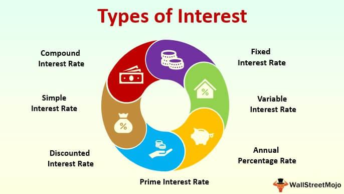

Working interest in the oil and gas industry refers to a stakeholder's proportionate ownership and responsibilities in a joint venture related to exploration, development, and production of oil and gas resources. This investment structure allows both companies and individuals to directly partake in the development and revenue from the venture, making it a key concept for investors aiming to capitalize on the oil and gas sector's potential returns. Unlike royalties, which provide a passive income stream, a working interest involves active engagement in operational decisions and financial obligations, including the costs associated with drilling and production. As such, working interests are crucial for professionals seeking to gain strategic control and influence over production activities.

For investors, working interest represents a significant opportunity to benefit from the growth and profitability associated with energy ventures. Investors can potentially enjoy substantial returns, albeit balanced against risks such as operational costs and market fluctuations. The financial implications of holding a working interest are compelling, as they offer both tax advantages and exposure to direct collaboration in the energy sector's operations.



Algorithmic trading has emerged as a transformative tool in refining investment strategies within the oil and gas sector. This technology-driven approach leverages algorithms to analyze data, optimize trading decisions, and improve risk management. By mitigating the complexities inherent in oil and gas investments, algorithmic trading can enhance the investment portfolio's performance. Its capability to process vast amounts of market data in real-time provides investors with an edge in navigating market volatility, further cementing its role in modernizing investment approaches in sectors characterized by intricate market dynamics like oil and gas.

In combination, working interests and algorithmic trading represent a dynamic integration of traditional energy investments with cutting-edge technological advancements, promising investors a sophisticated approach to maximizing returns while managing associated risks.

## Table of Contents

## Understanding Working Interest in Oil and Gas

Working interest in the oil and gas industry refers to a type of ownership stake in an oil or gas lease, granting the holder the right to explore, develop, and produce resources from a specified land area. This type of interest is crucial for investors and industry professionals as it directly involves them in the operational aspects of oil and gas production, often correlating with significant financial and strategic responsibilities. 

A working interest comprises several components, including the rights to conduct drilling operations, invest in infrastructure, and share in the revenues from produced hydrocarbons. Holders of a working interest are entitled to their proportionate share of production and are similarly responsible for their proportionate share of production expenses. This encompasses both capital costs, such as drilling and equipping wells, and operating costs like maintenance and environmental compliance.

**Operated vs. Non-operated Working Interests**

The distinction between operated and non-operated working interests is fundamental in the management and operational control of oil and gas activities. An operated working interest refers to ownership that grants the holder operational control over the field. Consequently, the operator is responsible for making decisions regarding the day-to-day operations, maintenance scheduling, and compliance with regulations. Operators are expected to have the technical capability and resources necessary to effectively manage a producing field.

Conversely, a non-operated working interest does not confer operational control; instead, it involves a financial stake in the project without direct management responsibilities. Non-operated interest holders rely on the operator to make decisions and undertake operational tasks while still covering their share of costs. This type of interest often suits investors who lack the capacity or intent to engage in direct management but wish to participate financially in oil and gas projects.

**Financial Implications and Responsibilities**

Holding a working interest, whether operated or non-operated, involves significant financial implications. Investors must be prepared to fund their proportional share of costs associated with exploration, development, and production. These financial commitments can be considerable, given the capital-intensive nature of oil and gas operations. Moreover, the [volatility](/wiki/volatility-trading-strategies) of oil and gas prices can affect profitability and cash flow timing.

In addition to capital expenditure, working interest holders are liable for ongoing operational expenses. This includes employee salaries, equipment maintenance, production costs, and environmental mitigation measures. As a result, careful financial planning and risk management are essential when holding such interests.

In summary, working interest in oil and gas provides a pivotal role in the sector by offering investors operational involvement and potential profitability while necessitating a thorough understanding of the financial and operational obligations associated with ownership.

## Algorithmic Trading: A Modern Approach to Oil and Gas Investment

Algorithmic trading involves using complex algorithms to make trading decisions and execute orders in financial markets at high speed and frequency. In the oil and gas industry, it serves as an innovative approach to managing investment portfolios by leveraging large datasets and quantitative techniques to identify profitable opportunities.

One of the primary benefits of [algorithmic trading](/wiki/algorithmic-trading) in managing complex investment portfolios is its ability to process vast amounts of data quickly and efficiently. This capacity allows investors to analyze multiple variables simultaneously, enabling more informed and timely decision-making. Algorithmic trading systems can be designed to recognize patterns or correlations within market data that might be imperceptible to human traders. This enhanced analytical power helps optimize investment strategies and improve returns.

Moreover, algorithmic trading facilitates a disciplined and systematic approach to investing. By predetermining the criteria and logic for trade execution, investors can mitigate the influence of human emotions and biases, leading to more consistent and reliable outcomes. Algorithms can be programmed to automatically execute trades when market conditions meet predefined parameters, ensuring that opportunities are not missed due to human error or delay.

In oil and gas investments, data and algorithms play a crucial role in optimizing returns. Market dynamics in this sector are influenced by various factors, including geopolitical events, supply and demand fluctuations, and regulatory changes. By utilizing algorithmic trading, investors can quickly adjust their strategies in response to these factors, maximizing profit or minimizing loss. The use of predictive models and [machine learning](/wiki/machine-learning) algorithms can also enhance the accuracy of forecasts and decision-making.

For instance, an algorithm designed to trade oil stocks might analyze real-time data such as [crude oil](/wiki/crude-oil) inventory reports, currency fluctuations, and historical price movements to predict future prices and execute trades accordingly. Python is a preferred language for implementing these algorithms due to its extensive library support and ease of use for data analysis and machine learning. A basic example of a Python algorithm for trading based on moving averages could use the pandas and NumPy libraries to calculate and compare short-term and long-term moving averages, generating buy or sell signals when the former crosses the latter.

An example of code for this strategy is:

```python
import pandas as pd
import numpy as np

def moving_average_strategy(data, short_window=40, long_window=100):
    signals = pd.DataFrame(index=data.index)
    signals['price'] = data['close']
    signals['short_mavg'] = data['close'].rolling(window=short_window, min_periods=1, center=False).mean()
    signals['long_mavg'] = data['close'].rolling(window=long_window, min_periods=1, center=False).mean()
    signals['signal'] = 0.0
    signals['signal'][short_window:] = np.where(signals['short_mavg'][short_window:] 
                                                > signals['long_mavg'][short_window:], 1.0, 0.0)
    signals['positions'] = signals['signal'].diff()

    return signals
```

In this example, the algorithm calculates the short-term and long-term moving averages of a stock's closing prices. When the short-term moving average crosses above the long-term moving average, it generates a buy signal; when it crosses below, it generates a sell signal. Such strategies can be customized and scaled to encompass more complex decision-making processes tailored to the oil and gas market.

Overall, algorithmic trading empowers investors in the oil and gas industry by providing sophisticated tools to manage risks and enhance profitability. The continuous evolution of data analytics and machine learning technologies promises further advancements in refining these strategies, making algorithmic trading an indispensable aspect of modern investment management.

## Integration of Working Interest with Algorithmic Trading

Algorithmic trading is increasingly influencing the management of investments in the oil and gas industry, particularly concerning working interest. Working interest involves a fractional ownership in an oil or gas lease, entitling the holder to a portion of the revenues once production commences, but also requiring the holder to bear a commensurate portion of the operational costs. By leveraging algorithmic trading, investors can better manage the inherent risks and potentially enhance profit margins from these ventures.

Algorithmic trading systems utilize computational algorithms to execute trades at speeds and frequencies unreachable by human traders. These systems are adept at analyzing large datasets and making decisions based on predetermined rules to optimize returns. For working interest investments, which can be influenced by market volatility, changing oil prices, and operational costs, algorithmic trading offers a means to manage these risks dynamically and efficiently.

**Risk Management and Profit Maximization**

Algorithmic trading can be applied in various ways to manage risks associated with working interest. For instance, algorithmic models can be designed to predict fluctuations in oil and gas prices using historical data, market trends, and external economic indicators. By doing so, investors can make informed decisions about when to increase or decrease their holdings in a particular lease. For example, a mean-reversion algorithm might analyze past price cycles to forecast when prices are likely to revert to a mean, suggesting optimal entry and [exit](/wiki/exit-strategy) points for positions.

Let's consider a simple strategy using Python, where an investor might use a moving average crossover technique. In this strategy, a shorter-term moving average (e.g., 50 days) is compared with a longer-term moving average (e.g., 200 days). When the shorter-term average crosses above the longer-term average, it could signify a buying opportunity, while the reverse might suggest selling.

```python
import pandas as pd
import numpy as np

def moving_average_strategy(prices):
    short_window = 50
    long_window = 200

    signals = pd.DataFrame(index=prices.index)
    signals['price'] = prices
    signals['short_mavg'] = prices.rolling(window=short_window, min_periods=1).mean()
    signals['long_mavg'] = prices.rolling(window=long_window, min_periods=1).mean()
    signals['signal'] = 0

    signals['signal'][short_window:] = np.where(
        signals['short_mavg'][short_window:] > signals['long_mavg'][short_window:], 1.0, 0.0)

    signals['positions'] = signals['signal'].diff()

    return signals

# Assuming `oil_prices` is a Pandas Series with historical oil prices
signals = moving_average_strategy(oil_prices)
```

In this example, when the short-term moving average crosses above the long-term moving average, a signal is generated to buy working interests; when it falls below, a sell signal is generated.

**Examples and Integration**

There are notable instances where algorithmic strategies have been successfully integrated into working interest investments. Some investment firms employ complex algorithms, combining factors such as geopolitical analysis, economic indicators, and logistics data from pipeline companies, as part of their decision-making processes. These algorithms can determine optimal lease bidding strategies, cost reduction measures, and risk mitigation approaches.

**Challenges and Solutions**

Integration of algorithmic trading with working interest investments does not come without challenges. One significant challenge is the availability and quality of data required to drive these algorithms. Oil and gas data can be fragmented and siloed across different companies and industries. Ensuring data integrity and quality is paramount for effective algorithm application.

Furthermore, developing sophisticated algorithms requires technical expertise and substantial initial investment. Firms may need to hire teams of data scientists and technology experts to build and maintain these systems. Additionally, there's always the inherent risk of overfitting in algorithm models, where the model performs well on historical data but poorly in live trading environments.

To address these challenges, firms can invest in robust data management platforms and establish collaborations with data providers and analytics companies. Regular [backtesting](/wiki/backtesting) and validation of algorithms on unseen data can help mitigate risks of overfitting and improve model reliability.

In conclusion, algorithmic trading presents a powerful method for optimizing the management of working interest investments in oil and gas. By systematically applying data-driven strategies to manage risk and enhance returns, investors can achieve more consistent performance and make adaptive investment decisions in an ever-changing market environment.

## Advantages and Disadvantages of Working Interest

Working interest in the oil and gas industry presents a compelling investment opportunity, offering unique advantages and inherent challenges. Understanding these aspects can guide investors in making informed decisions.

### Benefits of Investing in Working Interest

#### Potential High Returns

Investing in a working interest can yield substantial financial returns. As a working interest holder, an investor is entitled to a share of the revenue generated from the sale of oil and gas. This revenue potential is primarily driven by market demand, which can lead to significant profits when commodity prices are favorable.

#### Tax Advantages

One of the most attractive features of working interest investments is the potential tax benefits. Investors may deduct intangible drilling costs (IDCs) and tangible drilling costs. IDCs cover expenses related to non-salvageable items necessary for the drilling process, such as labor and materials. These costs can be deducted immediately, which can significantly reduce taxable income. Additionally, tangible costs, which include equipment and facilities that have salvage value, are typically depreciated over time, allowing further tax deferrals.

### Disadvantages of Working Interest

#### High Initial Costs

Entering into a working interest agreement often requires substantial capital investment. The costs associated with leasing, drilling, and completing a well can be prohibitively high. This initial financial commitment makes it a less accessible option for smaller investors and necessitates careful consideration of the potential risks and rewards.

#### Potential Risks

Working interest holders are exposed to several risks, including operational challenges, fluctuating market conditions, and environmental liabilities. Unlike royalty interest holders, who receive a percentage of production revenues without operational responsibility, working interest owners must manage and fund their share of production costs. This includes costs associated with exploration, drilling, and operational setbacks, which can erode profits if not managed effectively.

### Comparison with Other Oil and Gas Investments

Compared to other investment vehicles in the oil and gas sector, such as royalty interest and master limited partnerships (MLPs), working interest offers a more direct exposure to the industry's operational side. While royalty interest provides passive income with minimal risk, it lacks the high-return potential of working interests. MLPs, on the other hand, offer tax-advantaged income distributions and typically require lower initial investments, appealing to a broader investor base.

In conclusion, investing in a working interest can be financially rewarding but carries significant risks and costs. A thorough examination of these factors, combined with a strategic approach, can enhance decision-making and align investments with individual financial goals.

## Legal and Tax Considerations

Working interest holders in the oil and gas industry face a variety of legal obligations that require careful consideration and adherence. At the core, these obligations stem from the joint operating agreements (JOAs) and leases associated with the ownership of the working interest. Under JOAs, working interest owners are responsible for their proportionate share of all costs related to exploration, drilling, and production activities. This includes adhering to regulatory requirements set by governmental bodies and environmental agencies, which may dictate specific operational practices and reporting standards.

From a tax perspective, investing in working interests offers several benefits and implications. A significant advantage lies in the ability to deduct intangible drilling costs (IDCs) from taxable income. IDCs, which include expenses such as labor, fuel, and drilling fluids, can often be fully deducted in the year they are incurred, providing immediate tax relief. Additionally, tangible drilling costs, such as equipment and machinery, can be depreciated over time, further reducing tax liabilities.

Investors should also be aware of potential income tax implications. Revenue generated from working interests is generally taxed as ordinary income, and investors must also consider any potential state taxes that may apply, depending on where the production takes place. Moreover, the tax treatment can vary significantly if the working interest is held within a partnership or a corporation, affecting how income and expenses are reported and taxed.

Given the complexity of legal and tax issues surrounding working interests, engaging with legal and tax professionals is vital for effective management of these investments. Legal advisors can provide guidance on compliance with regulatory requirements, help navigate lease agreements, and assist in resolving any disputes that may arise. Similarly, tax professionals can offer strategic advice on maximizing deductions, understanding tax liabilities, and ensuring compliance with all applicable tax laws.

In summary, the legal and tax considerations associated with working interests are intricate and necessitate informed decision-making. Properly understanding these aspects not only ensures compliance but also optimizes the financial benefits derived from such investments.

## Future Prospects and Trends

The future of working interest investments in the oil and gas industry is set against a backdrop of significant changes within the energy landscape. As technological advancements proceed alongside a growing shift towards renewable energy, stakeholders in working interest investments must adapt to new trends and challenges to remain competitive and profitable.

Technological advancements have had a profound impact on the oil and gas sector, driving efficiency and reducing costs. Innovations such as hydraulic fracturing and horizontal drilling have unlocked previously inaccessible reserves, thereby enhancing production capabilities. Additionally, digital technologies including the Internet of Things (IoT), big data analytics, and machine learning are revolutionizing exploration and production processes. These technologies enable real-time monitoring and predictive maintenance, optimizing asset management and reducing operational risks.

As the global focus increasingly shifts towards cleaner energy sources, the oil and gas industry faces pressure to adapt. Renewable energy capacity is growing rapidly, and investments in solar, wind, and other sustainable energy sources are escalating. This shift presents both a challenge and an opportunity for working interest investments. Investors are starting to evaluate the long-term viability of oil and gas projects, factoring in potential declines in demand and stricter environmental regulations. Consequently, diversification strategies that include renewable energy assets are becoming more popular among forward-thinking investors.

Sustainability is becoming a critical component of corporate strategy in the oil and gas industry. Companies are increasingly committing to reducing their carbon footprint and adopting more sustainable practices in response to shareholder expectations and regulatory requirements. This trend necessitates incorporating Environmental, Social, and Governance ([ESG](/wiki/esg-investing)) criteria into investment strategies. Working interest holders must align their operations with these evolving priorities to ensure continued access to capital and market opportunities.

Regulatory changes are another [factor](/wiki/factor-investing) shaping the future of working interest investments. As governments implement policies aimed at reducing emissions and transitioning to cleaner energy, the oil and gas industry faces stricter compliance obligations. Adapting to these regulations may require significant investment in technology and process improvements, affecting the financial dynamics of working interest holdings. Investors must remain informed about policy developments and ensure that their investment strategies are resilient to potential regulatory shifts.

In conclusion, the future prospects of working interest investments are closely tied to technological, environmental, and regulatory changes within the energy sector. Stakeholders must embrace innovation, adapt to emerging trends, and incorporate sustainability into their investment strategies to thrive in the evolving landscape. As the industry transforms, informed decision-making and strategic agility will be paramount for capturing opportunities and mitigating risks.

## Conclusion

The discussion in this article has highlighted the integral role of working interest in the oil and gas industry, serving as a pivotal mechanism for investors seeking engagement in the exploration and production phase while bearing the corresponding rights and responsibilities. In tandem, algorithmic trading emerges as a transformative tool in managing these investments with precision, optimizing returns through sophisticated data analysis and automated decision-making. The synergy between working interest and algorithmic trading offers a robust framework for enhancing investment strategies, ensuring both risk management and profitability are maximized.

This blend of traditional investment avenues in oil and gas with modern technological solutions exemplifies the dynamic nature of investment strategies today. As the industry continues to evolve amidst advancements in technology and shifts towards renewable energy, the importance of informed decision-making cannot be overstated. Potential investors must consider both the promising high returns and the inherent risks associated with working interests, evaluating their portfolios with a keen eye on both the regulatory landscape and sustainable practices.

Ultimately, smart investing in oil and gas demands a comprehensive understanding of working interest intricacies and algorithmic tools, encouraging investors to adapt and innovate in response to industry trends. Whether through tax benefits or operational efficiencies, the strategic integration of these elements positions investors to effectively navigate challenges and capitalize on opportunities within the sector.

## References & Further Reading

[1]: Johnston, D. H., Jr., & Johnston, D. C. (2006). ["Introduction to Oil Company Financial Analysis."](https://www.amazon.com/Introduction-Oil-Company-Financial-Analysis/dp/159370044X) Pennwell Corp.

[2]: Tvede, L. (2013). ["The Psychology of Finance: Understanding Behavioral Finance for Strategic Decision-Making."](https://www.larstvede.com/book/the-psychology-of-finance/) Wiley.

[3]: Hull, J. C. (2018). ["Options, Futures, and Other Derivatives."](https://www.semanticscholar.org/paper/Options%2C-Futures%2C-and-Other-Derivatives-Hull/89bdee500c8623864fc9eb7a471546aa713acc44) Pearson.

[4]: Durbin, M. (2010). ["All About High-Frequency Trading."](https://www.mhebooklibrary.com/doi/book/10.1036/9780071743457) McGraw-Hill.

[5]: Geman, H. (2005). ["Commodities and Commodity Derivatives: Modelling and Pricing for Agriculturals, Metals, and Energy."](https://download.e-bookshelf.de/download/0000/5675/90/L-G-0000567590-0015270354.pdf) Wiley.