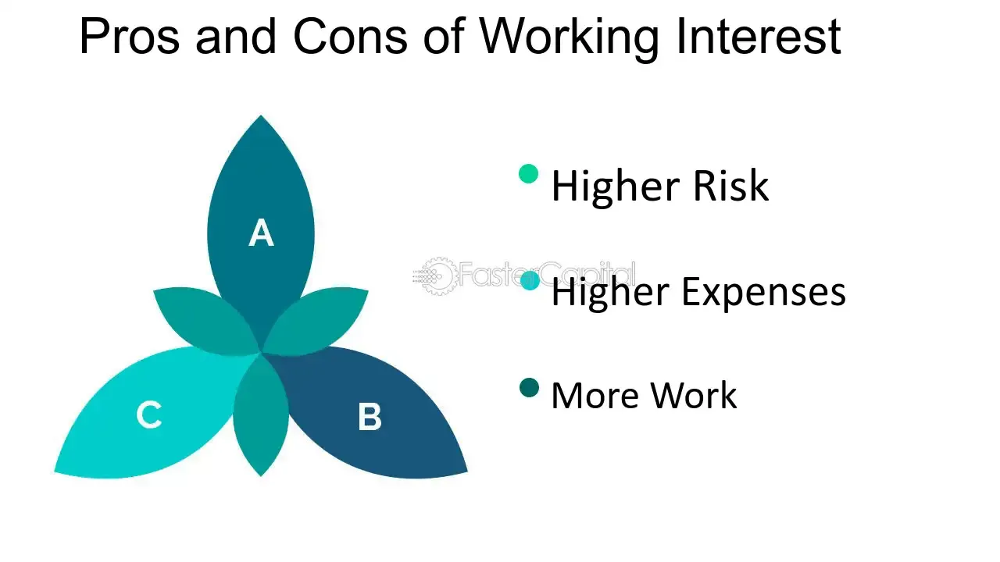

## Table of Contents

## What is a working interest in the context of oil and gas?

A working interest in the oil and gas industry is a type of ownership in an oil or gas well. It means that the owner has the right and responsibility to explore, drill, and produce oil or gas from the well. The owner of a working interest also has to pay for the costs of these activities. This type of interest is different from a royalty interest, where the owner gets a share of the production but does not have to pay for the costs.

Having a working interest can be profitable if the well produces a lot of oil or gas. The owner gets a share of the production, which can be sold for money. However, it can also be risky because if the well does not produce enough, the owner might lose money. The costs of drilling and operating the well can be very high, so it's important for the owner to carefully manage the well and make good decisions.

## How does a working interest differ from a royalty interest?

A working interest and a royalty interest are two different ways to own part of an oil or gas well. With a working interest, the owner has the right to explore, drill, and produce oil or gas from the well. This means they are responsible for paying all the costs related to these activities. It's like being a partner in the business of running the well. If the well does well, the owner can make a lot of money, but if it doesn't, they might lose money because of the high costs.

On the other hand, a royalty interest is much simpler. The owner of a royalty interest gets a share of the oil or gas that is produced from the well, but they don't have to pay for any of the costs of drilling or operating the well. It's like getting a regular payment without having to do any work or spend any money. This makes royalty interests less risky than working interests, but the potential for big profits is also lower because the owner doesn't get to make decisions about the well.

## What are the basic responsibilities of someone holding a working interest?

Someone holding a working interest in an oil or gas well has to manage the well. This means they need to make decisions about when to drill, how to drill, and how to keep the well running smoothly. They also have to pay for all the costs of drilling and operating the well, which can be a lot of money. If something goes wrong, like the well not producing enough oil or gas, they are the ones who have to deal with it and figure out what to do next.

Another big responsibility is to make sure the well follows all the rules and laws. This includes safety rules to keep workers safe and environmental rules to protect the land and water around the well. The person with the working interest needs to keep good records and report to the government about what the well is doing. If they don't follow the rules, they could get in trouble and have to pay fines.

## What are the potential financial benefits of owning a working interest?

Owning a working interest in an oil or gas well can be very profitable if the well produces a lot of oil or gas. The owner gets a share of the production, which they can sell for money. This means that if the well is successful, the owner can make a lot more money than someone who just has a royalty interest. The working interest owner gets to make decisions about the well, like when to drill and how to operate it, which can help them make the well more productive and increase their profits.

However, the financial benefits depend on how well the well does. If the well produces a lot, the owner can make a lot of money. But if the well doesn't produce enough, the owner might not make any money at all and could even lose money because they have to pay for all the costs of drilling and operating the well. So, while there is a chance to make a lot of money, it's also a risky investment.

## What are the common risks associated with a working interest?

Owning a working interest in an oil or gas well can be risky. One big risk is that the well might not produce enough oil or gas. If this happens, the owner has to pay for all the costs of drilling and operating the well but doesn't get much money back. This can lead to big financial losses. Another risk is that the costs of drilling and operating the well can be very high and can go up unexpectedly. If the owner doesn't have enough money to cover these costs, they might have to borrow money or even sell their interest in the well.

There are also risks related to following the rules and laws. If the owner doesn't follow safety and environmental rules, they could get in trouble and have to pay fines. This can be expensive and can hurt their reputation. Another risk is that the price of oil or gas can go up and down a lot. If the price goes down, the owner might not make enough money to cover their costs, even if the well is producing a lot. So, owning a working interest can be a risky investment because there are many things that can go wrong.

## How can one acquire a working interest in an oil or gas project?

One way to get a working interest in an oil or gas project is to buy it from someone who already owns it. This can happen when someone wants to sell their part of the well, maybe because they need money or they think the well won't be successful. You can find these opportunities by talking to people in the oil and gas industry or by working with a company that helps people buy and sell interests in wells. When you buy a working interest, you need to make sure you understand all the costs and risks involved, and it's a good idea to get help from a lawyer or an expert in the oil and gas business.

Another way to get a working interest is to join a group of people who are starting a new oil or gas project. This is called a partnership or joint venture. In this kind of arrangement, everyone in the group shares the costs and the profits. To join a partnership, you need to find other people who are interested in the same project and agree on how to work together. This can be a good way to share the risks and costs, but it's important to have a clear agreement about who does what and how the profits will be shared.

## What are the tax implications of holding a working interest?

When you own a working interest in an oil or gas well, you have to pay taxes on the money you make from it. The good news is that you can also take deductions for the costs of drilling and operating the well. These costs can be a lot, so the deductions can help lower your taxes. You can deduct things like the cost of drilling the well, the cost of equipment, and the cost of paying workers. This means that in some years, you might not have to pay any taxes at all if your costs are higher than your income from the well.

However, the tax rules for working interests can be complicated. You need to keep good records of all your costs and income, and you might need to file special tax forms. It's a good idea to work with a tax professional who knows about the oil and gas industry. They can help you make sure you are following all the rules and getting all the deductions you can. If you don't follow the rules, you could get in trouble with the tax authorities and have to pay fines.

## How does the management of a working interest affect its profitability?

The way you manage a working interest can really change how much money you make from it. If you make good choices about when to drill and how to run the well, you can make the well produce more oil or gas. This means you can sell more and make more money. You also need to keep an eye on the costs. If you can find ways to spend less money on drilling and running the well, you can keep more of the money you make from selling the oil or gas. Good management can help you make the most out of your working interest.

On the other hand, if you don't manage the working interest well, you might lose money. If you make bad choices about drilling or running the well, it might not produce as much oil or gas as it could. This means you won't have as much to sell, and you won't make as much money. Also, if you don't keep track of your costs and they get too high, you might end up spending more money than you make. So, managing a working interest well is really important for making it profitable.

## What are the legal considerations one should be aware of when dealing with working interests?

When you own a working interest in an oil or gas well, you need to follow a lot of rules and laws. These rules are there to make sure the well is safe for workers and doesn't harm the environment. You have to get permits before you start drilling, and you need to report to the government about what the well is doing. If you don't follow these rules, you could get in trouble and have to pay fines. It's also important to have clear agreements with anyone else who owns part of the well, so everyone knows who is responsible for what.

Another thing to think about is the contracts you sign when you buy or sell a working interest. These contracts need to be very clear about what you are buying or selling, how much it costs, and what happens if something goes wrong. It's a good idea to have a lawyer look at these contracts to make sure they protect you. If there is a problem later, like if the well doesn't produce as much as expected, you might need to go to court to solve it. So, understanding the legal side of working interests is really important to avoid problems and protect your investment.

## How do market conditions influence the value and performance of a working interest?

Market conditions can really change how much a working interest is worth and how well it does. The price of oil and gas goes up and down a lot, and this can make a big difference. If the price is high, you can sell the oil or gas from your well for more money, which makes your working interest more valuable. But if the price goes down, you might not make enough money to cover your costs, and your working interest could lose value. Also, if there is a lot of oil or gas being produced all over the world, the price might go down because there is too much supply.

Another thing that can affect your working interest is how easy it is to get the oil or gas to people who want to buy it. If there are good roads, pipelines, and other ways to move the oil or gas, you can sell it more easily and make more money. But if it's hard to get the oil or gas to buyers, you might have to spend more money on transportation, which can make your working interest less profitable. So, keeping an eye on market conditions and understanding how they can change the value and performance of your working interest is really important.

## What advanced strategies can be used to optimize the returns from a working interest?

One advanced strategy to optimize returns from a working interest is to use new technology to make the well produce more oil or gas. This can mean using better drilling methods or tools that help find more oil or gas in the ground. Another way is to use data and computers to make better decisions about when to drill and how to run the well. By looking at a lot of information, you can figure out the best times to drill and the best ways to keep the well running smoothly. This can help you produce more oil or gas and make more money.

Another strategy is to work with other people who own working interests in the same area. By working together, you can share the costs of drilling and operating the wells, which can save you money. You can also share information and ideas, which can help everyone make better decisions. Sometimes, you can even sell the oil or gas together, which can help you get a better price. By working together, you can make your working interest more profitable and reduce the risks.

Lastly, it's important to keep an eye on the market and be ready to change your plans if things change. If the price of oil or gas goes down, you might need to find ways to spend less money on drilling and operating the well. If the price goes up, you might want to drill more wells or spend more money to make the well produce more. By being flexible and ready to change your plans, you can make the most out of your working interest no matter what the market is doing.

## How do technological advancements impact the operations and economics of working interests?

Technological advancements can really change how you run a well and how much money you can make from a working interest. New tools and methods can help you find more oil or gas in the ground. For example, better drilling technology can let you reach oil or gas that was hard to get before. Also, using computers and data can help you make smarter decisions about when to drill and how to keep the well running well. This can make the well produce more oil or gas, which means you can sell more and make more money.

These advancements can also help you save money. New technology can make drilling and operating the well cheaper. For example, new tools might work faster or need less people to run them. This can lower your costs, which means you can keep more of the money you make from selling the oil or gas. But, using new technology can also be risky. It can be expensive to buy new tools and learn how to use them. If the new technology doesn't work as well as you hoped, you might lose money. So, it's important to think carefully about whether the new technology will really help you make more money from your working interest.

## References & Further Reading

[1]: Johnston, D. H., Jr., & Johnston, D. C. (2006). ["Introduction to Oil Company Financial Analysis."](https://www.amazon.com/Introduction-Oil-Company-Financial-Analysis/dp/159370044X) Pennwell Corp.

[2]: Tvede, L. (2013). ["The Psychology of Finance: Understanding Behavioral Finance for Strategic Decision-Making."](https://www.larstvede.com/book/the-psychology-of-finance/) Wiley.

[3]: Hull, J. C. (2018). ["Options, Futures, and Other Derivatives."](https://www.semanticscholar.org/paper/Options%2C-Futures%2C-and-Other-Derivatives-Hull/89bdee500c8623864fc9eb7a471546aa713acc44) Pearson.

[4]: Durbin, M. (2010). ["All About High-Frequency Trading."](https://www.mhebooklibrary.com/doi/book/10.1036/9780071743457) McGraw-Hill.

[5]: Geman, H. (2005). ["Commodities and Commodity Derivatives: Modelling and Pricing for Agriculturals, Metals, and Energy."](https://download.e-bookshelf.de/download/0000/5675/90/L-G-0000567590-0015270354.pdf) Wiley.