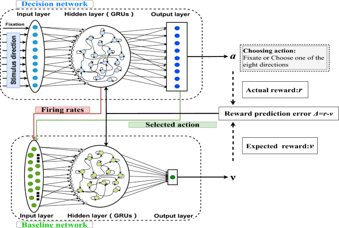

## Table of Contents

## What is working memory in the context of machine learning?

Working memory in the context of machine learning refers to the temporary storage and manipulation of information that a model uses during its processing. Just like how humans use working memory to hold and work with information in the short term, machine learning models use working memory to keep track of data as they perform computations. This is particularly important in models like recurrent neural networks (RNNs) and transformers, where the ability to remember past inputs helps in understanding and generating sequences.

In RNNs, for example, working memory is implemented through hidden states that carry information from one step to the next. These hidden states allow the model to maintain context over time, which is crucial for tasks like language translation or time series prediction. In transformers, working memory is managed through mechanisms like attention, where the model can focus on different parts of the input data at different stages of processing. This ability to dynamically adjust what information is being considered helps improve the model's performance on complex tasks.

## What are the main types of working memory models used in machine learning?

In machine learning, two main types of working memory models are commonly used: recurrent neural networks (RNNs) and transformers. RNNs use hidden states to keep track of information over time. Imagine reading a book; you need to remember what happened in previous chapters to understand the current one. RNNs do something similar by passing information from one step to the next through these hidden states. A simple example of how an RNN updates its hidden state can be represented as $$h_t = f(W \cdot x_t + U \cdot h_{t-1} + b)$$, where $$h_t$$ is the current hidden state, $$x_t$$ is the current input, and $$h_{t-1}$$ is the previous hidden state.

Transformers, on the other hand, use a different approach called attention. Instead of passing information sequentially like RNNs, transformers look at all the input data at once and decide which parts are most important. This is like quickly scanning a whole page to find the key points. The attention mechanism allows the model to weigh different parts of the input differently, which is useful for tasks like language translation or text summarization. The attention can be computed using a formula like $$Attention(Q, K, V) = softmax\left(\frac{QK^T}{\sqrt{d_k}}\right)V$$, where $$Q$$, $$K$$, and $$V$$ are query, key, and value matrices, and $$d_k$$ is the dimension of the keys.

Both types of models have their strengths. RNNs are good for tasks where the order of the data is important, like predicting the next word in a sentence. Transformers, however, can process data more efficiently and are better at understanding long-range dependencies, making them popular in applications like machine translation and natural language processing.

## How does a Memory Network function and what are its key components?

A Memory Network is a type of neural network that uses an external memory component to store and retrieve information. This external memory helps the network remember things it has learned before, which can be useful for tasks like answering questions or understanding stories. The network can look up information in the memory and use it to make better predictions or decisions. Imagine having a big notebook where you write down important facts; a Memory Network does something similar by storing and accessing information from its memory.

The key components of a Memory Network include an input module, a memory module, an output module, and a response module. The input module takes in the current input and turns it into a format that the network can work with. The memory module is where the network stores and retrieves information. It uses a special way to match the current input with stored information, often using something called an attention mechanism. The output module combines the information from the memory with the current input to produce an output, and the response module turns this output into the final answer or action. For example, if you ask the network a question, it will use the memory to find relevant information and then give you an answer based on that.

In more detail, the memory module can be thought of as a big list of items, each with a content and a key. When the network needs to find information, it compares the current input (or a transformed version of it) to the keys in the memory to find the most relevant items. This can be done using a formula like $$Attention(Q, K, V) = softmax\left(\frac{QK^T}{\sqrt{d_k}}\right)V$$, where $$Q$$ is the query derived from the input, $$K$$ are the keys in the memory, and $$V$$ are the values associated with those keys. The network then uses the values from the memory to help generate its output. This process of storing, retrieving, and using information from the memory helps the Memory Network perform tasks that require understanding and using past information.

## What is a Neural Turing Machine and how does it differ from traditional neural networks?

A Neural Turing Machine (NTM) is a type of neural network that has a special memory component, kind of like a computer's memory. This memory allows the NTM to store and retrieve information as it processes data, which can help it remember things over long periods of time. Unlike traditional neural networks, which rely only on their internal states to keep track of information, NTMs can access and modify a separate memory bank. This makes them more like a computer program that can use memory to solve problems, rather than just a network of interconnected nodes.

The key difference between NTMs and traditional neural networks is how they handle memory. Traditional neural networks might use hidden states to remember things, but these states are limited and can forget information over time. In contrast, NTMs use a memory matrix that can be read from and written to using special attention mechanisms. For example, the NTM can write information to the memory using a formula like $$w_t = \text{softmax}(k_t \cdot M)$$, where $$w_t$$ is the write weight, $$k_t$$ is the key vector, and $$M$$ is the memory matrix. This ability to access and manipulate external memory allows NTMs to perform tasks that require remembering and using information from the past in a more flexible way than traditional neural networks.

## Can you explain the architecture and operation of a Dynamic Memory Network?

A Dynamic Memory Network (DMN) is a type of neural network that uses memory to understand and answer questions about text. It's like a smart reader that can remember what it reads and use that memory to answer questions later. The DMN has four main parts: an input module, a question module, an episodic memory module, and an answer module. When you give the DMN a piece of text and a question, it first turns the text and the question into numbers that the network can understand. Then, it uses these numbers to search through its memory to find the information it needs to answer the question.

The episodic memory module is the heart of the DMN. It works by keeping track of what the network has read so far and updating this memory with new information as it reads more. For example, if you ask the DMN about a story, it will remember the characters and events as it goes through the text. The memory is updated using an attention mechanism, which helps the network focus on the most important parts of the text. This can be represented with a formula like $$Attention(Q, K, V) = softmax\left(\frac{QK^T}{\sqrt{d_k}}\right)V$$, where $$Q$$ is the query from the question, $$K$$ are the keys from the text, and $$V$$ are the values associated with those keys. The answer module then uses this updated memory to come up with the final answer to the question.

## What are the advantages of using an End-To-End Memory Network in natural language processing tasks?

An End-To-End Memory Network is really helpful in natural language processing tasks because it can understand and remember information from text easily. It's like having a smart friend who can read a story and answer questions about it without forgetting the details. This network uses a special memory to store what it reads, and when you ask it a question, it looks through this memory to find the right answer. This makes it great for tasks like answering questions about a story or understanding what people are talking about in a conversation.

One big advantage of using an End-To-End Memory Network is that it can learn to focus on the important parts of the text. It does this by using something called attention, which helps the network decide which parts of the text to pay more attention to. For example, if you ask the network a question about a specific character in a story, it will look through its memory and find the parts that talk about that character. This attention mechanism can be described with the formula $$Attention(Q, K, V) = softmax\left(\frac{QK^T}{\sqrt{d_k}}\right)V$$, where $$Q$$ is the query from the question, $$K$$ are the keys from the text, and $$V$$ are the values associated with those keys. By focusing on the right information, the network can give better and more accurate answers.

## How does a Recurrent Entity Network manage and update memory over time?

A Recurrent Entity Network is like a smart memory keeper that helps computers understand and remember things over time. It's especially good at keeping track of different things, like characters in a story or items in a list. The network uses a special memory system where it stores information about these things, called entities. When new information comes in, the network looks at what it already knows and updates its memory. It does this by using something called attention, which helps it focus on the most important parts of the new information. For example, if a new character is introduced in a story, the network will add this character to its memory and update what it knows about the other characters based on the new information.

The way the Recurrent Entity Network updates its memory is a bit like how we update our notes in a notebook. When something new happens, the network looks at its memory and decides what to change or add. It uses a formula like $$Attention(Q, K, V) = softmax\left(\frac{QK^T}{\sqrt{d_k}}\right)V$$ to figure out which parts of the new information are important. In this formula, $$Q$$ is the query from the new information, $$K$$ are the keys from the memory, and $$V$$ are the values associated with those keys. By doing this, the network can keep its memory up to date and use it to understand the story or list better over time.

## What are the practical applications of working memory models in machine learning?

Working memory models in machine learning are really useful for tasks that need to remember and use information over time. For example, they help in understanding and generating language. When you use a model like a Recurrent Neural Network (RNN) or a Transformer, it can remember what it has read or heard before. This is important for things like translating languages or answering questions about a story. The model uses something called attention to focus on the important parts of the text, which helps it give better answers. For instance, if you ask about a specific character in a story, the model can look back at what it knows about that character and use it to answer your question.

These models are also used in other areas like predicting the next item in a sequence or understanding long conversations. In a chatbot, for example, the model needs to remember what was said before to keep the conversation going smoothly. It does this by keeping track of the conversation in its memory and using that to respond to new messages. The memory can be updated using formulas like $$Attention(Q, K, V) = softmax\left(\frac{QK^T}{\sqrt{d_k}}\right)V$$, where $$Q$$ is the query, $$K$$ are the keys, and $$V$$ are the values. This helps the model focus on the right information and give a good response. So, working memory models are super helpful in making machines understand and interact with us better.

## How do working memory models enhance the performance of deep learning systems?

Working memory models make deep learning systems better by helping them remember and use information over time. Imagine you're reading a story and need to remember the characters and what happened before to understand the next part. Working memory models like Recurrent Neural Networks (RNNs) and Transformers do something similar. They keep track of what they have seen before and use that to make better predictions or decisions. For example, in language translation, an RNN remembers the previous words to help translate the next one correctly. Transformers use attention to focus on the important parts of the text, which helps them understand long sentences or paragraphs better.

These models are really helpful in tasks where the order of information matters, like understanding speech or generating text. They can remember long sequences of data and use that memory to improve their performance. For instance, in a conversation, a model with good working memory can keep track of what was said before and respond more accurately. The attention mechanism in Transformers, which can be described with the formula $$Attention(Q, K, V) = softmax\left(\frac{QK^T}{\sqrt{d_k}}\right)V$$, helps the model focus on the right parts of the input. This makes the model better at understanding and generating language, making deep learning systems more effective and useful in real-world applications.

## What challenges are associated with implementing and training working memory models?

Implementing and training working memory models can be tricky because they need to handle a lot of information over time. For example, when using models like Recurrent Neural Networks (RNNs) or Transformers, they have to remember what they've seen before to make good predictions. This can be hard because the more information they need to remember, the more complex the model becomes. Also, these models can sometimes forget important details from the past, a problem known as the vanishing gradient. This happens because the information from earlier steps can get weaker as it goes through many layers of the network, making it hard for the model to learn from it.

Another challenge is that working memory models often need a lot of data to train well. They need to see many examples to learn how to remember and use information correctly. This can be a problem if you don't have enough data or if the data is not good quality. Training these models can also take a long time and use a lot of computer power. For instance, the attention mechanism in Transformers, which helps the model focus on important parts of the input, can be described with the formula $$Attention(Q, K, V) = softmax\left(\frac{QK^T}{\sqrt{d_k}}\right)V$$. This formula shows how the model weighs different parts of the input, but calculating it for every step can be very demanding on the computer.

## How can working memory models be optimized for specific tasks such as question answering or language translation?

To optimize working memory models for tasks like question answering or language translation, you can focus on the model's ability to remember and use information effectively. For question answering, you might use a model like a Dynamic Memory Network (DMN) that has a special memory module to store and retrieve information from the text. The DMN uses attention to focus on the important parts of the text when answering questions. For example, if you ask about a character in a story, the model will look through its memory to find the relevant information. You can train the model with lots of question-answer pairs to help it learn how to use its memory better. The attention mechanism can be described with the formula $$Attention(Q, K, V) = softmax\left(\frac{QK^T}{\sqrt{d_k}}\right)V$$, where $$Q$$ is the query from the question, $$K$$ are the keys from the text, and $$V$$ are the values associated with those keys.

For language translation, you might use a Transformer model, which is good at understanding and generating long sequences of text. The Transformer uses self-attention to look at all the words in a sentence at once and decide which ones are important for translating. This helps the model keep track of the context and translate more accurately. To optimize the Transformer for translation, you can train it with lots of example sentences in both languages. The self-attention mechanism can be represented with the same formula $$Attention(Q, K, V) = softmax\left(\frac{QK^T}{\sqrt{d_k}}\right)V$$, where $$Q$$, $$K$$, and $$V$$ are derived from the input sentence. By focusing on the right parts of the sentence, the model can better understand and translate the text.

## What are the latest advancements and future directions in the development of working memory models in machine learning?

The latest advancements in working memory models have focused on improving their ability to handle longer sequences and better understand context. One significant development is the introduction of more advanced attention mechanisms, like multi-head attention in Transformers. This allows the model to focus on different parts of the input at the same time, making it better at tasks like language translation and question answering. For example, the attention mechanism can be described with the formula $$Attention(Q, K, V) = softmax\left(\frac{QK^T}{\sqrt{d_k}}\right)V$$, where $$Q$$, $$K$$, and $$V$$ are query, key, and value matrices. Researchers are also exploring ways to make these models more efficient, such as using sparse attention to reduce the computational cost of processing long sequences.

Looking to the future, working memory models are expected to become even more sophisticated. One direction is the development of models that can better mimic human memory, including the ability to forget irrelevant information and remember important details over long periods. This could involve integrating memory networks with other types of models, like reinforcement learning, to create systems that can learn and adapt in more dynamic environments. Another exciting area is the use of these models in multi-modal tasks, where they can process and remember information from different types of data, like text, images, and sound, at the same time. These advancements could lead to more powerful and versatile machine learning systems that can handle a wide range of complex tasks.