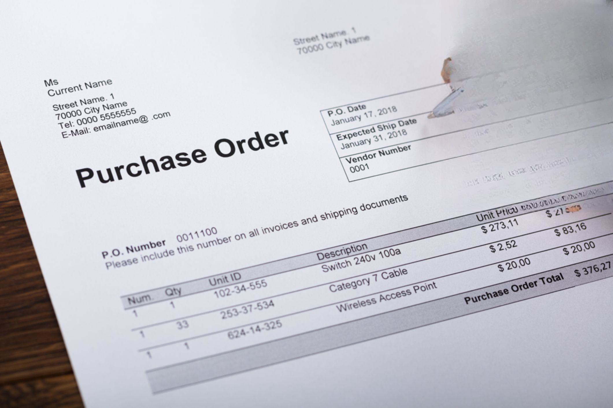

 to Algorithmic Trading

Algorithmic trading, commonly known as 'algo trading', involves the execution of trading strategies through the use of computer algorithms, which automatically place orders to buy or sell securities based on pre-determined criteria. This technologically driven method leverages the processing power of computers to execute trades more efficiently and precisely, reducing the need for human intervention in the decision-making process.



Algo trading is particularly significant in high-frequency trading (HFT), where trade decisions must be made in mere milliseconds. The speed and precision required in HFT demand that algorithms process large volumes of data to identify and exploit small price discrepancies in financial markets quickly. Algorithms can efficiently handle complex strategies that involve a vast array of market variables, making them indispensable in today's fast-paced trading environment.

The evolution of algorithmic trading stems from advancements in both computational technologies and the availability of comprehensive market data. The interplay between these elements has revolutionized traditional trading practices, enabling traders to focus on strategic development and optimization while leaving execution to sophisticated algorithms.

This article discusses the critical conditions necessary for successful algorithmic trading, such as the operational environment, functional states of trading systems, and the implementation of orders that activate under specific market conditions. By understanding these essential components, traders can enhance their trading outcomes through an adaptive and efficient trading infrastructure.

## Table of Contents

## Understanding the Operational Conditions of Algo Trading

Algorithmic trading requires a meticulously curated technical and market environment to function optimally. The operational conditions are foundational elements that empower algorithms with the capacity to execute trades autonomously and proficiently. Key components of these conditions include data feed reliability, order execution efficiency, and robust back-testing facilities.

A reliable data feed is paramount for algorithmic trading. Algorithms depend on accurate and timely data to identify trading signals and make instantaneous decisions. Market data is often streamed in real-time, requiring technical infrastructures capable of processing large volumes efficiently without latency. This involves leveraging advanced networking solutions and data management systems that ensure data integrity and low-latency transmission.

Order execution systems are equally critical. These systems must perform trades with minimal delay to capitalize on transient market opportunities. Execution speed is a crucial [factor](/wiki/factor-investing), particularly in high-frequency trading ([HFT](/wiki/high-frequency-trading-strategies)) setups, where trades might be executed within microseconds. The underlying software architecture should be optimized for speed, often implemented in low-level programming languages such as C++ to achieve high throughput and rapid execution times.

Robust back-testing capabilities form another cornerstone of a functional trading environment. Before deployment, trading algorithms undergo rigorous testing against historical data to validate their effectiveness. This process helps in fine-tuning the strategy parameters and ensuring the algorithm can withstand various market scenarios. Python is frequently used for back-testing because of its rich ecosystem of libraries like pandas, NumPy, and [backtrader](/wiki/backtrader), which facilitate data manipulation and strategy testing.

Furthermore, the infrastructure must support real-time data processing to exploit momentary trading opportunities efficiently. This entails the use of distributed computing systems to handle parallel data processing and decision-making tasks. Technologies such as Apache Kafka for data streaming and Apache Flink or Spark for real-time data analytics can be integrated to create a scalable and responsive trading platform.

In summary, successful [algorithmic trading](/wiki/algorithmic-trading) hinges on an impeccable operational setup, featuring robust data feeds, efficient order execution systems, and comprehensive back-testing frameworks. These elements, combined with state-of-the-art technical infrastructure, enable trading algorithms to operate with the speed and precision necessary to produce optimal trading outcomes.

## Working Order in Algo Trading

A working order in algorithmic trading is a trade order that is executed when predefined conditions are met, such as reaching a certain price level or fulfilling specific market criteria. This mechanism allows for the automation of trading strategies, reducing the need for constant human supervision and enabling rapid responses to market changes. 

Working orders can be classified into two main types: stop orders and limit orders. Stop orders trigger a trade once the market price reaches a specified level, often used to minimize losses or protect gains. For example, a stop-loss order is designed to sell an asset if its price falls to a certain point, effectively capping potential losses. Conversely, limit orders specify a maximum or minimum price at which a trader is willing to buy or sell an asset. This ensures that trades are executed only at favorable prices or better.

Python is often used to automate these types of orders. For instance, the following pseudo-code demonstrates how a simple limit order can be implemented using Python:

```python
def place_limit_order(current_price, limit_price, order_type):
    if order_type == 'buy' and current_price <= limit_price:
        execute_order('buy', current_price)
    elif order_type == 'sell' and current_price >= limit_price:
        execute_order('sell', current_price)

def execute_order(order_type, price):
    # Logic to execute the order
    print(f"Executed {order_type} order at price {price}")

# Example usage
current_market_price = 100
limit_price = 95
place_limit_order(current_market_price, limit_price, 'buy')
```

Working orders enhance algorithmic trading strategies by allowing traders to capitalize on market opportunities without the need for continuous monitoring. This increases efficiency and precision, key attributes especially important in high-frequency trading where even millisecond delays can impact profitability.

Implementing working orders effectively requires a thorough understanding of market mechanics and careful design of algorithm parameters. The success of these orders often depends on the accuracy of market data and the responsiveness of the trading system's infrastructure. By utilizing working orders, traders can better manage risk, optimize execution, and achieve their desired trading outcomes.

## Functional State of Algorithmic Trading Systems

A trading system's functional state refers to its ability to consistently execute strategies as intended, aligned with its design and defined parameters. The stability and efficiency of these systems are paramount; hence, rigorous testing and validation are essential to ensure reliability across diverse market conditions. This involves stress testing the algorithms against historical data and hypothetical scenarios to observe how the system reacts to various market events.

One critical aspect of maintaining the functional state is regular monitoring. This involves continuously tracking the algorithm's performance metrics to identify and rectify any anomalies that could affect trading efficiency. For instance, metrics such as the Sharpe ratio, which measures risk-adjusted return, are commonly used to assess performance. Monitoring involves leveraging real-time analytics to detect deviations from expected behavior patterns, which could suggest underlying issues within the trading algorithm or strategy.

Updating algorithms is another crucial factor in preserving the functional state. As financial markets are dynamic and subject to evolving trends and reforms, algorithms might require modifications or enhancements to adapt to these changes. For example, if a significant economic policy shift affects market [volatility](/wiki/volatility-trading-strategies), recalibrating the algorithm's parameters to accommodate increased risk levels could be necessary.

Back-testing is an ongoing process in maintaining a trading system's functional state. It entails running the trading strategies against historical market data to validate their effectiveness before live deployment. In Python, tools like Pandas and libraries such as Backtrader or PyAlgoTrade can facilitate efficient back-testing. Here is a simple example of using Python to back-test a moving average crossover strategy:

```python
import pandas as pd
import backtrader as bt

class MovingAverageCrossStrategy(bt.SignalStrategy):
    def __init__(self):
        self.signal_add(bt.SIGNAL_LONG, 
                        bt.indicators.CrossOver(self.data.close, self.data.low))

cerebro = bt.Cerebro()
data = bt.feeds.YahooFinanceData(dataname="AAPL", fromdate=pd.Timestamp("2019-01-01"),
                                 todate=pd.Timestamp("2020-01-01"))
cerebro.adddata(data)
cerebro.addstrategy(MovingAverageCrossStrategy)
cerebro.run()
cerebro.plot()
```

The above code outlines a framework for validating trading strategies before their application in live markets. This practice helps in refining and optimizing algorithms, thereby ensuring they are well-suited to current market environments.

By consistently testing, monitoring, and updating, traders can ensure that their algorithmic trading systems remain functional and robust, capable of navigating the complexities of ever-changing market landscapes. This adaptive process not only enhances performance but also mitigates potential risks associated with algorithm malfunctions.

## Key Components for a Reliable Algo Trading Setup

A reliable algorithmic trading setup is crucial for executing trading strategies effectively and efficiently. It typically comprises several key components, each playing a vital role in ensuring the system's overall performance and reliability.

### Data Acquisition Modules

The first critical component in an algorithmic trading setup is data acquisition modules. These modules are responsible for collecting real-time and historical market data, which serve as the foundation for making informed trading decisions. High-quality data feeds provide accurate and timely information about market prices, volumes, and other relevant metrics. Ensuring minimal latency in data acquisition is crucial, especially in high-frequency trading, where milliseconds can determine the success or failure of a trade.

### Strategy Development Tools

Strategy development tools are essential for creating, testing, and refining trading algorithms. These tools enable traders and developers to implement various trading strategies, analyze their performance, and optimize parameters for better results. Algorithms can range from simple moving average crossovers to more complex [machine learning](/wiki/machine-learning) models. Python, with its vast library ecosystem (such as NumPy, pandas, and scikit-learn), is a popular language for strategy development due to its versatility and ease of use.

```python
import pandas as pd
import numpy as np

# Example: Simple Moving Average Crossover Strategy
def generate_signals(data):
    short_window = 40
    long_window = 100

    signals = pd.DataFrame(index=data.index)
    signals['signal'] = 0.0

    # Create short simple moving average
    signals['short_mavg'] = data['Close'].rolling(window=short_window, min_periods=1, center=False).mean()

    # Create long simple moving average
    signals['long_mavg'] = data['Close'].rolling(window=long_window, min_periods=1, center=False).mean()

    # Create signals
    signals['signal'][short_window:] = np.where(signals['short_mavg'][short_window:] 
                                                > signals['long_mavg'][short_window:], 1.0, 0.0)   

    # Generate trading orders
    signals['positions'] = signals['signal'].diff()

    return signals
```

### Execution Platforms

Once a trading strategy is developed, execution platforms come into play. These platforms are responsible for executing trades according to the predefined algorithms. Modern execution platforms not only support the placement of orders but also integrate built-in risk management tools to protect traders from significant losses. They often provide APIs, allowing developers to integrate custom strategies and automate trading processes.

### Risk Management Tools

Incorporating risk management tools within an algorithmic trading setup is paramount. These tools help assess and mitigate potential risks associated with trading activities, such as market volatility and [liquidity](/wiki/liquidity-risk-premium) issues. Common risk management techniques include position sizing, stop-loss orders, and diversification. These features ensure that trading strategies not only seek profits but also safeguard against excessive losses.

### Ensuring Low-Latency Connections

Low-latency connections are essential for high-frequency trading strategies, where the speed of order execution can significantly impact profitability. Minimizing the time it takes to execute a trade requires a robust technical infrastructure, including co-location services, direct market access (DMA), and the use of advanced networking hardware. These measures help ensure that trading systems can react to market changes promptly, maintaining an edge over competitors.

In conclusion, a reliable algorithmic trading setup depends on the seamless integration of data acquisition, strategy development, execution platforms, and risk management tools, all supported by a low-latency technical infrastructure. These components work together to create an effective and efficient trading environment, capable of executing complex strategies in dynamic market conditions.

## Conclusion: Achieving an Effective Trading Environment

An effective algorithmic trading environment hinges on the equilibrium between robust technical infrastructure and insightful strategic decision-making. The rapid evolution of financial markets necessitates regular adaptation and optimization of trading algorithms. This dynamic process is key to maintaining and improving the performance of trading activities amidst changing market conditions. 

Algorithmic trading involves understanding the operational conditions under which algorithms function optimally. This requires attention to data accuracy, speed, and the efficiency of the order execution system. It's crucial for traders to fine-tune these parameters continually. The correct setup helps capture fleeting opportunities in the market, which can significantly impact profitability.

The working order in algorithmic trading allows automation of strategies that can respond to predetermined market conditions. It is essential to differentiate between types of orders, such as stop orders and limit orders, to maximize their effectiveness in various trading scenarios. These components help traders execute strategies more efficiently and reduce the need for constant human management, thus optimizing trading outputs.

Moreover, maintaining a functional state of the trading system is critical. This involves ensuring the system executes strategies consistently according to its design. Regular testing and validation are imperative to confirm the algorithm operates reliably across different market conditions. Monitoring and updating algorithms as necessary guarantees that they remain aligned with current market dynamics and trader objectives.

In terms of infrastructure, a reliable algorithmic trading setup should integrate components like data acquisition systems, strategy development tools, and execution platforms that ensure low latency and high-speed execution. Risk management tools are also essential, providing safety nets that protect investments against unpredictable market shifts.

Ultimately, by comprehensively understanding and optimizing the operational conditions, working order, and functional state of their trading systems, traders can significantly enhance their trading outcomes. Achieving this balance promotes a more effective trading environment, accommodating both the technical and strategic aspects of algorithmic trading. This approach allows traders to leverage market opportunities fully, leading to improved trading results and long-term success in financial markets.

## FAQs and Further Reading

Algorithmic trading, a cornerstone of modern financial markets, often raises several questions, particularly for newcomers. Here, we address some frequently asked questions about algorithmic trading, focusing on setup requirements and strategy development.

### What are the minimum technical requirements for setting up an algorithmic trading system?

To set up an algorithmic trading system, the essential technical components include:

1. **A Reliable Internet Connection**: Speed and stability are critical, especially for high-frequency trading strategies.

2. **A Trading Platform**: Choose platforms like MetaTrader, QuantConnect, or Interactive Brokers that offer APIs, access to market data, and integrated development environments.

3. **Data Feed Access**: Real-time and historical market data are necessary for developing and testing trading strategies.

4. **Programming Skills**: Familiarity with programming languages such as Python, C++, or Java is beneficial for developing custom algorithms.

5. **Computing Power**: Depending on the complexity of the strategies, a powerful computer or access to cloud-based services may be required for processing and executing trades.

### How do I start developing an algorithmic trading strategy?

Developing a successful algorithmic trading strategy involves several steps:

1. **Define Objectives**: Establish clear trading goals and risk tolerance levels.

2. **Market Research and Data Analysis**: Conduct thorough market research and analyze historical data to identify patterns or inefficiencies.

3. **Strategy Design**: Formulate the trading logic and rules. For example:

   ```python
   # Example of a simple moving average crossover strategy in Python
   def moving_average_strategy(prices, short_window=40, long_window=100):
       signals = pd.DataFrame(index=prices.index)
       signals['signal'] = 0.0

       signals['short_mavg'] = prices['Close'].rolling(window=short_window, min_periods=1, center=False).mean()
       signals['long_mavg'] = prices['Close'].rolling(window=long_window, min_periods=1, center=False).mean()

       signals['signal'][short_window:] = np.where(signals['short_mavg'][short_window:] > signals['long_mavg'][short_window:], 1.0, 0.0)
       signals['positions'] = signals['signal'].diff()

       return signals
   ```

4. **Backtesting**: Validate the strategy using historical data to assess its performance under different market conditions.

5. **Optimization**: Fine-tune strategy parameters to improve performance while avoiding overfitting.

6. **Live Testing**: Implement the strategy in a live market environment with limited capital to test its real-world performance.

### What resources are available for learning more about algorithmic trading?

Numerous resources are available for those interested in learning more about algorithmic trading:

- **Online Courses and Tutorials**: Websites like Coursera, Udacity, and edX offer courses on financial markets and algorithmic trading.

- **Books**: Titles such as "Algorithmic Trading" by Ernie Chan and "Quantitative Trading" by Rishi K. Narang are recommended for comprehensive insights.

- **Demo Accounts**: Platforms like MetaTrader and Interactive Brokers offer demo accounts for practice without financial risk.

- **Trading Communities**: Forums like QuantConnect Community and Stack Exchange Quantitative Finance provide opportunities to interact with professionals and enthusiasts.

- **Webinars and Workshops**: Institutions like the New York Institute of Finance offer webinars and workshops on trading strategies.

By leveraging these resources, traders can enhance their understanding and implementation of algorithmic trading, leading to more informed and strategic trading decisions.

## References & Further Reading

[1]: Chan, E. P. (2009). ["Quantitative Trading: How to Build Your Own Algorithmic Trading Business."](https://github.com/ftvision/quant_trading_echan_book) John Wiley & Sons.

[2]: Jansen, S. (2018). ["Machine Learning for Algorithmic Trading."](https://searchworks.stanford.edu/view/13246850) Packt Publishing.

[3]: Narang, R. K. (2013). ["Inside the Black Box: A Simple Guide to Quantitative and High Frequency Trading."](https://www.amazon.com/Inside-Black-Box-Quantitative-Frequency/dp/1118362411) John Wiley & Sons.

[4]: Lopez de Prado, M. (2018). ["Advances in Financial Machine Learning."](https://www.amazon.com/Advances-Financial-Machine-Learning-Marcos/dp/1119482089) John Wiley & Sons.

[5]: Aronson, D. R. (2006). ["Evidence-Based Technical Analysis: Applying the Scientific Method and Statistical Inference to Trading Signals."](https://www.amazon.com/Evidence-Based-Technical-Analysis-Scientific-Statistical/dp/0470008741) Wiley.