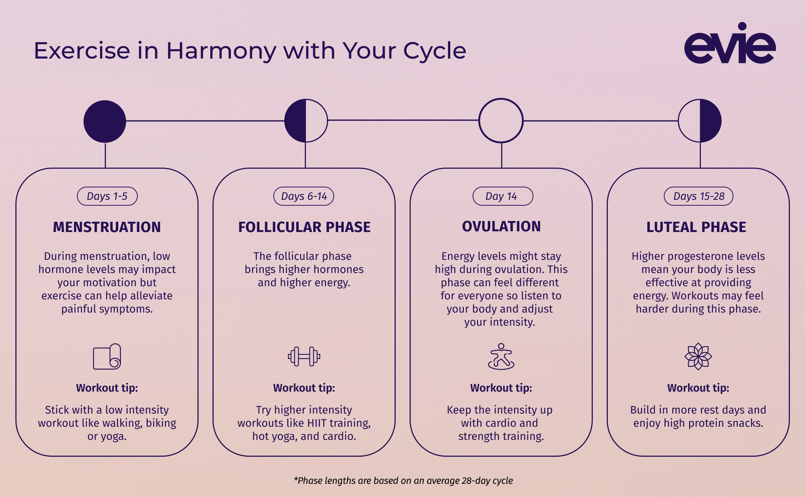

## Table of Contents

## What is a workout period?

A workout period is the time you spend exercising or doing physical activities to stay healthy and fit. It can be short, like 20 minutes, or longer, like an hour, depending on what you want to achieve and how much time you have. During this time, you might do things like running, lifting weights, or doing yoga to make your body stronger and healthier.

Different people have different workout periods based on their goals and schedules. For example, someone who wants to lose weight might have a longer workout period with more intense exercises. On the other hand, someone who just wants to stay active might have shorter, less intense workout periods. The important thing is to find a workout period that works for you and helps you reach your fitness goals.

## Why is it important to include workout periods in a fitness routine?

Including workout periods in a fitness routine is important because it helps keep your body strong and healthy. When you exercise regularly, your muscles get stronger, your heart works better, and you can even feel happier. It's like giving your body a good tune-up, making sure everything runs smoothly. Without regular workout periods, your body might not stay as healthy, and you might feel more tired or weak.

Workout periods also help you reach your fitness goals, whether you want to lose weight, gain muscle, or just stay active. By setting aside time to exercise, you can focus on specific activities that help you get where you want to be. Plus, having a regular workout period can make it easier to stick with your routine because it becomes a normal part of your day. This way, you're more likely to keep up with your fitness plan and see real results.

## How long should a typical workout period last?

A typical workout period can last anywhere from 20 to 60 minutes. The length of your workout depends on what you want to achieve and how much time you have. If you're just starting out or want to stay active, a shorter workout of about 20 to 30 minutes might be enough. This can include activities like walking, light jogging, or doing some basic strength exercises.

For people who want to lose weight or build muscle, a longer workout period of 45 to 60 minutes might be better. During this time, you can do more intense exercises like running, lifting heavier weights, or joining a fitness class. The key is to find a length that works for you and helps you reach your goals without feeling too tired or overwhelmed.

## What are the different types of workout periods?

There are different types of workout periods, and each one helps you in a different way. One type is called cardio workout. This is when you do things like running, swimming, or cycling to make your heart stronger. Cardio workouts help you lose weight and feel more energetic. Another type is strength training. This is when you lift weights or use your own body weight to make your muscles stronger. Strength training helps you build muscle and can make everyday tasks easier.

Another type of workout period is flexibility training. This includes activities like yoga or stretching, which help your body move more easily and prevent injuries. Flexibility workouts are good for keeping your muscles and joints healthy. Lastly, there are high-intensity interval training (HIIT) workouts. These are short, intense bursts of exercise followed by rest periods. HIIT workouts are great for burning fat and improving your fitness quickly. Each type of workout period has its own benefits, so you can mix them up to stay healthy and reach your fitness goals.

## How does the body respond during a workout period?

When you start a workout period, your body goes through a lot of changes to keep up with the exercise. Your heart starts beating faster to pump more blood to your muscles. This blood carries oxygen, which your muscles need to work hard. Your breathing also gets quicker and deeper to take in more air. As you keep exercising, your muscles might feel tired because they are working harder than usual. This is normal and part of getting stronger.

During a workout, your body also starts to sweat to cool itself down. Sweating helps keep your body from getting too hot. Your muscles might also start to feel a bit sore, especially if you're doing something new or intense. This soreness is a sign that your muscles are working and getting stronger. After the workout, your body will start to recover, repairing the muscles and getting ready for the next time you exercise. This is how your body adapts and gets better at handling workouts over time.

## What are the key physiological mechanisms at play during a workout period?

During a workout period, your body uses several key physiological mechanisms to keep up with the demands of exercise. One important mechanism is increased heart rate. Your heart beats faster to pump more blood to your muscles. This blood carries oxygen, which your muscles need to work hard. Another mechanism is increased breathing rate. You breathe quicker and deeper to take in more air, which also helps supply oxygen to your muscles. Your body also starts to sweat to cool itself down. Sweating helps prevent your body from getting too hot during exercise.

As you continue to exercise, your muscles start to use energy stored in the form of glycogen. When you use up this energy, your body can start to feel tired. This is normal and part of making your muscles stronger. Your muscles might also produce lactic acid, which can make them feel sore, especially during intense workouts. This soreness is a sign that your muscles are working hard and getting stronger. After the workout, your body goes into recovery mode. It repairs the muscles and replenishes energy stores, preparing you for your next workout. This recovery process is how your body adapts and gets better at handling exercise over time.

## How can workout periods be optimized for muscle growth?

To optimize workout periods for muscle growth, you need to focus on strength training. This means lifting weights or using your own body weight to make your muscles work hard. You should do exercises that target different muscle groups, like squats for your legs, push-ups for your chest, and pull-ups for your back. It's important to use heavy enough weights so that your muscles feel tired after a few reps. Aim for 3 to 5 sets of 6 to 12 reps for each exercise. This helps your muscles grow bigger and stronger.

Rest is also key for muscle growth. After a workout, your muscles need time to recover and repair. Make sure to rest for at least a day between workouts for the same muscle group. Eating enough protein is also important because it helps your muscles repair and grow. Foods like chicken, fish, eggs, and beans are good sources of protein. By combining a good workout plan with enough rest and the right food, you can optimize your workout periods for the best muscle growth.

## What role do rest periods play in relation to workout periods?

Rest periods are super important when you're working out. They give your body time to recover after you exercise. When you do a workout, your muscles get tired and might even have tiny tears. Rest periods help your body fix these tears and make your muscles stronger. If you don't rest enough, your muscles won't have time to heal, and you might feel more tired or even get hurt.

Rest periods also help you keep up your energy for your next workout. If you keep working out without resting, you'll feel more and more tired. This can make it hard to do your best during your workouts. By taking breaks, you can come back to your next workout feeling fresh and ready to go. So, rest periods are just as important as workout periods for staying healthy and strong.

## How do workout periods vary for different fitness goals, such as endurance versus strength?

Workout periods can be different depending on what you want to achieve. If your goal is to build endurance, like being able to run longer or cycle farther, your workout periods will be longer and less intense. You might spend 45 to 60 minutes doing activities like jogging, swimming, or cycling at a steady pace. This helps your heart and lungs get stronger and lets your body get used to working for a long time without getting too tired.

On the other hand, if your goal is to build strength, like lifting heavier weights or doing more push-ups, your workout periods will be shorter but more intense. You might spend 30 to 45 minutes lifting weights or doing bodyweight exercises. You'll do fewer reps but with heavier weights or harder exercises to make your muscles work really hard. This helps your muscles grow bigger and stronger over time.

## What advanced techniques can be used to enhance the effectiveness of workout periods?

One advanced technique to enhance the effectiveness of workout periods is called periodization. This means you change your workout plan over time to keep your body guessing and growing. You might start with lighter weights and more reps to build endurance, then switch to heavier weights and fewer reps to build strength. This helps prevent your muscles from getting used to the same routine, which can make your workouts more effective. Another technique is called supersets, where you do two exercises back-to-back without resting. This can help you work out more muscles in less time and keep your heart rate up, making your workout more intense.

Another technique is called plyometrics, which involves explosive movements like jump squats or box jumps. These exercises help improve your power and speed, making your muscles work harder and grow faster. You can also use a technique called drop sets, where you do an exercise until you can't do any more reps, then quickly lower the weight and keep going. This pushes your muscles to their limit and helps them grow bigger and stronger. By using these advanced techniques, you can make your workout periods more effective and reach your fitness goals faster.

## How can one measure the success of a workout period?

To measure the success of a workout period, you can look at how your body changes over time. One way is to track your strength by seeing if you can lift heavier weights or do more reps than before. Another way is to check your endurance by seeing if you can run, swim, or cycle for longer without getting tired. You can also measure your body by taking measurements or weighing yourself to see if you're losing fat or gaining muscle. These changes show that your workouts are working and helping you reach your goals.

Another way to measure success is by how you feel. If you feel stronger, more energetic, and happier after your workouts, that's a good sign. You might also notice that everyday tasks, like carrying groceries or climbing stairs, feel easier. Keeping a workout journal can help you see these changes over time. Write down how you feel before and after each workout, and look back to see how much you've improved. By paying attention to both your physical changes and how you feel, you can tell if your workout periods are successful.

## What are the latest research findings on the impact of workout periods on long-term health?

Recent research has shown that regular workout periods can really help with long-term health. Studies have found that people who exercise regularly have a lower chance of getting heart disease, diabetes, and some types of cancer. Exercise can also help keep your brain healthy. It can lower the risk of diseases like Alzheimer's and help you stay sharp as you get older. By making workout periods a part of your routine, you're helping your body stay strong and healthy for a long time.

Another important finding is that workout periods can improve your mental health. Regular exercise has been shown to reduce stress, anxiety, and depression. It can also help you sleep better and feel more energetic during the day. These mental health benefits are just as important as the physical ones. So, by sticking to a workout routine, you're not only helping your body but also your mind, leading to a happier and healthier life overall.

## How can algorithmic principles be incorporated into fitness routines?

Much like [algorithmic trading](/wiki/algorithmic-trading), fitness routines can be optimized and personalized through the use of algorithms. This approach enables traders to create effective and efficient workout plans that align with their unique physiological needs and goals. The following principles outline how such integration can be achieved.

Firstly, key fitness metrics must be identified to tailor workout regimes effectively. These metrics might include heart rate (HR), endurance levels, and stress indicators. By monitoring these parameters, traders can gain insights into their physical condition and adjust their workouts accordingly. For instance, maintaining an optimal heart rate zone can maximize cardiovascular benefits and improve overall endurance. The heart rate zone can be calculated using the formula:

$$
\text{Target Heart Rate} = \left( \text{max HR} - \text{rest HR} \right) \times \text{Intensity} + \text{rest HR}
$$

where $\text{max HR}$ is the maximum heart rate, $\text{rest HR}$ is the resting heart rate, and $\text{Intensity}$ is the desired workout intensity.

Predictive analysis can be deployed to refine these routines further. By analyzing past workout results, traders can forecast the efficacy of different workouts and make informed adjustments. This approach mirrors the predictive algorithms used in trading, where historical data is leveraged to predict future market trends. Machine learning models, such as regression analysis or time series forecasting, can be used to predict future performance based on past data.

```python
import numpy as np
from sklearn.linear_model import LinearRegression

# Sample data: [Session Number, Heart Rate, Endurance]
data = np.array([[1, 150, 30], [2, 155, 35], [3, 160, 40], [4, 165, 45]])
X = data[:, :-1]  # Features: Session Number, Heart Rate
y = data[:, -1]   # Target: Endurance

model = LinearRegression().fit(X, y)
future_session = np.array([[5, 170]])
predicted_endurance = model.predict(future_session)
print(f"Predicted Endurance for next session: {predicted_endurance[0]}")
```

Furthermore, by setting specific fitness goals and dynamically adjusting exercise plans, traders can emulate the iterative strategies seen in trading. Goals might center around increasing endurance, reducing recovery time, or enhancing flexibility. Regular assessments can help determine whether these goals are being met and identify areas needing adjustment.

In conclusion, applying algorithmic principles from trading to fitness routines offers a structured, data-driven approach to achieving physical health goals. By systematically analyzing physiological data, setting clear objectives, and revising routines based on feedback, traders can ensure an optimized approach to physical fitness that aligns with their demanding trading schedules.

## References & Further Reading

[1]: Ratey, J. J., & Hagerman, E. (2008). ["Spark: The Revolutionary New Science of Exercise and the Brain."](https://psycnet.apa.org/record/2008-02933-000) Little, Brown and Company.

[2]: Erickson, K. I., Hillman, C., & Kramer, A. F. (2015). ["Physical Activity, Brain, and Cognition."](https://www.sciencedirect.com/science/article/pii/S2352154615000157) *Current Directions in Psychological Science*, 24(1), 58-64.

[3]: Dishman, R. K., O’Connor, P. J., & Tomporowski, P. D. (2012). ["The Influence of Physical Fitness and Exercise on Cognitive Functioning and Classroom Behavior in Children and Adolescents: A Meta-Analysis."](https://psycnet.apa.org/record/2013-08176-000) *Psychological Bulletin*, 138(6), 1038-1064.

[4]: Kramer, A. F., & Colcombe, S. J. (2018). ["Fitness Effects on the Cognitive Function of Older Adults: A Meta-Analytic Study - Revisited."](https://pubmed.ncbi.nlm.nih.gov/12661673/) *The Gerontologist*, 58(2), 170-176.

[5]: Hansen, C. J., Stevens, L. C., & Coast, J. R. (2001). ["Exercise Duration and Mood State: How Much is Enough to Feel Better?"](https://pubmed.ncbi.nlm.nih.gov/11515738/) *Medicine & Science in Sports & Exercise*, 33(7), 1083-1088.