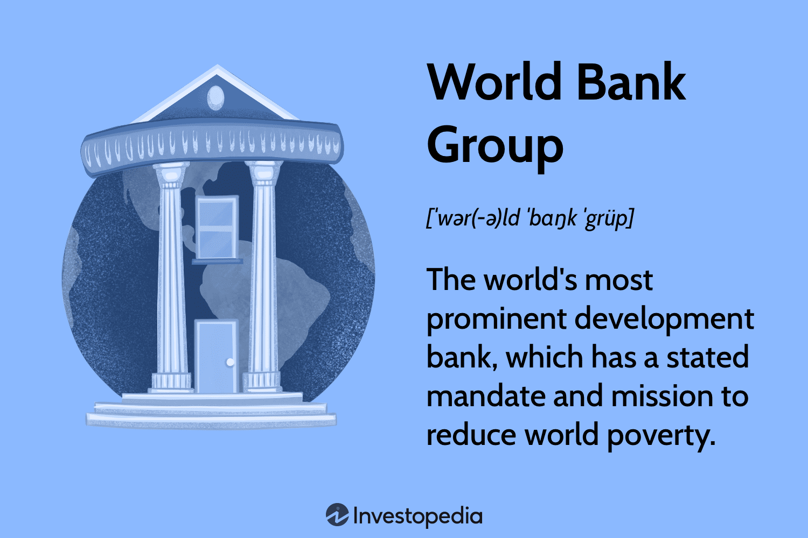

## Table of Contents

## What is the World Bank Group?

The World Bank Group is an international organization that helps countries reduce poverty and improve their economies. It was created in 1944 and has its headquarters in Washington, D.C. The group provides financial and technical assistance to developing countries to help them grow and develop.

The World Bank Group is made up of five different organizations that work together. These organizations include the International Bank for Reconstruction and Development (IBRD), the International Development Association (IDA), the International Finance Corporation (IFC), the Multilateral Investment Guarantee Agency (MIGA), and the International Centre for Settlement of Investment Disputes (ICSID). Each part of the group has a specific role, but they all aim to support sustainable development and reduce global poverty.

## When was the World Bank Group established?

The World Bank Group was set up in 1944. This happened during a meeting called the Bretton Woods Conference. Many countries came together to plan how to help the world's economy after World War II. They wanted to make sure countries could rebuild and grow.

The World Bank Group started with the goal to help countries that were poor or had been damaged by war. Over time, it has grown to include five different parts. Each part has its own job, but they all work to help countries become better off and reduce poverty around the world.

## What are the main objectives of the World Bank Group?

The main goal of the World Bank Group is to help countries reduce poverty and improve their living conditions. They do this by giving money and advice to countries that need it. This help can be used for things like building schools, hospitals, and roads, or for making sure people have clean water and enough food.

Another important objective is to support economic growth and development. The World Bank Group works with governments to create plans that can help their economies grow. This might include helping businesses start up, creating jobs, and making trade easier between countries. By doing these things, the World Bank Group aims to make the world a better place for everyone.

## How many institutions are part of the World Bank Group and what are they?

The World Bank Group has five different parts. These parts work together to help countries become better off and reduce poverty. The first part is called the International Bank for Reconstruction and Development (IBRD). It gives loans and advice to middle-income countries and creditworthy poorer countries. The second part is the International Development Association (IDA). It helps the world's poorest countries by providing loans with no interest and grants.

The third part is the International Finance Corporation (IFC). It focuses on helping businesses in developing countries by giving them loans and advice. The fourth part is the Multilateral Investment Guarantee Agency (MIGA). It helps protect investors from political risks when they invest in developing countries. The last part is the International Centre for Settlement of Investment Disputes (ICSID). It helps solve disagreements between countries and foreign investors.

All these parts of the World Bank Group work together to support countries in different ways. They aim to help these countries grow their economies, create jobs, and improve the lives of their people.

## What is the difference between the World Bank and the World Bank Group?

The World Bank is one part of the World Bank Group. It is made up of two main organizations: the International Bank for Reconstruction and Development (IBRD) and the International Development Association (IDA). The IBRD helps middle-income countries and creditworthy poorer countries by giving them loans and advice. The IDA focuses on the world's poorest countries, providing them with loans that don't have interest and grants to help them grow and develop.

The World Bank Group, on the other hand, includes the World Bank but also three other organizations. These are the International Finance Corporation (IFC), the Multilateral Investment Guarantee Agency (MIGA), and the International Centre for Settlement of Investment Disputes (ICSID). The IFC helps businesses in developing countries by giving them loans and advice. MIGA protects investors from political risks when they invest in developing countries. ICSID helps solve disagreements between countries and foreign investors. So, the World Bank Group is a bigger organization that works together to help countries in many different ways.

## How does the World Bank Group fund its operations?

The World Bank Group gets money from different places to do its work. The main way it gets money is from the countries that are members of the World Bank. These countries give money to the World Bank by buying shares in the International Bank for Reconstruction and Development (IBRD). The money from these shares helps the World Bank give loans to countries that need help. The World Bank also gets money from the profits it makes on the loans it gives out. This money is used to help more countries.

The World Bank Group also gets money from other sources. For example, the International Development Association (IDA) gets money from donations from richer countries. These donations are used to give loans and grants to the world's poorest countries. The International Finance Corporation (IFC) and the Multilateral Investment Guarantee Agency (MIGA) get money from investors who want to help businesses in developing countries. All these different ways of getting money help the World Bank Group do its important work around the world.

## What are some key initiatives and programs run by the World Bank Group?

The World Bank Group runs many important programs to help countries grow and reduce poverty. One key initiative is the Sustainable Development Goals (SDGs), which are a set of goals to make the world a better place by 2030. The World Bank Group works to help countries reach these goals by giving them money and advice. Another big program is the Global Partnership for Education, which helps improve education in poor countries. The World Bank Group gives money to build schools and train teachers, so more children can go to school and learn.

The World Bank Group also has programs to help countries deal with climate change. One of these is the Climate Investment Funds, which gives money to countries to help them use less energy and protect their environment. Another important program is the Pandemic Emergency Financing Facility, which helps countries prepare for and respond to health emergencies like pandemics. The World Bank Group gives money and advice to help countries build strong health systems and respond quickly to outbreaks.

These are just a few examples of the many initiatives and programs run by the World Bank Group. They all aim to help countries grow their economies, create jobs, and improve the lives of their people. By working together with governments and other organizations, the World Bank Group tries to make the world a better place for everyone.

## How does the World Bank Group work with governments and other international organizations?

The World Bank Group works closely with governments to help them plan and [carry](/wiki/carry-trading) out projects that can improve their countries. They talk with government leaders to understand what the country needs and then help create plans to build things like schools, hospitals, and roads. The World Bank Group gives money and advice to make these plans happen. They also check how the projects are going and help fix any problems that come up. This way, the World Bank Group makes sure that the money they give is used in the best way to help people.

The World Bank Group also works with other international organizations to make their work even better. They team up with groups like the United Nations, the International Monetary Fund, and many others to share information and resources. Together, they can help countries in ways that one group alone might not be able to do. For example, they might work together to help a country after a natural disaster or to fight diseases like malaria. By working together, the World Bank Group and these other organizations can help countries grow and make life better for more people around the world.

## What impact has the World Bank Group had on global poverty reduction?

The World Bank Group has made a big difference in helping to reduce poverty around the world. They do this by giving money and advice to countries that need help. This money can be used to build schools, hospitals, and roads, which helps people live better lives. The World Bank Group also helps countries create jobs and grow their economies. When more people have jobs and can earn money, they are less likely to be poor.

The World Bank Group has programs that focus on helping the poorest countries. For example, the International Development Association (IDA) gives loans with no interest and grants to these countries. This help can make a big difference in places where people struggle to have enough food, clean water, and good health care. By working with governments and other organizations, the World Bank Group has been able to help lift millions of people out of poverty. They keep working to make sure even more people can live better lives in the future.

## How does the World Bank Group address environmental and social issues in its projects?

The World Bank Group cares about the environment and people when they plan and carry out projects. They have rules to make sure their projects do not harm the environment or the people who live near them. Before they start a project, they check to see if it might cause problems for the environment or the community. If they find any issues, they make a plan to fix them. They also ask people who live nearby what they think and try to include their ideas in the project. This way, the World Bank Group makes sure their projects help the environment and the community, not hurt them.

The World Bank Group also has special programs to help with big environmental and social problems. For example, they have the Climate Investment Funds to help countries use less energy and protect their environment. They also work on projects to make sure people have clean water and enough food. The World Bank Group knows that taking care of the environment and people is important for reducing poverty and helping countries grow. By working on these issues, they try to make the world a better place for everyone.

## What are the criticisms and controversies surrounding the World Bank Group?

Some people criticize the World Bank Group for making countries follow strict rules when they get loans. These rules can be hard for poor countries to follow and might make their problems worse. For example, the World Bank might tell a country to cut spending on things like schools and hospitals to pay back their loans. This can hurt people who need these services. Critics also say that the World Bank Group sometimes supports projects that harm the environment or force people to leave their homes. These projects might help the economy grow, but they can also cause big problems for people and nature.

Another big criticism is about how the World Bank Group makes decisions. Some people think that rich countries have too much power in the World Bank and they make choices that help their own interests, not the interests of poorer countries. There have also been controversies about the World Bank Group's projects. For example, some projects have not worked as well as planned, and the money spent did not help as much as expected. Critics say the World Bank Group should be more careful about which projects they support and make sure they really help reduce poverty and improve lives.

## How does the World Bank Group plan to evolve its strategies in response to global challenges like climate change and digital transformation?

The World Bank Group is changing its strategies to deal with big global challenges like climate change. They know that climate change is a huge problem that affects everyone, especially people in poor countries. So, they are putting more money and effort into projects that help countries use less energy and protect their environment. For example, they have the Climate Investment Funds, which gives money to countries to help them switch to clean energy and stop deforestation. The World Bank Group also works with other organizations to make sure their projects do not harm the environment and help countries be ready for climate change effects like floods and droughts.

The World Bank Group is also focusing on digital transformation to help countries grow and reduce poverty. They see that technology can make a big difference in how countries work and how people live. So, they are helping countries build better internet and technology systems. This can help people get better education, health care, and jobs. The World Bank Group gives money and advice to make sure these digital projects work well and help as many people as possible. By focusing on both climate change and digital transformation, the World Bank Group wants to make the world a better place for everyone in the future.

## What is the Role of Algorithmic Trading in World Bank Operations?

The International Bank for Reconstruction and Development (IBRD), a component of the World Bank Group, leverages [algorithmic trading](/wiki/algorithmic-trading) to optimize its financial operations. This technology enhances both efficiency and cost-effectiveness, becoming an integral part of managing large-scale financial transactions such as bond issuance and foreign currency exchanges. Through algorithmic trading, the IBRD can execute transactions with remarkable speed and precision, minimizing errors inherent in manual processes. 

Algorithmic trading significantly contributes to more strategic financial planning and resource allocation. By employing advanced mathematical models and statistical techniques, the IBRD can predict market movements and optimize its investment strategies. This is crucial in reducing operational costs, enabling the redirection of saved resources toward developmental initiatives. 

A key advantage of algorithmic trading is its ability to optimize asset allocation by estimating the return and risk profile of various investment options. For example, mean-variance optimization is used to enhance portfolio returns while minimizing risk. The mathematical model often follows the formula:

$$

\min_{\omega} \left( \omega^T \Sigma \, \omega - \lambda \, \omega^T \mu \right)
$$

where $\omega$ represents the weights of the assets in the portfolio, $\Sigma$ is the covariance matrix of asset returns, $\lambda$ is the risk aversion coefficient, and $\mu$ is the expected return vector. 

Algorithmic trading also assists in reducing human error, thereby supporting the World Bank's mission to achieve its developmental and poverty reduction objectives. The use of algorithms enables consistent application of trading strategies, leading to more reliable outcomes. By automating these processes, the IBRD can allocate more attention to its primary goals of socioeconomic development and stability.

Furthermore, algorithmic trading helps the IBRD manage and analyze large datasets crucial for informed decision-making. It also adapts to rapid market changes, providing a dynamic approach to financial management. Thus, algorithmic trading remains instrumental in advancing the World Bank's mission by ensuring that financial operations are both economically and operationally optimized.

## References & Further Reading

- **Marcos Lopez de Prado,** *Advances in Financial Machine Learning* — This book offers insights into the application of advanced machine learning techniques in finance, focusing on how these tools can enhance trading strategies and operational efficiency. 

- **Stefan Jansen,** *Machine Learning for Algorithmic Trading* — An essential resource providing practical guidance on utilizing machine learning algorithms to optimize trading decisions, automate financial markets operations, and improve predictive accuracy.

- **David Aronson,** *Evidence-Based Technical Analysis* — Aronson presents a rigorous statistical approach to technical analysis, helping traders to assess and build better trading systems based on empirical evidence.

- **Ernest P. Chan,** *Quantitative Trading: How to Build Your Own Algorithmic Trading Business* — This guide offers a comprehensive overview of the strategies and technological infrastructures necessary for creating and running a successful algorithmic trading business, emphasizing quantitative methods.

- **The World Bank: IBRD Background** — A comprehensive overview of the International Bank for Reconstruction and Development's role within the World Bank Group, highlighting its mission, historical context, and current objectives.

- **Andrew W. Lo,** *Adaptive Markets* — Lo explores the Adaptive Markets Hypothesis, presenting a nuanced understanding of financial markets that blends both evolutionary principles and efficient market theories, useful for considering how algorithmic trading can adapt to market changes.

