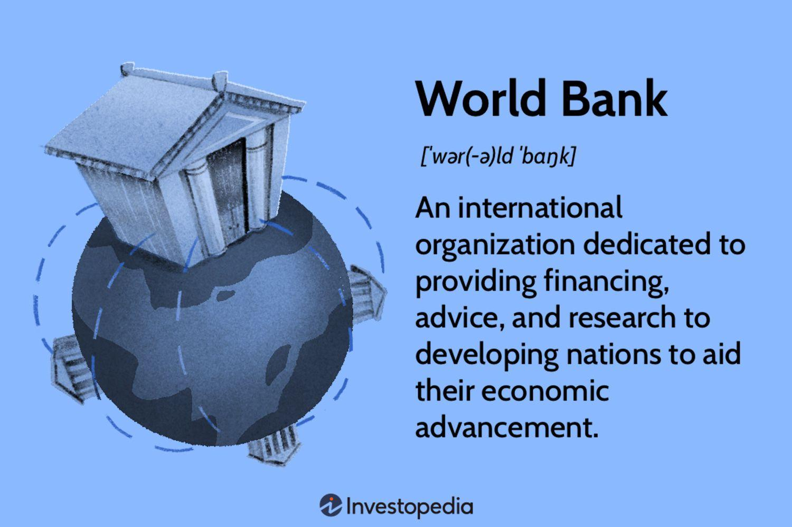

## Table of Contents

## What is the World Bank?

The World Bank is an international organization that helps countries get money and advice to make their economies better. It started in 1944 and is located in Washington, D.C. The main goal of the World Bank is to reduce poverty and help countries grow by giving them loans, grants, and expert advice.

The World Bank works with governments, other international organizations, and the private sector. It focuses on areas like education, health, and infrastructure. By helping countries build schools, hospitals, and roads, the World Bank aims to improve the lives of people around the world.

## When was the World Bank established?

The World Bank was established in 1944. It was created to help countries that were struggling after World War II. The idea was to give these countries money and advice to rebuild their economies.

The World Bank started working officially on December 27, 1945. Since then, it has grown a lot and now helps many countries around the world. Its main goal is to reduce poverty and help countries develop by giving them loans, grants, and expert advice.

## What are the main goals of the World Bank?

The main goal of the World Bank is to reduce poverty around the world. It does this by helping countries that need money and advice to make their economies better. The World Bank gives loans and grants to these countries, which they can use to build things like schools, hospitals, and roads. This helps people in these countries have better lives.

Another important goal of the World Bank is to help countries grow and develop. It works with governments, other international organizations, and businesses to make this happen. The World Bank gives expert advice on how to improve areas like education, health, and infrastructure. By focusing on these areas, the World Bank aims to create lasting improvements in the countries it helps.

## How is the World Bank structured?

The World Bank is made up of two main parts: the International Bank for Reconstruction and Development (IBRD) and the International Development Association (IDA). The IBRD helps middle-income and creditworthy low-income countries by giving them loans at low interest rates. The IDA, on the other hand, focuses on the world's poorest countries. It gives them loans with no interest and grants, which are like gifts that don't need to be paid back.

The World Bank is run by a president, who is chosen by the Board of Governors. The Board of Governors is made up of one representative from each of the 189 member countries. They meet once a year to make big decisions. Day-to-day work is handled by the Board of Executive Directors, which has 25 members. These members are chosen by the member countries, and they meet regularly to make sure the World Bank is doing its job well.

The World Bank also has many smaller groups and offices that work on specific projects and areas. These groups focus on things like education, health, and building infrastructure. They work closely with the countries they help, making sure that the money and advice they give are used in the best way possible. This structure helps the World Bank reach its main goals of reducing poverty and helping countries grow.

## What is the difference between the World Bank and the International Monetary Fund (IMF)?

The World Bank and the International Monetary Fund (IMF) are two different organizations that help countries with their economies, but they have different goals and ways of working. The World Bank focuses on reducing poverty and helping countries grow by giving them loans, grants, and advice. It works on long-term projects like building schools, hospitals, and roads. The World Bank is made up of two main parts: the International Bank for Reconstruction and Development (IBRD) and the International Development Association (IDA). The IBRD helps middle-income and creditworthy low-income countries, while the IDA focuses on the world's poorest countries.

The IMF, on the other hand, is more focused on helping countries with their short-term financial problems. It gives loans to countries that are having trouble paying their debts or keeping their economies stable. The IMF also gives advice on how countries can improve their economic policies. Unlike the World Bank, the IMF is more about making sure countries can manage their money well in the short term. Both organizations work together sometimes, but they have different main goals and ways of helping countries.

## How does the World Bank fund its operations?

The World Bank gets money to run its operations from the countries that are members of the organization. These countries give money to the World Bank by buying shares in the International Bank for Reconstruction and Development (IBRD). The more shares a country buys, the more say it has in how the World Bank is run. The World Bank also borrows money from international financial markets by selling bonds. This money is used to give loans to countries that need help.

The other part of the World Bank, the International Development Association (IDA), gets its money from contributions from richer member countries. These contributions are given as grants, which means the money does not have to be paid back. The IDA uses this money to give loans with no interest and grants to the world's poorest countries. By using these different ways to get money, the World Bank can help many countries around the world with their development and fight against poverty.

## What types of projects does the World Bank typically finance?

The World Bank helps countries by giving money for many different kinds of projects. It often pays for projects that help build things like schools, hospitals, and roads. These projects are important because they help make life better for people in the countries. For example, building a new school can help more children get an education, while a new hospital can make sure people get the healthcare they need. The World Bank also gives money for projects that help the environment, like protecting forests and making energy cleaner.

Another type of project the World Bank finances is about helping people get better jobs and earn more money. This can include projects that teach people new skills or help small businesses grow. The World Bank also supports projects that help farmers grow more food and sell it for a good price. These projects are important because they help reduce poverty and make sure people have enough to eat. By financing these different kinds of projects, the World Bank works to make the world a better place for everyone.

## How does the World Bank assess the impact of its projects?

The World Bank uses different ways to check if its projects are helping. It looks at numbers and data to see if things like poverty, health, and education are getting better in the countries it helps. The World Bank also talks to people in these countries to find out if the projects are making a difference in their lives. This helps the World Bank understand if the money and advice it gives are being used in the best way.

The World Bank also does special studies to see how well its projects are working. These studies look at the long-term effects of the projects and see if they are helping the countries grow and develop. By doing these checks, the World Bank can learn from its projects and make them better in the future. This way, it can keep working to reduce poverty and help countries around the world.

## What role does the World Bank play in global poverty reduction?

The World Bank plays a big role in helping to reduce poverty around the world. It does this by giving money and advice to countries that need help. The World Bank gives loans and grants to these countries, which they can use to build things like schools, hospitals, and roads. This helps people in these countries have better lives. For example, building a new school can help more children get an education, and a new hospital can make sure people get the healthcare they need.

The World Bank also helps countries grow and develop. It works with governments, other international organizations, and businesses to make this happen. The World Bank gives expert advice on how to improve areas like education, health, and infrastructure. By focusing on these areas, the World Bank aims to create lasting improvements in the countries it helps. This way, it can keep working to reduce poverty and help people around the world live better lives.

## How does the World Bank collaborate with other international organizations?

The World Bank works with many other groups around the world to help countries. It often works with the United Nations (UN) to make sure that the money and advice it gives are used in the best way. The World Bank also works with groups like the International Monetary Fund (IMF) to help countries that are having financial problems. By working together, these organizations can help countries more effectively than if they worked alone.

The World Bank also partners with other organizations like the World Health Organization (WHO) and the United Nations Children's Fund (UNICEF). These partnerships help the World Bank focus on important areas like health and education. For example, the World Bank might work with the WHO to build hospitals or with UNICEF to build schools. By working with these groups, the World Bank can make sure that its projects are helping people in the best way possible.

## What are some criticisms of the World Bank's policies and operations?

Some people say that the World Bank's policies can hurt the countries it tries to help. They think that the World Bank sometimes makes countries follow strict rules to get loans. These rules can make it hard for countries to grow in the way they want. For example, the World Bank might tell a country to cut spending on important things like health and education. This can make life harder for people in those countries. Critics also say that the World Bank focuses too much on big projects like building roads and dams, and not enough on helping poor people directly.

Another criticism is that the World Bank does not always listen to the people in the countries it helps. Some say that the World Bank makes decisions without talking to the people who will be affected by its projects. This can lead to projects that do not meet the needs of the local people. For example, a new dam might help the economy, but it could also force people to leave their homes. Critics also worry that the World Bank's projects can harm the environment. They say that the World Bank should do more to protect nature and make sure its projects are good for the planet.

## How has the World Bank adapted its strategies in response to global economic changes?

The World Bank has changed its ways to keep up with the world's economy. It used to focus a lot on big projects like building roads and dams. But now, it also helps countries with things like climate change and technology. The World Bank knows that the world is changing fast, so it tries to help countries in new ways. For example, it gives money for projects that use clean energy and help the environment. This way, the World Bank can help countries grow while also protecting the planet.

The World Bank also listens more to the people in the countries it helps. It used to make decisions without talking to them much. But now, it tries to work with local people to make sure its projects meet their needs. The World Bank also gives more help to countries during big problems like the global health crisis. It gives money and advice to help countries get through tough times. By doing these things, the World Bank can keep helping countries even when the world's economy changes a lot.

## References & Further Reading

[1]: ["The World Bank: History and Evolution"](https://www.britannica.com/topic/World-Bank) - World Bank

[2]: Lopez de Prado, M. (2018). ["Advances in Financial Machine Learning"](https://www.amazon.com/Advances-Financial-Machine-Learning-Marcos/dp/1119482089). Wiley.

[3]: Black, F. (1986). ["Noise"](https://onlinelibrary.wiley.com/doi/abs/10.1111/j.1540-6261.1986.tb04513.x). The Quarterly Journal of Economics, 100(2), 353-367.

[4]: ["World Development Report 2019: The Changing Nature of Work"](https://www.worldbank.org/en/publication/wdr2019) - World Bank

[5]: Aldridge, I. (2013). ["High-Frequency Trading: A Practical Guide to Algorithmic Strategies and Trading Systems"](https://www.amazon.com/High-Frequency-Trading-Practical-Algorithmic-Strategies/dp/1118343506). Wiley.

[6]: Acemoglu, D., & Restrepo, P. (2018). ["Artificial Intelligence, Automation, and Work"](https://www.nber.org/papers/w24196). National Bureau of Economic Research Working Paper No. 24196.

[7]: [International Finance Corporation (IFC) Annual Report 2022](https://www.ifc.org/content/dam/ifc/doc/2022/ifc-ar22-vol-2-financials.pdf) - International Finance Corporation

[8]: Hasbrouck, J., Saar, G. (2013). ["Low-Latency Trading"](https://papers.ssrn.com/sol3/papers.cfm?abstract_id=1695460). The Review of Financial Studies, 26(9), 3261-3290.