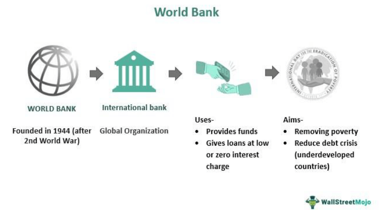

The global landscape of international finance is marked by its intricate and constantly changing nature. Central to this field is the World Bank, an influential entity dedicated to global development. Established in 1944, the World Bank has grown to become a pivotal organization that provides financial resources and expert assistance to developing nations. Its primary aim is to eradicate poverty and foster sustainable economic growth by supporting an array of projects that focus on infrastructure, education, health, and more. This institution engages in strategic partnerships with governments worldwide to achieve sustainable development goals, thereby impacting millions of lives across the globe.

Another significant component reshaping international finance is algorithmic trading, often referred to as algo trading. Characterized by the use of sophisticated algorithms, this method enables trades to be executed at unprecedented speeds and volumes. While it offers enhanced efficiency and the potential for increased profitability, it also presents challenges such as market volatility and regulatory concerns. The proliferation of algo trading is transforming financial markets, prompting institutions globally to invest heavily in this technology.

This article seeks to explore the World Bank's contributions to global development and examine how algo trading impacts international finance. Together, these elements underscore the dynamic nature of global finance and the continuous interplay between development initiatives and technological advancements in financial markets.

## Table of Contents

## Understanding the World Bank's Role in Global Development

The World Bank plays a significant role in promoting global development by providing crucial financial and technical assistance to developing countries. Established in 1944, its mission is to reduce poverty and build shared prosperity in these regions. It achieves this by supporting a wide array of projects that are integral to fostering economic growth and improving living standards.

One of the primary ways the World Bank contributes to global development is through funding initiatives aimed at enhancing infrastructure, education, and health services. By financing infrastructure projects, such as roads, bridges, and energy facilities, the World Bank helps create the foundation necessary for economic activities to thrive. For example, improved transportation networks facilitate trade and access to markets, while reliable energy supplies support industrial and technological advances.

In the education sector, the World Bank's projects focus on increasing access to quality education and reducing gender disparities. Through programs designed to improve schooling infrastructure, train teachers, and provide learning resources, the Bank strives to equip future generations with the skills needed to participate in modern economies. Education is a driving force behind human capital development, which is essential for sustaining long-term economic growth.

The Bank also places a strong emphasis on health-related projects, recognizing that health is an essential component of human development. By supporting initiatives that improve healthcare access, combat diseases, and enhance nutritional standards, the World Bank aims to boost productivity and reduce poverty. Healthier populations contribute to more robust labor markets and, consequently, stronger economies.

One pivotal initiative led by the World Bank is the Human Capital Project. This effort underscores the importance of investing in human capabilities, acknowledging that a country's human capital—the knowledge, skills, and health of its people—is crucial for economic development. The project seeks to accelerate investments in people by encouraging governments to prioritize human capital development in policy decisions. By doing so, nations can expect substantial returns, such as increased economic productivity and a higher gross domestic product (GDP).

Governments around the world actively collaborate with the World Bank to achieve sustainable development goals (SDGs). These collaborations often involve tailored financial and technical support that addresses specific challenges faced by individual countries. Through partnerships with various stakeholders, including the private sector, civil society, and international organizations, the World Bank fosters a collective approach to addressing global development issues.

In summary, the World Bank is a vital player in supporting the development of infrastructure, education, and healthcare in developing countries. By promoting projects that enhance human capital and aligning efforts with global goals, the Bank contributes significantly to the fight against poverty and the pursuit of sustainable development.

## Financial Structure of the World Bank

The World Bank is an influential financial institution that differs from traditional banks by its organizational structure, consisting of five distinct entities known collectively as the World Bank Group (WBG). These entities are designed to provide a comprehensive approach to international development and economic growth. The two most prominent institutions within the World Bank Group are the International Bank for Reconstruction and Development (IBRD) and the International Development Association (IDA).

The International Bank for Reconstruction and Development (IBRD) primarily serves middle-income and creditworthy low-income countries. It provides loans and financial products that cater to the development needs of these nations, focusing on projects that span sectors like infrastructure, education, and environmental sustainability. IBRD raises funds primarily through the issuance of bonds in international financial markets. These bonds are backed by the World Bank's triple-A credit rating, allowing the institution to offer competitive rates. The organization operates on a subscription basis where member countries buy shares, providing a financial base for its operations.

In contrast, the International Development Association (IDA) targets the world's poorest countries, offering concessional loans and grants that are vital for countries with limited access to financial markets. Concessional loans offered by IDA typically have low or no interest rates and extended repayment terms, ensuring that these vulnerable nations can finance developmental projects without undue fiscal strain. IDA's resources are replenished periodically through contributions from member countries, reflecting a shared commitment to aiding poverty reduction and sustainable development.

In addition to the IBRD and IDA, the World Bank Group comprises three other institutions: the International Finance Corporation (IFC), the Multilateral Investment Guarantee Agency (MIGA), and the International Centre for Settlement of Investment Disputes (ICSID). Each plays a unique role in furthering development aims through private sector partnerships, investment guarantees, and legal dispute resolution, respectively.

Understanding the financial structure of the World Bank involves recognizing how these institutions synergize to provide financial support for developmental initiatives. By offering a combination of loans, grants, and technical assistance, the World Bank Group facilitates strategic investments that address key areas of economic and human development. The substantial impact of the World Bank's financial aid mechanisms underscores its critical position in helping countries pursue sustainable growth objectives and improve living standards.

## Impact of Global Value Chains on Development

Global Value Chains (GVCs) have become a cornerstone of modern international trade, fostering development by enabling economic convergence and offering new avenues for growth to poorer nations. By integrating firms and workers from multiple countries in the production and distribution of goods and services, GVCs facilitate the specialization necessary for efficiency and competitive advantage. As a result, nations with limited resources can participate in global markets by focusing on particular segments of production, significantly contributing to economic advancement.

The rapid growth and integration into GVCs have historically provided substantial opportunities for developing countries. By joining these networks, they can tap into global demand and access advanced technologies, knowledge, and skills. For instance, countries like Vietnam and Bangladesh have experienced accelerated economic growth by engaging in textile and manufacturing networks dominated by more developed economies. This integration has often led to job creation, increased productivity, and higher standards of living.

However, the 2008 financial crisis marked a slowdown in the expansion of GVCs. This stagnation has posed serious challenges for developing economies that were beginning to reap the benefits of global integration. The crisis triggered a decrease in global trade due to reduced consumer demand and tighter financial conditions, making it difficult for these countries to maintain their previous growth trajectories. Furthermore, the rise of protectionist policies, geopolitical tensions, and uncertainties in global trade agreements have added layers of complexity, hindering the seamless operation and expansion of GVCs post-crisis.

To revive the potential of GVCs, technological advancements and international cooperation are imperative. Technological innovations, such as digital platforms and automation, can optimize logistic operations, reduce costs, and connect diverse players in global production networks more effectively. For example, blockchain technology is increasingly being leveraged to enhance transparency and traceability in supply chains, thereby fostering trust and collaboration among international partners.

Moreover, overcoming stalled growth in GVCs requires strong international collaboration. Countries must engage in dialogue and form alliances to ensure open trade and investment channels, as well as create regulatory standardizations that facilitate seamless cross-border transactions. Initiatives focused on capacity building, infrastructure development, and skill enhancement in developing countries will empower local industries to participate more effectively in GVCs.

In conclusion, while GVCs have been pivotal in aiding economic convergence, proactive measures are essential to sustain and expand their influence, particularly in the aftermath of economic disruptions. Concerted efforts in adopting technological innovations and promoting international cooperation can rejuvenate GVCs, fostering an inclusive and dynamic global economy.

## Algorithmic Trading: Shaping the Future of International Finance

Algorithmic trading, often referred to as algo trading, leverages advanced algorithms to execute financial trades with remarkable speed and precision. This automated trading approach utilizes pre-programmed instructions accounting for variables such as timing, price, and [volume](/wiki/volume-trading-strategy), which allows it to surpass the capabilities of human traders in both speed and scale. With the rapid evolution of technology, algo trading has become a cornerstone of modern financial markets.

Efficiency is one of the primary advantages of [algorithmic trading](/wiki/algorithmic-trading). By minimizing manual intervention, it reduces the time taken to [carry](/wiki/carry-trading) out trades and reduces human error, thereby potentially increasing profitability. The ability to quickly analyze large volumes of data and execute trades optimally is particularly beneficial in high-frequency trading, where speed is crucial.

However, the same features that enhance efficiency contribute to market [volatility](/wiki/volatility-trading-strategies). The automated nature of algo trading means that significant financial fluctuations can occur within milliseconds, sometimes leading to destabilizing market events such as flash crashes. For example, the 2010 Flash Crash witnessed the Dow Jones Industrial Average plunge nearly 1,000 points within minutes, partly attributed to algorithmic trading systems responding to each other in a feedback loop.

Moreover, the regulatory landscape poses challenges for algorithmic trading. Ensuring market stability while fostering innovation necessitates stringent oversight. Regulatory bodies across the globe, including the U.S. Securities and Exchange Commission (SEC) and European Securities and Markets Authority (ESMA), have implemented stringent guidelines to curb potential systemic risks. These regulations often focus on maintaining market transparency, managing technological risks, and safeguarding against market manipulation.

The growth of algo trading is evident from increased investments by financial institutions worldwide, who are integrating cutting-edge technology to refine their trading strategies. This trend underscores the need for advanced data analytics, [machine learning](/wiki/machine-learning), and [artificial intelligence](/wiki/ai-artificial-intelligence) to develop more sophisticated and adaptive trading algorithms.

Hence, the future of algorithmic trading in international finance is intertwined with technology and regulation. Financial markets benefit from improved efficiency and [liquidity](/wiki/liquidity-risk-premium), while also facing potential risks that necessitate careful oversight. Balancing technological advancements with regulatory frameworks is key to harnessing the benefits of algorithmic trading without compromising market integrity.

## Interlinking Global Development and Algorithmic Trading

The integration of technology within finance has the potential to significantly enhance global development through improved market efficiency. Algorithmic trading, leveraging advanced computational techniques and vast datasets, enables the execution of trades with precision and speed that surpass human capabilities. This improvement in efficiency reduces transaction costs and increases liquidity, thereby making financial markets more accessible to a broader audience, including developing economies. 

Increased market accessibility provides developing countries with greater opportunities to attract international capital. This influx of investment is crucial for fostering economic growth, as it allows for the funding of essential infrastructure projects, educational systems, and healthcare services. Consequently, these investments can uplift communities, reduce poverty, and stimulate economic activity within these nations.

The World Bank, as a key player in supporting global economic development, can harness the benefits of algorithmic trading to enhance the effectiveness of its initiatives. By integrating fintech innovations like algo trading into its financial support frameworks, the World Bank can optimize the allocation of resources and accelerate the achievement of its sustainable development goals. For example, algorithmic trading could be utilized to more effectively manage the bond markets or currency exchanges that fund developmental projects.

However, the benefits of incorporating algorithmic trading must be weighed against the need for robust regulatory frameworks. Unchecked, algorithmic trading can introduce volatility and systemic risks to financial markets, which could destabilize developing economies rather than support them. It is essential to establish regulations that mitigate these risks while fostering an environment that encourages technological advancement and financial inclusion.

In conclusion, the synergy of global development initiatives and algorithmic trading holds significant promise. This combination has the potential to empower developing economies by providing the necessary capital for growth. Ensuring that these technological advancements are balanced with effective regulation will be critical to achieving sustainable and inclusive financial development on a global scale. The ongoing collaboration between international institutions like the World Bank and the fintech sector will be vital in navigating these opportunities and challenges.

## Challenges and Future Outlook

International finance encounters numerous obstacles, including political instability, economic inequalities, and technological disruptions. Addressing these challenges necessitates dynamic strategies, particularly from key institutions like the World Bank and advancements in financial technologies such as algorithmic trading.

Political instability remains a persistent issue affecting international finance. Uncertainty in governance can lead to volatile market conditions and deter investment, which hampers economic growth. The World Bank continues to evolve its strategies to mitigate these impacts by promoting good governance and fostering institutional resilience in developing countries. By providing financial assistance and policy guidance, the World Bank supports the establishment of stable and transparent financial systems that can withstand political upheavals.

Economic inequality is another critical barrier to development. Disparities in income and resources can limit access to financial services, restricting economic opportunities for sections of the population. The World Bank targets these issues through initiatives aimed at poverty alleviation and economic inclusivity, ensuring that growth benefits are widespread. Enhanced social protection systems, investments in human capital, and infrastructure development are essential components of this approach.

Technological disruptions, while offering opportunities for economic advancement, also present challenges that require careful navigation. Algorithmic trading exemplifies a transformative technology reshaping financial markets. While it brings efficiency and potential profits, it also introduces new risks, such as increased market volatility and ethical concerns related to trading practices. Future developments in algorithmic trading should focus on reducing systemic risk and incorporating ethical considerations into algorithm designs.

To achieve a more integrated and equitable financial landscape, collaboration on global policies and technological innovation is vital. International cooperation can lead to the development of standardized regulations that manage cross-border financial activities effectively. Embracing technological advancements, countries can create more robust financial systems, fostering greater economic integration and opportunity.

The integration of thoughtful regulation with technology-driven market efficiencies promises a future where international finance can contribute significantly to solving global challenges. Addressing these challenges in a holistic manner positions international finance as a tool for sustainable development and economic growth.

## Conclusion

International finance, underpinned by institutions like the World Bank and technological advancements such as algorithmic trading, plays a critical role in fostering global development. The World Bank continues to be a significant force in providing financial and technical aid, helping countries improve their infrastructure, health, education, and overall economic stability. Its strategic programs aimed at human capital development underscore a commitment to reducing poverty and boosting economic capabilities. By enhancing human capabilities, these initiatives catalyze sustainable growth and equitable resource distribution.

Algorithmic trading, a groundbreaking innovation in financial markets, offers enhanced efficiency and profitability through high-speed transactions facilitated by sophisticated algorithms. This technology holds great potential to improve market access and liquidity, thereby empowering emerging economies. However, the integration of such complex systems necessitates stringent regulatory oversight to ensure market stability and mitigate potential risks associated with increased volatility.

The confluence of traditional financial aid mechanisms and cutting-edge financial technologies creates a unique opportunity to address global economic disparities. Continuous investment in human capital and technology is essential to unlocking new economic opportunities. Robust regulatory frameworks will ensure that technological and financial innovations are harnessed responsibly, protecting the integrity of markets worldwide.

As global financial landscapes evolve, the need for collaborative efforts across nations and institutions becomes ever more critical. Innovation, coupled with strategic partnerships, will enable the world to navigate complex financial systems more effectively. Such collaboration holds the promise of a more integrated and equitable global economy, where economic growth is inclusive and sustainable. The synergy between global financial institutions and technological advancements is poised to drive transformative changes, ultimately leading to a reduction in poverty and the enhancement of economic opportunities on a global scale.

## References & Further Reading

[1]: ["The World Bank: History and Evolution"](https://www.britannica.com/topic/World-Bank) - World Bank

[2]: Lopez de Prado, M. (2018). ["Advances in Financial Machine Learning"](https://www.amazon.com/Advances-Financial-Machine-Learning-Marcos/dp/1119482089). Wiley.

[3]: Black, F. (1986). ["Noise"](https://onlinelibrary.wiley.com/doi/abs/10.1111/j.1540-6261.1986.tb04513.x). The Quarterly Journal of Economics, 100(2), 353-367.

[4]: ["World Development Report 2019: The Changing Nature of Work"](https://www.worldbank.org/en/publication/wdr2019) - World Bank

[5]: Aldridge, I. (2013). ["High-Frequency Trading: A Practical Guide to Algorithmic Strategies and Trading Systems"](https://www.amazon.com/High-Frequency-Trading-Practical-Algorithmic-Strategies/dp/1118343506). Wiley.

[6]: Acemoglu, D., & Restrepo, P. (2018). ["Artificial Intelligence, Automation, and Work"](https://www.nber.org/papers/w24196). National Bureau of Economic Research Working Paper No. 24196.

[7]: [International Finance Corporation (IFC) Annual Report 2022](https://www.ifc.org/content/dam/ifc/doc/2022/ifc-ar22-vol-2-financials.pdf) - International Finance Corporation

[8]: Hasbrouck, J., Saar, G. (2013). ["Low-Latency Trading"](https://papers.ssrn.com/sol3/papers.cfm?abstract_id=1695460). The Review of Financial Studies, 26(9), 3261-3290.