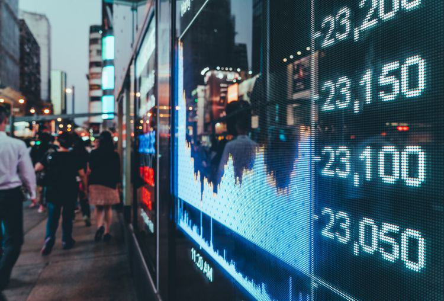

In today's interconnected world, understanding the complexities of global financial markets is crucial. These markets form a vast network that includes various instruments and platforms, where assets are traded across borders, influencing economies worldwide. Among the essential components of this intricate system are global stock exchanges, which facilitate trade and investment, thus playing a crucial role in economic development.

Significant organizations, like the World Federation of Exchanges (WFE), play an indispensable role in ensuring that the global trading environment remains cohesive, efficient, and fair. The WFE, with members from over 66 exchanges, is committed to promoting standardized practices, transparency, and collaboration across markets, providing a platform for exchanges to align on critical issues.



A key transformation in recent years has been the rise of algorithmic trading. By using predefined computational models to execute trades at unprecedented speeds and volume, algorithmic trading has fundamentally changed how transactions are executed. This technology-driven shift has led to greater precision and efficiency, allowing traders to respond quickly to market changes and execute complex strategies.

Technological advancements, particularly in artificial intelligence, are further impacting financial markets. AI is enhancing data analysis, predictive modeling, and decision-making processes, offering new insights and improving risk management. These technologies allow market participants to identify trends and refine strategies with remarkable accuracy and speed.

As this article progresses, it will explore the latest trends and challenges facing global financial markets. The focus will include an examination of the impact technologies like AI have on these markets and the ongoing efforts of organizations such as the WFE in fostering a sustainable and equitable environment for all market participants.

## Table of Contents

## Global Stock Exchanges

Global stock exchanges are fundamental components of the international financial markets, serving as pivotal platforms for facilitating trade and investment across national boundaries. These exchanges act as structured environments where securities such as stocks, bonds, and derivatives are bought and sold, providing a robust infrastructure for economic activity and capital formation.

The World Federation of Exchanges (WFE) plays a crucial role in this ecosystem, comprising over 66 member exchanges across the globe. This collective underscores the significance of standardized practices and the importance of data sharing, which are essential for ensuring market transparency, efficiency, and stability. By fostering collaboration among exchanges, the WFE helps to harmonize trading practices, which is vital in maintaining investor confidence and promoting global market integration.

Each stock exchange functions under its local regulatory framework, which defines the rules and requirements for market operations and participant behavior. Despite these local regulations, there is a growing trend towards international collaboration, aimed at creating a more seamless trading experience across different jurisdictions. This collaboration is facilitated through agreements and partnerships that focus on aligning trading standards, improving cross-border transactions, and enhancing information sharing.

The evolution of stock exchanges is significantly shaped by digital transformation, which has revolutionized how these institutions operate and interact with market participants. Digital technologies are enhancing market accessibility, making it possible for a broader range of investors to participate in trading activities. This technological advancement is also driving greater data transparency, allowing investors to make more informed decisions based on real-time market information and analytics.

Overall, global stock exchanges continue to serve as the backbone of the financial markets, leveraging technological advancements and international cooperation to support the continuous flow of global capital. By maintaining a focus on standardized operations and embracing innovation, these exchanges contribute to the stability and growth of the global economy.

## The Role of International Trade

International trade is a fundamental pillar that influences global economic policies and maintains a close relationship with financial markets. It serves as a catalyst for economic growth by enabling countries to specialize in the production of goods and services that they can produce most efficiently. Consequently, international trade enhances resource allocation, productivity, and consumption, resulting in increased standards of living worldwide.

Trade agreements such as the North American Free Trade Agreement (NAFTA), the European Union (EU) single market, and other regional trade agreements play a crucial role in market stability and investor confidence. These agreements reduce barriers to trade, such as tariffs and import quotas, facilitating a smoother exchange of goods and services across borders. This, in turn, creates a more predictable and secure trading environment, encouraging investment and economic stability.

The World Trade Organization (WTO) and similar entities work to ensure that trade flows as smoothly, predictably, and freely as possible, thus supporting robust market infrastructures. Through its regulatory framework, the WTO oversees and enforces international trade agreements, offering a forum for negotiating trade-related issues and resolving disputes. As a result, participating countries have greater confidence in engaging with international markets, knowing there is a structured mechanism to address concerns.

The evolution of global stock exchanges further intertwines with international trade. The seamless integration of these markets enables greater [liquidity](/wiki/liquidity-risk-premium) and accessibility, allowing investors to diversify their portfolios and hedge against potential risks. This interconnectedness not only fosters harmonized trade practices but also enhances transparency and efficiency in the global financial ecosystem.

The World Federation of Exchanges (WFE) is pivotal in facilitating this interconnectedness by uniting exchanges worldwide to promote a unified approach to market practices and data sharing. The WFE's work in standardizing best practices and advocating for the interests of securities exchanges and central counterparties globally strengthens the trading environment.

Moreover, the synergy between international trade and financial markets is evident in how market participants utilize financial instruments to manage trade-related risks. Derivatives such as futures, options, and swaps are widely used by importers and exporters to hedge against foreign exchange and commodity price fluctuations, ensuring more stable cash flows and operational certainty.

In summary, international trade significantly influences global financial markets through agreements that foster market confidence and stability and through the role of exchanges that provide a platform for efficient capital allocation. As the world becomes increasingly interconnected, the collaboration facilitated by trade and financial organizations ensures that trade practices remain standardized and reliable, contributing to sustainable economic growth.

## Algorithmic Trading: A Technological Revolution

Algorithmic trading, known as algo trading, utilizes sophisticated algorithms to execute trading decisions at extraordinary speed and efficiency. This approach has fundamentally transformed financial markets by leveraging technology to perform trades with minimal human intervention. The core strategies involve the use of mathematical models and statistical analyses to determine the optimal timing and pricing for trade execution. By automating the trading process, algo trading reduces transaction costs, mitigates human error, and exploits fleeting market opportunities that are imperceptible to human traders.

The efficiency and liquidity that [algorithmic trading](/wiki/algorithmic-trading) brings are unparalleled. In essence, algorithms can process vast amounts of market data in real-time, identify patterns, and execute trades within milliseconds. The use of high-frequency trading ([HFT](/wiki/high-frequency-trading-strategies)), a subset of algorithmic trading, exemplifies this capability. HFT systems typically buy and sell large volumes of stocks in extremely short holding periods, often measured in seconds or fractions thereof. This rapid turnover contributes significantly to market liquidity and tighter bid-ask spreads.

One of the most significant advancements in algorithmic trading arises from the incorporation of [artificial intelligence](/wiki/ai-artificial-intelligence) (AI) and [machine learning](/wiki/machine-learning) (ML). These technologies enhance the sophistication of trading algorithms by enabling them to learn from historical data and adjust to new patterns autonomously. Machine learning algorithms, specifically, can identify and adapt to complex market conditions, thus offering adaptive trading solutions that improve over time. For example, [reinforcement learning](/wiki/reinforcement-learning)—a type of machine learning—can optimize trading strategies based on outcomes from historical trading scenarios.

A practical Python example to illustrate a basic concept in algorithmic trading could be the implementation of a moving average crossover strategy. This is a common strategy used to signal when to buy or sell assets:

```python
import pandas as pd

# Load historical stock data
data = pd.read_csv('stock_prices.csv')

# Calculate short and long-term moving averages
data['Short_MA'] = data['Close'].rolling(window=20).mean()
data['Long_MA'] = data['Close'].rolling(window=50).mean()

# Generate trading signals (1 for buy, -1 for sell)
data['Signal'] = 0
data.loc[data['Short_MA'] > data['Long_MA'], 'Signal'] = 1
data.loc[data['Short_MA'] < data['Long_MA'], 'Signal'] = -1

# Display signals
print(data[['Close', 'Short_MA', 'Long_MA', 'Signal']])

```

This script computes short-term and long-term moving averages for stock prices and generates buy or sell signals based on their crossover. Despite its simplicity, such algorithmic strategies can be a foundation for more complex systems that incorporate AI techniques.

Moreover, algorithmic trading systems are increasingly using sentiment analysis on financial news and social media to predict market movements. This demonstrates the power of AI in translating qualitative data into quantitative insights, which can guide trading decisions.

In summary, algorithmic trading harnesses technology to optimize trade processes, significantly impacting the speed and precision of financial markets. As AI and machine learning continue to evolve, we can expect the next generation of trading algorithms to be even more adaptive and insightful, driving more profound changes across the financial landscape.

## Impact of AI in Financial Markets

Artificial Intelligence (AI) has emerged as a transformative force in financial markets, particularly in the domain of algorithmic trading. By offering enhanced data analysis and predictive modeling, AI is not merely an add-on but a critical component reshaping how trades are executed and decisions are made.

AI's capacity for handling large datasets allows for more complex and nuanced analysis than traditional methods. Predictive models powered by AI can analyze past and present data to identify patterns, trends, and anomalies that might impact market conditions. This predictive capability is crucial for developing trading strategies that are both responsive and adaptive to changing market dynamics.

Generative AI models play a significant role by enabling traders to simulate various market conditions. These simulations assist traders in evaluating potential risks and rewards of different strategies before applying them in real-world scenarios. The role of AI in risk management becomes evident as traders can optimize their decision-making processes and mitigate potential losses.

For instance, utilizing generative AI, traders can create multiple scenarios for market movements, applying these models to construct a probabilistic representation of potential outcomes. The Python code snippet below illustrates a simple generative AI model using probabilistic forecasting:

```python
import numpy as np

def simulate_market_conditions(n_simulations, initial_price, volatility):
    # Generate random market conditions using a log-normal distribution
    returns = np.random.normal(loc=0, scale=volatility, size=n_simulations)
    # Calculate future prices based on initial price and returns
    future_prices = initial_price * np.exp(returns)
    return future_prices

# Example usage: Simulating 1000 market conditions for a stock with initial price $100 and 2% volatility
simulated_prices = simulate_market_conditions(1000, 100, 0.02)
```

AI-driven insights are crucial for promptly identifying market trends and refining trading strategies. Real-time analysis of data streams and constant model updates empower traders to act on emerging trends faster than traditional analysis would allow. For example, machine learning algorithms can detect slight deviations or consistencies in market behavior that signal opportunities or threats, providing a competitive edge through timely decision-making.

In conclusion, AI significantly enhances the landscape of financial markets by introducing sophisticated tools for analysis, simulation, and strategy optimization. Its integration in algorithmic trading facilitates a more robust approach to navigating complex and fast-paced financial environments, ultimately leading to more informed and precise trading decisions.

## Challenges and Regulatory Considerations

The rapid advancement of trading technologies, particularly algorithmic and AI-driven trading, poses significant regulatory challenges for financial markets worldwide. As these technologies have transformed the mechanics of trading, they have also introduced complexities that necessitate continuous regulatory vigilance and adaptation.

Firstly, the high speed and automation inherent in algorithmic trading can exacerbate issues such as market [volatility](/wiki/volatility-trading-strategies) and flash crashes. For instance, the 2010 Flash Crash, where the Dow Jones Industrial Average plunged nearly 1,000 points within minutes, highlighted the vulnerabilities in market infrastructures due to automated trading systems. To mitigate such risks, regulatory bodies have implemented measures like circuit breakers, which temporarily halt trading during extreme market movements to curb excessive volatility.

Globally, financial regulatory authorities, such as the U.S. Securities and Exchange Commission (SEC), the European Securities and Markets Authority (ESMA), and others, are working to keep pace with technological advancements. This involves updating existing regulations and developing new frameworks that address the unique attributes of algorithmic and AI-based trading. A key focus is ensuring that these regulations maintain market integrity, prevent market manipulation, and protect investor interests.

Balancing innovation with regulation is critical for creating a sustainable trading environment. Overregulation could stifle technological progress and limit the benefits of efficiency and liquidity provided by cutting-edge trading technologies. Conversely, insufficient regulation could lead to abuses and systemic risks. Therefore, regulatory approaches are increasingly adopting a risk-based perspective, whereby the focus is on understanding the potential impacts of new technologies and crafting rules that minimize these risks without hampering innovation.

In addition to national regulatory measures, international cooperation is essential due to the global nature of financial markets. The development of standardized practices through organizations like the World Federation of Exchanges (WFE) promotes a unified regulatory approach. These collaborative efforts are pivotal in ensuring that trading activities remain fair and transparent across borders.

In conclusion, the intersection of rapidly evolving trading technologies and regulatory frameworks presents both challenges and opportunities. Effective regulation that adapts to technological advancements while fostering innovation can ensure that financial markets remain robust, transparent, and resilient.

## The Future of Global Financial Markets

The financial markets are on the cusp of significant transformation, with technology at the forefront of this evolution. As we look to the future, several key factors will dictate how these markets develop and operate. 

Firstly, the integration of advanced technologies such as artificial intelligence (AI), machine learning, and blockchain is expected to streamline trading processes. AI and machine learning algorithms can analyze vast amounts of data, providing insights that enhance decision-making processes. These technologies improve predictive modeling, allowing traders to simulate market conditions and refine their strategies efficiently. As a result, markets are likely to become more efficient and liquid, offering enhanced opportunities for investors and traders alike.

Blockchain technology, with its transparent and secure nature, has the potential to revolutionize settlement processes in financial markets. By reducing the time and cost associated with traditional settlement methods, blockchain can increase the speed and security of transactions. This shift will foster trust among market participants and could lead to broader acceptance and adoption of digital financial assets.

The future of global financial markets also hinges on the collaboration between exchanges, regulatory bodies, and technology providers. Such collaboration will be crucial in establishing frameworks that ensure market integrity and protect investor interests while accommodating technological advancements. Regulatory bodies are already working towards establishing guidelines that balance innovation with investor protection. These efforts will likely continue as technology evolves, ensuring that markets remain fair and transparent.

Furthermore, the role of global exchanges remains pivotal as they adapt to digital transformation. By embracing digital platforms and enhancing data transparency, exchanges can improve market accessibility for a wider range of participants. This inclusivity will not only democratize financial markets but also boost their stability and robustness.

In conclusion, understanding the current dynamics of financial markets is essential for stakeholders aiming to navigate future challenges and opportunities effectively. The ongoing technological evolution, supported by international collaboration and regulatory oversight, is set to redefine the landscape of global financial markets. This transformation promises to create more efficient, transparent, and inclusive markets, benefiting participants worldwide.

## Conclusion

The complex ecosystem of global financial markets, driven by rapid technological evolution and strengthened by international collaboration, presents both remarkable opportunities and significant challenges. As the digitization of markets accelerates and trading becomes significantly automated, understanding how to navigate these transformations becomes crucial. Technology and innovation promise to enhance market efficiency and expand accessibility, yet they also complicate the landscape with risks that need to be managed.

The increasing automation in trades requires participants to adapt swiftly to new trends and be vigilant regarding regulatory changes. Technological advancements such as algorithmic trading and artificial intelligence continue to mold how we engage with financial markets, emphasizing the necessity for robust regulatory frameworks. These frameworks aim to preserve market integrity and protect investors without stifling the innovation that drives growth.

The overarching objective remains to cultivate markets that are fair, transparent, and efficient for stakeholders across the globe. This involves not only the harmonization of global trading practices but also the adoption of uniform data standards to facilitate smooth cross-border transactions. The collaboration among stock exchanges, regulatory institutions, and technology providers will be pivotal in shaping resilient and adaptable financial systems.

As market participants, staying informed and agile are key to navigating the complexities of today’s financial landscape. Understanding these dynamics will prepare stakeholders for the continual changes and opportunities that lie ahead, fostering a sustainable market environment that benefits both local and global economies.

## References & Further Reading

[1]: Bergstra, J., Bardenet, R., Bengio, Y., & Kégl, B. (2011). ["Algorithms for Hyper-Parameter Optimization."](https://dl.acm.org/doi/10.5555/2986459.2986743) Advances in Neural Information Processing Systems 24.

[2]: ["Advances in Financial Machine Learning"](https://www.amazon.com/Advances-Financial-Machine-Learning-Marcos/dp/1119482089) by Marcos Lopez de Prado

[3]: Arner, D. W., Barberis, J., & Buckley, R. P. (2015). ["The Evolution of Fintech: A New Post-Crisis Paradigm?"](https://papers.ssrn.com/sol3/papers.cfm?abstract_id=2676553) University of Hong Kong Faculty of Law Research Paper No. 2015/047.

[4]: Chlistalla, M. (2011). ["High-Frequency Trading: Better Than Its Reputation?"](https://c.mql5.com/forextsd/forum/168/high-frequency_trading_-_better_than_its_reputation.pdf) Deutsche Bank Research.

[5]: Gomber, P., Arndt, B., Lutat, M., & Uhle, T. (2011). ["High-Frequency Trading."](https://papers.ssrn.com/sol3/papers.cfm?abstract_id=1858626) Wirtschaftsinformatik, 53(2), 89-99.

[6]: Rasekhschaffa, B., & Kusy, M. (2019). ["Algorithmic Trading and Machine Learning: Trends and Costs."](https://www.science.org/doi/10.1126/science.aaa8415) Procedia Computer Science, 147, 781-789.

[7]: ["Quantitative Trading: How to Build Your Own Algorithmic Trading Business"](https://github.com/LucindaYa/quant-resources/blob/master/Quantitative%20Trading%20How%20to%20Build%20Your%20Own%20Algorithmic%20Trading%20Business.pdf) by Ernest P. Chan

[8]: World Federation of Exchanges. ["Leading the Industry in Exchange Advocacy."](https://www.world-exchanges.org/)