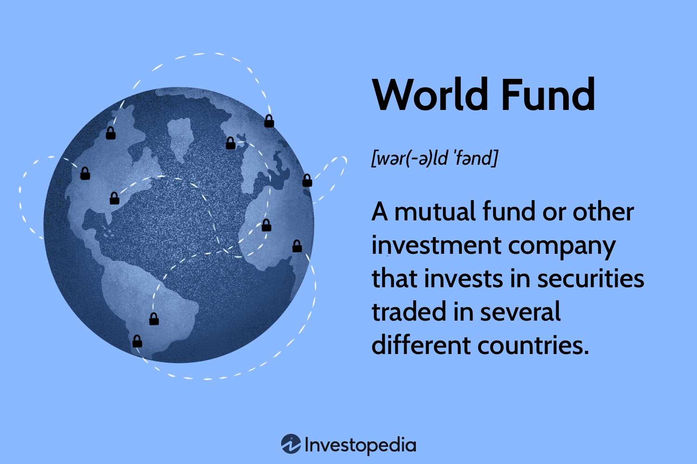

## Table of Contents

## What is the World Fund?

The World Fund is an organization that helps protect the environment. It works to stop climate change and support nature. The fund raises money to invest in projects that are good for the planet. These projects can include things like planting trees, protecting wildlife, and using clean energy.

People from all over the world can give money to the World Fund. This money helps the fund to do more projects that help the environment. The World Fund believes that if many people work together, they can make a big difference in saving the planet.

## What are the main objectives of the World Fund?

The main goal of the World Fund is to fight climate change. They want to stop the Earth from getting too hot. They do this by supporting projects that use clean energy, like wind and solar power. These projects help reduce the gases that make the planet warm up.

Another big aim of the World Fund is to protect nature. They work to save forests, oceans, and animals. They help plant trees and protect wildlife. This is important because nature helps clean the air and water we need to live.

The World Fund also wants to bring people together to help the planet. They believe that if many people give a little money, they can do big things. They encourage everyone to join in and support their projects to make the world a better place.

## How was the World Fund established?

The World Fund was started by a group of people who wanted to help the planet. They saw that the Earth was in trouble because of climate change and damage to nature. So, they decided to create an organization that could raise money to fix these problems. They called it the World Fund and began working to get support from people all over the world.

At first, the World Fund focused on small projects. They helped plant trees and protect animals. As more people learned about their work, more people wanted to help. The World Fund grew bigger and started to work on bigger projects. They began to support clean energy and fight climate change on a larger scale. Today, the World Fund is known around the world for its efforts to save the planet.

## Who manages the World Fund?

The World Fund is managed by a team of people who care a lot about the environment. This team includes a board of directors, who make big decisions about what projects to support. They also have a group of experts who know a lot about climate change and nature. These experts help choose the best projects to help the planet.

The day-to-day work of the World Fund is done by staff members. They handle things like raising money, running projects, and talking to people about the fund's work. Everyone on the team works together to make sure the World Fund is doing the most it can to help the Earth.

## What types of projects does the World Fund typically support?

The World Fund supports many different kinds of projects that help the environment. One type of project they often support is planting trees. Trees are important because they take in the gases that make the planet warm up. The World Fund helps plant trees in places where they are needed the most. They also support projects that protect forests from being cut down. This helps keep the air clean and gives animals a place to live.

Another kind of project the World Fund supports is protecting wildlife. They help save animals that are in danger of disappearing. This can include setting up safe areas where animals can live without being bothered by people. The World Fund also works to stop people from hunting animals that should not be hunted. By protecting wildlife, the World Fund helps keep nature balanced and healthy.

The World Fund also supports projects that use clean energy. They help build wind farms and solar panels that make energy without polluting the air. This is important because it reduces the gases that cause climate change. The World Fund believes that using more clean energy can help stop the Earth from getting too hot. By supporting these projects, the World Fund is working to make the planet a better place for everyone.

## How does the World Fund select projects to fund?

The World Fund picks projects to fund by looking at how much they can help the environment. They have a group of experts who know a lot about climate change and nature. These experts look at each project and see if it will really make a difference. They think about things like how many trees will be planted, how many animals will be saved, or how much clean energy will be made. If a project can do a lot of good, the World Fund is more likely to support it.

The World Fund also thinks about where the projects are happening. They want to help places that need it the most. For example, if a forest is in danger of being cut down, the World Fund might choose to help protect it. They also look at how much money the project needs and if they can raise enough to make it happen. By choosing projects carefully, the World Fund makes sure their money is used in the best way to help the planet.

## What has been the impact of the World Fund on global development?

The World Fund has made a big difference in global development by helping to fight climate change and protect nature. They have supported many projects that use clean energy, like wind and solar power. These projects help reduce the gases that make the planet warm up. By doing this, the World Fund is helping to slow down climate change and make the Earth a safer place for everyone. They have also helped plant millions of trees, which take in harmful gases and give us fresh air to breathe.

In addition to fighting climate change, the World Fund has helped protect wildlife and their homes. They have set up safe areas where animals can live without being bothered by people. This has helped save many animals that were in danger of disappearing. By protecting nature, the World Fund is also helping to keep the air and water clean, which is important for people's health. Their work has shown that when people from all over the world work together, they can make a big difference in saving the planet.

## How is the World Fund financed?

The World Fund is financed by people from all over the world who want to help the planet. People can give money to the World Fund to support their projects. This money comes from individuals, families, and sometimes even businesses and schools. The World Fund also gets money from special events where they raise funds. For example, they might have a big walk or a concert where people pay to join in and the money goes to the fund.

In addition to donations from people, the World Fund sometimes gets money from governments and big organizations. These groups see the important work the World Fund is doing and want to help. The World Fund uses all this money carefully to support projects that fight climate change and protect nature. By bringing together money from many different places, the World Fund can do more to help the Earth.

## What are the criteria for countries or organizations to receive funding from the World Fund?

The World Fund looks at several things before giving money to countries or organizations. They want to make sure the money will be used to help the environment. They check if the project will fight climate change, protect nature, or use clean energy. The World Fund also looks at how much the project will help. They want to support projects that can make a big difference, like planting lots of trees or saving many animals.

The World Fund also thinks about where the projects are happening. They want to help places that really need it. For example, if a forest is in danger or if a country is struggling with climate change, the World Fund might choose to help there. They also look at how much money the project needs and if they can raise enough to make it happen. By choosing projects carefully, the World Fund makes sure their money is used in the best way to help the planet.

## How does the World Fund ensure transparency and accountability in its operations?

The World Fund makes sure everyone can see what they are doing by being very open about their work. They share detailed reports about where their money comes from and how it is spent. These reports are easy to find on their website. They also tell people about the projects they support and how those projects are doing. By sharing this information, the World Fund helps people trust that their money is being used to help the planet.

The World Fund also has rules to make sure they are doing things the right way. They have a group of people who watch over their work to make sure they are following these rules. This group checks that the projects are doing what they said they would do. If something is not right, they fix it. By having these checks, the World Fund shows that they care about using the money they get in the best way to help the environment.

## What challenges does the World Fund face in achieving its goals?

The World Fund faces many challenges in trying to help the planet. One big problem is that they need a lot of money to do their work. Even though many people give money, it can be hard to raise enough to support all the projects they want to do. Climate change is a big problem, and it takes a lot of money to fight it. The World Fund has to work hard to get enough money from people, businesses, and governments to make a difference.

Another challenge is that the problems they are trying to solve are very big and hard to fix. Climate change affects the whole world, and it is not easy to stop. Protecting nature and wildlife is also hard because there are many people and businesses that want to use the land for other things. The World Fund has to work with many different groups and people to find ways to protect the environment. This can take a lot of time and effort.

## How does the World Fund collaborate with other international organizations and governments?

The World Fund works with other big groups and governments to help the planet. They know that they can do more if they work together. So, they join forces with groups like the United Nations and other environmental organizations. Together, they share ideas and plan big projects to fight climate change and protect nature. By working with others, the World Fund can use their money and knowledge to do even more good.

Governments are also important partners for the World Fund. They help by giving money and making rules that protect the environment. The World Fund talks to governments about what they can do to help. For example, they might ask a government to make laws that stop people from cutting down forests or to support projects that use clean energy. By working with governments, the World Fund can make sure that their projects have a bigger impact and help more people and places.

## What is Algo Trading: A Technological Revolution?

Algorithmic trading, or algo trading, represents a key transformation in modern finance, deploying advanced computer algorithms to automate trading decisions and execute trades at speeds and volumes well beyond human capability. At its core, algo trading relies on predefined criteria such as timing, price, and quantity to manage and execute transactions, minimizing human intervention and enhancing efficiency.

**Types of Strategies**

A variety of strategies underscore algo trading, each tailored to specific market opportunities. Trend-following strategies, one of the most common types, capitalize on market [momentum](/wiki/momentum) by executing trades based on persistent trends in security prices. This can be mathematically represented using moving averages or more sophisticated models like the Exponential Moving Average (EMA):

$$
\text{EMA}_{t} = \alpha \times (\text{Price}_{t}) + (1 - \alpha) \times \text{EMA}_{t-1}
$$

where $\alpha$ is the smoothing parameter, $t$ is the time period, and $\text{Price}_{t}$ the current price.

Another prevalent strategy is [arbitrage](/wiki/arbitrage), which involves exploiting price discrepancies of the same asset across different markets for profit. Algo trading systems can scan thousands of markets simultaneously, executing trades instantly when a price difference is detected, thus capturing profits much faster than human traders.

**Benefits**

The benefits of [algorithmic trading](/wiki/algorithmic-trading) are manifold. Speed and accuracy are paramount; algorithms can process a vast array of data inputs in milliseconds and execute trades almost instantaneously, thus reducing the window for price slippage. This ability also limits human error and emotional bias, which can cloud judgment in manual trading scenarios.

Furthermore, algo trading enables high-frequency trading ([HFT](/wiki/high-frequency-trading-strategies)), where hundreds of thousands of trades are executed in fractions of a second. This capability creates [liquidity](/wiki/liquidity-risk-premium) and reduces transaction costs across markets, creating more efficient and stable trading environments.

**Challenges**

Despite these advantages, algorithmic trading is not without challenges. Technical failures, including system glitches or connectivity issues, can result in significant financial loss. For instance, the infamous "Flash Crash" of 2010 demonstrated how automated trading systems could lead to extreme market [volatility](/wiki/volatility-trading-strategies): in a matter of minutes, the Dow Jones Industrial Average fell by about 1,000 points only to recover shortly thereafter.

Additionally, the market impact is a critical consideration. Large trades executed by algorithms can lead to significant price movements, sometimes causing adverse effects on market equilibrium. As these trades are often opaque, they may contribute to market noise, complicating traditional price discovery mechanisms.

In conclusion, while algorithmic trading stands as a technological revolution in financial markets, promising unprecedented speed and efficiency, it necessitates robust systems and a proactive approach to managing potential risks. Tools such as [machine learning](/wiki/machine-learning) algorithms are increasingly integrated to adapt to market changes dynamically and mitigate these challenges efficiently. The successful deployment of these systems hinges on balancing innovation with stringent risk management and regulatory oversight.

## References & Further Reading

[1]: Lopez de Prado, M. (2018). ["Advances in Financial Machine Learning"](https://www.amazon.com/Advances-Financial-Machine-Learning-Marcos/dp/1119482089). Wiley.

[2]: Aronson, D. R. (2007). ["Evidence-Based Technical Analysis: Applying the Scientific Method and Statistical Inference to Trading Signals"](https://onlinelibrary.wiley.com/doi/book/10.1002/9781118268315). Wiley.

[3]: Jansen, S. (2020). ["Machine Learning for Algorithmic Trading"](https://github.com/stefan-jansen/machine-learning-for-trading). Packt Publishing.

[4]: Chan, E. P. (2008). ["Quantitative Trading: How to Build Your Own Algorithmic Trading Business"](https://github.com/egorpe/EPChan-QuantitativeTrading/blob/master/example7_6.m). Wiley.

[5]: Bergstra, J., Bardenet, R., Bengio, Y., & Kégl, B. (2011). ["Algorithms for Hyper-Parameter Optimization."](https://dl.acm.org/doi/10.5555/2986459.2986743) Advances in Neural Information Processing Systems 24.