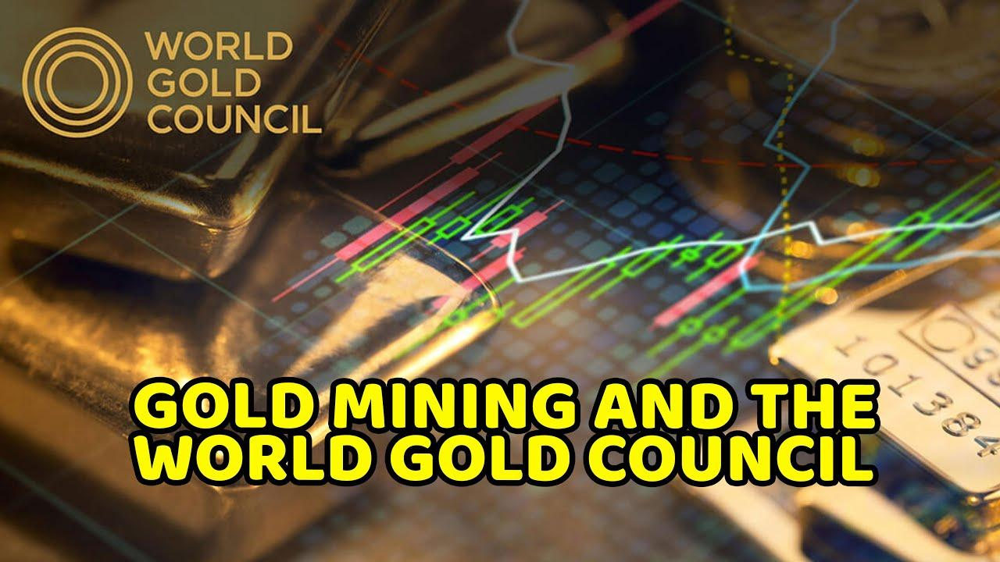

## Table of Contents

## What is the World Gold Council?

The World Gold Council is a group that works with companies that mine gold. They help these companies by doing research, giving advice, and promoting gold. The Council was started in 1987 and is based in London, England. Their main goal is to make more people interested in gold and to help the gold industry grow.

The World Gold Council also does a lot of work to show how gold can be used in different ways. They talk about gold in jewelry, in technology, and even as a way to save money. They work with governments and other groups to make rules about gold that are fair and good for everyone. This helps make sure that the gold industry is strong and healthy.

## When was the World Gold Council founded?

The World Gold Council was founded in 1987. It is a group that helps companies that mine gold. They do this by doing research, giving advice, and promoting gold. The Council is based in London, England.

Their main goal is to make more people interested in gold and to help the gold industry grow. The World Gold Council also talks about the different ways gold can be used. This includes gold in jewelry, technology, and as a way to save money. They work with governments and other groups to make fair rules about gold, which helps keep the gold industry strong and healthy.

## What are the main objectives of the World Gold Council?

The main goal of the World Gold Council is to make more people interested in gold and help the gold industry grow. They do this by working with companies that mine gold. The Council helps these companies by doing research, giving advice, and promoting gold. This helps the gold industry become stronger and more successful.

The World Gold Council also focuses on showing how gold can be used in different ways. They talk about gold in jewelry, in technology, and even as a way to save money. By doing this, they help people understand the many uses of gold. The Council works with governments and other groups to make rules about gold that are fair and good for everyone. This helps keep the gold industry healthy and strong.

## How does the World Gold Council influence the gold market?

The World Gold Council influences the gold market by working with companies that mine gold. They do research and give advice to these companies. This helps the companies make better decisions about how to mine and sell gold. The Council also promotes gold, which can make more people want to buy it. When more people want gold, the price can go up, and this is good for the gold industry.

The World Gold Council also talks about the different ways gold can be used. They show how gold is used in jewelry, technology, and as a way to save money. By doing this, they help people understand that gold is important and useful. The Council works with governments and other groups to make rules about gold that are fair. These rules help keep the gold market stable and healthy. This is important because it makes people trust the gold market more.

## What are some key initiatives launched by the World Gold Council?

The World Gold Council has launched several key initiatives to help the gold industry. One important initiative is the Gold Investment Program. This program works to make gold a more popular choice for people who want to save money or invest. The Council does this by creating new gold products, like gold-backed exchange-traded funds (ETFs). These products make it easier for people to buy and sell gold without having to store physical gold.

Another key initiative is the Responsible Gold Mining Principles. This initiative focuses on making sure that gold is mined in a way that is good for the environment and the people who live near the mines. The Council works with mining companies to set high standards for how gold should be mined. This helps make sure that gold mining is done in a way that is safe and fair for everyone involved.

The World Gold Council also runs the Gold and Jewellery Demand Trends report. This report gives detailed information about how much gold is being bought and sold around the world. It helps people in the gold industry understand what is happening in the market. By sharing this information, the Council helps companies make better decisions about how to sell their gold and meet the needs of their customers.

## How is the World Gold Council structured?

The World Gold Council is run by a group of people called the Board of Directors. These people come from the companies that mine gold and are part of the Council. The Board of Directors makes the big decisions for the Council. They decide what the Council should do and how it should help the gold industry. The Board also picks a CEO, who is in charge of running the Council every day. The CEO makes sure that the Council does what the Board wants and helps the gold industry grow.

The World Gold Council also has different teams that work on specific things. There is a team that does research about gold and the gold market. Another team works on making new gold products, like gold-backed exchange-traded funds (ETFs). There is also a team that talks to governments and other groups to make rules about gold that are fair. All these teams work together to help the gold industry and make more people interested in gold.

## Who are the members of the World Gold Council?

The members of the World Gold Council are companies that mine gold. These companies come from different countries around the world. Some of the member companies are big and well-known, while others are smaller but still important in the gold industry. The Council works with these companies to help them do better in the gold market. By being part of the Council, these companies can share ideas and work together to make the gold industry stronger.

The World Gold Council also works with other groups that are not mining companies but are important to the gold industry. These groups can include banks, investment firms, and jewelry makers. The Council helps these groups understand the gold market better and find new ways to use gold. By working with a wide range of members, the World Gold Council can help the whole gold industry grow and succeed.

## What role does the World Gold Council play in gold mining?

The World Gold Council helps companies that mine gold by giving them advice and doing research. They work with these companies to make sure they are mining gold in a good way. The Council also helps these companies understand the gold market better. This can help the companies make better decisions about how to mine and sell their gold. By working together, the Council and the mining companies can make the gold industry stronger and more successful.

The World Gold Council also makes rules about how gold should be mined. These rules are called the Responsible Gold Mining Principles. They help make sure that gold mining is safe for the environment and the people who live near the mines. The Council works with the mining companies to make sure they follow these rules. This helps make sure that gold mining is done in a way that is fair and good for everyone.

## How does the World Gold Council promote gold as an investment?

The World Gold Council promotes gold as an investment by creating new ways for people to buy and sell gold. They have started programs like the Gold Investment Program, which makes it easier for people to invest in gold. One way they do this is by creating gold-backed exchange-traded funds (ETFs). These ETFs let people buy and sell gold without having to keep physical gold. This makes it simpler for people to invest in gold and can make more people want to do it.

The Council also does a lot of research and shares information about gold. They put out reports like the Gold and Jewellery Demand Trends, which tell people how much gold is being bought and sold around the world. By sharing this information, the Council helps people understand the gold market better. This can make people feel more confident about investing in gold. The World Gold Council works hard to show that gold is a good and safe way to save and invest money.

## What research does the World Gold Council conduct on gold?

The World Gold Council does a lot of research about gold. They look at how much gold is being bought and sold around the world. This helps them understand what is happening in the gold market. They share this information in reports like the Gold and Jewellery Demand Trends. These reports tell people how much gold people are buying for jewelry, for technology, and as a way to save money. By doing this research, the World Gold Council helps people in the gold industry make better decisions.

The Council also studies how gold can be used in different ways. They look at how gold is used in things like computers and phones. They also study how gold can be a good way to save money or invest. The World Gold Council shares this information with companies that mine gold and with people who might want to buy gold. This helps everyone understand why gold is important and useful. By doing all this research, the Council helps make the gold industry stronger and more successful.

## How does the World Gold Council address environmental and social issues related to gold mining?

The World Gold Council works hard to make sure gold mining is good for the environment and the people who live near the mines. They have created something called the Responsible Gold Mining Principles. These are rules that tell mining companies how to mine gold in a way that is safe and fair. The rules help make sure that mining does not hurt the environment too much. They also make sure that the people who work in the mines and live nearby are treated well and have a good life.

The Council works with mining companies to make sure they follow these rules. They check to see if the companies are doing things the right way. If a company is not following the rules, the Council helps them understand how to do better. By doing this, the World Gold Council helps make sure that gold mining is done in a way that is good for everyone. This helps keep the gold industry strong and healthy, while also taking care of the environment and the people.

## What are the future strategies and goals of the World Gold Council?

The World Gold Council wants to keep helping the gold industry grow and be successful. They plan to do this by working with more companies that mine gold and by making new ways for people to invest in gold. The Council will keep doing research to understand the gold market better. They will share this information with everyone in the gold industry so that people can make good decisions. The Council also wants to make sure that gold is seen as a good and safe way to save and invest money.

Another big goal for the World Gold Council is to make sure that gold mining is good for the environment and the people who live near the mines. They will keep working on the Responsible Gold Mining Principles to make sure mining companies follow rules that are fair and safe. The Council will also work with governments and other groups to make rules about gold that help everyone. By doing all these things, the World Gold Council hopes to make the gold industry stronger and more successful in the future.

## References & Further Reading

[1]: ["World Gold Council"](https://www.gold.org/) - The official site of the World Gold Council, an organization playing a vital role in stimulating demand for gold and supporting the gold industry.

[2]: Alkhalifa, O., & Berber, A. (2013). ["Algorithmic Gold Trading: Developments and Effects on the Market."](https://www.tandfonline.com/doi/pdf/10.1080/1350486X.2013.771515) Financial Markets and Portfolio Management.

[3]: Baker, E., & McPhee, D. (2013). ["Technology and Gold: The Impact of Algorithms and High-Frequency Trading on Market Functionality."](https://pmc.ncbi.nlm.nih.gov/articles/PMC6407499/) Journal of Futures Markets.

[4]: "Gold and the International Monetary System: Transformations and Experience" by Sandra L. Nickel (2013). An in-depth exploration of the historical significance and future prospects of gold in the international monetary system.

[5]: ["The Alchemy of Finance: Reading the Mind of the Market"](https://www.amazon.com/Alchemy-Finance-Reading-Mind-Market/dp/0471042064) by George Soros - Offers insights into the dynamics of financial markets, applicable to gold investments as well.

[6]: Biais, B., Foucault, T., & Moinas, S. (2015). ["Equilibrium High-Frequency Trading."](https://www.sciencedirect.com/science/article/abs/pii/S0304405X15000288) Journal of Financial Economics.