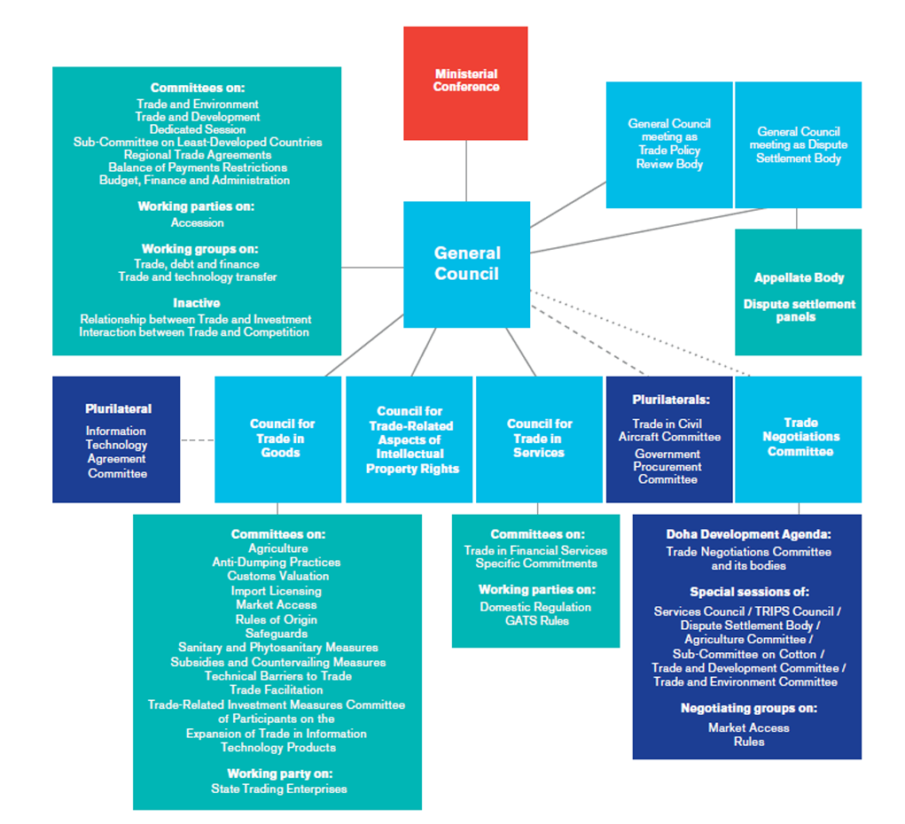

The evolving global economy is intricately tied to the mechanisms of international trade, with the World Trade Organization (WTO) serving as a central facilitator. Established in 1995, the WTO has grown to encompass 164 member nations, providing a structured platform for the formulation of trade agreements and the resolution of trade-related disputes. This institution is pivotal in maintaining a stable trading environment by overseeing the rules that govern international commerce.

In recent years, discussions regarding globalization have evolved, focusing more on concepts such as 'geo-economic biglobalization'. This shift reflects the changing landscape of international trade, where geopolitical factors increasingly influence economic relationships and strategies. Geo-economic biglobalization signifies the emergence of dual economic powers and alliances, often seen in the dynamics between major economies like the United States and China. This phenomenon underscores a transition from previously unipolar economic policies toward a more competitive and multipolar global economic order.

Moreover, technology is transforming the international finance and trade sectors, particularly algorithmic trading. This form of trading utilizes sophisticated algorithms to execute trades at speeds and efficiencies beyond human capability. Algorithmic trading significantly impacts market liquidity and the price discovery process, altering global trading practices. With financial markets becoming more interconnected, the influence of algorithmic trading on international trade is expanding, presenting both challenges and opportunities for traders and policymakers.

This article examines the roles of the WTO, the impacts of global economic partnerships, and the rise of algorithmic trading in reshaping the global trade landscape. Understanding these dynamics is crucial for businesses and policymakers to navigate the complexities of the modern global market effectively. As the global economy stands at a crossroads, influenced by geo-economic competition and technological innovation, strategic foresight and collaboration are essential for achieving sustainable economic growth.

## Table of Contents

## The Role of the World Trade Organization in Global Economy

The World Trade Organization (WTO), established in 1995, plays a critical role in regulating international trade by providing a structured platform for negotiating trade agreements and mediating trade disputes among its 164 member nations. As a central body, the WTO aims to promote free and fair trade, which is essential for fostering global economic growth and stability. It facilitates the reduction of trade barriers and ensures that member countries adhere to unified trade rules, thereby minimizing trade conflicts and promoting seamless trade flows.

Despite encountering criticisms, especially concerning its effectiveness in addressing contemporary trade issues and inclusivity, the WTO remains a fundamental institution for maintaining the stability of the global trading environment. Critics argue that the organization struggles with decision-making due to its consensus-based approach, which can lead to stagnation, particularly when member countries have conflicting interests. Moreover, developing nations often feel disadvantaged by the dominant influence of more powerful economies within the organization.

In recent years, the global trade landscape has been characterized by a shift from unipolar economic policies, primarily driven by a dominant power such as the United States, to a more competitive, bipolar alignment influenced by the rise of China as a major economic power. This shift has added complexity to international trade relations, requiring the WTO to adapt its strategies and frameworks to address the evolving nature of global trade dynamics. The emergence of regional trade agreements and economic alliances, such as the Regional Comprehensive Economic Partnership (RCEP) and the Comprehensive and Progressive Agreement for Trans-Pacific Partnership (CPTPP), further highlights the changing trade environment that the WTO must navigate.

The WTO's influence on international trade policy and economic globalization continues to evolve in response to these geopolitical shifts. It serves as a critical mediator in trade negotiations, helping countries reach agreements that balance diverse economic interests while striving to sustain the principles of free trade. Additionally, the organization provides a legal and regulatory framework for settling trade disputes, thus playing a vital role in ensuring that international trade practices are conducted fairly and transparently.

Overall, the WTO's capacity to adapt to the ever-changing geopolitical landscape and address the emerging challenges of globalization is crucial for its continued relevance and effectiveness in promoting a stable and equitable global trading system.

## Global Economic Trends and International Trade

The era of economic globalization, primarily driven by free trade, is undergoing a transformation towards geo-economic strategies heavily influenced by geopolitical factors. This shift is marked by the increasing involvement of political considerations and strategic interests in economic decision-making, rather than the traditional focus on market efficiency and profits.

A prominent example of this trend is the ongoing US-China rivalry, which exemplifies the increasingly competitive landscape of global trade. This rivalry impacts economic policies worldwide as both nations seek to assert their influence and secure strategic advantages. The geopolitical tensions between these two economic powerhouses have led to policy adjustments and trade strategies aimed at reducing reliance on each other, thereby fostering a decoupling trend.

Decoupling strategies involve nations consciously reducing economic interdependencies, aiming to enhance national security and reassert control over critical supply chains. These strategies are evident in sectors such as technology and manufacturing, where geopolitical tensions could disrupt traditional trade flows. Consequently, countries are forming economic alliances and partnerships designed to solidify their positions in the global trade hierarchy while circumventing potential adversarial dependencies.

Trade partnerships are increasingly influenced by considerations of national security and broader economic strategy objectives. Countries are re-evaluating their trade relationships, assessing not only the economic benefits but also the strategic implications of such partnerships. This approach has led to the adoption of protectionist measures and strategic trade policies, which are reshaping traditional trade dynamics. Economic nationalism and policies aimed at protecting domestic industries have re-emerged, reflecting a shift away from the previously dominant free-market ideology.

The manifestation of these dynamics can be observed in the formation of trade blocs and regional alliances. Trade blocs, such as the European Union (EU) and the Comprehensive and Progressive Agreement for Trans-Pacific Partnership (CPTPP), are gaining prominence as countries seek to strengthen economic ties within a specific geographic region to enhance collective bargaining power and to insulate against external economic pressures.

Overall, the global trade environment is increasingly characterized by a complex interplay of geopolitical considerations, economic strategies, and evolving partnerships. Countries are navigating a landscape where traditional trade partnerships are being reassessed, and new alliances are formed based on strategic interests. In this context, understanding the implications of geo-economic strategies and their influence on international trade is critical for stakeholders aiming to adapt to the rapidly changing global economic order.

## The Rise of Algorithmic Trading in International Markets

Algorithmic trading has reshaped global financial markets, driven by advances in technology and the need for faster, more efficient trade execution. By employing sophisticated algorithms, traders and financial institutions can analyze vast datasets to make rapid trading decisions. This method offers significant speed advantages over traditional human trading, with transactions executed in milliseconds often leading to higher trading volumes and reduced transaction costs.

The primary impact of [algorithmic trading](/wiki/algorithmic-trading) is observed in market [liquidity](/wiki/liquidity-risk-premium) and price discovery. Increased liquidity results from higher trading volumes, as algorithms execute trades virtually instantaneously, thereby narrowing bid-ask spreads. Improved price discovery occurs because algorithms are capable of processing a continuous stream of market data, adjusting trading strategies based on new information, and reflecting this in asset prices more accurately.

Algorithmic trading strategies include [market making](/wiki/market-making), [arbitrage](/wiki/arbitrage), and [trend following](/wiki/trend-following). Market making involves buying and selling to capture the spread between bid and ask prices, while arbitrage exploits price discrepancies across different markets or asset classes. Trend following algorithms identify and capitalize on predictable patterns in market behavior. Each of these strategies contributes uniquely to market dynamics and enhances the efficiency of financial markets.

As algorithmic trading becomes more prevalent, regulatory bodies have adapted to address associated risks such as market [volatility](/wiki/volatility-trading-strategies) and systemic risk. Regulations focus on ensuring market stability by implementing safeguards against errant algorithms, which can cause flash crashes or other market disruptions. For instance, circuit breakers and kill switches are mechanisms that automatically halt trading if extreme conditions are detected, reducing the risk of cascading failures. Regulatory frameworks also require thorough testing and auditing of algorithms before deployment to mitigate unintended consequences.

The role of algorithmic trading in international trade is increasingly significant as markets grow more interconnected. Cross-border capital flows benefit from algorithmic strategies that operate seamlessly across different time zones and financial systems. This global reach enhances market efficiency on an international scale, contributing to more synchronized and cohesive global markets.

In conclusion, algorithmic trading continues to expand its influence in international markets, offering both opportunities and challenges. While it drives market efficiency and liquidity, it also necessitates robust regulatory oversight to ensure financial stability. Understanding the complexities of algorithmic trading is crucial for participants in the global financial ecosystem, as it evolves alongside technological progress and market developments.

## Challenges and Opportunities in the Current Global Trade Landscape

The current global trade landscape is a complex tapestry shaped by geopolitical tensions and evolving economic policies. These challenges require nations to skillfully navigate intricate trade relationships while safeguarding their economic interests. The international trade environment is increasingly characterized by uncertainty, driven by geopolitical rivalries and shifting alliances. Such tensions can lead to trade disputes, tariff impositions, and the disruption of established supply chains, necessitating strategic responses from all involved parties.

A significant challenge facing global trade is how nations reconcile national security concerns with economic interests. Countries are revisiting their trade policies to address vulnerabilities in supply chains, particularly concerning essential goods and technologies. Such recalibrations can involve diversification of supply sources and an increased focus on domestic production to reduce reliance on single external markets. This strategic realignment might lead to a reevaluation of global trade agreements and partnerships, impacting the international trade order.

Despite these challenges, the landscape is ripe with potential opportunities. Technological advancements offer avenues for enhancing trade efficiencies and market access. Innovations such as blockchain, [artificial intelligence](/wiki/ai-artificial-intelligence), and advanced communication technologies can streamline operations, boost transparency, and reduce transaction costs across global markets. For instance, blockchain can enhance the traceability and security of trade documentation, while AI can optimize logistics and supply chain management, leading to increased overall competitiveness.

Moreover, the potential emergence of new markets, particularly in developing regions, presents opportunities for expanding trade networks. Countries and businesses that recognize and tap into these growing markets can leverage comparative advantages to foster economic growth. This expansion is not without its challenges, as entering new markets requires a comprehensive understanding of local regulations, cultural nuances, and economic conditions.

Another essential aspect of navigating the contemporary trade environment involves staying informed about global trade trends and policy shifts. Businesses and policymakers need to actively monitor changes in trade agreements, tariff regulations, and international political developments. Access to accurate and timely information enables stakeholders to adapt their strategies proactively, ensuring resilience against sudden market disruptions.

Leveraging technology can also play a vital role in mitigating trade tensions and promoting economic stability. By fostering international cooperation through technology-sharing agreements and collaborative frameworks, nations can address common challenges such as climate change, cybersecurity, and health emergencies. These collaborations can build trust and facilitate more stable and harmonious trade relations, ultimately benefiting the global economy.

In conclusion, while geopolitical tension and complex economic policies present significant challenges to global trade, they also offer opportunities for innovation and growth. The key to success in this environment lies in adaptability, strategic foresight, and international collaboration, enabling nations and businesses to navigate the evolving trade landscape effectively.

## Conclusion

The global economy stands at a pivotal crossroads, profoundly influenced by the competing forces of geo-economic dynamics and rapid technological advancements. The World Trade Organization (WTO) continues to serve as a critical institution in managing international trade relations, resolving conflicts, and ensuring economic stability across nations. As trade disputes become increasingly complex, the WTO's role is more significant than ever in fostering a cooperative international economic environment. Its ability to mediate conflicts and adapt to changing geopolitical landscapes is vital for sustaining an interconnected global market.

Concurrently, algorithmic trading emerges as a transformative force within international markets. The automation of trading processes through sophisticated algorithms offers enhanced efficiency and speed, heralding a new era in financial transactions. While this technological evolution presents opportunities for increased market liquidity and improved price discovery mechanisms, it also poses challenges such as market volatility and regulatory oversight. Balancing these elements requires astute regulatory measures to harness algorithmic trading's potential while mitigating its risks.

As the global trade environment continues to evolve, strategic collaboration among nations and within industries becomes imperative. Long-term economic growth and sustainability hinge on the ability of nations to cooperatively address shared challenges and leverage technological innovations. Policymakers and businesses must be agile in their approach, aligning strategies with both emerging macroeconomic trends and technological advancements.

In navigating this intricate landscape, understanding the intersection of economic trends and innovation is crucial. As global markets are reshaped by these driving forces, the ability to predict, respond, and adapt to changes will determine economic success. Collaborative efforts, informed by a comprehensive grasp of both geo-economic strategies and technical progress, are key to fostering a stable and prosperous global economic future.

## References & Further Reading

[1]: Bergstra, J., Bardenet, R., Bengio, Y., & Kégl, B. (2011). ["Algorithms for Hyper-Parameter Optimization."](https://dl.acm.org/doi/10.5555/2986459.2986743) Advances in Neural Information Processing Systems 24.

[2]: ["Advances in Financial Machine Learning"](https://www.amazon.com/Advances-Financial-Machine-Learning-Marcos/dp/1119482089) by Marcos Lopez de Prado

[3]: ["Evidence-Based Technical Analysis: Applying the Scientific Method and Statistical Inference to Trading Signals"](https://www.amazon.com/Evidence-Based-Technical-Analysis-Scientific-Statistical/dp/0470008741) by David Aronson

[4]: ["Machine Learning for Algorithmic Trading"](https://github.com/stefan-jansen/machine-learning-for-trading) by Stefan Jansen

[5]: ["Quantitative Trading: How to Build Your Own Algorithmic Trading Business"](https://github.com/LucindaYa/quant-resources/blob/master/Quantitative%20Trading%20How%20to%20Build%20Your%20Own%20Algorithmic%20Trading%20Business.pdf) by Ernest P. Chan