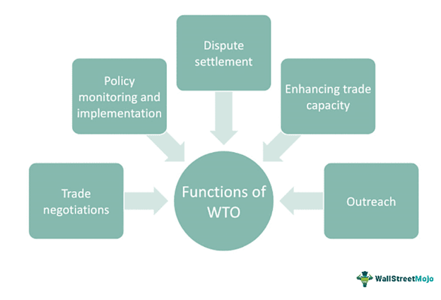

## Table of Contents

## What is the World Trade Organization (WTO)?

The World Trade Organization (WTO) is an international group that helps countries trade with each other more easily. It was created in 1995 and has 164 member countries. The main goal of the WTO is to make sure that trade between countries is fair and follows certain rules. This helps countries to sell their products and services to other countries without too many problems.

The WTO does this by making agreements between countries. These agreements say how countries should trade with each other. For example, they might say that countries cannot charge too much tax on imported goods. If a country thinks another country is not following the rules, they can ask the WTO to help solve the problem. The WTO then tries to find a solution that is fair for everyone.

## When was the WTO established and why?

The World Trade Organization (WTO) was established on January 1, 1995. It was created to help countries trade with each other more easily and fairly. Before the WTO, there was another group called the General Agreement on Tariffs and Trade (GATT), which started in 1947. The GATT helped countries lower trade barriers, but it was not a permanent organization. The WTO was made to replace the GATT and to be a stronger, more permanent group.

The main reason for creating the WTO was to make global trade rules clearer and more enforceable. Countries wanted a place where they could talk about trade problems and solve them together. The WTO helps make sure that all countries follow the same rules when they trade with each other. This helps prevent big fights over trade and makes it easier for countries to do business with each other.

## What are the main objectives of the WTO?

The main goal of the World Trade Organization (WTO) is to help countries trade with each other more easily and fairly. It does this by making rules that all member countries agree to follow. These rules help make sure that countries do not put up too many barriers to trade, like high taxes on imports. By having clear rules, the WTO helps countries sell their products and services to other countries without too many problems.

Another important objective of the WTO is to help solve trade disagreements between countries. If one country thinks another country is not following the trade rules, they can ask the WTO to help. The WTO then tries to find a fair solution that everyone can agree on. This helps prevent big fights over trade and keeps the global trading system working smoothly.

The WTO also works to help developing countries take part in global trade. It gives these countries special help and support so they can grow their economies and trade more with other countries. By including all countries in the global trading system, the WTO aims to make the world economy stronger and more balanced.

## How does the WTO promote free trade among member countries?

The World Trade Organization (WTO) promotes free trade among its member countries by setting up rules that everyone agrees to follow. These rules help make sure that countries do not put up too many barriers to trade, like high taxes on imports. By having clear rules, the WTO helps countries sell their products and services to other countries without too many problems. This makes it easier for businesses to trade across borders and helps the global economy grow.

The WTO also helps solve trade disagreements between countries. If one country thinks another country is not following the trade rules, they can ask the WTO to help. The WTO then tries to find a fair solution that everyone can agree on. This helps prevent big fights over trade and keeps the global trading system working smoothly. By making sure that all countries follow the same rules, the WTO helps create a more open and fair trading system for everyone.

## What are the key functions of the WTO?

The World Trade Organization (WTO) has several important jobs. One of its main jobs is to make rules that help countries trade with each other more easily. These rules say that countries should not put up too many barriers to trade, like high taxes on imports. By having clear rules, the WTO helps countries sell their products and services to other countries without too many problems. This makes it easier for businesses to trade across borders and helps the global economy grow.

Another key function of the WTO is to help solve trade disagreements between countries. If one country thinks another country is not following the trade rules, they can ask the WTO to help. The WTO then tries to find a fair solution that everyone can agree on. This helps prevent big fights over trade and keeps the global trading system working smoothly. By making sure that all countries follow the same rules, the WTO helps create a more open and fair trading system for everyone.

The WTO also works to help developing countries take part in global trade. It gives these countries special help and support so they can grow their economies and trade more with other countries. By including all countries in the global trading system, the WTO aims to make the world economy stronger and more balanced.

## How does the WTO handle trade disputes between countries?

The World Trade Organization (WTO) helps solve trade disagreements between countries. If one country thinks another country is not following the trade rules, they can ask the WTO for help. The WTO then starts a process to find a fair solution. First, the countries try to talk and solve the problem themselves. If they can't agree, the WTO sets up a special group called a panel to look at the problem. The panel listens to both sides and then makes a decision about who is right.

If the panel decides that a country broke the rules, the WTO tells that country to fix the problem. The country has to change its rules or actions to follow the WTO's decision. If the country does not fix the problem, the WTO can let the other country take action. This action can be things like charging extra taxes on the country's products. The goal is to make sure that all countries follow the same rules and trade fairly with each other.

## What is the role of the WTO in global economic policy?

The World Trade Organization (WTO) plays a big role in global economic policy by helping countries trade with each other more easily and fairly. It does this by making rules that all member countries agree to follow. These rules help make sure that countries do not put up too many barriers to trade, like high taxes on imports. By having clear rules, the WTO helps countries sell their products and services to other countries without too many problems. This makes it easier for businesses to trade across borders and helps the global economy grow.

The WTO also helps solve trade disagreements between countries. If one country thinks another country is not following the trade rules, they can ask the WTO to help. The WTO then tries to find a fair solution that everyone can agree on. This helps prevent big fights over trade and keeps the global trading system working smoothly. By making sure that all countries follow the same rules, the WTO helps create a more open and fair trading system for everyone.

## How does the WTO assist developing countries?

The World Trade Organization (WTO) helps developing countries by giving them special support and help. It knows that these countries might need more time and help to grow their economies and trade with other countries. So, the WTO gives them special rules and programs that make it easier for them to join the global trading system. For example, developing countries might get more time to lower their trade barriers or they might get help to learn about the WTO's rules and how to use them.

The WTO also works to make sure that developing countries can have a say in making trade rules. It helps them take part in talks and meetings so they can share their ideas and needs. This way, the rules that the WTO makes are fair and help everyone, not just the big, rich countries. By including developing countries in the global trading system, the WTO aims to make the world economy stronger and more balanced.

## What are the major agreements administered by the WTO?

The World Trade Organization (WTO) looks after many important agreements that help countries trade with each other. One of the main agreements is the General Agreement on Tariffs and Trade (GATT), which focuses on trade in goods. GATT helps countries lower taxes on imports and remove other barriers to trade, making it easier for them to sell their products to other countries. Another important agreement is the General Agreement on Trade in Services (GATS), which deals with trade in services like banking, tourism, and telecommunications. GATS helps countries open up their service markets to other countries and make sure that everyone follows the same rules.

The WTO also administers the Agreement on Trade-Related Aspects of Intellectual Property Rights (TRIPS), which sets rules for protecting things like patents, trademarks, and copyrights. This agreement helps make sure that countries respect each other's intellectual property rights when they trade. Another key agreement is the Agreement on Agriculture, which aims to make trade in farm products fairer and more open. It helps countries lower taxes on farm goods and reduce other barriers to trade in agriculture. These agreements all work together to make global trade smoother and more fair for everyone.

## How does the WTO monitor national trade policies?

The World Trade Organization (WTO) keeps an eye on the trade rules of its member countries to make sure they follow the agreements they signed. It does this by asking countries to report their trade policies and any changes they make. The WTO also has a special group called the Trade Policy Review Body that looks at these reports and talks about them with the countries. This helps the WTO understand if countries are following the rules and if there are any problems that need to be fixed.

The WTO also uses something called the Trade Policy Review Mechanism to check on countries' trade policies. This means that every few years, each country has to go through a detailed review where they explain their trade policies to the WTO and other member countries. During these reviews, countries can ask questions and talk about any issues they see. This helps keep trade fair and open because it makes sure that everyone knows what each country is doing and can work together to solve any problems.

## What challenges does the WTO face in the modern global economy?

The World Trade Organization (WTO) faces many challenges in today's global economy. One big challenge is that countries often disagree on trade rules. Some countries want to protect their own businesses by putting up trade barriers, while others want to trade more freely. These disagreements can make it hard for the WTO to get everyone to agree on new rules or to solve trade disputes. Another challenge is that the world is changing fast with new technology and new ways of doing business. The WTO needs to keep up with these changes to make sure its rules still work well for everyone.

Another challenge for the WTO is helping developing countries. These countries often need more help to grow their economies and trade with other countries. The WTO tries to give them special support, but it can be hard to make sure that all countries feel the rules are fair. Also, some big countries sometimes ignore WTO rules or make their own trade deals outside the WTO. This can make the WTO less powerful and make it harder for it to keep global trade fair and open for everyone.

## How has the WTO evolved since its inception and what future developments are anticipated?

Since it started in 1995, the World Trade Organization (WTO) has grown a lot. It began with 128 member countries and now has 164. The WTO has worked hard to make trade rules clearer and easier to follow. It has helped solve many trade disagreements between countries and has made new agreements to cover more areas of trade, like services and intellectual property. The WTO has also tried to help developing countries by giving them special support and more time to follow the rules. But it has faced challenges, like disagreements between countries and the fast changes in the global economy.

In the future, the WTO is expected to keep working on making global trade fairer and more open. It will need to update its rules to keep up with new technology and new ways of doing business. The WTO will also need to find ways to help developing countries even more and to make sure that all countries follow the rules. There might be new agreements to cover things like digital trade and environmental issues. The WTO will need to work hard to solve disagreements and keep everyone working together to make the global economy stronger and more balanced.

## References & Further Reading

[1]: Hoekman, B. M., & Kostecki, M. M. (2009). ["The Political Economy of the World Trading System: The WTO and Beyond"](https://academic.oup.com/book/1467). Oxford University Press.

[2]: Krugman, P. R., Obstfeld, M., & Melitz, M. J. (2012). ["International Economics: Theory and Policy"](https://www.pearson.com/se/Nordics-Higher-Education/subject-catalogue/economics/International-Economics-Theory-and-Policy-Krugman.html). Pearson.

[3]: WTO. (2021). ["World Trade Report 2021: Economic resilience and trade."](https://www.wto-ilibrary.org/content/books/9789287051400) World Trade Organization.

[4]: Irwin, D. A. (2015). ["Free Trade under Fire"](https://www.jstor.org/stable/j.ctvr0qr9q). Princeton University Press.

[5]: Scott, J. & Wilkinson, R. (2013). ["The politics of trade and the struggles to reform the World Trade Organization"](https://www.tandfonline.com/doi/full/10.1080/14747731.2020.1779965). Routledge.