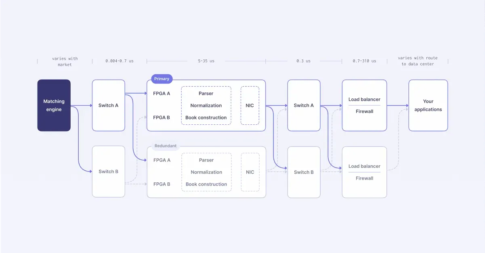

## Table of Contents

## What is a cloud ticker plant?

A cloud ticker plant is a system used in finance to collect, process, and store real-time market data from various sources. It's like a big data center in the cloud that helps financial companies keep track of stock prices, trades, and other important market information as it happens. By using the cloud, the ticker plant can handle huge amounts of data quickly and efficiently, making sure that the information is always up-to-date and accessible from anywhere.

The main advantage of a cloud ticker plant is its scalability and flexibility. Traditional ticker plants might need a lot of physical hardware and can be hard to expand or update. But with a cloud ticker plant, companies can easily increase their data storage and processing power as their needs grow, without having to buy new equipment. This makes it easier and cheaper for financial firms to manage their data and stay competitive in the fast-moving world of finance.

## Why is speed important in a cloud ticker plant?

Speed is really important in a cloud ticker plant because it helps financial companies make quick decisions. In the world of finance, things can change fast. Stock prices go up and down, and traders need to know about these changes right away. If a cloud ticker plant can process and deliver data quickly, traders can buy or sell stocks at the best times, which can make them more money.

Also, being fast helps keep the data accurate. When lots of information is coming in from different places, it can get mixed up if it's not handled quickly. A fast cloud ticker plant makes sure that all the data is sorted and stored correctly, so everyone using it has the right information. This is important because making decisions based on wrong data can lead to big mistakes and losses.

## What are the basic components of a cloud ticker plant?

The main parts of a cloud ticker plant are the data collection system, the processing unit, and the storage system. The data collection system gathers information from different places like stock exchanges and financial news sources. It's like a big net that catches all the important data as it comes in. The processing unit then takes this data and sorts it out, making sure it's in the right format and ready to use. It's like a chef in a kitchen, preparing the ingredients before they're used.

The storage system keeps all the processed data safe and easy to find. It's like a huge library in the cloud where all the information is stored and can be accessed anytime. This part is really important because it needs to be fast and reliable so that traders can get the information they need quickly. Together, these parts work to make sure that the cloud ticker plant can handle a lot of data and deliver it to users in real-time, helping them make smart decisions in the fast world of finance.

## How does a cloud ticker plant differ from traditional ticker plants?

A cloud ticker plant and a traditional ticker plant both collect and process financial data, but they do it in different ways. A traditional ticker plant uses physical hardware like servers and data centers to handle the data. This can be expensive and hard to change or grow as the company's needs change. On the other hand, a cloud ticker plant uses the internet and cloud computing to do the same job. This means it can be easier and cheaper to make bigger or smaller, depending on what the company needs.

The main difference is how they handle speed and access. Traditional ticker plants can be slow because they rely on physical equipment, and it can take time to update or fix them. A cloud ticker plant is usually faster because it uses the power of the cloud to process data quickly. Also, with a cloud ticker plant, people can access the data from anywhere in the world as long as they have an internet connection. This is not always easy with a traditional ticker plant, which might need people to be in a specific place to use it.

## What technologies are used to enhance the speed of a cloud ticker plant?

To make a cloud ticker plant faster, people use special technologies like in-memory computing and distributed systems. In-memory computing means keeping data in the computer's memory instead of on a hard drive. This makes it much quicker to get to the data because memory is faster than hard drives. Distributed systems spread the work across many computers in the cloud. This way, the cloud ticker plant can handle more data at the same time and process it faster.

Another technology that helps is data compression. This makes the data smaller so it can be sent and stored more quickly. Also, using fast network connections like fiber optics helps the data move quickly between different parts of the cloud ticker plant. All these technologies work together to make sure the cloud ticker plant can give traders the information they need as fast as possible.

## Can you explain the data flow in a world’s fastest cloud ticker plant?

In the world's fastest cloud ticker plant, data flows quickly and smoothly. It starts when the data collection system grabs information from places like stock exchanges and financial news sources. This data comes in fast and from many different places, so the system needs to be really quick to catch it all. Once the data is collected, it's sent to the processing unit. This part of the ticker plant is like a super-fast chef, sorting and preparing the data so it's ready to use. The processing unit uses in-memory computing to keep the data in the computer's memory, which is much faster than using hard drives.

After the data is processed, it goes to the storage system. This part is like a huge, fast library in the cloud where all the data is kept safe and easy to find. The storage system uses data compression to make the data smaller, so it can be stored and sent more quickly. The data then travels through fast network connections, like fiber optics, to get to the people who need it. Traders and other users can access this data from anywhere in the world as long as they have an internet connection. This whole process happens very quickly, making sure that everyone gets the latest financial information right away.

## What are the key performance metrics for evaluating a cloud ticker plant’s speed?

The main way to check how fast a cloud ticker plant is by looking at its latency. Latency is the time it takes for data to go from the place it's collected to the person who needs it. A good cloud ticker plant will have very low latency, meaning the data gets to the user quickly. Another important thing to look at is the throughput, which is how much data the ticker plant can handle at once. A fast cloud ticker plant can process a lot of data without slowing down.

Another key performance metric is the data refresh rate. This is how often the ticker plant updates the data it's showing. A fast ticker plant will update the data very often, so users always have the latest information. It's also important to check the system's scalability, which means how well it can handle more data or more users without getting slower. A good cloud ticker plant can grow and still stay fast.

## How do latency and throughput impact the performance of a cloud ticker plant?

Latency and throughput are really important for how well a cloud ticker plant works. Latency is how long it takes for data to go from where it's collected to the person who needs it. If the latency is low, the data gets to the user quickly, which is good because in finance, every second counts. Traders need to know about changes in stock prices right away so they can make the best decisions. If the latency is high, it means the data is slow to get to the user, and this can make traders miss out on good opportunities or make bad decisions.

Throughput is about how much data the ticker plant can handle at the same time. A high throughput means the ticker plant can deal with a lot of data without slowing down. This is important because there's a lot of information coming in from different places like stock exchanges and financial news. If the throughput is low, the ticker plant might get overwhelmed and start to slow down, which can cause delays and make the data less accurate. So, having both low latency and high throughput helps make sure the cloud ticker plant works fast and efficiently, giving traders the information they need when they need it.

## What are the challenges in maintaining the world’s fastest cloud ticker plant?

Keeping the world's fastest cloud ticker plant running smoothly is tough. One big challenge is dealing with the huge amount of data that comes in every second. The ticker plant needs to collect, process, and store this data without slowing down. If it can't handle all the data, it might start to lag, and traders won't get the information they need on time. Another challenge is making sure the system stays fast even when more people start using it or when more data needs to be processed. This means the ticker plant has to be able to grow and change without losing speed.

Another issue is keeping the latency low. Latency is how long it takes for data to go from the source to the user. Even a tiny delay can be a big problem in finance, where every second counts. To keep latency low, the ticker plant needs to use the best technology and keep everything running perfectly. But this is hard because technology is always changing, and what's fast today might not be fast enough tomorrow. So, the people who run the ticker plant have to keep updating and improving it to stay ahead.

## How does scalability affect the design of a high-speed cloud ticker plant?

Scalability is really important when designing a high-speed cloud ticker plant. It means the ticker plant can handle more data and more users without getting slower. When designing the ticker plant, engineers need to make sure it can grow easily. They use technologies like cloud computing and distributed systems to spread the work across many computers. This way, if more data comes in or more people start using the ticker plant, it can still work fast and not get overwhelmed.

Keeping the ticker plant scalable also means it can change as the company's needs change. For example, if a company starts trading in more markets, the ticker plant needs to handle more data from those new places. The design has to be flexible so it can add more storage or processing power without a lot of trouble. This helps the company stay competitive because they can quickly adapt to new opportunities without worrying about their data system slowing down.

## What are the latest advancements in cloud ticker plant technology?

The latest advancements in cloud ticker plant technology focus on making things even faster and more reliable. One big change is the use of better in-memory computing. This means the ticker plant keeps data in the computer's memory instead of on hard drives, which makes it much quicker to get to the data. Another advancement is the use of more advanced distributed systems. These systems spread the work across many computers in the cloud, so the ticker plant can handle a lot more data at the same time without slowing down.

Also, new technologies like [machine learning](/wiki/machine-learning) are being used to make the ticker plant smarter. Machine learning can help the ticker plant predict what data will be needed next, so it can get that data ready ahead of time. This makes the whole system even faster. Another important advancement is better data compression. This makes the data smaller, so it can be sent and stored more quickly. All these new technologies work together to make sure the cloud ticker plant can give traders the information they need as fast as possible.

## How can one optimize a cloud ticker plant for maximum speed and efficiency?

To make a cloud ticker plant as fast and efficient as possible, you need to focus on a few key things. First, use in-memory computing to keep data in the computer's memory instead of on hard drives. This makes it much quicker to get to the data because memory is faster than hard drives. Also, use distributed systems to spread the work across many computers in the cloud. This way, the ticker plant can handle a lot more data at the same time without slowing down. Another important thing is to use data compression to make the data smaller, so it can be sent and stored more quickly. 

Another way to optimize the cloud ticker plant is by using fast network connections like fiber optics. This helps the data move quickly between different parts of the ticker plant. It's also important to keep the system scalable, so it can handle more data or more users without getting slower. This means the ticker plant needs to be able to grow and change easily. Using machine learning can also help make the ticker plant smarter by predicting what data will be needed next, so it can get that data ready ahead of time. All these things together help make the cloud ticker plant work as fast and efficiently as possible.

## References & Further Reading

[1]: Lopez de Prado, M. (2018). ["Advances in Financial Machine Learning."](https://books.google.com/books/about/Advances_in_Financial_Machine_Learning.html?id=oU9KDwAAQBAJ) John Wiley & Sons.

[2]: Chan, E. P. (2009). ["Quantitative Trading: How to Build Your Own Algorithmic Trading Business."](https://github.com/ftvision/quant_trading_echan_book) John Wiley & Sons.

[3]: Jansen, S. (2020). ["Machine Learning for Algorithmic Trading: Second Edition."](https://www.oreilly.com/library/view/machine-learning-for/9781839217715/) Packt Publishing.

[4]: Aronson, D. (2006). ["Evidence-Based Technical Analysis: Applying the Scientific Method and Statistical Inference to Trading Signals."](https://www.amazon.com/Evidence-Based-Technical-Analysis-Scientific-Statistical/dp/0470008741) John Wiley & Sons.

[5]: Bergstra, J., Bardenet, R., Bengio, Y., & Kégl, B. (2011). ["Algorithms for Hyper-Parameter Optimization."](https://dl.acm.org/doi/10.5555/2986459.2986743) Advances in Neural Information Processing Systems 24.

[6]: Hasbrouck, J. (2007). ["Empirical Market Microstructure: The Institutions, Economics, and Econometrics of Securities Trading."](https://academic.oup.com/book/52241) Oxford University Press.

[7]: Khandani, A. E., & Lo, A. W. (2007). ["What Happened To The Quants In August 2007?"](https://web.mit.edu/Alo/www/Papers/august07.pdf) National Bureau of Economic Research.