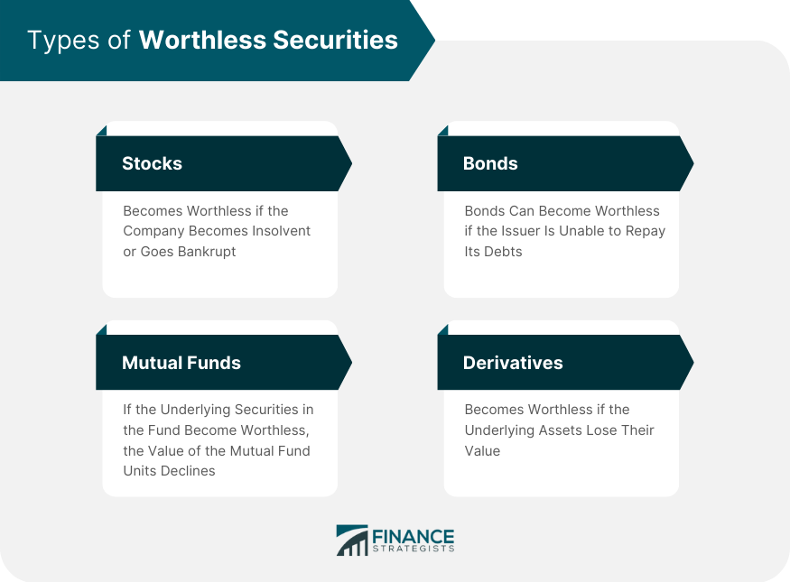

## Table of Contents

## What are worthless securities?

Worthless securities are investments that have lost all their value and are no longer worth anything. This can happen for many reasons, like if a company goes bankrupt or if the market changes a lot. When a security becomes worthless, it means that the investor can't get any money back from it. It's like holding a ticket to an event that got canceled and can't be used anymore.

Sometimes, securities can become worthless quickly, like when a company suddenly fails. Other times, it might happen slowly over time as the company struggles or the industry changes. Investors need to keep an eye on their investments to try to avoid or minimize losses from securities that might become worthless. It's important to understand that even though an investment might seem safe, things can change, and it's good to be prepared.

## How do securities become worthless?

Securities can become worthless when the company behind them runs into big trouble. This often happens if the company goes bankrupt and can't pay back its debts. When a company goes bankrupt, it might have to sell everything it owns to try to pay off what it owes. If there's nothing left after paying the debts, the company's stocks and bonds become worthless because there's no value left for investors.

Sometimes, securities lose their value slowly over time. This can happen if a company keeps losing money and can't find a way to make things better. It can also happen if the whole industry the company is in starts to do badly. For example, if people stop buying a certain type of product, companies that make that product might see their stocks become worthless. Keeping an eye on how a company and its industry are doing can help investors spot these problems early.

In some cases, big changes in the economy or new laws can make securities worthless. If the economy goes into a deep recession, many companies might struggle, and their securities could lose value. Also, if a new law makes it harder for a company to do business, its securities might become worthless. It's important for investors to stay informed about these bigger changes that could affect their investments.

## What are the common types of worthless securities?

Worthless securities often include stocks of companies that have gone bankrupt. When a company can't pay its debts and has to close down, its stocks usually become worthless. This happens because there's no money left to give to shareholders after paying off what the company owes. Sometimes, even if a company doesn't go bankrupt, its stocks can become worthless if it keeps losing money and can't find a way to make things better. If people stop believing in the company's future, they won't want to buy its stocks, and the value can drop to zero.

Another common type of worthless security is bonds from companies that have defaulted on their debt. Bonds are like loans that investors give to a company, and the company promises to pay back the money with interest. If the company can't pay back the bond, it defaults, and the bond becomes worthless. This can happen if the company goes bankrupt or if it runs into big financial trouble. Sometimes, even government bonds can become worthless if the country's economy collapses and it can't pay its debts.

Options and other derivatives can also become worthless. These are financial products that get their value from something else, like a stock or a commodity. If the thing they're based on loses all its value, the option or derivative can become worthless too. For example, if you have an option to buy a stock at a certain price, but the stock's value drops to zero, the option won't be worth anything because no one would want to buy the stock at any price.

## What are the signs that a security might be becoming worthless?

One sign that a security might be becoming worthless is if the company behind it starts losing a lot of money. If a company keeps reporting big losses and can't find a way to make things better, its stocks and bonds might lose value. Another sign is if the company is having trouble paying its debts. If it starts missing payments or if it's borrowing more money just to stay afloat, that's a warning that the security could become worthless. Also, if the company's industry is doing badly, like if people stop buying the products the company makes, that can be a sign that the security is at risk.

Another thing to watch out for is if the company is facing big legal problems or if there are rumors of fraud. If the company is being investigated or if there are lawsuits that could cost a lot of money, its securities might lose value. Changes in the economy or new laws can also be signs that a security might become worthless. If the economy is going into a recession or if new laws make it harder for the company to do business, its securities could be in trouble. Keeping an eye on these signs can help investors spot problems early and maybe avoid big losses.

## How can investors identify worthless securities in their portfolio?

Investors can identify worthless securities in their portfolio by looking at the company's financial health. If a company keeps losing money and can't find a way to make things better, its stocks and bonds might be on their way to becoming worthless. Another sign is if the company is struggling to pay its debts. If it's missing payments or borrowing more money just to stay afloat, that's a warning that the security could lose all its value. Also, if the company's industry is doing badly, like if people stop buying the products the company makes, that can be a sign that the security is at risk.

Another way to spot worthless securities is by keeping an eye on big legal problems or rumors of fraud. If the company is being investigated or if there are lawsuits that could cost a lot of money, its securities might lose value. Changes in the economy or new laws can also be signs that a security might become worthless. If the economy is going into a recession or if new laws make it harder for the company to do business, its securities could be in trouble. By watching these signs, investors can spot problems early and maybe avoid big losses.

## What are the tax implications of holding worthless securities?

When you have securities that become worthless, you might be able to claim a loss on your taxes. This can help lower the amount of taxes you have to pay. The loss is usually treated as a capital loss, just like if you sold the security for less than you paid for it. You can use this loss to reduce your taxable income, but there are rules about how much you can use each year. If your loss is more than what you can use in one year, you can carry it over to future years.

It's important to keep good records of when you bought the security and how much you paid for it. You also need to know the date when the security became worthless. The IRS might ask for proof that the security is really worthless, so having documents like financial statements or news articles about the company's bankruptcy can help. Talking to a tax professional can be a good idea because they can help you understand all the rules and make sure you're doing everything right on your tax return.

## What steps should investors take when they realize they own worthless securities?

When investors realize they own worthless securities, the first thing they should do is check if the security is really worthless. They can look at the company's financial statements, news about the company, and any official announcements. If the company has gone bankrupt or is clearly not going to recover, it's likely the security is worthless. Investors should also keep records of when they bought the security and how much they paid for it, as well as the date they found out it was worthless. This information will be important for tax purposes.

Once they've confirmed the security is worthless, investors should think about the tax implications. They can claim a capital loss on their taxes, which can help lower their taxable income. It's a good idea to talk to a tax professional to make sure they're doing everything right and taking advantage of all the tax benefits they can. After dealing with the tax side of things, investors should review their portfolio to see if they need to make any changes. They might want to sell other securities or invest in different companies to balance out their losses and keep their investments healthy.

## Can worthless securities ever regain value, and if so, how?

Sometimes, securities that seem worthless can regain value, but it's not very common. This can happen if the company goes through a big change, like getting new leaders who turn things around or finding a new way to make money. For example, if a company goes bankrupt but then gets bought by another company that fixes its problems, the securities might start to have value again. It's like a sick person getting better after a long time; it's possible, but it takes a lot of work and luck.

Another way worthless securities can regain value is if the whole industry they're in starts doing better. If a new technology or a change in the market makes the industry popular again, companies in that industry might recover. For instance, if a company makes a product that nobody wanted before but suddenly becomes popular, its stocks could go up in value. But investors need to be careful because hoping for a comeback is risky, and most of the time, securities that become worthless stay that way.

## What are the legal considerations surrounding worthless securities?

When a security becomes worthless, there can be some legal things to think about. If a company goes bankrupt, there might be a legal process called bankruptcy proceedings. During this time, the company's assets are sold to pay off debts. Investors who own the worthless securities might have a chance to get some money back, but usually, they are at the end of the line after other debts are paid. Sometimes, investors can join together and take legal action against the company or its leaders if they think there was fraud or bad management that led to the security becoming worthless.

Another legal thing to consider is how to claim a tax loss from worthless securities. The IRS has rules about what you need to prove that a security is really worthless. You might need to show financial statements or news articles about the company's bankruptcy. If you don't follow these rules, you might not be able to claim the loss on your taxes. It's a good idea to talk to a lawyer or a tax professional to make sure you're doing everything right and not missing out on any legal rights or benefits you might have.

## How do regulatory bodies address the issue of worthless securities?

Regulatory bodies like the Securities and Exchange Commission (SEC) in the United States work to protect investors from worthless securities. They do this by making rules that companies have to follow when they sell securities. These rules make sure that companies tell the truth about their business and finances. If a company breaks these rules, the SEC can take action against them. They might fine the company or even stop them from selling securities. This helps to stop companies from selling securities that might become worthless because of lies or bad behavior.

Sometimes, regulatory bodies also look into cases where securities become worthless because of fraud or bad management. They can start investigations to find out what went wrong and if anyone broke the law. If they find that someone did something wrong, they can take them to court. This can lead to fines, jail time, or other punishments. By doing this, regulatory bodies try to make the market safer for investors and help stop more securities from becoming worthless in the future.

## What strategies can investors use to avoid investing in securities that may become worthless?

Investors can avoid investing in securities that may become worthless by doing their homework. They should look at a company's financial health before buying its stocks or bonds. This means checking if the company is making money, paying its debts, and has a good plan for the future. Investors should also keep an eye on the industry the company is in. If the industry is doing badly, the company's securities might be at risk. Reading news and reports about the company and its industry can help investors spot problems early and stay away from securities that might lose value.

Another strategy is to spread out investments. Instead of putting all their money into one company or industry, investors can buy securities from different companies and industries. This way, if one security becomes worthless, it won't hurt their whole portfolio. It's also a good idea to talk to a financial advisor. They can help investors understand the risks and make smart choices. By being careful and doing research, investors can lower the chance of ending up with worthless securities.

## How do advanced financial analysis techniques help in predicting the potential worthlessness of securities?

Advanced financial analysis techniques can help investors predict if a security might become worthless by looking closely at a company's financial health. These techniques include things like ratio analysis, where investors look at numbers like the debt-to-equity ratio or the current ratio to see if the company can pay its debts. They also use cash flow analysis to see if the company is making enough money to keep going. By using these methods, investors can spot early warning signs, like if a company is losing money or has too much debt. This helps them decide if a security is at risk of becoming worthless.

Another way advanced financial analysis helps is by using predictive models and algorithms. These tools can look at a lot of data, like past stock prices, industry trends, and economic indicators, to guess what might happen in the future. For example, machine learning can find patterns that might be hard for people to see. If these patterns show that a company is likely to struggle, investors can be warned that its securities might lose value. By using these advanced techniques, investors can make better choices and avoid securities that might become worthless.

## References & Further Reading

[1]: [U.S. Securities and Exchange Commission (2010). "Findings regarding the market events of May 6, 2010."](https://www.sec.gov/news/studies/2010/marketevents-report.pdf)

[2]: ["Advances in Financial Machine Learning"](https://www.amazon.com/Advances-Financial-Machine-Learning-Marcos/dp/1119482089) by Marcos Lopez de Prado

[3]: IRS, ["Publication 550: Investment Income and Expenses."](https://www.irs.gov/publications/p550)

[4]: ["Algorithmic Trading: Winning Strategies and Their Rationale"](https://www.wiley.com/en-us/Algorithmic+Trading%3A+Winning+Strategies+and+Their+Rationale-p-9781118460146) by Ernest P. Chan

[5]: ["High-Frequency Trading: A Practical Guide to Algorithmic Strategies and Trading Systems"](https://www.ahmetbeyefendi.com/wp-content/uploads/2020/07/High-Frequency-Trading-Irene-Aldridge.pdf) by Irene Aldridge