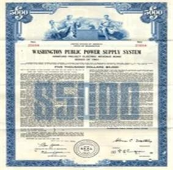

## Table of Contents

## What is WPPSS and what does it stand for?

WPPSS stands for Washington Public Power Supply System. It is a group that was formed to build nuclear power plants in the state of Washington. The group was created in the 1950s when people thought nuclear power would be a good way to make electricity.

However, WPPSS had a lot of problems. They started building five nuclear plants, but only finished one. The other four were never completed, and this caused a lot of money to be wasted. This led to a big financial problem known as the WPPSS default, which was one of the biggest municipal bond defaults in the United States.

## What are municipal bonds and how do they work?

Municipal bonds are like loans that people give to cities, towns, or states to help them pay for big projects. These projects can be things like building schools, fixing roads, or even building power plants. When someone buys a municipal bond, they are basically lending money to the government. In return, the government promises to pay back the money over time, usually with a little extra as a thank you, which is called interest.

Sometimes, things don't go as planned. If the city or state can't pay back the money they borrowed, it's called a default. This is what happened with WPPSS. They borrowed a lot of money to build nuclear power plants but couldn't finish the projects or pay back the loans. When a default happens, it can be a big problem for everyone involved because the people who lent the money might not get it back.

## What led to the WPPSS municipal bond defaults in the 1980s?

The WPPSS municipal bond defaults in the 1980s happened because the group tried to build too many nuclear power plants at the same time. They started building five plants, but only finished one. The other four were never completed because they ran out of money and faced a lot of problems. Building nuclear plants is very expensive and takes a long time. When costs kept going up and the projects were delayed, WPPSS couldn't keep up with the bills.

On top of that, fewer people wanted to buy electricity from nuclear power because it was getting more expensive. This made it even harder for WPPSS to pay back the money they borrowed. They had borrowed a lot of money by selling municipal bonds, which are like loans from people to the government. When WPPSS couldn't finish the plants and couldn't sell enough electricity, they couldn't pay back the loans. This led to one of the biggest municipal bond defaults in the United States, leaving many people who had lent money to WPPSS without getting their money back.

## How did the WPPSS bond defaults impact the municipal bond market?

The WPPSS bond defaults had a big impact on the municipal bond market. When WPPSS couldn't pay back the money they borrowed, it made people worried about lending money to other cities and states. They were scared that the same thing could happen again. This made it harder for cities and states to borrow money because people were more careful about where they put their money.

Because of the WPPSS defaults, the rules for municipal bonds got stricter. People who lend money started to look more closely at the projects they were funding. They wanted to make sure the projects were going to be finished and that the money would be paid back. This made the whole process of borrowing money for big projects more complicated and careful.

## What were the financial consequences for investors holding WPPSS bonds?

Investors who held WPPSS bonds faced big financial losses. When WPPSS couldn't finish building the nuclear power plants and couldn't pay back the money they borrowed, the bonds became almost worthless. Many investors lost a lot of money because they didn't get back what they had lent to WPPSS. This was especially hard for people who had put a lot of their savings into these bonds, thinking they were safe investments.

The WPPSS bond default also made investors more cautious about buying municipal bonds in the future. They started to look more carefully at the projects they were funding, wanting to make sure they wouldn't lose money again. This changed how people thought about municipal bonds, making them see these investments as riskier than before. As a result, it became harder for cities and states to borrow money because investors were more hesitant to lend.

## What legal actions were taken in response to the WPPSS bond defaults?

After the WPPSS bond defaults, a lot of people who had bought the bonds were upset and wanted their money back. They took WPPSS to court, saying that the group had promised to pay them back but didn't. The big legal fight was about whether WPPSS had the right to make people pay for the bonds even if the projects weren't finished. The case went all the way to the Washington State Supreme Court.

The court decided that WPPSS could not force people to pay for the bonds if the projects were not completed. This was a big win for the bondholders because it meant they didn't have to keep paying for something that was never going to be finished. But it also made it harder for WPPSS to get any more money to finish the projects. The legal battle showed everyone how important it is to be clear about what you're promising when you borrow money.

## How did the WPPSS situation affect public perception and trust in municipal bonds?

The WPPSS situation made a lot of people worried about municipal bonds. Before, many thought these bonds were safe ways to invest their money. But when WPPSS couldn't finish their projects and didn't pay back the money, people started to see municipal bonds as riskier. They realized that even if the bonds were from the government, there was still a chance they could lose their money. This made people more careful about where they put their money and less trusting of these kinds of investments.

Because of what happened with WPPSS, people started to look more closely at the projects they were funding with their money. They wanted to make sure the projects would be finished and that they would get their money back. This change in how people thought about municipal bonds made it harder for cities and states to borrow money. They had to show that their projects were good and that they could pay back the loans. Overall, the WPPSS situation shook people's trust in municipal bonds and made them more cautious about investing in them.

## What were the key lessons learned from the WPPSS bond defaults?

The WPPSS bond defaults taught everyone that it's really important to be careful when borrowing money for big projects. WPPSS tried to build too many nuclear power plants at once and ran out of money. They didn't finish most of the plants, and this caused a huge problem. People learned that you need to make sure you can finish what you start and that you have enough money to do it. If you borrow money, you have to be able to pay it back, or else a lot of people can get hurt financially.

Another big lesson was about trust and how important it is to be clear about what you're promising. When WPPSS couldn't pay back the money, a lot of people who had bought the bonds felt cheated. They took WPPSS to court and won, showing that you can't force people to pay for something that's not finished. This made people more careful about where they put their money and made them want to know more about the projects they were funding. It also made the rules for borrowing money stricter, so that everyone would be more careful in the future.

## How have regulations and practices in the municipal bond market changed since the WPPSS defaults?

Since the WPPSS defaults, the rules for municipal bonds have gotten stricter. People who lend money now look more closely at the projects they are funding. They want to make sure the projects will be finished and that they will get their money back. This means cities and states have to show that their projects are good and that they can pay back the loans. The government also made new rules to make sure everyone is more careful about borrowing and lending money.

These changes have made the municipal bond market safer but also more complicated. Now, when cities and states want to borrow money, they have to go through more steps to prove their projects are worth it. This can make it harder for them to get the money they need, but it also helps protect the people who lend the money. Overall, the WPPSS defaults taught everyone to be more careful and to make sure they understand the risks before they invest in municipal bonds.

## What role did the Washington Public Power Supply System play in the energy sector before the defaults?

Before the defaults, the Washington Public Power Supply System, or WPPSS, was a big group that tried to make more electricity for people in Washington. They thought nuclear power was a good way to do this, so they started building five nuclear power plants. WPPSS wanted to help meet the growing need for electricity and thought nuclear power would be a good, long-lasting solution.

But building nuclear power plants is really hard and costs a lot of money. WPPSS ran into a lot of problems while trying to build the plants. They couldn't finish most of them because they ran out of money and faced delays. This caused big financial problems for WPPSS and led to the bond defaults that hurt a lot of people who had lent them money.

## How did the WPPSS defaults influence future energy project financing?

The WPPSS defaults made people a lot more careful about how they finance big energy projects. Before, people thought that if the government was behind a project, it was safe to lend them money. But when WPPSS couldn't finish their nuclear power plants and didn't pay back the money, it showed everyone that even government projects can fail. This made lenders want to look more closely at the projects they were funding. They wanted to make sure the projects would be finished and that they would get their money back.

Because of what happened with WPPSS, the rules for financing energy projects got stricter. Now, when cities or companies want to build big projects like power plants, they have to show that they have a good plan and enough money to finish it. This can make it harder to get the money they need, but it also helps protect the people who lend the money. The WPPSS defaults taught everyone to be more careful and to think about the risks before they invest in big energy projects.

## What are some other notable cases of municipal bond defaults and how do they compare to WPPSS?

Another big case of municipal bond default happened in Detroit, Michigan in 2013. Detroit had a lot of money problems and couldn't pay back the money they borrowed. They had to file for bankruptcy, which is when you can't pay your bills and need help to fix your money problems. This was different from WPPSS because Detroit's problems were about the whole city, not just one project. But like WPPSS, it made people worried about lending money to cities and states.

Another example is the case of Jefferson County, Alabama in 2011. They had borrowed a lot of money to fix their sewer system but ran into big problems. They couldn't pay back the money and had to file for bankruptcy too. This was similar to WPPSS because it was about a big project that didn't work out. Both cases showed that even when the government borrows money, things can go wrong and people can lose their money. These cases made people more careful about where they put their money and made the rules for borrowing money stricter.

## References & Further Reading

[1]: Viswanathan, K. G. (1984). ["WPPSS: The largest municipal bond default in history."](https://www.upi.com/Archives/1983/07/25/WPPSS-defaults-on-225-billion-nuclear-plant-bonds/7039427953600/) The Financial Analysts Journal, 40(3), 40-49.

[2]: Grant, R. M. (1983). ["The WPPSS debacle: An analysis of project and management failure in large nuclear power projects."](https://law.justia.com/cases/washington/supreme-court/1983/49186-1-1.html) Construction Management and Economics, 1(2), 139-148.

[3]: Fabozzi, F. J., & Peterson, P. P. (2003). ["Financial management and analysis."](https://books.google.com/books/about/Financial_Management_and_Analysis.html?id=NBeyfpHg1boC) John Wiley & Sons.

[4]: Whitman, C. (1986). ["Municipal Bonds and Default: An Anatomy of WPPSS."](https://www.americanbar.org/content/dam/aba-cms-dotorg/products/inv/book/384962102/INTRODUCTION.pdf) Urban Lawyer, 18(2), 271-284.

[5]: Lopez de Prado, M. (2018). ["Advances in Financial Machine Learning."](https://www.amazon.com/Advances-Financial-Machine-Learning-Marcos/dp/1119482089) Wiley.

[6]: Chan, E. (2009). ["Quantitative Trading: How to Build Your Own Algorithmic Trading Business."](https://github.com/ftvision/quant_trading_echan_book) Wiley.