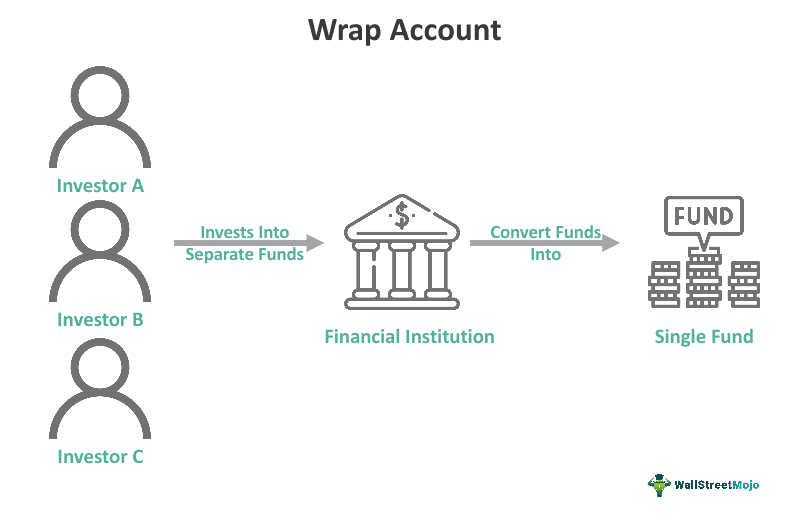

## Table of Contents

## What is a wrap account?

A wrap account is a type of investment account where you pay a single fee that covers all the costs of managing your investments. This fee includes things like the advisor's fees, trading costs, and other expenses. It's like a package deal where everything is wrapped into one simple payment, which makes it easier for you to know exactly how much you're spending on managing your money.

These accounts are often used by people who want professional help with their investments but don't want to deal with lots of different fees. The advisor who manages the wrap account will choose and manage the investments for you, based on your goals and how much risk you're willing to take. This can be a good option if you want a straightforward way to invest without having to worry about the details.

## How do wrap accounts differ from traditional brokerage accounts?

Wrap accounts and traditional brokerage accounts are different in how they handle fees and investment management. In a wrap account, you pay one big fee that covers everything, like the advisor's help, trading costs, and other expenses. This makes it easy to know exactly how much you're spending. On the other hand, with a traditional brokerage account, you might pay separate fees for each thing you do, like buying or selling stocks, and you might also pay for advice if you want it.

Another difference is how the investments are managed. In a wrap account, a professional advisor picks and manages your investments for you, based on what you want and how much risk you're okay with. This can be really helpful if you don't want to make all the decisions yourself. With a traditional brokerage account, you usually make your own investment choices, though you can still get advice if you pay for it. So, wrap accounts can be a simpler and more hands-off way to invest, while traditional brokerage accounts give you more control but also more responsibility.

## What are the typical fees associated with wrap accounts?

Wrap accounts usually have a single fee that covers everything. This fee is often a percentage of the total money you have in the account. It can be anywhere from 1% to 3% each year. So, if you have $100,000 in your wrap account and the fee is 2%, you would pay $2,000 a year for the account.

This fee includes the cost of the advisor's help, trading costs, and other expenses. It's like a package deal where you don't have to worry about different fees for different things. But, it's important to check what exactly is included in the fee because sometimes there might be extra costs for certain services or investments.

## Can you explain how wrap accounts can save on broker commissions?

Wrap accounts can save you money on broker commissions because they include trading costs in the single fee you pay. In a traditional brokerage account, every time you buy or sell a stock, you might have to pay a commission. These commissions can add up, especially if you trade a lot. But with a wrap account, you don't have to worry about these extra costs because they're already covered in the yearly fee.

This can be a big advantage if you like to make a lot of changes to your investments. Instead of paying a fee each time you trade, you just pay one fee for the whole year. This can make it easier to manage your money without worrying about the cost of each trade.

## What types of investments are commonly included in wrap accounts?

Wrap accounts usually include a mix of different types of investments. You might find stocks, which are shares in companies, and bonds, which are like loans to companies or governments. These accounts often also have mutual funds, which are big pools of money from many investors that are used to buy a variety of stocks, bonds, or other assets. Sometimes, wrap accounts include exchange-traded funds (ETFs), which are similar to mutual funds but trade like stocks on an exchange.

The idea is to spread your money across different kinds of investments to lower the risk. The advisor who manages your wrap account will pick these investments based on what you want to achieve and how much risk you're okay with. This way, you can have a well-rounded investment plan without having to choose each investment yourself.

## Who is the ideal investor for a wrap account?

The ideal investor for a wrap account is someone who wants professional help with their investments but doesn't want to deal with lots of different fees. This person might not have the time or knowledge to pick their own investments and would rather have an advisor do it for them. They like the idea of paying one simple fee that covers everything, so they know exactly how much they're spending on managing their money.

Wrap accounts are also good for people who trade a lot. Since the trading costs are included in the single fee, these investors can make changes to their investments without worrying about extra commissions. If you're someone who wants a straightforward way to invest and doesn't mind paying a bit more for the convenience and professional management, a wrap account could be a great choice for you.

## How does the performance of a wrap account compare to self-managed accounts?

The performance of a wrap account compared to a self-managed account can vary a lot. It depends on how good the advisor is at picking investments and how well they match your goals and risk level. If the advisor does a great job, your wrap account might do better than if you managed it yourself. But if the advisor doesn't pick the right investments or charges too much in fees, your wrap account might not do as well.

In a self-managed account, you're in charge of picking your own investments. This can be good if you know a lot about investing and can find good opportunities. But it can also be risky if you make bad choices or don't keep up with the market. The big difference is that with a wrap account, you're paying for someone else's expertise, which can help or hurt your performance depending on how good they are.

## What are the potential drawbacks of using a wrap account?

One potential drawback of using a wrap account is the cost. The single fee you pay might be higher than what you would pay if you managed your investments yourself or used a traditional brokerage account. If you don't trade a lot, the wrap fee might end up being more expensive than paying separate commissions for each trade. It's important to think about how much you're willing to pay for the convenience and professional help.

Another issue is that you might not have as much control over your investments. In a wrap account, the advisor picks and manages your investments for you. If you like to make your own choices or have specific ideas about what to invest in, a wrap account might not be the best fit. You're trusting the advisor to do a good job, and if they don't, your investments might not do as well as you hoped.

## How do wrap account fees impact overall investment returns?

Wrap account fees can lower your overall investment returns because you're paying a fee every year, no matter how well your investments do. If you have a wrap account with a 2% fee and your investments grow by 6% in a year, you'll only keep 4% after the fee. Over time, these fees can add up and take a big chunk out of your money, especially if the fees are high or if your investments don't grow much.

It's important to think about how much you're paying in fees and how it affects your returns. If the advisor in your wrap account does a great job and picks investments that do really well, the fees might be worth it. But if the fees are too high or the investments don't do as well as you hoped, you might end up with less money than if you had managed your investments yourself or used a different type of account.

## What should investors consider when choosing between a wrap account and paying individual broker commissions?

When choosing between a wrap account and paying individual broker commissions, investors should think about how much they want to pay and how much control they want over their investments. A wrap account has one big fee that covers everything, like the advisor's help and trading costs. This can be good if you want to know exactly how much you're spending and don't want to deal with lots of different fees. But, if you don't trade a lot, the wrap fee might be more expensive than paying separate commissions for each trade. So, it's important to think about how often you plan to buy and sell investments.

Another thing to consider is how much help you want with your investments. In a wrap account, a professional advisor picks and manages your investments for you. This can be really helpful if you don't have the time or knowledge to do it yourself. But, if you like to make your own choices or have specific ideas about what to invest in, you might prefer to pay individual broker commissions and manage your own account. It's all about finding the right balance between cost, control, and the level of help you need.

## How do regulatory requirements affect wrap accounts?

Regulatory requirements can have a big impact on wrap accounts. They make sure that the people who manage these accounts follow certain rules to protect investors. For example, advisors have to tell you clearly what the fees are and what services you're getting. They also have to make sure that the investments they pick for you are good for your goals and how much risk you're okay with. This helps keep things fair and honest.

These rules also mean that advisors have to keep good records and report things to the right people. This can make running a wrap account a bit more work for them, but it's all to make sure that your money is safe and that you're getting what you pay for. So, while regulatory requirements might make things a bit more complicated for the people managing wrap accounts, they're there to help you feel more secure about your investments.

## What advanced strategies can be implemented within a wrap account to optimize returns?

One way to try to get better returns in a wrap account is by using something called asset allocation. This means spreading your money across different types of investments, like stocks, bonds, and maybe even real estate. The idea is to balance risk and reward. If one type of investment doesn't do well, the others might help make up for it. Your advisor can change this mix over time to try to get the best results based on what's happening in the market and your goals.

Another strategy is called tax-loss harvesting. This is when your advisor sells investments that have lost value to help lower your taxes. They can then use the money to buy similar investments, so your overall plan doesn't change much. This can help you keep more of your money by reducing what you owe in taxes. It's a smart way to make the most of your investments while also thinking about your tax situation.

## References & Further Reading

[1]: Bergstra, J., Bardenet, R., Bengio, Y., & Kégl, B. (2011). ["Algorithms for Hyper-Parameter Optimization."](https://papers.nips.cc/paper/4443-algorithms-for-hyper-parameter-optimization) Advances in Neural Information Processing Systems 24.

[2]: ["Advances in Financial Machine Learning"](https://www.amazon.com/Advances-Financial-Machine-Learning-Marcos/dp/1119482089) by Marcos Lopez de Prado

[3]: ["Evidence-Based Technical Analysis: Applying the Scientific Method and Statistical Inference to Trading Signals"](https://www.amazon.com/Evidence-Based-Technical-Analysis-Scientific-Statistical/dp/0470008741) by David Aronson

[4]: ["Machine Learning for Algorithmic Trading"](https://github.com/stefan-jansen/machine-learning-for-trading) by Stefan Jansen

[5]: ["Quantitative Trading: How to Build Your Own Algorithmic Trading Business"](https://www.amazon.com/Quantitative-Trading-Build-Algorithmic-Business/dp/1119800064) by Ernest P. Chan