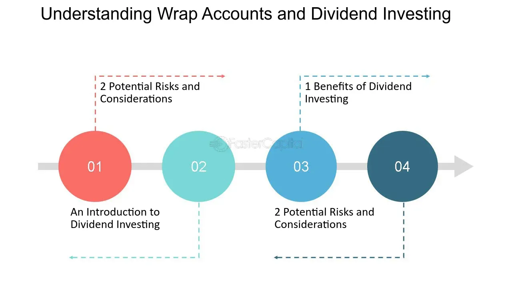

## Table of Contents

## What is a wrap fee?

A wrap fee is a type of fee that you pay for investment management services. It's like a package deal where you pay one fee that covers everything, including the costs of managing your investments, trading, and sometimes even advice. This fee is usually a percentage of the total amount of money you have invested.

Wrap fees can be good because they make things simple. You know exactly how much you're paying, and you don't have to worry about extra charges popping up. But, you need to be careful. Sometimes, the wrap fee might be higher than if you paid for each service separately. So, it's important to compare and see if a wrap fee is the best choice for you.

## How does a wrap fee program work?

A wrap fee program is like a bundle deal for managing your investments. When you join a wrap fee program, you pay one single fee that covers all the costs of managing your money. This fee is usually a percentage of the total amount you have invested. For example, if you have $10,000 invested and the wrap fee is 1%, you would pay $100 a year. The fee includes things like trading costs, investment advice, and sometimes even financial planning.

The main advantage of a wrap fee program is that it makes things simple. You don't have to worry about keeping track of different fees for different services. Everything is included in one easy-to-understand fee. However, you need to be careful because sometimes the wrap fee might be more expensive than if you paid for each service separately. It's important to compare the total costs and see if a wrap fee program is the best choice for your situation.

## What are the typical components included in a wrap fee?

A wrap fee usually includes several services all bundled into one fee. This fee covers the cost of managing your investments, which means someone is making decisions about where to put your money to help it grow. It also includes the costs of trading, so when your investments are bought or sold, you don't have to pay extra for those transactions. Sometimes, the wrap fee even covers investment advice, where a professional gives you tips on how to invest your money better.

In some cases, the wrap fee might also include financial planning services. This means you could get help with planning for big life events like retirement or buying a house. The idea behind a wrap fee is to make things easier for you by combining all these costs into one simple fee. However, it's important to check what exactly is included in the wrap fee because it can vary from one program to another.

## Who typically uses wrap fee programs?

People who use wrap fee programs are often those who want a simple way to manage their investments. They might be busy and don't want to spend a lot of time figuring out different fees for trading, advice, and other services. By paying one wrap fee, they can have everything taken care of without worrying about extra costs popping up.

These programs are also popular with people who have a good amount of money to invest. Since wrap fees are usually a percentage of the total investment, it makes more sense for someone with a larger amount of money. They can benefit from the convenience and professional management that comes with a wrap fee program.

## What are the advantages of using a wrap fee program for beginners?

For beginners, using a wrap fee program can make investing a lot easier. Instead of having to figure out different fees for trading, advice, and other services, beginners just pay one simple fee. This means they don't have to worry about extra costs popping up and can focus on learning about investing without getting confused by complicated fee structures.

Another advantage for beginners is that wrap fee programs often come with professional management. This means that someone with experience is making decisions about where to put the money to help it grow. For someone new to investing, having this kind of help can be really valuable. It can give them confidence and help them learn as they go, knowing that their investments are being looked after by someone who knows what they're doing.

## How can wrap fees impact the overall cost of investment management?

Wrap fees can make the overall cost of investment management simpler but sometimes more expensive. When you pay a wrap fee, you're paying one fee that covers everything, like trading costs, advice, and sometimes even financial planning. This can be good because it's easy to understand and you don't have to worry about extra charges. But, if you add up all the individual costs that you would pay without a wrap fee, sometimes the wrap fee might be higher. So, it's important to compare the total costs to see if a wrap fee is really saving you money.

For example, if you have a small amount of money to invest, the wrap fee might not be the best choice. Since wrap fees are usually a percentage of your total investment, a smaller amount means a smaller fee, but it might still be more than paying for each service separately. On the other hand, if you have a lot of money to invest, the wrap fee might make more sense because the convenience and professional management can be worth the cost. It's all about figuring out what works best for your situation.

## What are the potential disadvantages of wrap fee programs?

One potential disadvantage of wrap fee programs is that they can be more expensive than paying for each service separately. Since the wrap fee is a percentage of your total investment, if you don't trade a lot or need much advice, you might end up paying more than you need to. It's like paying for a big package when you only need a few things from it.

Another disadvantage is that wrap fees might not be the best choice for everyone. If you have a small amount of money to invest, the wrap fee might take a bigger bite out of your investment than if you paid for each service on its own. Also, some wrap fee programs might not offer all the services you need, so you could end up paying the wrap fee and still needing to pay for other services separately. It's important to look closely at what you're getting and compare the costs to make sure a wrap fee program is right for you.

## How do wrap fees compare to other fee structures like commission-based or fee-only models?

Wrap fees are different from commission-based and fee-only models. With a wrap fee, you pay one fee that covers everything, like trading costs, advice, and sometimes even financial planning. This fee is usually a percentage of your total investment. It's like a package deal where you know exactly how much you're paying upfront. On the other hand, a commission-based model means you pay a fee every time you buy or sell an investment. This can add up if you trade a lot. A fee-only model is where you pay a set fee for advice or management, but you might still have to pay for trading costs separately.

The main advantage of a wrap fee is that it's simple and easy to understand. You don't have to worry about extra charges popping up. But, it might be more expensive than other models if you don't trade a lot or need much advice. With a commission-based model, you might save money if you don't trade often, but the costs can be unpredictable. A fee-only model can be good if you want to pay just for advice, but you need to be careful about other costs like trading fees. It's important to compare all these options to see which one fits your needs and budget the best.

## What should investors consider when evaluating the suitability of a wrap fee program for their portfolio?

When thinking about using a wrap fee program for your investments, it's important to look at how much money you have to invest. If you have a lot of money, a wrap fee might be a good choice because the fee is a percentage of your total investment. This means the convenience and professional management you get might be worth the cost. But if you have a smaller amount of money, the wrap fee could take a bigger bite out of your investment than if you paid for each service separately.

You should also think about how often you trade and how much advice you need. If you don't trade a lot or need much advice, a wrap fee might be more expensive than you need. It's like paying for a big package when you only need a few things from it. On the other hand, if you like the idea of one simple fee that covers everything, a wrap fee could make things easier for you. It's all about figuring out what works best for your situation and comparing the total costs to see if a wrap fee program is the right choice for you.

## How do regulatory bodies oversee wrap fee programs and what are the compliance requirements?

Regulatory bodies like the Securities and Exchange Commission (SEC) in the United States keep an eye on wrap fee programs to make sure they are fair and follow the rules. They do this by checking that the fees charged are clear and that investors know exactly what they are paying for. The SEC also makes sure that the people running the wrap fee programs are giving good advice and not just trying to make money for themselves. They look at things like how the fees are calculated and whether the program is really helping investors.

To follow the rules, companies offering wrap fee programs have to be very open about their fees. They need to tell investors exactly what services are included in the wrap fee and how much it will cost. They also have to make sure that the wrap fee is fair and not too high compared to what investors would pay if they paid for each service separately. This helps make sure that investors are getting a good deal and that the wrap fee program is working the way it should.

## What advanced strategies can be implemented within a wrap fee program to optimize returns?

One way to make the most out of a wrap fee program is by using a strategy called asset allocation. This means spreading your money across different types of investments, like stocks, bonds, and real estate. By doing this, you can lower the risk of losing money because if one type of investment goes down, the others might go up. The professionals managing your wrap fee program can help you figure out the best way to split your money to match your goals and how much risk you're okay with taking.

Another strategy is called rebalancing. This is when you check your investments every now and then and make changes to keep your asset allocation the way you want it. For example, if your stocks have done really well and now make up a bigger part of your portfolio than you planned, you might sell some stocks and buy more bonds to get back to your original plan. The wrap fee program can make this easier because the fee covers the costs of trading, so you don't have to worry about extra charges when you make these changes.

## How can financial advisors use wrap fee programs to better serve high-net-worth clients?

Financial advisors can use wrap fee programs to better serve high-net-worth clients by offering a simple and comprehensive solution for managing their investments. Since high-net-worth clients often have large sums of money to invest, a wrap fee, which is a percentage of the total investment, can be cost-effective for them. The wrap fee covers everything from trading costs to investment advice and sometimes even financial planning, making it easier for clients to understand their expenses and focus on their financial goals without worrying about extra charges.

Additionally, wrap fee programs allow financial advisors to provide personalized and proactive management for their high-net-worth clients. Advisors can use advanced strategies like asset allocation and rebalancing to optimize returns and manage risk effectively. This tailored approach can help high-net-worth clients feel confident that their investments are being looked after by professionals who understand their unique needs and are working to maximize their wealth.

## References & Further Reading

[1]: ["Wrap Fees: Understanding Their Pros and Cons"](https://www.investopedia.com/terms/w/wrap-fee.asp) by Marshall Hargrave on Investopedia

[2]: Aber, J. (2015). ["The Use and Misuse of Wrap Fee Accounts"](https://psychiatryonline.org/doi/10.1176/appi.ajp.2015.15020262). Journal of Financial Service Professionals.

[3]: ["Trading and Exchanges: Market Microstructure for Practitioners"](https://www.amazon.com/Trading-Exchanges-Market-Microstructure-Practitioners/dp/0195144708) by Larry Harris

[4]: Hendershott, T., Jones, C. M., & Menkveld, A. J. (2011). ["Does Algorithmic Trading Improve Liquidity?"](https://onlinelibrary.wiley.com/doi/full/10.1111/j.1540-6261.2010.01624.x) Review of Financial Studies, 24(3), 210–235.

[5]: Fleming, M. J., & Nguyen, G. (2013). ["Order Flow Segmentation and the Role of Dark Trading in the Price Discovery of U.S. Treasury Securities"](https://link.springer.com/article/10.1007/s12197-020-09506-8). Federal Reserve Bank of New York.