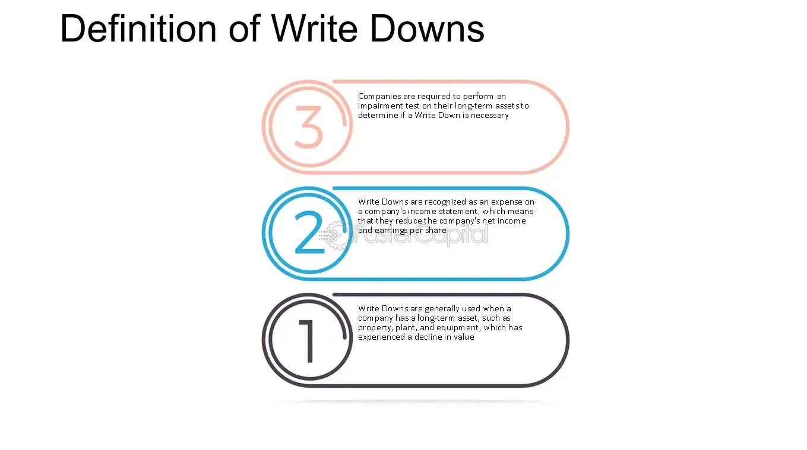

## Table of Contents

## What is a write-down in accounting?

A write-down in accounting is when a company reduces the value of an asset on its balance sheet. This happens when the asset is worth less than what the company originally thought. For example, if a company bought a machine for $10,000 but now it's only worth $7,000, they would write down the value by $3,000.

Write-downs are important because they help show a more accurate picture of a company's financial health. If a company doesn't write down an asset's value, it might look like they have more money than they really do. This can affect decisions made by investors and other people who look at the company's financial statements.

## Why might a company need to perform a write-down?

A company might need to perform a write-down if the value of one of its assets goes down. This can happen for many reasons. For example, if a company owns a building and the real estate market crashes, the building might be worth less than what the company paid for it. Or, if a company has a lot of inventory that doesn't sell, the value of that inventory might go down because it's not as useful anymore.

Write-downs are important because they help the company show a true picture of its financial health. If a company doesn't adjust the value of its assets when they go down, it might look like the company is worth more than it really is. This can be misleading for investors and other people who look at the company's financial statements. By performing a write-down, the company can be more honest about how much its assets are really worth.

## How does a write-down affect a company's financial statements?

When a company does a write-down, it changes the numbers on its balance sheet. The balance sheet shows what the company owns and owes. When an asset's value goes down, the company subtracts that loss from the asset's value on the balance sheet. This makes the company's total assets look smaller. It also affects the company's equity, which is what's left after you subtract what the company owes from what it owns. A lower asset value means less equity.

A write-down also shows up on the income statement, which shows how much money the company made or lost over a period of time. When a company writes down an asset, it records that loss as an expense. This makes the company's net income, or profit, smaller for that period. So, a write-down can make it look like the company made less money than it did before the write-down. This is important for investors and others who look at the company's financial health.

## Can you explain the difference between a write-down and a write-off?

A write-down and a write-off both deal with reducing the value of an asset, but they are a bit different. A write-down happens when a company lowers the value of an asset on its [books](/wiki/algo-trading-books) because it's now worth less than what the company paid for it. For example, if a company bought a piece of equipment for $10,000 but now it's only worth $8,000, they would write down the value by $2,000. The asset still has some value, just less than before.

A write-off, on the other hand, is when a company decides an asset has no value left at all. They take the whole value of the asset off their books. For instance, if that same piece of equipment becomes totally unusable and can't be sold or used anymore, the company would write it off completely. This means the asset's value goes to zero on the balance sheet. Both write-downs and write-offs affect a company's financial statements, but a write-off is a more extreme action because it means the asset is worthless.

## What are the common reasons for asset impairment leading to a write-down?

Asset impairment leading to a write-down can happen for many reasons. One common reason is when the market value of an asset drops a lot. For example, if a company owns a building and the real estate market crashes, the building might be worth less than what the company paid for it. Another reason is when technology changes quickly. If a company has old computers or machinery that can't do the new things needed, their value goes down because they're not as useful anymore.

Another reason for asset impairment is when a company's inventory doesn't sell. If a company has a lot of products that people don't want to buy, those products lose value over time. Also, if a company loses a big customer or a contract, the assets used for that customer or contract might not be as valuable anymore. All these situations can lead a company to do a write-down to show a more honest picture of what their assets are really worth.

## How is the amount of a write-down calculated?

The amount of a write-down is calculated by figuring out the difference between what an asset is worth now and what it was worth when the company bought it. To do this, a company first looks at the asset's current market value. This might mean getting an appraisal or looking at what similar assets are selling for. Then, they compare this current value to the asset's book value, which is what the company has it listed as on their balance sheet. The difference between these two values is the amount of the write-down.

For example, if a company bought a machine for $50,000 and now it's only worth $30,000, the write-down amount would be $20,000. This is because the machine's value has gone down by $20,000. The company would then adjust the machine's value on their balance sheet to $30,000 and record a $20,000 loss on their income statement. This helps show a more accurate picture of the company's financial health.

## What are the tax implications of a write-down?

When a company does a write-down, it can affect their taxes. A write-down means the company has to record a loss on their income statement. This loss can lower the company's taxable income, which means they might have to pay less in taxes for that year. But, the rules about how write-downs affect taxes can be different in different countries and can change over time. So, a company needs to talk to a tax expert to know exactly how a write-down will affect their taxes.

Sometimes, a write-down can also affect a company's tax situation in the future. If a company writes down an asset, they can't claim a tax deduction for that asset again later. For example, if a company writes down a machine and then sells it, they might not be able to take a tax deduction for the sale because they already took a deduction when they did the write-down. This is another reason why it's important for a company to understand the tax rules and talk to a tax expert before doing a write-down.

## How do write-downs impact a company's stock price and investor perception?

When a company does a write-down, it can make its stock price go down. This happens because a write-down shows that the company's assets are worth less than before. Investors might think this means the company is not doing as well as they thought. They might sell their shares, which makes the stock price drop. Also, if a write-down is a surprise to investors, it can shake their trust in the company's management. They might worry that the company is not being honest about its financial health.

But, not all write-downs are bad news. Sometimes, a write-down can actually make investors feel better about a company. If the write-down shows that the company is being honest about its problems, investors might trust the company more. They might see the write-down as a sign that the company is trying to fix its issues and be more open about its financial situation. This can make them more likely to keep their shares or even buy more, which can help the stock price stay steady or go up.

## What are the accounting standards (e.g., GAAP, IFRS) that govern write-downs?

Write-downs are guided by accounting standards like GAAP (Generally Accepted Accounting Principles) in the United States and IFRS (International Financial Reporting Standards) used in many other countries. Both sets of rules say that a company needs to check their assets often to see if they are still worth what the company says they are. If an asset's value goes down a lot, the company has to write it down. This means they have to lower the asset's value on their books to show what it's really worth now.

GAAP and IFRS have some small differences in how they handle write-downs. Under GAAP, once a company writes down an asset, they usually can't write it back up if the asset's value goes up again later. But under IFRS, if the asset's value goes up after a write-down, the company can sometimes write it back up. Both sets of rules want to make sure that a company's financial statements show a true picture of how much their assets are worth.

## How should a company disclose write-downs in their financial reporting?

When a company does a write-down, they need to tell people about it in their financial reports. This is important because it helps people who look at the reports, like investors, understand what's happening with the company's money. The company should write about the write-down in the notes to their financial statements. These notes explain the numbers in the statements and give more details about why the write-down happened and how much it was.

The company also needs to show the write-down in their income statement as a loss. This means they subtract the amount of the write-down from their income for that period. On the balance sheet, they need to show the new, lower value of the asset after the write-down. By doing this, the company makes sure that everyone can see the true value of their assets and how the write-down affects their money.

## What strategies can companies employ to mitigate the need for future write-downs?

Companies can take steps to avoid needing to do write-downs in the future. One way is to keep a close eye on their assets all the time. This means checking the value of things like buildings, machines, and inventory often to see if they are still worth what the company says they are. If they see that an asset's value is going down, they can try to sell it or use it differently before it loses too much value. Another way is to be careful about what they buy. If a company only buys assets that they are sure will keep their value or be useful for a long time, they are less likely to need a write-down later.

Another strategy is to stay up to date with changes in the market and technology. If a company knows that the things they own might lose value because of new technology or changes in what people want to buy, they can plan ahead. They might decide to sell those assets before they lose too much value or find new ways to use them. By being smart about what they buy and how they keep track of their assets, companies can lower the chances of having to do a write-down and keep their financial statements looking healthy.

## Can you discuss a real-world example where a significant write-down had a major impact on a company?

In 2012, Hewlett-Packard (HP) announced a huge write-down of $8.8 billion. This happened because HP bought a company called Autonomy for $11 billion, but then found out that Autonomy's value was not as high as they thought. HP said that Autonomy's leaders had made the company look more valuable than it really was. This big write-down made HP's stock price drop a lot and made people trust HP less. It was a big shock to investors and showed how important it is for companies to check the value of what they buy carefully.

This write-down was one of the biggest in history and it really hurt HP. After the write-down, HP had to explain what happened and how they were going to fix things. They had to work hard to show that they were still a good company and that they were being honest about their financial problems. This example shows how a big write-down can change how people see a company and affect its stock price and business.

## What is the Write-Down Process Explained?

A write-down occurs when an asset's market value falls below its book value, prompting a necessary adjustment in financial records to accurately represent the asset's reduced worth. This adjustment is critical to maintaining the integrity of financial statements.

Several primary factors can trigger a write-down. Market shifts, such as fluctuations in demand or changes in consumer preferences, can directly reduce an asset's value. Technological changes often render existing assets obsolete, necessitating a revaluation. Additionally, unfavorable business conditions, such as economic downturns or increased competition, can diminish an asset's market value.

The write-down process affects both the income statement and the balance sheet. On the income statement, the write-down is recorded as an expense, decreasing net income for the period in which it is recognized. This reflects the incurred loss due to the asset's diminished value. On the balance sheet, the asset's carrying value is reduced to its revised market value, thereby impacting total asset valuation. The formula to calculate the new asset value is:

$$
\text{New Asset Value} = \text{Book Value} - \text{Write-Down Amount}
$$

Companies must follow established accounting standards to ensure consistent reporting across financial statements. Generally Accepted Accounting Principles (GAAP) in the United States and the International Financial Reporting Standards (IFRS) globally provide comprehensive guidelines for recognizing and reporting write-downs. Adhering to these standards ensures transparency and comparability, crucial for stakeholders evaluating the financial health of a company. 

By accurately reflecting lower asset values, businesses provide stakeholders with a more realistic view of their financial position, facilitating informed decision-making.

## What are the impacts of write-downs on financial indicators?

Write-downs have a profound impact on a company's financial indicators. These adjustments entail reducing the book value of an asset when its market value falls below its recorded value, thus necessitating changes in financial metrics and ratios. Understanding these changes is crucial for stakeholders who are assessing a company's financial health and decision-making efficiency.

One of the primary financial metrics affected by write-downs is earnings per share (EPS). The formula for EPS is:

$$
\text{EPS} = \frac{\text{Net Income} - \text{Preferred Dividends}}{\text{Average Outstanding Shares}}
$$

When a write-down is recorded, it appears as an expense on the income statement, thereby reducing net income. This reduction, in turn, leads to a lower EPS, implying lesser profitability per share from the perspective of common shareholders. 

Another significant indicator affected is the return on assets (ROA), calculated as:

$$
\text{ROA} = \frac{\text{Net Income}}{\text{Total Assets}}
$$

A write-down directly reduces the value of total assets on the balance sheet. When combined with a decrease in net income due to the write-down, ROA can experience substantial declines. This reduction highlights a decrease in the efficiency with which a company utilizes its assets to generate earnings.

The debt-to-equity ratio, expressed as:

$$
\text{Debt-to-Equity Ratio} = \frac{\text{Total Liabilities}}{\text{Shareholders' Equity}}
$$

is also influenced by write-downs. By decreasing the value of shareholders' equity—since retained earnings, a component of equity, are affected by the reduced net income—the write-down can elevate this ratio. A higher debt-to-equity ratio suggests increased financial leverage and risk, since a larger proportion of the company's operations are funded by debt rather than equity.

For stakeholders, understanding the way write-downs alter these financial indicators is essential for evaluating a company's financial stability and operational effectiveness. An accurate assessment of financial health can guide investment decisions, risk assessment, and strategic planning significantly. By monitoring these ratios, investors and managers can gain insights into the implications of a company's asset write-downs on its broader financial landscape.

## References & Further Reading

[1]: Bergstra, J., Bardenet, R., Bengio, Y., & Kégl, B. (2011). ["Algorithms for Hyper-Parameter Optimization."](https://dl.acm.org/doi/10.5555/2986459.2986743) Advances in Neural Information Processing Systems 24.

[2]: ["Advances in Financial Machine Learning"](https://www.amazon.com/Advances-Financial-Machine-Learning-Marcos/dp/1119482089) by Marcos Lopez de Prado

[3]: ["Evidence-Based Technical Analysis: Applying the Scientific Method and Statistical Inference to Trading Signals"](https://www.amazon.com/Evidence-Based-Technical-Analysis-Scientific-Statistical/dp/0470008741) by David Aronson

[4]: ["Machine Learning for Algorithmic Trading"](https://github.com/stefan-jansen/machine-learning-for-trading) by Stefan Jansen

[5]: ["Quantitative Trading: How to Build Your Own Algorithmic Trading Business"](https://www.amazon.com/Quantitative-Trading-Build-Algorithmic-Business/dp/1119800064) by Ernest P. Chan