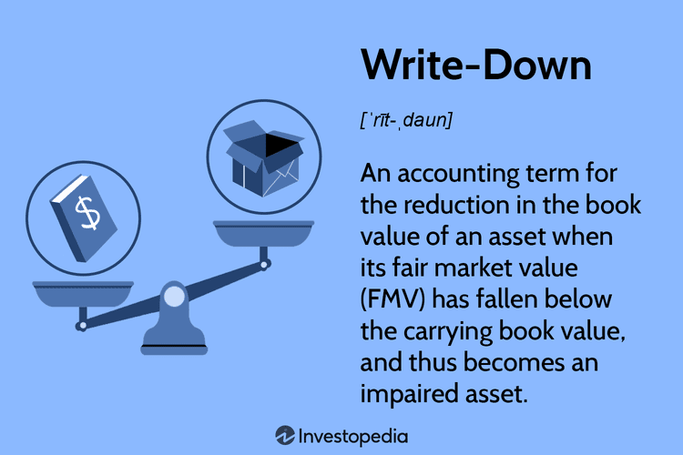

In today's fast-paced financial environment, grasping complex concepts such as asset valuation, write-downs, and algorithmic trading is essential for maintaining financial acumen. Asset valuation serves as a cornerstone of financial accounting, providing a basis for determining the monetary worth of a company's assets. This process ensures that financial statements accurately portray a company's current financial status, thereby informing strategic decisions. Write-downs, on the other hand, occur when an asset's market value falls below its book value, prompting necessary adjustments in financial records. These write-downs can be triggered by market changes, technological advancements, or adverse business conditions, directly affecting the income statement and balance sheet.

Algorithmic trading introduces another layer of complexity and opportunity, utilizing sophisticated algorithms for executing trades and analyzing financial data at unprecedented speeds. These algorithms, enhanced by big data and machine learning, can predict asset impairments and facilitate proactive risk management. By incorporating such advanced analytical tools, businesses can refine their financial strategies and optimize asset management, adapting to dynamic market conditions.



Emerging technologies are reshaping traditional finance, making it imperative for business leaders and investors to understand these key elements. The interconnections between asset valuation, write-down dynamics, and the role of algorithmic trading highlight significant impacts on financial reporting, decision-making, and risk management. Acquiring knowledge in these areas not only enhances financial transparency but also supports strategic planning, essential for thriving in a rapidly evolving economic landscape.

## Table of Contents

## Understanding Accounting Asset Valuation

Asset valuation is a fundamental aspect of financial accounting that determines the monetary worth of a company's assets. This process is crucial for ensuring that a company's balance sheet accurately reflects its current financial position, providing stakeholders with a clear picture of the firm's financial health. There are several methods used to ascertain asset value, each contributing to a comprehensive evaluation.

The primary approaches to asset valuation include fair market value and historical cost. Fair market value represents the price at which an asset could be bought or sold in an open market, reflecting current market conditions. This method is particularly useful for assets that are frequently traded, such as stocks or real estate; it captures real-time market dynamics, offering a more up-to-date valuation.

In contrast, the historical cost method assesses assets at their original purchase price, adjusted for any depreciation or amortization. Historical cost provides a stable figure that is not subject to market volatility, making it a reliable metric for long-term assets like machinery or infrastructure. While this method may not reflect current market prices, it provides consistency over time, which can be essential for long-term financial planning.

Understanding these valuation processes is critical for assessing a company's health. Accurate asset valuation allows investors and stakeholders to make informed decisions by evaluating whether a company's assets are sufficient to cover its liabilities. It also impacts various financial metrics, such as return on assets (ROA) and debt-to-asset ratios, which are integral to analyzing investment viability.

Moreover, asset valuation has implications for compliance with accounting standards such as Generally Accepted Accounting Principles (GAAP) or International Financial Reporting Standards (IFRS). These standards often dictate specific valuation methodologies and their application in financial reporting, ensuring consistency and transparency across financial statements.

In practice, financial professionals may use software tools to aid in the valuation process, employing algorithms to analyze market data and apply valuation methodologies efficiently. As technology evolves, these tools are becoming more sophisticated, incorporating elements like [machine learning](/wiki/machine-learning) to enhance precision and predictive capabilities in asset valuation.

In summary, asset valuation is an essential practice in financial accounting. It ensures that a company's balance sheet provides an accurate and fair representation of its assets, thereby influencing financial decision-making and strategic planning. Understanding and applying the correct valuation methods are vital for investors seeking to assess company health and the potential for future growth.

## The Write-Down Process Explained

A write-down occurs when an asset's market value falls below its book value, prompting a necessary adjustment in financial records to accurately represent the asset's reduced worth. This adjustment is critical to maintaining the integrity of financial statements.

Several primary factors can trigger a write-down. Market shifts, such as fluctuations in demand or changes in consumer preferences, can directly reduce an asset's value. Technological changes often render existing assets obsolete, necessitating a revaluation. Additionally, unfavorable business conditions, such as economic downturns or increased competition, can diminish an asset's market value.

The write-down process affects both the income statement and the balance sheet. On the income statement, the write-down is recorded as an expense, decreasing net income for the period in which it is recognized. This reflects the incurred loss due to the asset's diminished value. On the balance sheet, the asset's carrying value is reduced to its revised market value, thereby impacting total asset valuation. The formula to calculate the new asset value is:

$$
\text{New Asset Value} = \text{Book Value} - \text{Write-Down Amount}
$$

Companies must follow established accounting standards to ensure consistent reporting across financial statements. Generally Accepted Accounting Principles (GAAP) in the United States and the International Financial Reporting Standards (IFRS) globally provide comprehensive guidelines for recognizing and reporting write-downs. Adhering to these standards ensures transparency and comparability, crucial for stakeholders evaluating the financial health of a company. 

By accurately reflecting lower asset values, businesses provide stakeholders with a more realistic view of their financial position, facilitating informed decision-making.

## Role of Algorithmic Trading in Asset Impairment

Algorithmic trading is a critical aspect of modern financial markets, employing advanced algorithms to execute trades efficiently and analyze vast amounts of financial data. These algorithms play a pivotal role in identifying potential asset impairments early, providing businesses with the opportunity to undertake proactive risk management strategies.

One of the primary advantages of [algorithmic trading](/wiki/algorithmic-trading) in addressing asset impairment is its capability to process large datasets in real-time. By integrating big data analytics and machine learning techniques, algorithms are equipped to detect patterns and anomalies in financial metrics that might suggest an asset's declining value. For instance, an algorithm can analyze market trends, compare historical asset values, and correlate them with external economic indicators to forecast potential impairments.

Machine learning models, such as regression analysis or neural networks, can be used for predictive modeling to assess asset values continuously. A simple linear regression model may help estimate an asset's future market value based on variables like market trends and sector performance. Python's sklearn library can be employed for such tasks. Here is a basic example of how a linear regression might be implemented to predict asset impairments:

```python
from sklearn.model_selection import train_test_split
from sklearn.linear_model import LinearRegression
import numpy as np
import pandas as pd

# Sample dataset: historic asset values and associated features
data = {
    'feature_1': [5.1, 4.9, 4.7, 4.6, 5.0],
    'feature_2': [3.5, 3.0, 3.2, 3.1, 3.6],
    'asset_value': [1.4, 1.5, 1.3, 1.5, 1.7]
}

df = pd.DataFrame(data)

# Independent variables as features
X = df[['feature_1', 'feature_2']]
# Dependent variable: asset value
y = df['asset_value']

# Splitting the dataset into training and testing
X_train, X_test, y_train, y_test = train_test_split(X, y, test_size=0.2, random_state=0)

# Linear Regression Model
regressor = LinearRegression()
regressor.fit(X_train, y_train)

# Predicting the test set results
y_pred = regressor.predict(X_test)

print("Predicted asset values:", y_pred)
```

This example demonstrates how companies can leverage machine learning to predict asset impairments based on varying indicators. The ongoing assessment helps firms refine financial strategies and optimize asset management practices, bolstering their ability to respond swiftly to potential depreciation.

Moreover, the integration of algorithmic trading into asset impairment assessments helps enhance decision-making processes. By utilizing these tools, businesses not only refine their financial strategies but also optimize asset management. This hybrid approach allows for the dynamic adjustment of asset portfolios in response to predictive insights. 

The confluence of big data, machine learning, and algorithmic trading creates a robust framework for managing asset impairments. These technologies are not just about identification; they fundamentally reshape how companies approach financial strategy and risk management, offering a potent combination of real-time analysis, enhanced predictive capabilities, and strategic foresight.

## Impacts of Write-Downs on Financial Indicators

Write-downs have a profound impact on a company's financial indicators. These adjustments entail reducing the book value of an asset when its market value falls below its recorded value, thus necessitating changes in financial metrics and ratios. Understanding these changes is crucial for stakeholders who are assessing a company's financial health and decision-making efficiency.

One of the primary financial metrics affected by write-downs is earnings per share (EPS). The formula for EPS is:

$$
\text{EPS} = \frac{\text{Net Income} - \text{Preferred Dividends}}{\text{Average Outstanding Shares}}
$$

When a write-down is recorded, it appears as an expense on the income statement, thereby reducing net income. This reduction, in turn, leads to a lower EPS, implying lesser profitability per share from the perspective of common shareholders. 

Another significant indicator affected is the return on assets (ROA), calculated as:

$$
\text{ROA} = \frac{\text{Net Income}}{\text{Total Assets}}
$$

A write-down directly reduces the value of total assets on the balance sheet. When combined with a decrease in net income due to the write-down, ROA can experience substantial declines. This reduction highlights a decrease in the efficiency with which a company utilizes its assets to generate earnings.

The debt-to-equity ratio, expressed as:

$$
\text{Debt-to-Equity Ratio} = \frac{\text{Total Liabilities}}{\text{Shareholders' Equity}}
$$

is also influenced by write-downs. By decreasing the value of shareholders' equity—since retained earnings, a component of equity, are affected by the reduced net income—the write-down can elevate this ratio. A higher debt-to-equity ratio suggests increased financial leverage and risk, since a larger proportion of the company's operations are funded by debt rather than equity.

For stakeholders, understanding the way write-downs alter these financial indicators is essential for evaluating a company's financial stability and operational effectiveness. An accurate assessment of financial health can guide investment decisions, risk assessment, and strategic planning significantly. By monitoring these ratios, investors and managers can gain insights into the implications of a company's asset write-downs on its broader financial landscape.

## Mitigation Strategies and the Future of Asset Management

Companies aiming to reduce impairment risks should prioritize regular asset evaluations and strategic asset management to maintain financial stability. Regular evaluations help ensure that asset values accurately reflect current market conditions, allowing for timely interventions when impairments loom. Employing robust methodologies to assess both tangible and intangible assets can mitigate unforeseen financial discrepancies and maintain balance sheet integrity.

Emerging technological advancements have transformed asset management, with Enterprise Resource Planning (ERP) systems and financial analytics playing pivotal roles. ERP systems integrate various business processes, providing comprehensive data insights that streamline asset management. These systems improve decision-making by offering real-time data analysis, ensuring assets are utilized optimally and reducing the probability of impairments.

Furthermore, financial analytics tools enhance asset management by leveraging data-driven insights. Such tools enable companies to forecast market trends and asset performance more accurately. By applying predictive analytics, firms can anticipate potential impairments and adjust strategies proactively. This capability aligns asset management strategies with evolving market dynamics, fostering resilience against adverse economic shifts.

Looking ahead, advancements in financial algorithms and technology are expected to further optimize asset management practices. The integration of [artificial intelligence](/wiki/ai-artificial-intelligence) (AI) and machine learning (ML) in financial analytics is set to refine asset valuation and risk assessment processes. Adaptive algorithms can analyze vast datasets to uncover hidden patterns, enabling predictive insights with greater accuracy. These insights facilitate strategic decision-making and resource allocation, enhancing financial performance and risk management.

Staying informed about these technological developments is crucial for maintaining a competitive edge. Companies that embrace such innovations can bolster financial resilience, adapting quickly to market changes and mitigating potential impairments. Continuous education and technological adoption will position businesses favorably in the evolving economic landscape, driving sustainable growth and stability.

## Conclusion

Asset valuation, write-downs, and algorithmic trading are tightly woven into the fabric of modern financial management. These components are critical in enhancing financial transparency and informing strategic decision-making processes within organizations. By understanding the nuanced mechanics of asset valuation, stakeholders can ensure that a company's financial statements accurately reflect its economic reality, thereby fostering trust among investors and other key stakeholders.

Algorithmic trading, with its capability to swiftly process vast amounts of data, offers unprecedented insights into market behaviors and potential asset impairments. The integration of advanced analytical tools, such as machine learning algorithms, empowers businesses to anticipate and react to shifts in market conditions proactively. This not only allows for the optimization of asset management practices but also aids in mitigating the risks associated with asset write-downs.

In the ever-evolving landscape of finance, ongoing education and adaptation to cutting-edge technologies are imperative for maintaining financial robustness. As businesses continue to face market [volatility](/wiki/volatility-trading-strategies) and the challenges of asset depreciation, staying ahead of technological trends ensures that they can adapt and thrive, thereby securing a competitive edge in a dynamic economy. Advanced tools and technologies do more than just provide a temporary advantage; they contribute significantly to long-term financial success and stability.

## References & Further Reading

[1]: Bergstra, J., Bardenet, R., Bengio, Y., & Kégl, B. (2011). ["Algorithms for Hyper-Parameter Optimization."](https://dl.acm.org/doi/10.5555/2986459.2986743) Advances in Neural Information Processing Systems 24.

[2]: ["Advances in Financial Machine Learning"](https://www.amazon.com/Advances-Financial-Machine-Learning-Marcos/dp/1119482089) by Marcos Lopez de Prado

[3]: ["Evidence-Based Technical Analysis: Applying the Scientific Method and Statistical Inference to Trading Signals"](https://www.amazon.com/Evidence-Based-Technical-Analysis-Scientific-Statistical/dp/0470008741) by David Aronson

[4]: ["Machine Learning for Algorithmic Trading"](https://github.com/stefan-jansen/machine-learning-for-trading) by Stefan Jansen

[5]: ["Quantitative Trading: How to Build Your Own Algorithmic Trading Business"](https://www.amazon.com/Quantitative-Trading-Build-Algorithmic-Business/dp/1119800064) by Ernest P. Chan