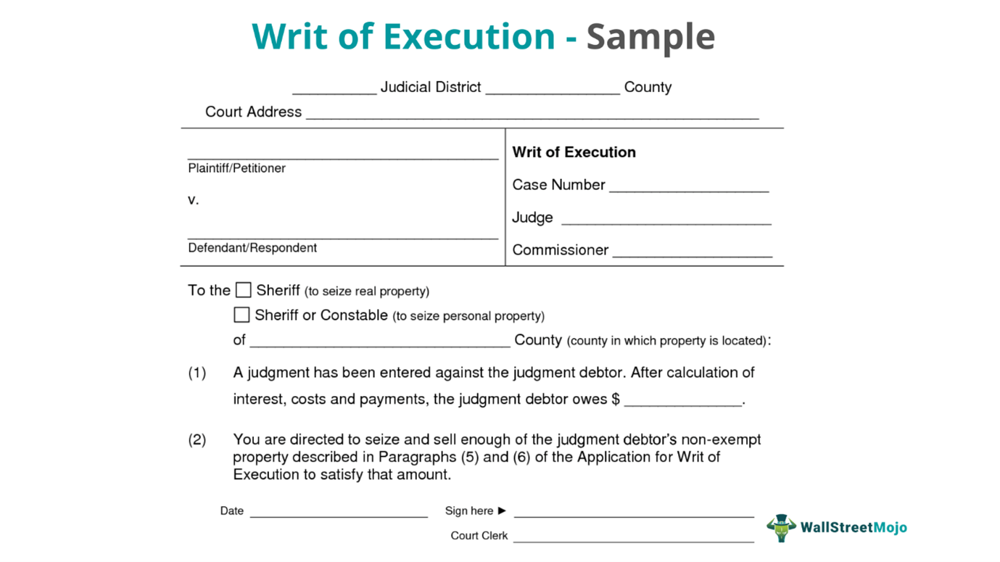

Algorithmic trading, which leverages complex algorithms to automate trading decisions, has become a significant force in the financial markets. It relies on computational power to analyze large datasets and execute trades at speeds unattainable by human traders. This approach has led to increased liquidity, reduced transaction costs, and improved market efficiency. However, the rapid integration of technology in trading activities has raised legal challenges, necessitating a robust legal framework to address potential issues.

One of the primary legal challenges associated with algorithmic trading is market manipulation. With the ability to execute numerous transactions almost instantaneously, there is a risk of algorithms being used to create artificial market movements, known as "spoofing" or "layering." Such practices can lead to inflated or deflated asset prices, undermining market integrity. Regulators worldwide have been keenly observing these developments, formulating laws to curb adverse behaviors while encouraging technological innovation.

In legal systems, writs are crucial instruments. Historically, they have played a significant role in enforcing legal rights and remedies. A writ is a formal written order issued by a body with administrative or judicial jurisdiction; in essence, it commands a party to perform or cease specific actions. Over time, writs have been diversified to address varied legal concerns. Their adaptability allows them to serve as a potent tool in resolving disputes, including those in the dynamic domain of algorithmic trading.

For traders, understanding the legal frameworks governing algorithmic trading is vital. Without appropriate knowledge, traders may inadvertently violate regulations, leading to significant penalties or disruptions in operations. As the landscape of algorithmic trading continually evolves, maintaining compliance with legal standards becomes increasingly essential to prevent malpractice and ensure market fairness.

This article aims to examine the legal dimensions of algorithmic trading through the lens of writs. It seeks to provide insights into how these legal instruments can address algorithmic trading challenges and uphold transparency and fairness. By exploring various examples and implications, the discussion highlights the necessity of aligning trading innovations with legal standards to foster a trustworthy and efficient trading environment.

## Table of Contents

## Understanding Writs in the Legal System

Writs have been a fundamental component of the legal system, serving as formal written orders issued by a body with administrative or judicial jurisdiction. Historically, writs played a crucial role in the administration of justice, dating back to Anglo-Saxon England and continuing through the development of the British common law system. These documents commanded the performance or cessation of a specific act, effectively allowing a court to exert its authority and enforce laws.

There are several types of writs commonly used in legal proceedings, each serving unique functions. The most recognized writs include:

1. **Habeas Corpus**: This writ demands that a person detained by authorities be brought before a court to determine the legality of the detention. Habeas corpus is a fundamental safeguard against unlawful imprisonment.

2. **Mandamus**: Issued to compel a public official or governmental body to perform a mandatory or purely ministerial duty correctly. For instance, if a government official fails to issue a license that is rightfully due, a writ of mandamus may be sought.

3. **Prohibition**: Directs a subordinate to stop doing something the law prohibits it from doing. It is often used to prevent an inferior court from exceeding its jurisdiction.

4. **Certiorari**: Orders a lower court or tribunal to deliver the record in a case for review, often used by higher courts to review the decisions and proceedings of lower courts.

5. **Quo Warranto**: Challenges a person's right to hold a public office, asking the officeholder to show by what warrant an office or franchise is held, claimed, or exercised.

Writs serve as essential tools for enforcing rights and obligations within legal contexts. They facilitate the legal process by ensuring that individuals and institutions comply with the law, thereby maintaining the rule of law. Writs are typically applied in situations where a party seeks legal remedy beyond ordinary legal proceedings. For example, a person unlawfully detained might file for a habeas corpus writ to seek release, or a taxpayer could seek a writ of mandamus to compel a government agency to issue a refund due under the law.

In modern legal disputes and actions, writs remain relevant as they provide mechanisms for addressing grievances swiftly and effectively. They uphold civil liberties by allowing courts to intervene in cases of overreach by authorities or breaches of duty by public officials. As legal challenges become more complex, especially with the advent of technological advancements and algorithmic systems, the ability to apply writs in new contexts continues to underscore their enduring importance in ensuring justice and accountability.

## Algorithmic Trading: An Overview

Algorithmic trading is a method of executing orders using automated pre-programmed trading instructions accounting for variables such as time, price, and [volume](/wiki/volume-trading-strategy). This type of trading employs complex algorithms, mathematical models, and sometimes high-frequency data to make trading decisions swiftly, reducing human intervention in the trading process. These algorithms are designed to evaluate market conditions, detect patterns, and execute trades at speeds and frequencies that are impossible for human traders.

The primary benefits of [algorithmic trading](/wiki/algorithmic-trading) include speed, efficiency, and improved risk management. Algorithms can process massive amounts of data and execute orders within milliseconds, enabling traders to exploit even the smallest market inefficiencies. This rapid execution minimizes the risk of manual errors and slippage, as trades are executed at the desired prices almost instantaneously. Additionally, algorithmic trading allows for better market [liquidity](/wiki/liquidity-risk-premium) and tighter spreads by providing consistent volume to the markets.

Algorithmic trading strategies are varied, with specific algorithms designed for different purposes. Common strategies include:

1. **Trend-Following Strategies**: These algorithms capitalize on momentum in the market, buying securities that are trending upward and selling those trending downward. An example is moving averages, where the algorithm buys or sells based on the relationship between short-term and long-term moving averages.

2. **Arbitrage Strategies**: These strategies exploit price discrepancies of the same asset across different markets. An algorithm might simultaneously buy and sell an asset in different markets to profit from transient inefficiencies.

3. **Market-Making**: This strategy involves placing buy and sell orders to capture the bid-ask spread, aiming to provide liquidity to the market.

4. **Mean Reversion**: This strategy assumes that prices will return to a mean over time, buying undervalued assets and selling overvalued ones.

5. **Statistical Arbitrage**: A sophisticated form of arbitrage that employs statistical methods to exploit slight deviations from statistical averages.

Key players in algorithmic trading include institutional investors, such as hedge funds and investment banks, who utilize these strategies to manage large portfolios efficiently. Brokerage firms also play a significant role by providing algorithmic trading platforms and services to their clients. Regulatory bodies are crucial stakeholders, ensuring fair practices and protecting market integrity.

The impact of algorithmic trading on global financial markets is profound. It has increased market liquidity and reduced transaction costs due to tighter spreads. However, it also introduces challenges such as market [volatility](/wiki/volatility-trading-strategies) and flash crashes, where rapid trade execution can lead to significant price swings in a short time. Despite these challenges, algorithmic trading continues to grow, driven by advancements in technology and data analytics, reshaping how financial markets operate globally.

## Legal Challenges in Algorithmic Trading

Algorithmic trading, characterized by the use of complex algorithms to automate trading decisions, poses notable legal challenges. These challenges arise due to the intricate nature of the trading strategies employed and the high-speed environment of financial markets.

### Overview of Major Legal Challenges

Algorithmic traders often face legal difficulties related to compliance with financial regulations and the detection of improper or fraudulent activities. These challenges encompass issues such as market manipulation, lack of transparency, and inadequate monitoring systems. Additionally, the deployment of high-frequency trading ([HFT](/wiki/high-frequency-trading-strategies)) strategies can lead to regulatory scrutiny due to their potential to destabilize markets.

### Case Studies of Legal Issues

Significant legal cases have highlighted issues within algorithmic trading. For example, the "Flash Crash" of May 6, 2010, where the Dow Jones Industrial Average dropped nearly 1,000 points within minutes, was partly attributed to algorithmic trading activities. The incident prompted investigations into how algorithms could exacerbate market volatility. Similarly, in 2014, Navinder Sarao was charged with market manipulation for employing spoofing techniques through algorithms that contributed to market disruptions.

### Role of Regulations and Compliance

Regulatory bodies, such as the U.S. Securities and Exchange Commission (SEC) and the Commodity Futures Trading Commission (CFTC), play crucial roles in establishing frameworks to guide algorithmic trading. Compliance involves adhering to established rules such as the Dodd-Frank Act and MiFID II in the European Union, which aim to enhance transparency and prevent market abuses. Regulatory compliance is essential for preventing market manipulation and ensuring that trading algorithms operate within legal boundaries.

### Impact of Illegal Practices and Market Manipulation

Illegal practices, including spoofing and layering, have been facilitated by algorithms. Spoofing involves placing false orders to deceive other traders about supply and demand, while layering consists of placing multiple orders at different price levels to mislead the market. Both practices are considered manipulative and violate market integrity. These detrimental practices undermine investor confidence and can lead to significant legal consequences for offending firms and individuals.

### Evolving Legal Landscape

The legal landscape for algorithmic trading is evolving as regulators adapt to technological advancements. New regulations focus on improving surveillance systems to detect fraudulent algorithms. Moreover, advancements in [artificial intelligence](/wiki/ai-artificial-intelligence) and [machine learning](/wiki/machine-learning) offer innovative solutions for enhancing regulatory oversight by providing tools for monitoring trading activities in real-time. The interplay between technology and regulation continues to shape the legal environment, balancing the need for innovation with the necessity of maintaining market integrity and investor trust.

In summary, algorithmic trading requires robust legal frameworks to address the challenges posed by rapid technological advancements. Ongoing collaboration between regulators and market participants is pivotal in ensuring that algorithmic trading remains a secure, transparent, and efficient component of modern financial markets.

## Writs: Legal Response to Algo Trading Malpractices

Writs, as formal written orders issued by legal authorities, play a significant role in addressing malpractices in algorithmic trading. These instruments can mandate or prohibit certain actions, thereby providing a legal framework for resolving disputes and enforcing regulations in this complex domain. In the context of algorithmic trading, writs can be particularly effective in cases involving allegations of misconduct or regulatory violations.

### Application of Writs in Algorithmic Trading Disputes

In algorithmic trading legal disputes, writs such as mandamus, prohibition, and certiorari can be applied. A writ of mandamus could compel a regulatory body to enforce existing financial regulations rigorously against an errant trading firm. Similarly, a writ of prohibition may be used to stop a trading company from continuing potentially harmful or unlawful algorithmic practices. Certiorari writs allow for reviewing lower court or regulatory agency decisions, which is useful in ensuring that regulatory actions or disciplinary measures are legally sound and fair.

### Examples of Writs Addressing Algo Trading Malpractices

One notable example is the use of writs to tackle market manipulation through high-frequency trading (HFT) algorithms. Regulatory agencies, empowered by writs, have intervened in cases where trading algorithms have been suspected of artificial price inflation or creating misleading market conditions, demanding cessation and reviewing these practices through judicial oversight.

### Case Analysis of Writ Applications

In a notable case, a writ of mandamus was sought against a trading firm accused of deploying algorithms that violated fair trading practices. The writ required the firm to disclose its trading algorithms for regulatory review, highlighting the importance of transparency. Such cases underscore the utility of writs in enforcing compliance and maintaining market integrity. While records of such specific cases may not be publicly available, the hypothetical framework shows how writs can function in practical scenarios.

### Role of Writs in Safeguarding Fairness and Transparency

By mandating compliance and ensuring that market activities are conducted lawfully, writs safeguard fairness and transparency. They hold entities accountable by legally enforcing regulations, thus deterring manipulative practices. For instance, forbidding the use of certain algorithms through prohibition writs ensures that trading remains fair and aligned with market regulations.

### Potential Improvements in Legal Mechanisms Regarding Writs

Enhancing the efficacy of writs in algorithmic trading involves adapting these legal instruments to the evolving technological landscape. Suggestions for improvement include developing specialized writs tailored to the unique challenges presented by digital trading platforms and algorithms. Moreover, increasing cross-border legal cooperation can ensure wider applicability and enforcement of such writs, given the global nature of finance. Enhanced judicial training on technological advancements will also ensure more informed and effective use of writs in this domain.

Strengthening the integration of writs within the regulatory frameworks governing algorithmic trading can augment the capacity to handle disputes and enforce fair practices, ultimately contributing to more stable and equitable financial markets.

## Preventive Measures and Compliance in Algo Trading

Algorithmic trading, while offering significant advantages in speed and efficiency, presents numerous legal and ethical challenges that need to be managed proactively. Companies involved in algorithmic trading must adopt comprehensive strategies to mitigate legal risks, ensuring that their operations comply with the applicable laws and regulations.

**Compliance Programs and Ethical Guidelines**

The cornerstone of legal risk mitigation in algorithmic trading is the establishment of robust compliance programs and ethical guidelines. Firms need to implement policies that ensure adherence to financial regulations like the Securities Exchange Commission (SEC) regulations in the United States or the Markets in Financial Instruments Directive (MiFID II) in the European Union. These programs include regular audits, internal controls, and reporting mechanisms designed to detect and prevent unauthorized trading activities and market manipulation. A well-defined code of ethics guides traders and developers in maintaining integrity, transparency, and fairness in their trading strategies.

**Technological Solutions for Transparency**

Technological solutions are vital for ensuring transparency and legal adherence in algorithmic trading activities. Advanced monitoring systems can track algorithmic transactions in real-time, identifying patterns that may indicate non-compliance or potential illegal activity. Implementing secure and transparent platforms ensures that all trading activities are recorded and auditable. Blockchain technology, for instance, offers immutable ledgers that can store trading data safely, allowing regulators and financial institutions to verify transactions efficiently. Moreover, employing machine learning algorithms can help in monitoring trading data to flag unusual activities that require further investigation.

**Education and Training for Algo Traders**

Education and training play a pivotal role in helping algorithmic traders understand the legal landscape and potential implications of their activities. Comprehensive training programs should cover regulatory requirements, ethical considerations, and the technical aspects of algorithm development. Continuous education initiatives help traders and developers stay updated with evolving laws and technological advancements. Workshops, seminars, and certification programs can significantly enhance the knowledge base, ensuring that employees are well-equipped to handle complex legal challenges associated with algorithmic trading.

**Case Study: Successful Preventive Initiatives**

A notable example of successful preventive initiatives can be seen in the approach adopted by some leading financial institutions. For instance, a major investment bank implemented a preventative strategy that combined advanced real-time monitoring tools with exhaustive compliance training for all its algorithmic traders. This strategy led to a 30% reduction in compliance-related incidents within the first year of implementation. In addition to the technological and educational components, the creation of a dedicated compliance team responsible for reviewing and approving all algorithmic strategies before deployment ensured a systematic check of regulatory adherence. This holistic approach serves as a benchmark for other firms aiming to strengthen their compliance and risk management frameworks in the field of algorithmic trading.

In conclusion, effective preventive measures and compliance programs are critical to managing the legal risks associated with algorithmic trading. Firms must invest in both cutting-edge technology and rigorous training, focusing on fostering a culture of compliance and ethical responsibility within the organization. Such initiatives not only safeguard against legal pitfalls but also enhance the firm’s reputation and trustworthiness in the financial markets.

## The Future of Legal Frameworks in Algorithmic Trading

As algorithmic trading (algo trading) continues to evolve, propelled by technological advancements, the legal frameworks governing this activity are also expected to undergo significant changes. One major prediction is that legal frameworks will increasingly incorporate AI and machine learning algorithms to monitor and regulate trading activities more effectively. These technologies could offer real-time analysis and detection of manipulative trading patterns that are currently challenging to identify using traditional methods.

International collaboration is anticipated to play a critical role in standardizing legal practices for algorithmic trading. As financial markets are globally interconnected, inconsistencies in regulations across jurisdictions can create loopholes that traders might exploit. Efforts toward harmonizing legal standards could lead to the establishment of unified regulations that facilitate smoother cross-border trading while minimizing regulatory [arbitrage](/wiki/arbitrage). Supranational entities, such as the International Organization of Securities Commissions (IOSCO), may take initiative to foster collaboration among national regulators, aligning their strategies to address common challenges in algo trading.

Emerging trends suggest a more proactive regulatory approach where compliance is integrated with technological innovations. Regulatory bodies are likely to adopt newer methodologies like regulatory technology (RegTech) to enhance compliance processes. RegTech can automate routine compliance tasks and provide advanced data analytics, which are crucial for assessing complex algo trading activities. This proactive stance is expected to help regulators preemptively address potential issues rather than responding reactively to transgressions.

The role of AI in shaping future legal standards cannot be understated. AI has the potential to not only aid regulators in their oversight functions but also provide traders with tools to ensure compliance. Advanced AI systems can simulate trading scenarios, predict regulatory impacts, and assess risk, thus helping traders to navigate the legal landscapes more effectively. However, reliance on AI also raises concerns about fairness, accountability, and transparency, necessitating comprehensive ethical guidelines.

The balance between innovation and regulation remains a pivotal consideration. Regulators must ensure that legal frameworks do not stifle innovation while adequately protecting market integrity and investor interests. This delicate balance calls for dynamic policies that can adapt to the rapid pace of technological change without compromising regulatory objectives. A forward-thinking approach might include sandbox environments where new trading technologies can be tested under regulatory supervision before full-scale implementation.

In conclusion, the future of legal frameworks in algorithmic trading is set to be more technology-driven, globally harmonized, and adaptive to emerging trends. As the interplay between technology and regulation becomes more pronounced, stakeholders in financial markets will need to remain vigilant, embracing both innovation and compliance in equal measure.

## Conclusion

In conclusion, the intricate interplay between writs and algorithmic trading underscores the vital importance of legal acumen in the financial sector. As algorithmic trading grows in prominence, the potential for legal challenges, particularly those related to writs, becomes increasingly significant. Understanding writs and their application can provide critical insights into enforcing fair practices and ensuring transparent operations in trading environments.

Legal knowledge in algorithmic trading is crucial for navigating regulatory landscapes and avoiding pitfalls associated with compliance failures and market manipulation. This underscores the need for continuous research and policy development to keep pace with technological advancements, ensuring robust regulatory frameworks that can adapt to emerging challenges.

Maintaining a fair and regulated trading environment necessitates collaboration among all stakeholders, including regulators, traders, and technologists. By fostering an ecosystem prioritizing legal compliance and ethical trading practices, the industry can safeguard itself against malpractices that could undermine market integrity.

Finally, stakeholders are urged to engage proactively in legal compliance, emphasizing the value of preventive measures and adherence to regulatory guidelines. By doing so, the industry can continue to innovate while maintaining a balanced approach to regulation, ensuring that market developments occur within a framework that promotes fairness and transparency.

## References & Further Reading

[1]: Bergstra, J., Bardenet, R., Bengio, Y., & Kégl, B. (2011). ["Algorithms for Hyper-Parameter Optimization."](https://papers.nips.cc/paper/4443-algorithms-for-hyper-parameter-optimization) Advances in Neural Information Processing Systems 24.

[2]: ["Advances in Financial Machine Learning"](https://www.amazon.com/Advances-Financial-Machine-Learning-Marcos/dp/1119482089) by Marcos Lopez de Prado

[3]: ["Evidence-Based Technical Analysis: Applying the Scientific Method and Statistical Inference to Trading Signals"](https://www.amazon.com/Evidence-Based-Technical-Analysis-Scientific-Statistical/dp/0470008741) by David Aronson

[4]: ["Machine Learning for Algorithmic Trading"](https://github.com/stefan-jansen/machine-learning-for-trading) by Stefan Jansen

[5]: ["Quantitative Trading: How to Build Your Own Algorithmic Trading Business"](https://www.amazon.com/Quantitative-Trading-Build-Algorithmic-Business/dp/1119800064) by Ernest P. Chan