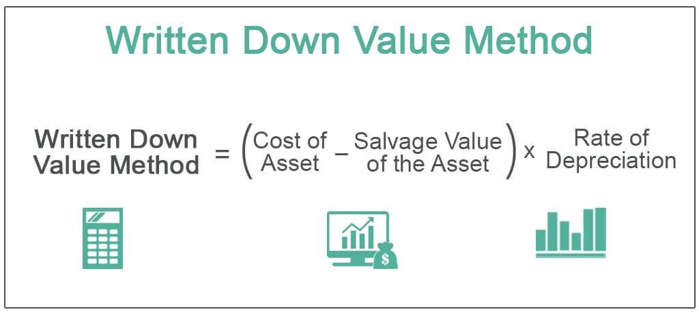

In today's financial environment, asset management and trading strategies are crucial for maximizing value and returns. Understanding asset depreciation is a key component of effective asset management, as it has a direct impact on financial statements and investment decisions. Accurate depreciation calculations can influence how an asset appears in company books, affecting profitability assessments, tax liabilities, and investment attractiveness.

Written-Down Value (WDV) is a depreciation method that reflects the current value of an asset after depreciation is accounted for. It is integral for businesses to measure an asset's declining value accurately over time. WDV is pivotal not only for compliance and transparency in financial reporting but also for strategic asset management and financial planning.



In recent years, algorithmic trading has increasingly relied on precise data analysis to drive automated trading strategies. Understanding and integrating depreciation methods, such as WDV, can offer crucial insights for refining trading algorithms. This understanding aids in evaluating the real-time worth of assets, thus informing buy and sell decisions and potentially enhancing trading performance.

This article will explore WDV calculation methods and provide examples that illustrate its application. By examining both the benefits and drawbacks of the WDV method, we aim to highlight its significance in financial reporting and decision-making processes. As we explore the intersection of asset management and algorithmic trading, we will look at how accurate calculation of asset depreciation informs automated trading decisions, ultimately affecting overall trading performance.

## Table of Contents

## Understanding Written-Down Value (WDV)

Written-Down Value (WDV) refers to the current value of an asset after depreciation has been accounted for. It plays a significant role in financial management by reflecting an asset's worth accurately on a balance sheet. The WDV, also known as book value or net book value, assists companies in tracking the reduction in an asset's utility and value over its useful life.

The calculation of WDV is straightforward and involves subtracting the accumulated depreciation from the asset's initial cost. Mathematically, it can be expressed as:

$$
\text{WDV} = \text{Original Cost} - \text{Accumulated Depreciation}
$$

For tangible assets, depreciation is the process of allocating the cost of an asset over its useful life in a systematic manner. This contrasts with amortization, which applies to intangible assets such as patents and licenses. Despite the different applications, both depreciation and amortization contribute to the determination of the WDV.

The WDV method provides a dynamic approach for companies to manage their assets. It allows the adjustment of asset values on financial statements according to prevailing market conditions. By reflecting the declining utility and market value of assets over time, companies can make more informed decisions regarding asset replacements or sales. This, in turn, leads to more accurate financial reporting and assists in strategic planning and investment decisions.

## WDV Calculation: Methods and Examples

Written-Down Value (WDV) is an essential concept in asset management, and its calculation can significantly impact financial statements. Businesses employ several methods to determine WDV, with the most common being the diminishing balance and straight-line methods.

### Diminishing Balance Method

The diminishing balance method, also known as the declining balance method, involves depreciating an asset by a constant percentage each year. This approach results in higher depreciation expenses during the early years of an asset's life, tapering off as the asset ages. The diminishing balance method is particularly useful for assets that rapidly lose value after purchase, such as technology or vehicles. The formula for calculating depreciation using this method is:

$$
\text{Depreciation Expense} = \text{WDV at Beginning of Year} \times \text{Depreciation Rate}
$$

Consider an asset with an initial cost of $10,000 and a depreciation rate of 20%:

1. **Year 1:**
   - WDV at the beginning = $10,000
   - Depreciation Expense = $10,000 × 20% = $2,000
   - WDV at the end = $10,000 - $2,000 = $8,000

2. **Year 2:**
   - WDV at the beginning = $8,000
   - Depreciation Expense = $8,000 × 20% = $1,600
   - WDV at the end = $8,000 - $1,600 = $6,400

The process continues similarly for subsequent years, progressively reducing the asset's book value.

### Straight-Line Method

The straight-line method distributes depreciation evenly across the useful life of an asset. It is straightforward and commonly employed for assets that depreciate consistently over time, like buildings. The formula for straight-line depreciation is:

$$
\text{Depreciation Expense} = \frac{\text{Initial Cost} - \text{Salvage Value}}{\text{Useful Life}}
$$

For instance, an asset with an initial cost of $10,000, a salvage value of $1,000, and a useful life of 5 years will have a yearly depreciation expense calculated as follows:

$$
\text{Depreciation Expense} = \frac{\$10,000 - \$1,000}{5} = \$1,800
$$

The WDV at the end of each year decreases by $1,800 until it reaches the salvage value.

### Importance of Accurate Calculation

Accurate calculation of WDV is vital for financial reporting. It assists in providing a realistic view of an asset's value on the balance sheet. Moreover, understanding these depreciation methods enables businesses to execute strategic decisions regarding asset management, influencing aspects such as budgeting and tax planning. Adjusting for how an asset loses value can enhance financial statements' reliability, ultimately leading to more informed decisions regarding asset utilization and replacement.

## Advantages and Disadvantages of WDV

The Written-Down Value (WDV) method offers notable advantages in the realm of asset depreciation by providing a realistic reflection of how an asset's utility diminishes over time. This method adjusts the book value of an asset to reflect wear and tear or obsolescence more accurately than a static valuation, making financial statements more representative of an asset's true value. Notably, the WDV method tends to allocate higher depreciation expenses in the earlier years of an asset's life. This approach not only enhances the precision of financial reporting but also creates a strategic financial benefit: reduced taxable income during the initial years of asset ownership, which can be advantageous for cash flow management and financial planning.

From a tax perspective, the ability to recognize higher depreciation expenses sooner translates into immediate tax relief, aiding businesses in maintaining [liquidity](/wiki/liquidity-risk-premium) and potentially funding capital investments or operating expenses. This aspect can be especially beneficial in environments where tax regulations support accelerated depreciation methods.

However, the WDV method is not without its drawbacks. One of the primary disadvantages is the potential for reduced income reporting in the years immediately following a significant asset acquisition. The higher initial depreciation expense can lower the apparent profitability, which may not always align with business objectives, particularly if a company is seeking to demonstrate strong profit margins to investors or stakeholders.

Furthermore, the complexity inherent in calculating depreciation using the diminishing balance method can pose challenges. Unlike the straight-line method, which applies a constant depreciation rate, the diminishing balance method requires recalculating depreciation expense annually based on the asset's reduced book value. This can lead to increased administrative workload and necessitate robust accounting processes to ensure accuracy.

An example of this calculation can be illustrated through Python, where the initial cost, depreciation rate, and number of years are used to determine the asset's depreciated value over time:

```python
def wdv_calculation(initial_cost, depreciation_rate, years):
    current_value = initial_cost
    for year in range(1, years + 1):
        current_value -= current_value * depreciation_rate
        print(f"Year {year}: Written-Down Value = {current_value:.2f}")

# Example usage
wdv_calculation(initial_cost=10000, depreciation_rate=0.2, years=5)
```

Overall, while the WDV method can offer substantial fiscal advantages, it requires careful consideration and diligent management to align with broader financial and strategic objectives.

## WDV in Algorithmic Trading

Algorithmic trading, a domain that relies on the precision and speed of computing, requires accurate data to inform trading decisions effectively. Understanding asset depreciation, particularly through the Written-Down Value (WDV) method, is one way to refine these data-driven algorithms.

The WDV method provides insight into an asset's fair market value by accounting for accumulated depreciation, which offers a more realistic indicator of the asset's worth over time. In [algorithmic trading](/wiki/algorithmic-trading), this understanding can influence when algorithms decide to execute buy or sell orders. For instance, an asset with a significantly reduced book value might present an undervalued buying opportunity, or conversely, trigger a sell order if the depreciation aligns with an expected decline in market value.

Fluctuating market conditions require that trading algorithms remain adaptable. Incorporating changes in asset book values due to depreciation into these algorithms can enhance their robustness and accuracy. By integrating WDV calculations, traders can adjust their strategies to reflect the most current valuations, thereby optimizing their trading performance. For example, an algorithm could be designed to adjust its strategy based on a comparison between an asset's WDV and prevailing market prices. Here's a basic Python snippet demonstrating how an algorithm might adjust trade decisions based on depreciation:

```python
def trade_decision(original_cost, accumulated_depreciation, market_price):
    wdv = original_cost - accumulated_depreciation
    if market_price < wdv:
        return "Buy"
    elif market_price > wdv:
        return "Sell"
    else:
        return "Hold"

# Example usage
original_cost = 100000
accumulated_depreciation = 30000
market_price = 65000

decision = trade_decision(original_cost, accumulated_depreciation, market_price)
print(f"Trade decision: {decision}")
```

This simplified model uses WDV to determine trading actions, showcasing the adaptability and integration of robust financial analysis into automated trading strategies. Understanding and effectively using the interplay between asset valuation and algorithmic trading can strengthen performance outcomes, underscoring the necessity for precise financial data in a rapidly shifting market landscape. Such integration is pivotal to maintaining a competitive edge and optimizing trades in algorithmic systems.

## Conclusion

Comprehending asset depreciation methods such as the Written-Down Value (WDV) is essential for achieving precision in financial reporting and effectively managing assets strategically. WDV offers a framework that aligns asset valuation with their practical utility over time, enhancing the accuracy of a company's financial statements. This understanding allows organizations to not only comply with accounting standards but also to make strategic decisions regarding the acquisition, utilization, and disposal of assets.

For traders using algorithmic strategies, incorporating WDV insights into their models can lead to enhanced decision-making capabilities. The integration of accurate asset depreciation data enables algorithms to evaluate the fair market value of assets more precisely, which is crucial for executing timely and informed trading decisions. By adjusting algorithms to take into account changes in asset book values, traders can optimize their trading strategies to capitalize on market opportunities effectively.

Maintaining up-to-date asset valuations is critical for both companies and traders to respond swiftly to market dynamics, ensure they do not lose their competitive advantage, and maximize their financial positions. Staying informed about the current worth of assets allows for rapid adaptation to economic conditions, ensuring that financial strategies remain robust and relevant in an ever-changing financial landscape.

## References & Further Reading

[1]: ["Depreciation: Accounting and Calculation Methods"](https://www.investopedia.com/ask/answers/021815/what-are-different-ways-calculate-depreciation.asp) - Investopedia

[2]: ["Investment Valuation: Tools and Techniques for Determining the Value of Any Asset"](https://books.google.com/books/about/Investment_Valuation.html?id=5SRHAAAAQBAJ) by Aswath Damodaran

[3]: ["Algorithmic Trading: Winning Strategies and Their Rationale"](https://www.amazon.com/Algorithmic-Trading-Winning-Strategies-Rationale-ebook/dp/B00CY5HC0U) by Ernie Chan

[4]: ["Principles of Corporate Finance"](https://www.amazon.com/Principles-Corporate-Finance-Richard-Brealey/dp/0077404890) by Richard A. Brealey, Stewart C. Myers, and Franklin Allen

[5]: ["Financial Reporting and Statement Analysis: A Strategic Perspective"](https://searchworks.stanford.edu/view/10006491) by Clyde P. Stickney, Roman L. Weil, Katherine Schipper, Jennifer Francis